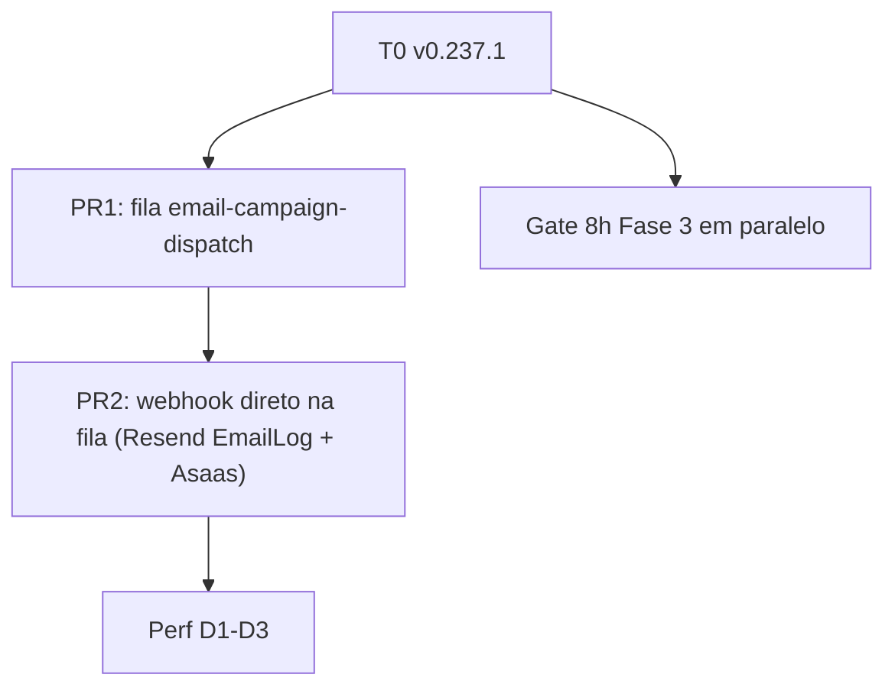
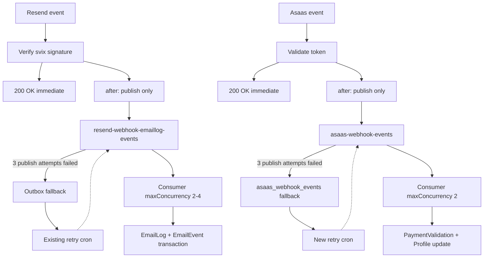
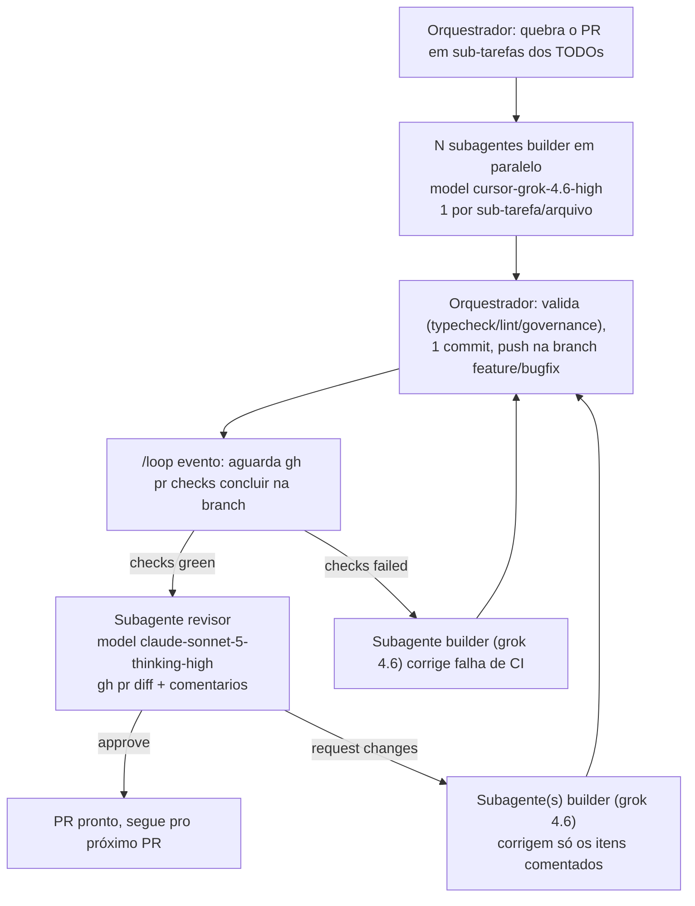

# Fase 4 — disparo de campanha na fila + webhooks direto na fila

A nota de diagnóstico **não** é editada. Fonte viva: [nota de progresso](/run/media/matheuswillock/Armazenamento/Workspace´s%20Matheus%20Willock/Corretor%20studio/Operações/Pool%20de%20Conexões%20—%20Progresso%20de%20Implementação.md).
Arquitetura hoje/proposta dos webhooks em canvas:
`~/.cursor/projects/home-matheuswillock-develop-testes-lead-flow-app/canvases/webhooks-arquitetura-atual.canvas.tsx`
e `webhooks-arquitetura-proposta.canvas.tsx`.

**Estado (2026-08-14 ~17:42 UTC):** Fase 3 (C1–C4) em produção **v0.237.1** (`dpl_bqhp4HVVDvgejTtcQhMXTD2ZYdmn`, 17:27 UTC). Snapshot T0 (~15 min) — **não** são 8h. HTTP 503/P2024/500 de campanhas no deploy novo = 0. D9 pending = 0.

**O que mudou na prioridade:** o gargalo vivo não é GET campanhas. É o cron `dispatch-scheduled` (`maxDuration` 60) enviando milhares de e-mails no isolate — 6 × 504 hoje, ~6.1k `queued` no remarketing GRU. Direção aprovada: **cron → fila → Resend** (PR1).

**Decidido em 2026-08-14:** o eixo seguinte (PR2) deixou de ser só "EmailLog fora do after()" — é **webhook publica direto na fila, outbox só como fallback do próprio `publish`**, aplicado a Resend (`EmailLog`) **e** Asaas juntos, no mesmo padrão que já roda para o Radar (A2). Asaas ganha o cron de retry que hoje não existe.

Perf D1–D3 e “sem filas novas” desta Fase 4 original **saem do caminho crítico**. Orçamento atual = **16** queue slots; o PR1 soma **+1 ou +2**; o PR2 soma mais **+4 a +6** (2–4 EmailLog + 2 Asaas).

## 1. T0 — o que já medimos

Não misturar com `dpl_74SwP8P` (v0.226, 13/08). Filtrar por `deploymentId`.

| Sinal                               | v0.237.1                  | Ação                                |
| ----------------------------------- | ------------------------- | ----------------------------------- |
| HTTP 503 webhook Resend             | 0 (7.335 × 200)           | A1 ok                               |
| P2024                               | 0                         | ok                                  |
| 500 GET campanhas                   | 0                         | não abrir Perf                      |
| P2028 `after()` `applyWebhookEvent` | 4                         | eixo EmailLog **depois** do disparo |
| Outbox Resend pending               | 29.493 due_now (semáforo) | alimentado pelo disparo de hoje     |
| C1–C4 hits                          | 0                         | não é falha (C4 fail-closed)        |
| Cron dispatch                       | 1 × 504 neste deploy      | **próximo PR**                      |

Gate 8h C1–C4 continua aberto em paralelo. **Não** espera as 8h para começar o PR de disparo.

## 2. Próximo PR — `email-campaign-dispatch`

Hoje o cron e o `after()` do POST `/send` chamam `completeManualDispatch` (Resend no mesmo isolate). Alvo:

- Cron 60s: `recoverStuck` + `start` / reclaim queued + `publish({ dispatchId })`. Sem `dispatchBatch`.
- POST `/send` e backoffice `/send`: `startManualDispatch` + publish. **Sem `after()`.**
- Consumer `maxDuration` 300: lote de logs `queued` → Resend; se restar queued, republica wake.
- Payload = `dispatchId` (reconstruir recipients como `resumeOrphanSendingDispatches`). **Não** serializar `ManualDispatchJob`.
- Unidade = lote, não 1 msg/destinatário (lição D9/C3).
- `maxConcurrency` 1–2; subtrair do orçamento no mesmo PR.
- Reclaim de `completed`+queued (GRU 01/02 o cron atual ignora).
- Consumer não chama `after()`.
- Feature branch a partir de `origin/develop`. Sem `gh pr create`. Sem commit em `main`/`develop`/`release/*`.

Fora deste PR: `RESEND_WEBHOOK_MAX_CONCURRENT`, fila de EmailLog/Asaas (PR2), Perf GET, reativar WhatsApp.

## 3. Por que o webhook direto na fila é PR2, não PR1

A2 já tirou o **Radar** do isolate (`resend-webhook-radar-events`). O diagnóstico original mandou o **email tracking** ficar no `after()` por ora. C1–C4 só cobriram escritas Radar. Subir o semáforo agora, antes do PR2 existir, aperta `EmailLog`.

O disparo na fila (PR1) reduz a rajada de delivered/opened que satura o semáforo — por isso vem primeiro. Assim que PR1 estiver em produção, PR2 (item 6) tira `EmailLog` **e** Asaas do `after()` de vez, em vez de só reduzir a pressão.

## 4. Gate 8h Fase 3 (não bloqueia o item 2)

Ainda medir, quando der 8h, no mesmo `deploymentId`:

- P2024/`after` em leads, portfolio, pixel, import HTTP
- P2024 nos consumers C1–C3 (aceitável com retry, sem storm)
- WhatsApp: zero P2024 novo (tráfego pode ser 0)
- Observar GET campanhas (já 0 no T0)

Falha de C1–C4 → hotfix desse caminho. Não misturar com o PR de disparo nem com EXPLAIN.

## 5. Perf D1–D3 — depois do disparo na fila

| Item             | Trabalho                              |
| ---------------- | ------------------------------------- |
| D1 GET campanhas | EXPLAIN / N+1 `countActiveRecipients` |
| D2 unread-count  | origem dos P2024 históricos           |
| D3 bootstrap     | SWR ou cache por time                 |

Sem cache de campanhas até o EXPLAIN.

## 6. PR2 — webhook direto na fila (Resend `EmailLog` + Asaas)

Depois do PR1 em produção. Mesma virada de padrão nos dois provedores:
o `after()` do webhook para de abrir transação Postgres e só faz um
`publish` na fila; o outbox deixa de ser o caminho primário e passa a
ser fallback só para quando o `publish` em si falha. Diagrama completo
(hoje vs. proposto) nos dois canvases linkados no topo desta nota.

**Regra nova (decidida em 2026-08-14):** o fallback para o outbox só
acontece depois de **3 tentativas** de `publish` na fila falharem em
sequência — não na primeira falha. Um `publish` transitório (timeout de
rede pontual) não deve gerar linha de outbox; só grava fallback quando
as 3 tentativas esgotarem. Isso pede um helper compartilhado de retry
curto (ex.: `lib/queues/publish-with-retry.ts`, backoff pequeno tipo
200ms/500ms/1s entre tentativas, sem `after()` aninhado) usado pelos dois
publishers novos (Resend e Asaas) antes de cair no
`upsertFromProcessingFailure` / gravar `asaas_webhook_events`.

**Regra nova (auditoria, decidida em 2026-08-14):** toda linha gravada no
fallback precisa de um **motivo de falha estruturado** (`failureReason`),
separado da mensagem de erro crua, para permitir consulta/filtro
posterior (ex.: "quantas falhas foram `semaphore_saturated` vs.
`queue_publish_failed` na última semana"). Valores fixos:

| `failureReason` | Quando ocorre | Provedor |
|---|---|---|
| `queue_publish_failed` | 3 tentativas de `publish` esgotadas | Resend e Asaas |
| `semaphore_saturated` | `inFlight >= MAX_CONCURRENT` antes de tentar publicar | só Resend |

A mensagem crua continua em `lastError`/`errorMessage` (texto livre do
erro). A trilha de data/hora para auditoria já existe nas duas tabelas e
não precisa de campo novo — usar o que já está no schema:
`createdAt` (1ª ocorrência) + `updatedAt` (última tentativa/atualização
de status) em `ResendWebhookProcessingFailure`; `receivedAt` (1ª
ocorrência) + `updatedAt` (última tentativa) em `AsaasWebhookEvent`. Os
dois repositórios (`upsertFromProcessingFailure` e o novo write de
fallback do Asaas) passam a receber `failureReason` como parâmetro
obrigatório.

### 6.1 Resend — tracking `EmailLog` (primeiro, PR2.1)

- **Migration pequena** (`bun run db:migrate:from-prisma -- add-resend-webhook-failure-reason`):
  adicionar `failureReason String?` ao model `ResendWebhookProcessingFailure`
  em [prisma/schema.prisma](/home/matheuswillock/develop/testes/lead-flow-app/prisma/schema.prisma).
  Único schema change deste sub-PR (fila em si não precisa de migration).
- Nova fila, mesmo padrão de
  [lib/queues/resend-webhook-radar-events.ts](/home/matheuswillock/develop/testes/lead-flow-app/lib/queues/resend-webhook-radar-events.ts):
  criar `lib/queues/resend-webhook-emaillog-events.ts` com `QueueClient`,
  `idempotencyKey = svixId`, `retentionSeconds` 7 dias.
- Novo consumer `app/api/queues/resend-webhook-emaillog-events/route.ts`,
  espelhando
  [app/api/queues/resend-webhook-radar-events/route.ts](/home/matheuswillock/develop/testes/lead-flow-app/app/api/queues/resend-webhook-radar-events/route.ts):
  chama `resendWebhookUseCase.handle({ event, svixId })` (código de negócio
  não muda, só quem invoca) e usa `handleXCallback` com retry backoff por
  `deliveryCount`.
- [app/api/webhooks/resend/route.ts](/home/matheuswillock/develop/testes/lead-flow-app/app/api/webhooks/resend/route.ts) —
  trocar o corpo do `after()`: em vez de
  `await resendWebhookUseCase.handle({ event, svixId })`, fazer
  `await publishResendWebhookEmailLogEvent({ event, svixId })`, com até
  **3 tentativas** de `publish` (helper `publish-with-retry`) antes de
  desistir. Só depois da 3ª falha cai no outbox já existente
  (`resendWebhookProcessingFailureRepository.upsertFromProcessingFailure`,
  agora com `failureReason: "queue_publish_failed"`; mesma chamada de
  hoje, só que agora é fallback do `publish` esgotado, não do
  processamento).
- Semáforo saturado (`inFlight >= MAX_CONCURRENT`) já grava direto no
  outbox hoje — mantém esse caminho como está (é o fallback esperado),
  só passa a incluir `failureReason: "semaphore_saturated"`.
- [vercel.json](/home/matheuswillock/develop/testes/lead-flow-app/vercel.json) —
  novo trigger `queue/v2beta`, topic `resend-webhook-emaillog-events`,
  `maxConcurrency` 2–4 (subtrair do orçamento de conexões, hoje 16 slots).
- Cron existente
  ([retry-resend-webhook-failures/route.ts](/home/matheuswillock/develop/testes/lead-flow-app/app/api/v1/email/cron/retry-resend-webhook-failures/route.ts) +
  `RetryResendWebhookFailuresUseCase`) não muda de código — só passa a
  varrer um volume bem menor (fallback raro, não mais o caminho primário).
- Reavaliar `RESEND_WEBHOOK_MAX_CONCURRENT` (hoje 2) só depois de validar
  em produção sem P2028 — sem transação no isolate, o semáforo pode subir
  sem repetir o problema. Não faz parte deste PR.

### 6.2 Asaas (depois do Resend, PR2.2)

- **Migration de schema**
  (`bun run db:migrate:from-prisma -- add-asaas-webhook-event-retry-fields`):
  adicionar `attemptCount Int @default(0)`,
  `nextAttemptAt DateTime @default(now())` **e** `failureReason String?`
  ao model `AsaasWebhookEvent` em
  [prisma/schema.prisma](/home/matheuswillock/develop/testes/lead-flow-app/prisma/schema.prisma)
  (hoje só tem `status`/`errorMessage`/`receivedAt`/`processedAt` — sem
  campos de retry nem motivo estruturado). `receivedAt` já cobre "1ª
  ocorrência" e `updatedAt` já cobre "última tentativa" — não precisa de
  campo de data novo. Revisar o SQL gerado antes de aplicar remoto;
  aplicar remoto só com autorização.
- Nova fila `lib/queues/asaas-webhook-events.ts`, mesmo padrão do Resend,
  `idempotencyKey = resolveAsaasWebhookEventId(body)`.
- [app/api/webhooks/asaas/route.ts](/home/matheuswillock/develop/testes/lead-flow-app/app/api/webhooks/asaas/route.ts) —
  `claimForProcessing` continua rodando antes do ack (dedupe, já é rápido,
  não é o gargalo). O `after()` troca
  `processAsaasWebhookEvent(body)` + `markProcessed(eventId)` por só
  `publishAsaasWebhookEvent({ eventId, body })`, também com até **3
  tentativas** via o mesmo helper `publish-with-retry`. Se as 3 falharem,
  grava `failureReason: "queue_publish_failed"` na linha (já existe em
  `asaas_webhook_events` com `status="processing"`, setado pelo
  `claimForProcessing`) — o cron novo precisa reclassificar linhas
  `processing` velhas como `pending`/`failed` (mesmo cuidado que
  `ResendWebhookProcessingFailureRepository.recoverStaleProcessingClaims`
  já faz para o Resend), senão o evento fica "processing" para sempre.
- Novo consumer `app/api/queues/asaas-webhook-events/route.ts` chama
  `processAsaasWebhookEvent(body)` + `markProcessed`/`markFailed`
  (repositório
  [AsaasWebhookEventRepository.ts](/home/matheuswillock/develop/testes/lead-flow-app/app/api/infra/data/repositories/asaasWebhook/AsaasWebhookEventRepository.ts)
  já tem os dois métodos).
- **Cron novo** `app/api/v1/integrations/webhooks/cron/retry-asaas-webhook-failures/route.ts`
  (mesma família do `process-outbox` já existente ali), espelhando
  [retry-resend-webhook-failures/route.ts](/home/matheuswillock/develop/testes/lead-flow-app/app/api/v1/email/cron/retry-resend-webhook-failures/route.ts)
  (`withCronAudit`, `CRON_SECRET`, `maxDuration` 60). Precisa de:
  - `RetryAsaasWebhookFailuresUseCase` (novo), espelhando
    `RetryResendWebhookFailuresUseCase`: `claimDue` (status
    `pending`/`failed`/`processing`-stale, `nextAttemptAt <= now`),
    reprocessa via `processAsaasWebhookEvent`, `markProcessed` em sucesso,
    backoff/`markFailed` em falha esgotada.
  - Backoff helper novo `lib/asaas/asaas-webhook-event-backoff.ts`,
    espelhando
    [resend-webhook-processing-failure-backoff.ts](/home/matheuswillock/develop/testes/lead-flow-app/lib/email/resend-webhook-processing-failure-backoff.ts)
    (mesma escala de tentativas, ajustável dado o volume bem menor do
    Asaas).
  - `vercel.json` — novo cron `*/5 * * * *` + novo trigger `queue/v2beta`
    topic `asaas-webhook-events`, `maxConcurrency` 2.
  - **Não** colocar em `app/api/v1/backoffice/cron/**` — Asaas é webhook de
    produto, não do módulo backoffice (isolamento de módulo).
- Não resolve isoladamente o bug P2023 (UUID em `externalReference` dentro
  de `Profile.findFirst`) — isso é um bug de validação, não de
  arquitetura; abrir item separado se persistir depois da fila.

### 6.3 Ordem, testes e rollout

1. Resend primeiro (sem migration, menor risco, já tem outbox e cron
   prontos — só troca o gatilho). Depois Asaas (schema change + cron
   novo, fecha o gap de retry que nunca existiu).
2. Publisher: caminho feliz não chama `handle()`/`processAsaasWebhookEvent()`
   direto, só publica; mesmo `svixId`/`eventId` não duplica mensagem
   (idempotency key).
3. Consumer: chama o use case de negócio existente sem mudança de
   comportamento; falha no consumer propaga (retry da fila via
   `handleXCallback`).
4. Fallback: publish falhando 1x ou 2x (mock) **não** grava no
   outbox/`asaas_webhook_events` — só a 3ª falha consecutiva grava, com
   os dados corretos para reprocesso.
5. Cron novo: claim de `pending`/`failed`/`processing`-stale, backoff,
   `markResolved`/`markFailed` — mirror dos testes existentes do
   `RetryResendWebhookFailuresUseCase`.
6. Feature branch a partir de `origin/develop`. Sem `gh pr create`. Sem
   commit em `main`/`develop`/`release/*`.
7. Rodar `bun run typecheck`, `bun run lint`, `bun run governance:check`,
   `bun run governance:check-api-masking` antes de considerar cada parte
   pronta (rotas de consumer são internas, não devem violar masking).
8. Atualizar `postman/Lead-Flow-API-Collection.json` se algum endpoint de
   consumer for exposto (normalmente não — são rotas de fila internas).

### 6.4 Depois de mergeado

- Atualizar a nota Obsidian de progresso (seção "Fase 4"/"Arquitetura dos
  webhooks") e este plano com os links de PR e os sinais pós-deploy
  (P2028 residual, outbox pending, cron novo do Asaas rodando), mesmo
  formato usado para C1–C4.

**Status (2026-08-14, fechado):**

| PR | Escopo | Status |
|---|---|---|
| [#837](https://github.com/matheuswillock/lead-flow-app/pull/837) | PR1 `email-campaign-dispatch` | Mergeado (auto-merge CI) |
| [#839](https://github.com/matheuswillock/lead-flow-app/pull/839) | Bugfix PR1 — credit leak + loop infinito no domain guard (`failDispatchOnDomainGuard`) | Mergeado |
| [#842](https://github.com/matheuswillock/lead-flow-app/pull/842) | PR2.1 `resend-webhook-emaillog-events` | Mergeado, revisor sem bloqueios |
| [#845](https://github.com/matheuswillock/lead-flow-app/pull/845) | PR2.2 `asaas-webhook-events` + retry cron | Mergeado (auto-merge CI) |
| [#847](https://github.com/matheuswillock/lead-flow-app/pull/847) | Bugfix PR2.2 — `claimDue` retry infinito de `failed` esgotado (`c0e79186`) | Mergeado manualmente (`gh pr merge`, branch `bugfix/*` não tem auto-merge) — **correção**: o fix havia sido empurrado direto para `feature/asaas-webhook-queue` *depois* de #845 já estar `MERGED`; a automação de auto-merge só dispara uma vez por branch, então o commit ficou preso na branch sem nunca entrar em `develop`. Detectado e corrigido em 2026-08-15 abrindo uma branch nova a partir de `origin/develop` + cherry-pick + PR próprio (mesmo padrão de #839) |

Sinais pós-deploy (P2028 residual, outbox pending, cron Asaas rodando)
ficam pendentes de nova coleta — ver seção "Snapshot" da nota de
progresso quando houver janela de tráfego real pós-v0.237.1.

## 7. Metodologia de execução — builder (grok 4.6) + revisor (sonnet 5) + `/loop`

**Decidido em 2026-08-14.** Cada PR (PR1, PR2.1, PR2.2) roda com um
ciclo builder → CI → revisor → (fix → CI → revisor)\* até aprovação, sem
intervenção manual entre rodadas. Vale para todos os PRs deste plano
(inclusive os já listados nas seções 5 e 6).

### 7.1 Papéis dos agentes

- **Builder (implementação):** `Task` com `subagent_type: generalPurpose`
  e `model: cursor-grok-4.6-high`. Um subagente por sub-tarefa/arquivo do
  TODO daquele PR (ex.: no PR2.1 — um para a migration, um para a fila,
  um para o consumer, um para o update da rota), lançados em **paralelo**
  no mesmo bloco de mensagem. Cada builder só edita os arquivos da sua
  sub-tarefa (sem `git commit`/`push` individual, para não haver corrida
  de git na mesma working tree) e recebe como contexto: o trecho
  correspondente deste plano, o arquivo-espelho a seguir como padrão
  (ex.: `resend-webhook-radar-events.ts`), e as regras normativas de
  `agents.md` relevantes (Output contract, `TeamContext`, etc.).
- **Orquestrador (esta sessão):** depois que todos os builders daquela
  rodada retornam, roda `bun run typecheck`, `bun run lint`,
  `bun run governance:check`, `bun run governance:check-api-masking`
  (e `lint:pt-br` se houver texto de UI), corrige o que for trivial, faz
  **um único commit** e `git push` na branch `feature/*` (criada a partir
  de `origin/develop`, nunca commit direto em `develop`/`main`/`release/*`).
  O push aciona a CI (`ci-feature.yml`/`ci-branch-reusable.yml`), que
  cria/atualiza o PR automaticamente — o orquestrador **não** roda
  `gh pr create`.
- **Watcher (`/loop`, modo evento):** depois do push, arma um watcher em
  background que faz polling de `gh pr checks <numero> --json` (ou
  `gh pr view --json statusCheckRollup`) até os checks da CI concluírem
  (sucesso ou falha), com sentinel próprio por PR
  (`AGENT_LOOP_WAKE_pr21`, `AGENT_LOOP_WAKE_pr22`, etc.) e
  `notify_on_output`. Enquanto isso o orquestrador pode seguir em outra
  tarefa; ao acordar, decide: checks falharam → builder de correção de CI
  (grok 4.6); checks verdes → aciona o revisor.
- **Revisor:** `Task` com `subagent_type: generalPurpose` e
  `model: claude-sonnet-5-thinking-high`. Recebe o número do PR, roda
  `gh pr diff <numero>` e `gh pr view <numero> --json ...`, revisa contra
  este plano + `agents.md` (Output contract, `TeamContext`, isolamento de
  módulo, idempotência, regra dos 3 retries + `failureReason`, etc.) e
  publica o veredito via `gh pr review`:
  - **Aprovado:** `gh pr review <numero> --approve` com resumo curto —
    encerra o ciclo daquele PR.
  - **Mudanças necessárias:** `gh pr review <numero> --request-changes
    --body "..."` com lista objetiva e numerada dos pontos a corrigir
    (arquivo + linha + o que ajustar), sem aplicar a correção ele mesmo.
- **Fix loop:** o orquestrador lê os comentários do revisor, agrupa por
  arquivo/sub-tarefa e lança builders (grok 4.6) só para os itens
  comentados — paralelos entre si se forem arquivos distintos,
  sequenciais se caírem no mesmo arquivo. Depois de aplicar, repete
  validação → commit → push → `/loop` aguarda CI → revisor de novo. O
  ciclo só termina quando o revisor aprova explicitamente; não há limite
  arbitrário de rodadas, mas se passar de ~4 rodadas sem convergir o
  orquestrador para e reporta ao usuário em vez de insistir sozinho.

### 7.2 Regras que valem para todas as rodadas

- Nunca criar PR manualmente (`gh pr create`) — só a CI cria/atualiza.
- Nunca commit direto em `main`/`develop`/`release/*`; toda rodada de fix
  vai para a mesma branch `feature/*`/`bugfix/*` já aberta pelo PR.
- Builders **não** decidem sozinhos abrir exceção em `.governance/*`
  allowlist — se `governance:check`/`governance:check-api-masking`
  falhar, corrigem a violação, não adicionam allowlist.
- Ordem entre PRs continua sequencial (PR1 → PR2.1 → PR2.2), cada um só
  começa depois do anterior ter sido aprovado pelo revisor (não precisa
  esperar merge/deploy, só aprovação do revisor, salvo dependência
  explícita de schema já mergeado).
- Se o revisor pedir uma mudança que contradiz uma decisão já registrada
  neste plano (ex.: reabrir "outbox como caminho primário"), o
  orquestrador não aplica automaticamente — pausa e pergunta ao usuário.
- **Regra adicionada em 2026-08-15 (incidente #845/#847):** a CI só faz
  auto-merge de uma branch `feature/*` **uma vez**. Se um fix pós-review
  for necessário depois que a branch já estiver `MERGED`, **nunca**
  reaproveitar essa branch — o commit fica preso e nunca chega em
  `develop`, mesmo com CI verde. Sempre abrir branch nova a partir de
  `origin/develop` (cherry-pick do commit de fix, se já existir) e
  deixar virar PR próprio (mesmo padrão de #839/#847). Antes de marcar
  qualquer fix pós-review como "mergeado", confirmar com
  `git show origin/develop:<arquivo>` ou `git branch --contains <sha>`
  que o commit realmente está em `origin/develop` — não confiar só no
  `gh pr view --json state` do PR original (ele fica `MERGED` para
  sempre, independente de commits novos na mesma branch local).

## 8. PR2.3 — Formulários públicos: 100% fila (decidido 2026-08-14)

Decisão: **todo** evento relacionado a Resend, Asaas **e formulários
públicos** precisa estar 100% em fila, no mesmo padrão (publish direto
na fila; outbox só como fallback do `publish` após 3 tentativas, com
`failureReason` estruturado). Análise do estado atual de formulários
(2026-08-14):

| # | Fluxo | Hoje | Risco |
|---|---|---|---|
| 1 | Métricas críticas de funil (`form_viewed`, `form_started`, `question_answered`, `form_completed`) — `POST /events` → `PublicFormsUseCase.recordMetric` | Queue-first: publica direto em `public-form-metric-events`, sem Prisma no caminho feliz | Se o `publish` falhar, **não há retry nem outbox** — `recordMetric` só loga e devolve erro ao cliente; evento perdido |
| 2 | Métricas não-críticas (`question_viewed`, `question_skipped`) | Caminho direto (`publicFormsService.recordMetric`, 1 retry local via `withPrismaRetry`), **sem fila** | Sob rajada de carga, mesmo padrão de pressão de pool que os webhooks tinham antes da A2/PR2.1/2.2 |
| 3 | Submissão do formulário (`POST /submissions`) — cria lead, agenda reunião | `accept()` síncrono (rápido) + `after()` **no mesmo isolate** chamando `processInBackground()` (lead match + `leadScheduleService`), sem fila, sem outbox, sem retry estruturado | Maior risco: é o trabalho mais pesado, ainda no padrão que causava P2024/P2028 nos webhooks/disparo; pico de tráfego pago pode saturar o pool |
| 4 | Eventos derivados pós-submissão (`form_completed`, `lead_created`, `lead_attached`, `meeting_scheduled`) dentro de `processInBackground` | Já publicados em `public-form-metric-events` no final do processamento | Depende do item 3 rodar — se o `after()` falhar antes de chegar lá, esses eventos nunca são publicados (sem qualquer registro) |

**Decisão:** fechar os 3 gaps (2, 3 e a falta de fallback do item 1)
com o mesmo padrão de `publish-with-retry` + outbox aplicado a
Resend/Asaas.

### 8.1 Métricas — remover o bypass sem fila

- `PublicFormsUseCase.recordMetric` deixa de bifurcar em
  "crítico → fila" / "não-crítico → direto". **Todo** `eventType`
  publica em `public-form-metric-events` (fila já existe, já suporta
  qualquer `eventType` via payload). `isCriticalPublicFormMetricEvent`
  deixa de decidir fila-vs-direto; se ainda for útil para priorização
  de consumer/telemetria, mantém só esse uso.
- O `catch` do `publishPublicFormMetricEvent` passa a usar
  `publish-with-retry` (3 tentativas, mesmo helper de Resend/Asaas)
  antes de responder erro ao cliente. Se as 3 falharem, cai num outbox
  novo (item 8.2) em vez de só logar e perder o evento.

### 8.2 Submissão — sair do `after()` síncrono

- **Migration nova:** model `PublicFormSubmissionProcessingFailure`
  (outbox fallback), espelhando
  `ResendWebhookProcessingFailure`: `id`, `submissionId`,
  `publicId`, `requestKey`, `payload Json` (o
  `PublicFormSubmissionBackgroundJob` serializado), `failureReason
  String?` (`"queue_publish_failed"`), `status` (`pending`/`resolved`),
  `createdAt`/`updatedAt` (auditoria — 1ª ocorrência / última
  tentativa, mesmo padrão já usado nos outros dois outbox).
- Nova fila `lib/queues/public-form-submission-events.ts`, mesmo
  padrão de `resend-webhook-emaillog-events.ts`: `idempotencyKey =
  requestKey` (já existe, único por submissão, evita duplicar
  lead/agendamento em replay).
- Novo consumer
  `app/api/queues/public-form-submission-events/route.ts` chamando
  `publicFormSubmissionUseCase.processInBackground(job)` (código de
  negócio não muda — lead match, `leadScheduleService`, eventos
  derivados continuam iguais, só quem invoca muda).
- `app/api/v1/public-forms/[publicId]/submissions/route.ts` —
  `accept()` continua síncrono (já é rápido, sem mudança). O `after()`
  troca `processInBackground(background)` direto por
  `publishPublicFormSubmissionEvent(background)` via
  `publish-with-retry` (3 tentativas). Só na 3ª falha grava no outbox
  novo com `failureReason: "queue_publish_failed"`.
- **Cron novo** `retry-public-form-submission-failures` +
  `RetryPublicFormSubmissionFailuresUseCase` + backoff helper,
  espelhando `RetryAsaasWebhookFailuresUseCase` (claim `pending`,
  reprocessa via `processInBackground`, `markResolved`/backoff).
- `vercel.json` — novo trigger `queue/v2beta`, topic
  `public-form-submission-events`, `maxConcurrency` inicial **2**.
  Orçamento hoje (pós PR1/2.1/2.2) = **23** slots; este PR soma **+2**
  → 25.

### 8.3 Ordem, testes e rollout

1. Métricas primeiro (8.1) — menor risco, sem migration, fila já
   existe.
2. Submissão depois (8.2) — schema change + fila + consumer + cron
   novo.
3. Publisher: caminho feliz não chama `processInBackground()` direto,
   só publica; mesmo `requestKey` não duplica lead/agendamento
   (idempotency key).
4. Consumer: chama `processInBackground()` sem mudança de
   comportamento de negócio; falha propaga para retry da fila.
5. Fallback: publish falhando 1x/2x (mock) não grava outbox; só a 3ª
   falha consecutiva grava, com payload suficiente para reprocesso via
   cron.
6. Feature branch a partir de `origin/develop`. Sem `gh pr create`.
   Sem commit em `main`/`develop`/`release/*`.
7. `bun run typecheck`, `bun run lint`, `bun run governance:check`,
   `bun run governance:check-api-masking` antes de cada parte pronta.
8. Executar via a mesma metodologia multiagente da seção 7
   (builders grok 4.6 + revisor sonnet 5 + `/loop`), como PR2.3.

### 8.4 Depois de mergeado

- Atualizar a nota Obsidian de progresso (nova seção "Formulários
  públicos — 100% fila") e este plano com links de PR e sinais
  pós-deploy (publish failures, outbox pending, cron novo rodando).

**Status (2026-08-15, fechado):**

| PR | Escopo | Status |
|---|---|---|
| [#848](https://github.com/matheuswillock/lead-flow-app/pull/848) | PR2.3 `public-form-submission-events` + outbox compartilhado `PublicFormQueueEventFailure` (`kind` metric/submission) + retry cron | Mergeado (`gh pr merge`, CI verde, revisor sem bloqueios) |

Revisor (`claude-sonnet-5-thinking-high`) validou explicitamente que o
`claimDue` de `PublicFormQueueEventFailureRepository` **não** repete o
bug do `#845`/`#847` (reclamar `failed` já esgotado) — aqui `claimDue`
só busca `status: "pending"`, e `failed` é terminal por construção, sem
necessidade da cláusula `OR` que foi o fix do Asaas. 4 observações não-
bloqueantes ficaram registradas como comentário no PR (guard de upsert
em `processing`, reset de `attemptCount` no re-upsert, teste de
regressão explícito para `claimDue` ignorar `failed`, nit de
destructuring em `handleCallback`) — não bloqueiam merge, ficam como
melhoria futura se algum desses casos virar problema real em produção.

Sinais pós-deploy (outbox `PublicFormQueueEventFailure` pending,
volume da fila `public-form-submission-events`, cron
`retry-queue-event-failures` rodando) ficam pendentes de nova coleta
quando houver janela de tráfego real pós-deploy em `main` — mesmo
formato usado para C1–C4 e PR2.1/2.2 (ver "Snapshot" na nota de
progresso).

Com PR2.3 mergeado, **os três eixos de "100% fila" (Resend, Asaas,
formulários públicos) deste plano estão fechados**. Único item restante
do plano é o follow-up de performance (item `perf-followup`, seção 5),
que segue fora do caminho crítico até o disparo de campanha sair do
isolate de 60s em produção com tráfego real.

