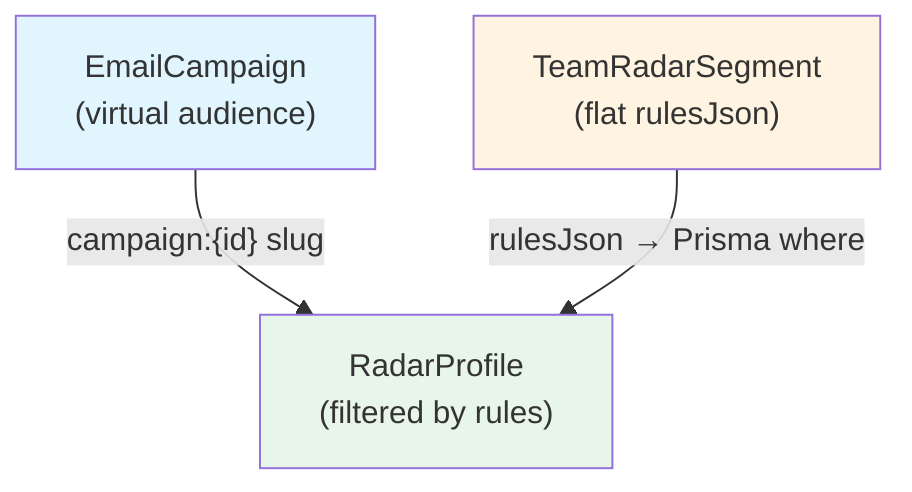
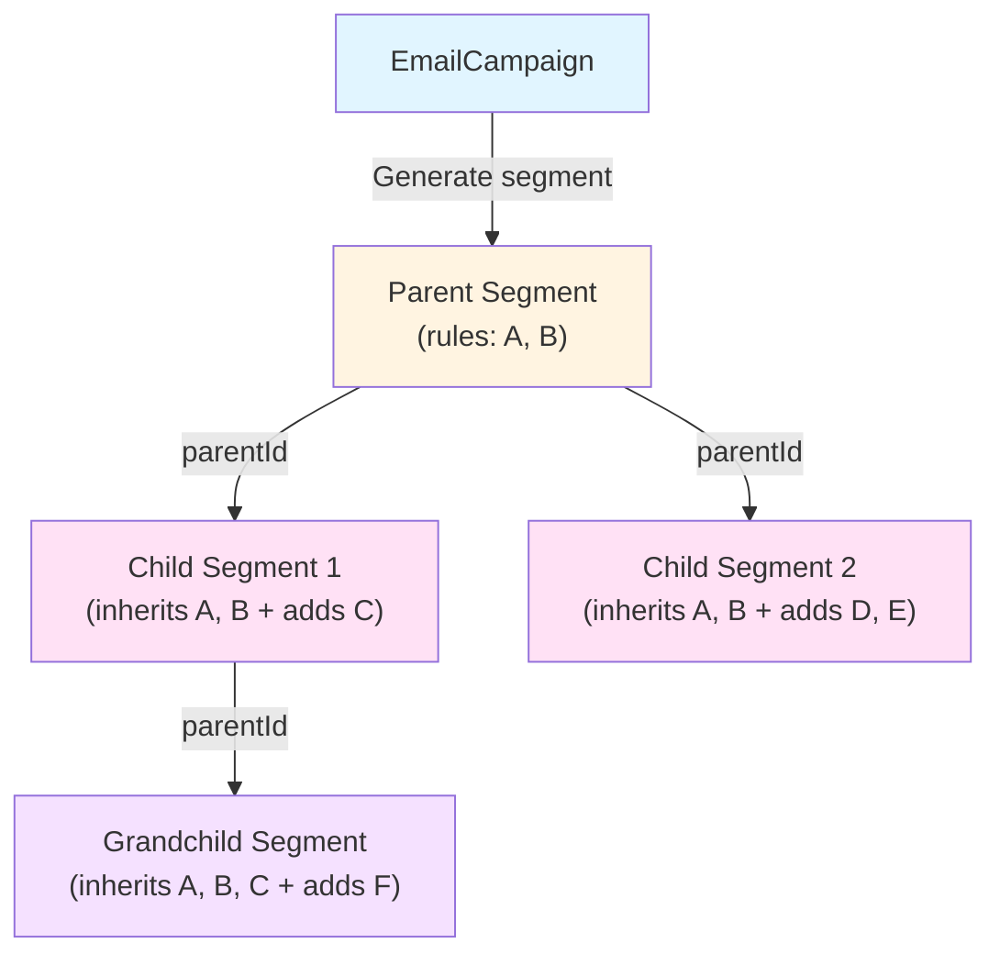

# Hierarchical Segment Generation Implementation Plan

## Overview

Allow any campaign or segment to generate child segments by adding additional filtering conditions on top of the parent's audience. Child segments maintain parent references, inherit conditions automatically (AND logic), recalculate dynamically, and appear in a visual hierarchy in the UI.

## Current State

- **Segments**: `[TeamRadarSegment](prisma/schema.prisma)` with flat `rulesJson` DSL (no hierarchy)
- **Campaigns**: Use segments via `radarSegmentSlug` (`system`, `custom:{id}`, `campaign:{id}`)
- **Virtual segments**: `campaign:{id}` queries profiles with campaign events dynamically
- **Condition DSL**: `[lib/radar/segment-dsl.ts](lib/radar/segment-dsl.ts)` - max 10 conditions, `match: all|any`
- **UI**: `[RadarSegmentBuilderDialog](app/(app)`/radar/container/components/RadarSegmentBuilderDialog.tsx) for flat segment creation




## Target State




## Database Schema Changes

### Migration: Add hierarchy fields to TeamRadarSegment

**File**: `supabase/migrations/YYYYMMDDHHMMSS_add_segment_hierarchy.sql`

```sql
-- Add parent reference
ALTER TABLE corretor_studio_radar_segments
ADD COLUMN "parentId" UUID REFERENCES corretor_studio_radar_segments("id") ON DELETE SET NULL;

-- Add source tracking
ALTER TABLE corretor_studio_radar_segments
ADD COLUMN "sourceType" TEXT NOT NULL DEFAULT 'manual',
ADD COLUMN "sourceCampaignId" UUID REFERENCES corretor_studio_email_campaigns("id") ON DELETE SET NULL;

-- Add constraints
ALTER TABLE corretor_studio_radar_segments
ADD CONSTRAINT check_source_type CHECK ("sourceType" IN ('manual', 'campaign', 'segment_derived'));

-- Indexes
CREATE INDEX idx_radar_segments_parent_id ON corretor_studio_radar_segments("parentId");
CREATE INDEX idx_radar_segments_source_campaign_id ON corretor_studio_radar_segments("sourceCampaignId");

-- Update Prisma enum
COMMENT ON COLUMN corretor_studio_radar_segments."sourceType" IS 'manual | campaign | segment_derived';
```

### Update Prisma Schema

**File**: `[prisma/schema.prisma](prisma/schema.prisma)`

Add to `TeamRadarSegment`:

```prisma
model TeamRadarSegment {
  // ... existing fields
  
  // Hierarchy
  parentId          String?            @map("parentId") @db.Uuid
  parent            TeamRadarSegment?  @relation("SegmentHierarchy", fields: [parentId], references: [id], onDelete: SetNull)
  children          TeamRadarSegment[] @relation("SegmentHierarchy")
  
  // Source tracking
  sourceType        SegmentSourceType  @default(manual)
  sourceCampaignId  String?            @map("sourceCampaignId") @db.Uuid
  sourceCampaign    EmailCampaign?     @relation(fields: [sourceCampaignId], references: [id], onDelete: SetNull)
  
  @@index([parentId])
  @@index([sourceCampaignId])
}

enum SegmentSourceType {
  manual           // Created directly by user
  campaign         // Generated from campaign
  segment_derived  // Derived from another segment
}
```

Add reverse relation to `EmailCampaign`:

```prisma
model EmailCampaign {
  // ... existing fields
  derivedSegments TeamRadarSegment[] @relation("CampaignDerivedSegments")
}
```

## Backend Implementation

### 1. Create Segment from Campaign Use Case

**File**: `app/api/useCases/radar/CreateSegmentFromCampaignUseCase.ts`

```typescript
interface CreateSegmentFromCampaignInput {
  campaignId: string;
  name: string;
  description?: string;
  additionalConditions: RadarSegmentCondition[];
  teamId: string;
  createdBy: string;
}

export class CreateSegmentFromCampaignUseCase {
  async execute(input: CreateSegmentFromCampaignInput): Promise<Output> {
    // 1. Validate campaign exists and belongs to team
    const campaign = await prisma.emailCampaign.findFirst({
      where: { id: input.campaignId, teamId: input.teamId }
    });
    
    if (!campaign) {
      return new Output(false, [], ['Campaign not found'], null);
    }
    
    // 2. Build campaign base condition (event filter)
    const campaignCondition: RadarSegmentCondition = {
      kind: 'event',
      eventType: 'email.*', // Any email event
      occurrence: 'occurred',
      campaignId: campaign.id
    };
    
    // 3. Merge with additional conditions (AND logic)
    const rulesJson: RadarSegmentRules = {
      match: 'all',
      conditions: [campaignCondition, ...input.additionalConditions]
    };
    
    // 4. Validate total conditions <= 10
    if (rulesJson.conditions.length > 10) {
      return new Output(false, [], ['Maximum 10 conditions allowed'], null);
    }
    
    // 5. Create segment
    const segment = await prisma.teamRadarSegment.create({
      data: {
        teamId: input.teamId,
        name: input.name,
        description: input.description,
        rulesJson: rulesJson as any,
        sourceType: 'campaign',
        sourceCampaignId: campaign.id,
        createdBy: input.createdBy,
        isSystem: false,
        isActive: true
      }
    });
    
    return new Output(true, ['Segment created successfully'], [], segment);
  }
}
```

### 2. Create Child Segment Use Case

**File**: `app/api/useCases/radar/CreateChildSegmentUseCase.ts`

```typescript
interface CreateChildSegmentInput {
  parentSegmentId: string;
  name: string;
  description?: string;
  additionalConditions: RadarSegmentCondition[];
  teamId: string;
  createdBy: string;
}

export class CreateChildSegmentUseCase {
  async execute(input: CreateChildSegmentInput): Promise<Output> {
    // 1. Fetch parent segment
    const parent = await prisma.teamRadarSegment.findFirst({
      where: { id: input.parentSegmentId, teamId: input.teamId }
    });
    
    if (!parent) {
      return new Output(false, [], ['Parent segment not found'], null);
    }
    
    // 2. Parse parent rules
    const parentRules = parent.rulesJson as RadarSegmentRules;
    
    // 3. Merge conditions (inherit parent + add new)
    const mergedRules: RadarSegmentRules = {
      match: 'all', // Always AND for inheritance
      conditions: [...parentRules.conditions, ...input.additionalConditions]
    };
    
    // 4. Validate <= 10 conditions
    if (mergedRules.conditions.length > 10) {
      return new Output(
        false, 
        [], 
        [`Total conditions (${mergedRules.conditions.length}) exceeds limit of 10`],
        null
      );
    }
    
    // 5. Create child segment
    const segment = await prisma.teamRadarSegment.create({
      data: {
        teamId: input.teamId,
        name: input.name,
        description: input.description,
        rulesJson: mergedRules as any,
        parentId: parent.id,
        sourceType: 'segment_derived',
        createdBy: input.createdBy,
        isSystem: false,
        isActive: true
      }
    });
    
    return new Output(true, ['Child segment created successfully'], [], segment);
  }
}
```

### 3. Enhanced Preview Endpoint

**File**: `app/api/v1/radar/segments/preview/route.ts`

Add support for `parentSegmentId` and `campaignId`:

```typescript
interface PreviewRequestBody {
  conditions?: RadarSegmentCondition[];
  match?: 'all' | 'any';
  parentSegmentId?: string;  // NEW: inherit from parent
  campaignId?: string;        // NEW: add campaign base condition
}

export async function POST(req: NextRequest) {
  const { teamId, profile } = await getTeamAccess(req);
  const body = await req.json();
  
  let finalConditions: RadarSegmentCondition[] = body.conditions || [];
  
  // Add campaign base condition if provided
  if (body.campaignId) {
    const campaign = await prisma.emailCampaign.findFirst({
      where: { id: body.campaignId, teamId }
    });
    
    if (campaign) {
      finalConditions = [
        {
          kind: 'event',
          eventType: 'email.*',
          occurrence: 'occurred',
          campaignId: campaign.id
        },
        ...finalConditions
      ];
    }
  }
  
  // Inherit parent conditions if provided
  if (body.parentSegmentId) {
    const parent = await prisma.teamRadarSegment.findFirst({
      where: { id: body.parentSegmentId, teamId }
    });
    
    if (parent) {
      const parentRules = parent.rulesJson as RadarSegmentRules;
      finalConditions = [...parentRules.conditions, ...finalConditions];
    }
  }
  
  const rules: RadarSegmentRules = {
    match: body.match || 'all',
    conditions: finalConditions
  };
  
  // Execute preview query
  const where = await queryService.buildWhereFromRules(rules, teamId);
  
  const [totalCount, profiles] = await Promise.all([
    prisma.radarProfile.count({ where: { ...where, teamId } }),
    prisma.radarProfile.findMany({
      where: { ...where, teamId },
      select: {
        id: true,
        displayName: true,
        primaryEmail: true,
        displayPhone: true,
        engagementBand: true,
        lastSeenAt: true
      },
      take: 10,
      orderBy: { lastSeenAt: 'desc' }
    })
  ]);
  
  return NextResponse.json({
    totalCount,
    previewProfiles: profiles,
    effectiveConditions: finalConditions
  });
}
```

### 4. List Segments with Hierarchy

**File**: `app/api/services/radar/TeamRadarSegmentService.ts`

Add method to fetch hierarchical list:

```typescript
async listWithHierarchy(teamId: string) {
  const segments = await prisma.teamRadarSegment.findMany({
    where: { teamId, isActive: true },
    select: {
      id: true,
      name: true,
      description: true,
      parentId: true,
      sourceType: true,
      sourceCampaignId: true,
      isSystem: true,
      createdAt: true,
      _count: {
        select: { children: true }
      }
    },
    orderBy: [
      { createdAt: 'desc' }
    ]
  });
  
  // Build tree structure
  const segmentMap = new Map(segments.map(s => [s.id, { ...s, children: [] }]));
  const rootSegments = [];
  
  for (const segment of segmentMap.values()) {
    if (segment.parentId && segmentMap.has(segment.parentId)) {
      segmentMap.get(segment.parentId)!.children.push(segment);
    } else {
      rootSegments.push(segment);
    }
  }
  
  return rootSegments;
}
```

## Frontend Implementation

### 1. Generate Segment Dialog Component

**File**: `app/(app)/radar/container/components/GenerateSegmentDialog.tsx`

```typescript
interface GenerateSegmentDialogProps {
  open: boolean;
  onOpenChange: (open: boolean) => void;
  sourceType: 'campaign' | 'segment';
  sourceId: string;
  sourceName: string;
  teamId: string;
}

export function GenerateSegmentDialog(props: GenerateSegmentDialogProps) {
  const [name, setName] = useState('');
  const [description, setDescription] = useState('');
  const [conditions, setConditions] = useState<RadarSegmentCondition[]>([]);
  const [preview, setPreview] = useState<{
    totalCount: number;
    profiles: RadarProfile[];
  } | null>(null);
  const [loading, setLoading] = useState(false);
  
  // Fetch preview when conditions change (debounced)
  useEffect(() => {
    const timer = setTimeout(() => {
      fetchPreview();
    }, 500);
    return () => clearTimeout(timer);
  }, [conditions]);
  
  async function fetchPreview() {
    setLoading(true);
    const response = await fetch('/api/v1/radar/segments/preview', {
      method: 'POST',
      body: JSON.stringify({
        conditions,
        match: 'all',
        ...(props.sourceType === 'campaign' 
          ? { campaignId: props.sourceId }
          : { parentSegmentId: props.sourceId }
        )
      })
    });
    const data = await response.json();
    setPreview(data);
    setLoading(false);
  }
  
  async function handleGenerate() {
    const endpoint = props.sourceType === 'campaign'
      ? '/api/v1/radar/segments/from-campaign'
      : '/api/v1/radar/segments/child';
    
    const response = await fetch(endpoint, {
      method: 'POST',
      body: JSON.stringify({
        [props.sourceType === 'campaign' ? 'campaignId' : 'parentSegmentId']: props.sourceId,
        name,
        description,
        additionalConditions: conditions
      })
    });
    
    if (response.ok) {
      toast.success('Segment created successfully');
      props.onOpenChange(false);
    }
  }
  
  return (
    <Dialog open={props.open} onOpenChange={props.onOpenChange}>
      <DialogContent className="max-w-4xl max-h-[90vh] flex flex-col">
        <DialogHeader>
          <DialogTitle>Generate Segment from {props.sourceName}</DialogTitle>
          <DialogDescription>
            Add filters to create a refined segment. The base audience will be inherited automatically.
          </DialogDescription>
        </DialogHeader>
        
        <div className="flex-1 overflow-y-auto space-y-4">
          {/* Name/Description Fields */}
          <FieldGroup>
            <Field label="Segment Name">
              <Input value={name} onChange={(e) => setName(e.target.value)} />
            </Field>
            <Field label="Description (optional)">
              <Textarea value={description} onChange={(e) => setDescription(e.target.value)} />
            </Field>
          </FieldGroup>
          
          {/* Condition Builder */}
          <div className="border rounded-lg p-4">
            <h3 className="font-medium mb-2">Additional Filters</h3>
            <RadarConditionBuilder
              conditions={conditions}
              onChange={setConditions}
              teamId={props.teamId}
            />
          </div>
          
          {/* Preview Section */}
          {preview && (
            <div className="border rounded-lg p-4 bg-muted/50">
              <div className="flex items-center justify-between mb-3">
                <h3 className="font-medium">Preview</h3>
                <Badge variant="secondary">
                  {preview.totalCount} profiles
                </Badge>
              </div>
              
              {preview.profiles.length > 0 ? (
                <div className="space-y-2">
                  {preview.profiles.map(profile => (
                    <div key={profile.id} className="flex items-center gap-3 text-sm">
                      <Avatar className="size-8">
                        <AvatarFallback>
                          {profile.displayName?.[0] || '?'}
                        </AvatarFallback>
                      </Avatar>
                      <div className="flex-1">
                        <div className="font-medium">{profile.displayName}</div>
                        <div className="text-muted-foreground">
                          {profile.primaryEmail || profile.displayPhone}
                        </div>
                      </div>
                      <Badge variant={
                        profile.engagementBand === 'hot' ? 'destructive' :
                        profile.engagementBand === 'warm' ? 'default' : 'secondary'
                      }>
                        {profile.engagementBand}
                      </Badge>
                    </div>
                  ))}
                  {preview.totalCount > 10 && (
                    <p className="text-sm text-muted-foreground text-center pt-2">
                      + {preview.totalCount - 10} more profiles
                    </p>
                  )}
                </div>
              ) : (
                <p className="text-sm text-muted-foreground">No profiles match these filters</p>
              )}
            </div>
          )}
        </div>
        
        <DialogFooter>
          <Button variant="outline" onClick={() => props.onOpenChange(false)}>
            Cancel
          </Button>
          <Button 
            onClick={handleGenerate}
            disabled={!name || !preview || preview.totalCount === 0}
          >
            Generate Segment with {preview?.totalCount || 0} profiles
          </Button>
        </DialogFooter>
      </DialogContent>
    </Dialog>
  );
}
```

### 2. Add to Campaign Detail Page

**File**: `app/(app)/emails/campanhas/[id]/page.tsx`

```typescript
export default function CampaignDetailPage({ params }) {
  const [generateDialogOpen, setGenerateDialogOpen] = useState(false);
  
  return (
    <div>
      {/* ... existing campaign details ... */}
      
      <Card>
        <CardHeader>
          <CardTitle>Audience Segmentation</CardTitle>
        </CardHeader>
        <CardContent>
          <p className="text-sm text-muted-foreground mb-4">
            Create refined segments from this campaign's audience for targeted follow-ups.
          </p>
          <Button onClick={() => setGenerateDialogOpen(true)}>
            <Filter className="size-4" data-icon="inline-start" />
            Generate Segment from Campaign
          </Button>
        </CardContent>
      </Card>
      
      <GenerateSegmentDialog
        open={generateDialogOpen}
        onOpenChange={setGenerateDialogOpen}
        sourceType="campaign"
        sourceId={params.id}
        sourceName={campaign.name}
        teamId={campaign.teamId}
      />
    </div>
  );
}
```

### 3. Add to Segment Detail View

**File**: `app/(app)/radar/container/components/RadarSegmentCard.tsx`

Add button to segment actions:

```typescript
<DropdownMenu>
  <DropdownMenuTrigger asChild>
    <Button variant="ghost" size="icon">
      <MoreVertical className="size-4" />
    </Button>
  </DropdownMenuTrigger>
  <DropdownMenuContent>
    {/* ... existing actions ... */}
    <DropdownMenuItem onClick={() => setGenerateDialogOpen(true)}>
      <Filter className="size-4" data-icon="inline-start" />
      Generate Child Segment
    </DropdownMenuItem>
  </DropdownMenuContent>
</DropdownMenu>
```

### 4. Hierarchical Segment List UI

**File**: `app/(app)/radar/container/components/RadarSegmentList.tsx`

```typescript
interface SegmentTreeNode {
  segment: TeamRadarSegment;
  children: SegmentTreeNode[];
  depth: number;
}

function SegmentTreeItem({ node }: { node: SegmentTreeNode }) {
  const [expanded, setExpanded] = useState(true);
  const hasChildren = node.children.length > 0;
  
  return (
    <div>
      <div 
        className="flex items-center gap-2 p-3 hover:bg-muted/50 rounded-lg"
        style={{ paddingLeft: `${node.depth * 24 + 12}px` }}
      >
        {hasChildren && (
          <Button
            variant="ghost"
            size="icon"
            className="size-6"
            onClick={() => setExpanded(!expanded)}
          >
            {expanded ? <ChevronDown className="size-4" /> : <ChevronRight className="size-4" />}
          </Button>
        )}
        
        {!hasChildren && <div className="size-6" />}
        
        {/* Source indicator */}
        {node.segment.sourceType === 'campaign' && (
          <Badge variant="outline" className="size-6 p-0 justify-center">
            <Mail className="size-3" />
          </Badge>
        )}
        {node.segment.sourceType === 'segment_derived' && (
          <Badge variant="outline" className="size-6 p-0 justify-center">
            <Filter className="size-3" />
          </Badge>
        )}
        
        <div className="flex-1">
          <div className="font-medium">{node.segment.name}</div>
          {node.segment.description && (
            <div className="text-sm text-muted-foreground">{node.segment.description}</div>
          )}
        </div>
        
        <Badge variant="secondary">{node.segment._count.profiles} profiles</Badge>
        
        {/* Actions */}
        <SegmentActions segment={node.segment} />
      </div>
      
      {expanded && hasChildren && (
        <div>
          {node.children.map(child => (
            <SegmentTreeItem key={child.segment.id} node={child} />
          ))}
        </div>
      )}
    </div>
  );
}
```

## API Routes

### Create Segment from Campaign

**File**: `app/api/v1/radar/segments/from-campaign/route.ts`

```typescript
export async function POST(req: NextRequest) {
  const { teamId, profile } = await getTeamAccess(req);
  const body = await req.json();
  
  const useCase = new CreateSegmentFromCampaignUseCase();
  const result = await useCase.execute({
    campaignId: body.campaignId,
    name: body.name,
    description: body.description,
    additionalConditions: body.additionalConditions || [],
    teamId,
    createdBy: profile.id
  });
  
  if (result.isValid) {
    return NextResponse.json(result.result, { status: 201 });
  } else {
    return NextResponse.json({ errors: result.errorMessages }, { status: 400 });
  }
}
```

### Create Child Segment

**File**: `app/api/v1/radar/segments/child/route.ts`

```typescript
export async function POST(req: NextRequest) {
  const { teamId, profile } = await getTeamAccess(req);
  const body = await req.json();
  
  const useCase = new CreateChildSegmentUseCase();
  const result = await useCase.execute({
    parentSegmentId: body.parentSegmentId,
    name: body.name,
    description: body.description,
    additionalConditions: body.additionalConditions || [],
    teamId,
    createdBy: profile.id
  });
  
  if (result.isValid) {
    return NextResponse.json(result.result, { status: 201 });
  } else {
    return NextResponse.json({ errors: result.errorMessages }, { status: 400 });
  }
}
```

## Future Enhancements

### New Condition Types

Add to `[lib/radar/segment-dsl.ts](lib/radar/segment-dsl.ts)` and `[RadarSegmentQueryService](app/api/services/radar/RadarSegmentQueryService.ts)`:

1. **Profile name filter**:

```typescript
{ kind: 'profile_field', field: 'name', operator: 'contains', value: 'Silva' }
```

1. **Phone filter**:

```typescript
{ kind: 'profile_field', field: 'phone', operator: 'is_empty' | 'not_empty' }
```

1. **Engagement score range**:

```typescript
{ kind: 'engagement_score', operator: 'between', min: 60, max: 100 }
```

1. **Source type filter**:

```typescript
{ kind: 'source_type', sourceTypes: ['crm_lead', 'email_contact'] }
```

### Bulk Operations

- Generate multiple child segments at once (batch conditions)
- Merge multiple segments into one
- Segment templates (save condition sets for reuse)

### Analytics

- Track segment usage (how often used in campaigns)
- Show segment performance metrics (conversion rates)
- Segment growth/shrinkage over time

## Testing Strategy

1. **Unit tests**: Use cases for segment creation logic
2. **Integration tests**: API endpoints with mock data
3. **E2E tests**: Full flow from campaign/segment detail to child segment creation
4. **Edge cases**:
  - Maximum depth (prevent infinite nesting)
  - Circular references (A → B → A)
  - Condition limit overflow (parent + child > 10)
  - Orphan segments (parent deleted)

## Deployment Plan

1. Run migration to add hierarchy columns
2. Deploy backend changes (use cases, services, routes)
3. Deploy frontend changes (dialogs, UI components)
4. Enable feature flag for beta testing
5. Monitor segment creation patterns
6. Gradual rollout to all teams

## Validation

After implementation, verify:

- [ ] Can create segment from campaign with additional filters
- [ ] Can create child segment from existing segment
- [ ] Preview shows correct count and profiles
- [ ] Hierarchical tree displays correctly in UI
- [ ] Child segments inherit parent conditions properly
- [ ] Dynamic recalculation works (count updates when data changes)
- [ ] Source indicators (campaign/derived) display correctly
- [ ] Cannot exceed 10 total conditions
- [ ] Performance is acceptable with deep hierarchies