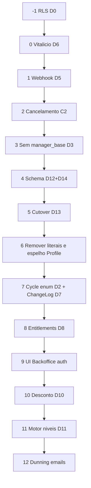

# BILLING_SPEC.md — Spec canônica de billing v2.0

**Versão:** 2.0  
**Data:** 2026-07-24  
**Base:** [`BILLING_AUDIT.md`](BILLING_AUDIT.md) (reauditoria 24/07 + inventário §3A)  
**Substitui:** `BILLING_SPEC.md` v1.0 (superseded) e `BILLING_ENGINE_SPEC.md` (removido).

---

## Goal

Motor de cobrança com **uma única estrutura de dados** (catálogo no banco + `ProfileSubscription` canônico), webhook alinhado ao Asaas real, segurança de borda (RLS + vitalício só Backoffice), cancelamento/refund reais, **migração completa** de todos os clientes para o modelo novo (sem legado permanente), **mudança entre quaisquer níveis** de assinatura, precificação multi-slug com parcelas iguais ou custom, entitlements unificados, e alertas de cobrança — com aceite por estágio e testes nas transições de risco.

## Non-goals

- Trocar PSP (permanece Asaas).
- Unificar `EmailCreditSubscription` / Dialer dentro da assinatura Profile (permanecem módulos separados, mesmo gate).
- Resolver todas as inconsistências comerciais de `PRICING_TABLE.md` / Radar (decisões de negócio à parte).
- Manter System A / `crm-legacy` / literais de preço após o cutover.
- Aplicar migration remota sem autorização explícita do owner.

---

## Decisões arquiteturais

### D0 — RLS (C-1)
`asaas_webhook_events`, `profile_user_types`, `profile_user_type_assignments`: ENABLE RLS + policies mínimas. Investigar grants em produção antes do push. Pré-requisito de segurança.

### D1 — Preço só no banco
Fonte única: `BackofficeProduct` + `BackofficeProductPaymentRule` (padrão `adhesion-pricing.ts`). **Proibido** `pricingCatalog.ts` ou literais 59,90/19,90/29,90 no app após Estágio 6.

### D2 — `SubscriptionCycle` enum
`MONTHLY | QUARTERLY | SEMIANNUALLY | YEARLY`. Migration normaliza case (`quarterly` → `QUARTERLY`). Vitalício ≠ ciclo (é flag / produto lifetime).

### D3 — Não forçar `manager_base`
Webhook/`updateProfileStatus` não sobrescrevem `subscriptionPlan` incondicionalmente (C3).

### D4 — Billing por módulo
Assinatura principal (Asaas) + Email credits (por Team) + Dialer: modelos separados, **um** feature gate (`FeatureAccessService`).

### D5 — Vocabulário Asaas real (C0)
Eventos: `SUBSCRIPTION_CREATED|UPDATED|INACTIVATED|DELETED`. Status payload: `ACTIVE|EXPIRED|INACTIVE`. Remover eventos inventados. Sem fallback `?? 'active'`. Handlers refund/chargeback. Inadimplência prolongada → `PUT` Asaas `INACTIVE`.

### D6 — Vitalício só Backoffice (C1/C1b)
Remover rota pública; PUT produto exige `getBackofficeAccess()`. Log de quem alterou.

### D7 — `SubscriptionChangeLog`
Toda mudança de nível/plano/ciclo/valor/vitalício/cancelamento: de-para JSON + source + actor.

### D8 — Entitlements unificados
`ACTIVE_SUBSCRIPTION_STATUSES` compartilhado. `SubscriptionCheck` + bootstrap leem **ProfileSubscription** (+ produtos/capacidades), não só Profile. Expor `productSlugs` / `featureSlugs` / capacidades.

### D9 — Mudança de ciclo = PUT Assas
`PUT /v3/subscriptions/{id}` com `cycle` + `updatePendingPayments`. Sem cancelar+recriar.

### D10 — Desconto % por adesão
Override só em `BackofficeAdhesion`; teto em config; acima do teto → aprovação autenticada MANAGER/MASTER (rota dedicada). Catálogo nunca escrito pelo desconto.

### D11 — Motor de mudança de nível (genérico)
Transicionar conta entre **quaisquer** níveis suportados: `ProfileUserType` + produtos do catálogo + capacidades. Exemplos: `common` → `member_pro` → plano pago; `associate`; vitalício; upgrade/downgrade de pack. Por transição: reconciliar Asaas vs catálogo, entitlements, ChangeLog.  
Casos especiais (ex. expiração Member PRO): gatilho `after()` no bootstrap + cron rede de segurança — **instâncias** do motor, não o modelo inteiro.

### D12 — P-MS multi-slug + parcelas + ciclos opcionais
- Produto: `featureSlugs String[]` (1..N) — **multi-slug ainda pendente**; hoje `featureSlug` singular com N precificações por slug.
- Ciclos de billing (`monthly`/`quarterly`/`semiannual`/`annual`) são **opcionais** (subset 1..4). Ciclos sem regra não aparecem na adesão.
- Update de produto: não remover/alterar preço ou schedule de ciclo com assinatura ativa (`ProfileSubscription` / `BackofficeUserSubscription`).
- Payment rule cartão: `installmentSplitMode EQUAL|CUSTOM`; EQUAL → `maxInstallments`; CUSTOM → `installmentSchedule` (soma = price); checkout/adesão: à vista **ou** schedule fixo.
- Adesão: `installmentSchedule` + `installmentLedger`; operador marca parcelas pagas externamente (parcial ou 100%); saldo gera cobranças Asaas; **conta ativa na criação** mesmo com saldo pendente.
- Asaas: EQUAL no checkout público → `installmentCount`/`installmentValue`; CUSTOM / saldo parcial → **N cobranças avulsas**.

### D13 — Cutover estrutural sem legado
Migrar **todas** as assinaturas/preços/capacidades System A → modelo novo. Dry-run + reconciliação Asaas. Remover literais só após cutover validado. Rollback documentado. Sem push remoto sem auth.

### D14 — Fonte única de assinatura (audit §3A)
Canônico: `ProfileSubscription` + `BackofficeUserSubscription` + `ProfileSubscriptionCapacity` + `ProfileUserTypeAssignment`.  
Profile: identidade + `asaasCustomerId`; campos de assinatura espelhados **descontinuados** pós-cutover. Nenhum fluxo novo faz dual-write “legacy compatibility”.

---

## Estágios de implementação

Ordem obrigatória. Cada estágio: `typecheck`, `lint`, `governance:check` (+ `design:check` se UI). Migration remota só com auth do owner.

---

### Estágio -1 — RLS (D0 / C-1)

**Fazer:**
1. MCP/SQL somente leitura: grants `anon`/`authenticated` nas 3 tabelas.
2. `bun run db:migrate:new fix-billing-tables-rls` — ENABLE RLS + policies idempotentes (`DROP POLICY IF EXISTS`).
   - `asaas_webhook_events`: sem policy permissiva (só service role).
   - `profile_user_types`: SELECT authenticated OK; escrita não.
   - `profile_user_type_assignments`: leitura própria / backoffice; escrita só service role.
3. Não `db:migrate:push` sem auth do owner.
4. Validar local: `db:migrate:reset:local` + rotas Prisma ok.

**Aceite:** migration revisada; grants documentados no PR.

---

### Estágio 0 — Vitalício só Backoffice (D6 / C1 / C1b)

**Fazer:**
1. DELETE `app/api/v1/profiles/permanent-subscription/route.ts` (+ use case se órfão).
2. PUT `profiles/[supabaseId]/permanent-subscription`: `getBackofficeAccess()`; remover UI produto se usar a rota.
3. Gravar em ProfileSubscription **e** Profile só se ainda no período pré-Estágio 6; preferir ProfileSubscription se já existir.
4. `console.info` estável + ator; Postman; testes auth (backoffice OK; sem auth / master produto negados).

**Aceite:** POST pública 404; PUT sem backoffice 403.

---

### Estágio 1 — Webhook Asaas real (D5 / C0)

**Fazer:**
1. `PaymentValidationService` + `processAsaasWebhookEvent`: só eventos reais; mapear `INACTIVE`→suspended, `EXPIRED`→canceled; **sem** `?? 'active'`.
2. Handlers `PAYMENT_REFUNDED` / parcial / `CHARGEBACK_*` (parcial ≠ past_due automático sem regra).
3. Inadimplência prolongada (ex. 15 dias `past_due`) → `PUT` Asaas `INACTIVE`.
4. Testes de mapeamento + regressão eventos inventados.

**Não tocar:** preços, schema além do necessário.

**Aceite:** sandbox `SUBSCRIPTION_UPDATED`+`INACTIVE` → suspended local; estorno tratado.

---

### Estágio 2 — Cancelamento / cartão / retry reais (C2 / C2b)

**Fazer:**
1. `cancelSubscription`: chamar Asaas `DELETE`/`cancel` **antes** de marcar local; fail-closed se Asaas falhar.
2. Implementar ou retornar `Output(false)` em `updatePaymentMethod` / `retryPayment` (nunca sucesso mentiroso).
3. Criar rota `POST .../subscription-management/invoices/retry` se o frontend depender dela.
4. ChangeLog de cancelamento (pode stub até Estágio 7 se tabela ainda não existir — preferir criar ChangeLog cedo ou registrar TODO bloqueante).

**Aceite:** cancelar em sandbox remove cobrança futura no Asaas; UI não mostra sucesso falso.

---

### Estágio 3 — Parar `manager_base` forçado (D3 / C3)

**Fazer:** Remover hardcode em `PaymentValidationService` (~130, ~337) e handlers irmãos. Preservar plano existente; derivar só se nulo (`operatorCount > 0 ? with_operators : manager_base` no modelo legado até cutover).

**Aceite:** renovação não regride `with_operators`.

---

### Estágio 4 — Schema alvo: P-MS + D14 (D12 / D14) — **fechado 2026-07-28**

**Fazer:**
1. `BackofficeProduct.featureSlugs String[]` — backfill de `featureSlug`; dropar coluna singular após callers — **feito**.
2. `BackofficeProductPaymentRule`: `installmentSplitMode`, `installmentSchedule` — **feito**.
3. Ciclos opcionais (subset 1..4) + UI opt-in + sync com lock de ciclos em uso — **feito**.
4. Adesão: filtrar ciclos do produto; `productId` no POST/PATCH; ledger de parcelas externas + cobrança Asaas do saldo + ativação na criação — **feito**.
5. Seed `CRM - Radar` bundle `["crm","radar"]` (trimestral CUSTOM 1200+990+990) — **feito**.
6. Checkout público EQUAL/CUSTOM: `normalizeCheckoutInput` com `maxCardInstallments`; DTO com schedule/saldo; UI CUSTOM — **feito**.
7. Inventário §3A documentado abaixo (writers/readers Estágios 5–6).

**Aceite:** produto com 2+ slugs libera todos no `FeatureAccessService`; checkout público CRM-Radar CUSTOM exibe cronograma; EQUAL respeita `maxCardInstallments`.

---

### Inventário writers/readers — Estágios 5–6

Fonte: [`BILLING_AUDIT.md`](BILLING_AUDIT.md) §3A.2–3.3. **Meta Estágio 6:** escrita/leitura canônica só em `ProfileSubscription` + `BackofficeUserSubscription` + `ProfileSubscriptionCapacity` + `ProfileUserTypeAssignment` (D14).

| Writer / Reader | Arquivo | Ação no Estágio 6 |
|---|---|---|
| `PaymentRepository` (dual-write) | `app/api/infra/data/repositories/payment/PaymentRepository.ts` | Só `ProfileSubscription` (+ produtos/capacity); remover espelho em `Profile` |
| `AsaasSubscriptionSyncRepository` (dual-write) | `app/api/infra/data/repositories/billing/AsaasSubscriptionSyncRepository.ts` | Só `ProfileSubscription` |
| `BillingRepository` (misto) | `app/api/infra/data/repositories/billing/BillingRepository.ts` | Só PS + capacity; remover `getLegacyAdhesionQuota` |
| `BackofficeAdhesionRepository` | `app/api/infra/data/repositories/backoffice/backofficeAdhesion/` | Manter upsert PS + capacity (já modelo novo) |
| `SubscriptionCreditRepository` | repositório de créditos | Só PS + capacity |
| `CheckoutAsaasUseCase` | `app/api/useCases/checkout/` | Migrar de só `Profile` → PS + `BackofficeUserSubscription` |
| `SubscriptionUpgradeUseCase` | use case upgrade | Idem |
| `CreateManagerOnboarding` | onboarding | Idem |
| `processAsaasWebhookEvent` | webhook handler | Idem |
| `SubscriptionManagementUseCase` | cancel/update misto | Só PS; remover updates espelhados em `Profile` |
| `TogglePermanentSubscriptionUseCase` | vitalício | PS canônico (ou flag dedicada acordada) |
| `BackofficeUserSubscriptionRepository` | já novo modelo | Manter |
| `BackofficeAllUsersRepository.upsertUserTypeAssignment` | user types | Manter |
| `FeatureAccessRepository` / `FeatureAccessService` | `app/api/services/featureAccess/` | Já lê PS + BO subscriptions; alinhar com `SubscriptionCheck` |
| `SubscriptionCheckService` | check ativo | Migrar para PS (hoje só `Profile.subscriptionStatus`) |
| `PaymentRepository.findBySubscriptionId` | fallback Profile | Remover fallback legado |
| `AsaasSubscriptionSyncRepository.getSyncSnapshot` | OR Profile/PS | Só PS |
| `BillingRepository.getBillingSnapshot` | dual path capacity | Só capacity + catálogo |
| `SubscriptionManagementUseCase` (read) | misto | Só PS |
| Backoffice platform/users | listagem | PS relation canônica |

**Regra:** nenhum **novo** dual-write Profile+PS após Estágio 4.

---

### Estágio 5 — Cutover de dados (D13)

**Fazer:**
1. Inventário produção/sandbox: profiles com assinatura Asaas, valores, ciclos, add-ons, flags, user types.
2. Script/migration idempotente + **dry-run**: mapear cada conta → ProfileSubscription + BackofficeUserSubscription(s) + Capacity + productIds do catálogo novo.
3. Reconciliar `asaas.value` vs catálogo (alertar anomalias tipo 5990).
4. Copiar campos de assinatura de Profile → ProfileSubscription onde faltar; unificar `hasPermanentSubscription`.
5. Não remover literais ainda.

**Aceite:** dry-run report revisado pelo owner; cutover local/staging verde; contagem ProfileSubscription = masters com assinatura.

---

### Estágio 6 — Remover literais e espelho Profile (D1 / D14)

**Fazer:**
1. Helper único `resolvePrice(featureSlug|productId, cycle, method)` via banco.
2. Substituir todos os literais listados no audit §3.1.
3. Writers (PaymentRepository, AsaasSubscriptionSync, Checkout, webhook, SubscriptionManagement, etc.): **só** ProfileSubscription (+ produtos/capacity); Profile deixa de receber status/plano/Asaas subscription id/cycle/datas de assinatura.
4. Readers: SubscriptionCheck / FeatureAccess / sync usam ProfileSubscription; remover fallbacks OR legados.
5. UI: sem fallback 59,9 — Skeleton se API falhar.
6. Teste/grep: `59\.9|19\.9|29\.9` só fora de app (ou zero em `app/`).

**Aceite:** grep limpo; dual-write removido; check e feature access alinhados.

---

### Estágio 7 — Cycle enum + ChangeLog (D2 / D7)

**Fazer:** enum Prisma + migration com normalização de case; model `SubscriptionChangeLog`; instrumentar cancel/nível/ciclo/vitalício/webhook.

**Aceite:** typecheck rejeita string livre; log gravado em mudança de teste.

---

### Estágio 8 — Entitlements (D8)

**Fazer:** export único `ACTIVE_SUBSCRIPTION_STATUSES`; `SubscriptionCheckService` alinhado; resposta com `productSlugs` / `featureSlugs` / capacidades; add-ons multiplicáveis exigem capacity > 0; bootstrap reutiliza o mesmo contrato.

**Aceite:** trial/past_due: sidebar e página coerentes; payload de check contém slugs.

---

### Estágio 9 — UI / auth Backoffice

**Fazer:** `requireManagerAccess` em `POST .../backoffice/payments`; remover ou implementar noop de fatura; AlertDialog vitalício; scroll em dialogs de cobrança; Postman se contrato mudar.

**Aceite:** operador não cria cobrança via API; sem botões financeiros mortos.

---

### Estágio 10 — Desconto por adesão (D10)

**Fazer:** campos em `BackofficeAdhesion` + teto config; `discountPercent` no cálculo; rota `approve-discount` com profile da sessão; UI preço tabela vs negociado.

**Aceite:** acima do teto fica pending até aprovação autenticada; catálogo intocado.

---

### Estágio 11 — Motor de mudança de nível (D11)

**Fazer:**
1. Use case Backoffice: `transitionSubscriptionLevel(profileId, target)` — target = user type e/ou set de productSlugs/capacidades.
2. Regras: validar dados Asaas se a transição inicia/altera cobrança; atualizar Assignment + UserSubscriptions + Capacity + ProfileSubscription; sync valor Asaas via catálogo; ChangeLog.
3. Casos especiais: expiração `member_pro` → plano pago via `after()` no bootstrap + cron; aviso na concessão sem cadastro.
4. Testes: common→member_pro; member_pro→crm pago; downgrade; vitalício.

**Aceite:** qualquer transição suportada documentada funciona ponta a ponta em sandbox; Member PRO não é o único path.

---

### Estágio 12 — Dunning / e-mails

**Fazer:** cron overdue-reminder (padrão CRON_SECRET do member-pro); reduzir dependência de botão manual; falhas de e-mail/billing no Sentry; copy distinta primeira cobrança vs renovação.

**Aceite:** conta past_due recebe e-mail automático na janela configurada.

---

## Critérios de aceite globais (pós todos os estágios)

- [ ] Sem rota pública de vitalício; vitalício só backoffice.
- [ ] Webhook só vocabulário Asaas real; sem reativação por fallback.
- [ ] Cancelamento reflete no Asaas.
- [ ] Preço só no banco; zero literais System A em `app/`.
- [ ] ProfileSubscription canônico; sem dual-write de assinatura no Profile.
- [ ] P-MS: multi-slug + EQUAL/CUSTOM no cadastro e no checkout.
- [ ] Cutover: 100% contas no modelo novo.
- [ ] Mudança entre quaisquer níveis suportados + ChangeLog.
- [ ] Entitlements únicos (check ≡ feature access quanto a “ativo”).
- [ ] RLS staging/prod conforme auth do owner.

## Apêndice — débitos (não bloqueiam D13/D14)

- Timeout em `asaasFetch`; índices `Profile.asaasCustomerId` (se ainda usados para customer).
- Overage e-mail opt-in (bloquear sem cartão — default).
- Performance bootstrap / cache feature access.
- Testes dedicados webhook/PaymentValidation (obrigatórios nos estágios 1–2, expandir depois).

---

## Changelog de implementação

### [Estágio -1] RLS billing tables — 2026-08-04

**Branch:** `feat/billing-stage-minus1-rls`

**O que foi feito:**
- Grants produção documentados no audit §1.3 (sem grants `anon`/`authenticated`; RLS off nas 3 tabelas).
- Migration [`supabase/migrations/20260804191440_fix-billing-tables-rls.sql`](supabase/migrations/20260804191440_fix-billing-tables-rls.sql): ENABLE RLS em `asaas_webhook_events` (sem policy), `profile_user_types` (SELECT authenticated), `profile_user_type_assignments` (SELECT próprio profile).
- Sem `db:migrate:push` remoto.

**Estágio -1 encerrado no repo.** Próximo: Estágio 0 (vitalício só Backoffice). Push remoto RLS aguarda auth do owner.

### [Estágio 0] Vitalício só Backoffice — 2026-08-04

**Branch:** `feat/billing-stage-minus1-rls` (wave 0)

**O que foi feito:**
- DELETE `app/api/v1/profiles/permanent-subscription/route.ts` (POST público).
- PUT `profiles/[supabaseId]/permanent-subscription` via `getBackofficeAccess()`; log `[PermanentSubscriptionRoute][PUT]` com ator.
- `UpdatePermanentSubscriptionUseCase` grava `ProfileSubscription` + espelho Profile; remove check `isMaster` de produto.
- Removido toggle vitalício em manager-users; removidos `TogglePermanentSubscriptionUseCase` + interface.
- Postman: removido POST público; PUT documentado como backoffice-only.

**Aceite:** POST pública 404; PUT sem backoffice 403.

### [Estágio 1] Webhook Asaas real — 2026-08-04

**O que foi feito:**
- Helper `lib/billing/asaas-subscription-status.ts` + testes (eventos reais, INACTIVE/EXPIRED, sem fallback `active`).
- `PaymentValidationService`: só eventos reais; handlers refund/chargeback; past_due prolongado → PUT Asaas `INACTIVE`.
- `processAsaasWebhookEvent`: lista de eventos alinhada ao Asaas real.

### [Estágio 2] Cancel/cartão/retry — 2026-08-04

**O que foi feito:**
- `cancelSubscription`: Asaas DELETE fail-closed antes do local.
- `updatePaymentMethod`: `Output(false)` (não mente sucesso).
- `retryPayment` + rota `POST .../subscription-management/invoices/retry`.

### [Estágio 3] Sem manager_base forçado — 2026-08-04

**O que foi feito:**
- Removido hardcode em vínculo/confirmação; preserva `subscriptionPlan`; deriva só se nulo.

### [Estágio 4 parcial] Parcelas CUSTOM — 2026-07-27

**Branch:** `claude/blissful-faraday-05e253`  
**Commit:** `cb495d60` — feat(pricing): parcelas CUSTOM com valores diferentes por ciclo (D12 parcial)

**Arquivos alterados:**
- `prisma/schema.prisma` — enum `InstallmentSplitMode { EQUAL, CUSTOM }`, campos `installmentSplitMode` e `installmentSchedule` (Json) em `BackofficeProductPaymentRule`
- `supabase/migrations/20260727164941_pricing-installment-schedule.sql` — cria enum `installment_split_mode`, adiciona colunas `installmentSplitMode` e `installmentSchedule` na tabela `backoffice_product_payment_rules`
- `app/api/infra/data/repositories/backoffice/backofficeProduct/IBackofficeProductRepository.ts` — `UpsertPaymentRuleInput` com campos opcionais `installmentSplitMode` e `installmentSchedule`
- `app/api/infra/data/repositories/backoffice/backofficeProduct/BackofficeProductRepository.ts` — `upsertPaymentRules` persiste os novos campos
- `app/api/useCases/backofficeProduct/BackofficeProductUseCase.ts` — `BackofficeProductPaymentRuleDTO` e `mapPaymentRuleDTO` incluem os novos campos
- `app/backoffice/(app)/pricing/features/context/BackofficePricingTypes.ts` — tipos `InstallmentSplitMode`, `InstallmentGroup`, helpers `flattenSchedule` e `groupSchedule`
- `app/backoffice/(app)/pricing/features/context/BackofficePricingContext.tsx` — handlers `setInstallmentSplitMode`, `setInstallmentGroup`, `addInstallmentGroup`, `removeInstallmentGroup`; `productToFormData` mapeia os novos campos
- `app/backoffice/(app)/pricing/features/services/BackofficePricingService.ts` — `formToPayload` expande grupos CUSTOM em array flat e calcula `price` = soma do schedule
- `app/backoffice/(app)/pricing/features/components/BackofficeProductDialog.tsx` — toggle EQUAL/CUSTOM por linha de cartão; editor inline de grupos (Nº × valor) com add/remove e total em tempo real

**O que foi feito:** Suporte a parcelamento customizado (CUSTOM) na regra de pagamento cartão. Em modo CUSTOM o usuário define grupos de parcelas (N × valor) em vez de um único preço mensal. O schedule é persistido como JSONB. Modo EQUAL permanece inalterado.

**Pendente (próximo agente — Estágio 4 continuação):**
- Integração Asaas: CUSTOM → N cobranças avulsas; EQUAL → `installmentCount`/`installmentValue` (spec D12).
- Multi-slug: `featureSlugs String[]` substituindo `featureSlug` singular (spec D12 primeiro bullet).

### [Estágio 4 continuação] Ciclos opcionais + adesão ledger + CRM - Radar — 2026-07-28

**Branch:** `feat/pricing-optional-cycles`

**O que foi feito:**
- Catálogo: ciclos opt-in na UI; validação API exige ≥1 ciclo; sync de rules com lock de ciclos em uso por assinatura.
- UI impeccable: copy “Nova precificação”, toggle Parcelas iguais/Valores diferentes, empty state com CTA, badges de ciclos na tabela.
- Adesão: `availableCycles` / `installmentByCycle` no options DTO; select de ciclo filtrado; `productId` no POST/PATCH.
- Adesão: `installmentSchedule` + `installmentLedger`; marcar parcelas externas (parcial/100%); cobranças Asaas do saldo; conta ativa na criação.
- Seed migration `seed-crm-radar-pricing` + `prisma/seed-backoffice-products.ts` (CRM - Radar trimestral CUSTOM).

**Pendente:** multi-slug `featureSlugs[]`; checkout público EQUAL/CUSTOM completo no fluxo do cliente.

### [Estágio 4 fechado] Multi-slug + checkout público D12 + inventário §3A — 2026-07-28

**Branch:** `feat/billing-stage-4-close`

**O que foi feito:**
- Schema: `featureSlugs String[]` com backfill, índice GIN e drop de `featureSlug` singular.
- Backend: repositório/use case pricing, entitlements (`FeatureAccessService`), adesão e `team-has-product-feature` com `has` no array.
- UI pricing: multi-select de slugs; tabela com badges; seed/migration CRM-Radar `["crm","radar"]`.
- Checkout público: `normalizeCheckoutInput` usa `maxCardInstallments` da regra; DTO expõe `installmentSplitMode`, `installmentSchedule`, `remainingBalance`, `chargeAmount`; UI CUSTOM mostra cronograma fixo.
- Documentação: inventário writers/readers Estágios 5–6 nesta SPEC (seção acima).

**Estágio 4 encerrado.** Próximo: Estágio 5 (cutover de dados).
### [Estágio 4 verificação] D12 ainda verde — 2026-08-04

Confirmado no tree: `featureSlugs String[]`, `InstallmentSplitMode`, checkout público CUSTOM/EQUAL, seed CRM-Radar. Sem regressão detectada.

### [Estágios 5–12] Wave cutover → dunning — 2026-08-04

**Branch:** `feat/billing-stage-minus1-rls` (implementação contínua wave 0–6)

**Estágio 5:** `scripts/billing/cutover-dry-run.ts` (dry-run default; `--apply` exige `BILLING_CUTOVER_APPLY=1`). Migration no-op de rastreio.

**Estágio 6 (parcial):** `lib/billing/resolvePrice.ts`; `isAccountSubscriptionActive` prefere ProfileSubscription; `SubscriptionCheckService` alinhado a status ativos unificados. Literais System A ainda presentes em alguns fluxos legados — remoção completa continua pós-cutover apply.

**Estágio 7:** migration `subscription-change-log-and-cycle-enum` + model `SubscriptionChangeLog` + `logSubscriptionChange`.

**Estágio 8:** `ACTIVE_SUBSCRIPTION_STATUSES` exportado; check usa `isAccountSubscriptionActive`.

**Estágio 9:** `requireManagerAccess` em `POST /api/v1/backoffice/payments`.

**Estágio 10:** campos desconto em adesão + `ApproveAdhesionDiscountUseCase` + rota `approve-discount`.

**Estágio 11:** `TransitionSubscriptionLevelUseCase` (nível genérico + ChangeLog).

**Estágio 12:** cron `GET /api/v1/billing/cron/overdue-reminder` (CRON_SECRET).

**Nota:** `db:migrate:push` remoto **não** executado — aguarda auth do owner.
