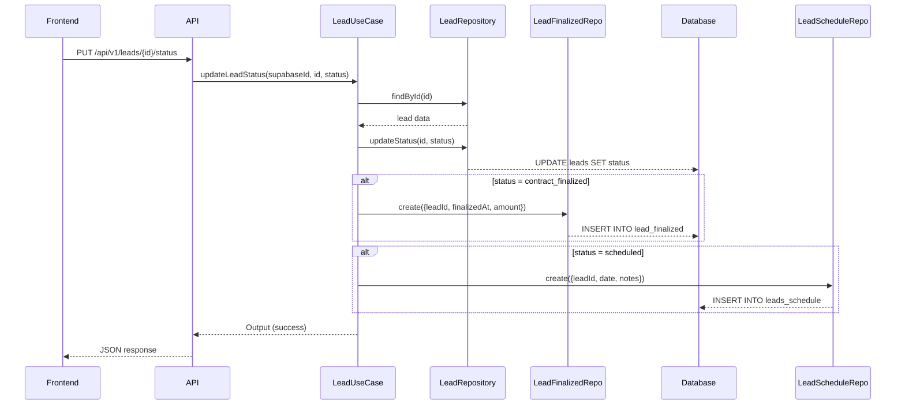

# Atualização Automática de Tabelas ao Mudar Status do Lead

## Resumo

Quando um lead tem seu status alterado, o sistema agora cria automaticamente registros nas tabelas especializadas:

### 1. **Status: `contract_finalized`** → Cria registro em `LeadFinalized`
Quando um lead é movido para a coluna "Negócio fechado", o sistema:
- ✅ Atualiza o status do lead para `contract_finalized`
- ✅ Cria um registro na tabela `LeadFinalized` contendo:
  - `leadId`: ID do lead
  - `finalizedAt`: Data/hora atual
  - `amount`: Valor do campo `currentValue` do lead
  - `notes`: Nota automática sobre a venda

### 2. **Status: `scheduled`** → Cria registro em `LeadsSchedule`
Quando um lead é movido para a coluna "Agendado", o sistema:
- ✅ Atualiza o status do lead para `scheduled`
- ✅ Cria um registro na tabela `LeadsSchedule` contendo:
  - `leadId`: ID do lead
  - `date`: Data do campo `meetingDate` do lead (ou data atual se não houver)
  - `notes`: Nota automática sobre o agendamento

---

## Arquivos Criados

### 1. Repositories para LeadFinalized

**`app/api/infra/data/repositories/leadFinalized/ILeadFinalizedRepository.ts`**
- Interface do repository
- Define métodos: `create()`, `findByLeadId()`, `findLatestByLeadId()`

**`app/api/infra/data/repositories/leadFinalized/LeadFinalizedRepository.ts`**
- Implementação do repository
- CRUD completo para tabela `LeadFinalized`

### 2. Repositories para LeadsSchedule

**`app/api/infra/data/repositories/leadSchedule/ILeadScheduleRepository.ts`**
- Interface do repository
- Define métodos: `create()`, `findByLeadId()`, `findLatestByLeadId()`

**`app/api/infra/data/repositories/leadSchedule/LeadScheduleRepository.ts`**
- Implementação do repository
- CRUD completo para tabela `LeadsSchedule`

---

## Arquivos Modificados

### `app/api/useCases/leads/LeadUseCase.ts`

**Método `updateLeadStatus()`:**
```typescript
async updateLeadStatus(supabaseId: string, id: string, status: LeadStatus): Promise<Output> {
  // 1. Valida o usuário
  // 2. Busca o lead existente
  // 3. Atualiza o status
  // 4. Se status = contract_finalized → cria registro em LeadFinalized
  // 5. Se status = scheduled → cria registro em LeadsSchedule
  // 6. Retorna sucesso
}
```

**Imports adicionados:**
```typescript
import { leadFinalizedRepository } from "../../infra/data/repositories/leadFinalized/LeadFinalizedRepository";
import { leadScheduleRepository } from "../../infra/data/repositories/leadSchedule/LeadScheduleRepository";
```

---

## Fluxo de Execução

### Quando o usuário arrasta um lead no Board Kanban:



---

## Integração com Frontend (BoardContext)

O componente `BoardContext.tsx` já está preparado para chamar a API quando um lead é arrastado:

```typescript
// No arquivo: app/[supabaseId]/board/features/context/BoardContext.tsx

const updateLeadStatusInAPI = async (leadId: string, newStatus: ColumnKey) => {
  try {
    const response = await fetch(`/api/v1/leads/${leadId}/status`, {
      method: 'PUT',
      headers: {
        'Content-Type': 'application/json',
        'x-supabase-user-id': supabaseId
      },
      body: JSON.stringify({ status: newStatus })
    });

    if (!response.ok) {
      console.error('Erro ao atualizar status do lead');
    }
  } catch (error) {
    console.error('Erro ao atualizar status do lead:', error);
  }
};
```

**Quando o usuário arrasta um card:**
1. `onDrop()` atualiza o estado local imediatamente
2. `updateLeadStatusInAPI()` envia a atualização para o backend
3. Backend atualiza o status E cria registros nas tabelas especializadas

---

## Benefícios

### 1. **Rastreamento Automático**
- ✅ Todas as vendas são automaticamente registradas em `LeadFinalized`
- ✅ Todos os agendamentos são automaticamente registrados em `LeadsSchedule`

### 2. **Métricas Precisas**
- ✅ Dashboard busca dados das tabelas especializadas
- ✅ Histórico completo de vendas e agendamentos
- ✅ Valores corretos sem depender do status atual do lead

### 3. **Auditoria**
- ✅ Cada venda tem timestamp de quando foi finalizada
- ✅ Cada agendamento tem registro da data agendada
- ✅ Notas automáticas para rastreabilidade

### 4. **Flexibilidade**
- ✅ Lead pode mudar de status sem perder histórico
- ✅ Múltiplos agendamentos possíveis para o mesmo lead
- ✅ Registros independentes do status atual

---

## Exemplos de Uso

### Criar venda manualmente via API:
```bash
curl -X PUT http://localhost:3000/api/v1/leads/{leadId}/status \
  -H "Content-Type: application/json" \
  -H "x-supabase-user-id: {supabaseId}" \
  -d '{"status": "contract_finalized"}'
```

### Criar agendamento manualmente via API:
```bash
curl -X PUT http://localhost:3000/api/v1/leads/{leadId}/status \
  -H "Content-Type: application/json" \
  -H "x-supabase-user-id: {supabaseId}" \
  -d '{"status": "scheduled"}'
```

---

## Próximos Passos Recomendados

### 1. **Validações**
- [ ] Evitar duplicar registros se o lead já está naquele status
- [ ] Validar se `currentValue` existe antes de criar `LeadFinalized`
- [ ] Validar se `meetingDate` existe antes de criar `LeadsSchedule`

### 2. **Melhorias**
- [ ] Permitir editar valores antes de finalizar (dialog de confirmação)
- [ ] Adicionar campo de observações ao finalizar venda
- [ ] Permitir escolher data ao agendar

### 3. **Frontend**
- [ ] Mostrar toast de confirmação ao criar registros
- [ ] Exibir histórico de agendamentos e vendas no detalhe do lead
- [ ] Dashboard visual para acompanhar vendas e agendamentos

### 4. **Testes**
- [ ] Testar criação de registros ao mudar status
- [ ] Testar métricas do dashboard com novos registros
- [ ] Validar permissões (Manager/Operator)

---

## Compatibilidade

- ✅ **Backward Compatible**: Não quebra funcionalidades existentes
- ✅ **API inalterada**: Mesma rota `/api/v1/leads/{id}/status`
- ✅ **Frontend inalterado**: Board Kanban continua funcionando normalmente
- ✅ **Métricas atualizadas**: Dashboard agora usa as tabelas especializadas

---

## Observações Importantes

⚠️ **Atenção**: 
- O valor salvo em `LeadFinalized.amount` é o valor de `Lead.currentValue` no momento da finalização
- Se o lead mudar de status depois, o registro em `LeadFinalized` permanece inalterado
- Isso garante que as métricas históricas sejam precisas

💡 **Dica**:
- Para ver o histórico completo de um lead, consulte:
  - `LeadsSchedule` para agendamentos
  - `LeadFinalized` para vendas
  - `LeadActivity` para todas as atividades
