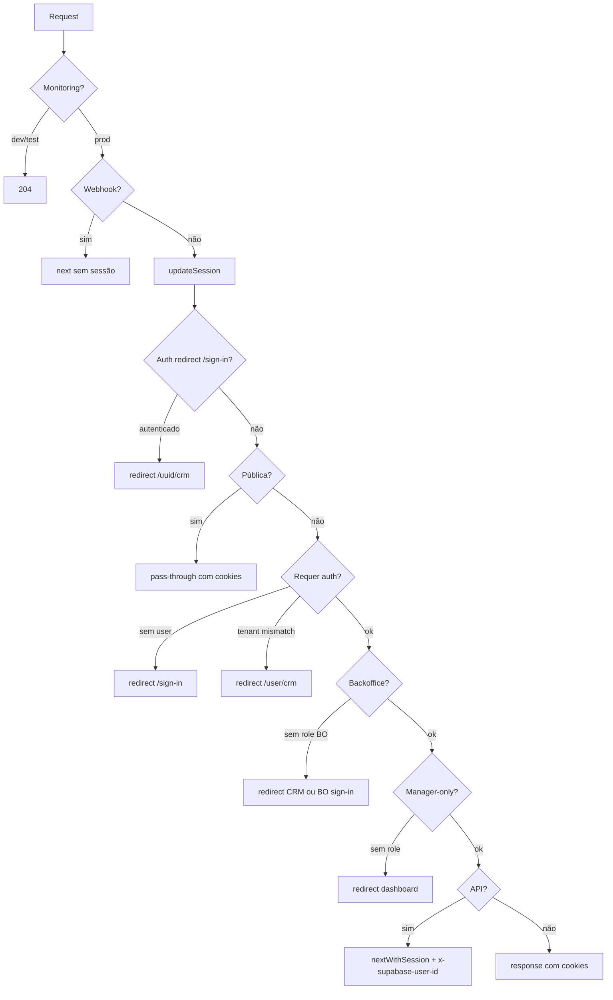

# Resumo — Proxy Next.js 16 + Supabase SSR

Documento consolidado do histórico deste chat: avaliação, planos definidos, implementações e validações.

---

## 1. Contexto inicial

O chat começou com uma **avaliação de `proxy.ts`** no contexto de **Next.js 16** (convenção `middleware` → `proxy`) e **Supabase SSR**. O arquivo concentra:

- Refresh de sessão Supabase (`updateSession`)
- Proteção de rotas tenantizadas (`/{supabaseId}/...`)
- Autorização de backoffice e rotas manager-only
- Injeção do header `x-supabase-user-id` nas APIs `/api/v1/*`

---

## 2. Avaliação inicial — o que estava bem e o que faltava

### Pontos positivos identificados

| Área | Situação |
|------|----------|
| Convenção Next.js 16 | `proxy.ts` na raiz com `export async function proxy` e `config.matcher` correto |
| Runtime | Proxy roda em Node.js por padrão no Next 16 — Prisma viável |
| Supabase SSR | `getUser()` (não `getSession()`), cookie gate antes de chamar auth |
| Webhooks | `/api/webhooks/*` bypassa sessão |
| Matcher | Exclui assets estáticos adequadamente |

### Problemas identificados

1. **Lista incompleta de rotas protegidas** — rotas tenantizadas novas (ex.: `/whatsapp`, `/carteira`) podiam ficar sem proteção
2. **Perda de cookies de sessão** — redirects e respostas API sem propagar cookies do `updateSession`
3. **Fail-open inconsistente** — erros em `updateSession` nem sempre bloqueavam rotas sensíveis
4. **Duplicação Prisma** — múltiplas queries de role no mesmo request
5. **Listas de rotas divergentes** — `proxy.ts` e `feature-route-access.ts` mantinham prefixos separados
6. **Anti-spoof frágil** — header `x-supabase-user-id` precisava ser sempre sobrescrito pelo proxy
7. **`/sign-in` como rota pública** — redirect para CRM quando autenticado era código morto
8. **GET `/api/v1/profiles/[supabaseId]`** — sem validação de ownership explícita

---

## 3. Plano 1 — Refatoração do proxy

**Objetivo:** deny-by-default em rotas tenantizadas, cookies propagados, configuração unificada, fail-closed padronizado e query Prisma única para role.

### Fases implementadas

| Fase | Descrição | Status |
|------|-----------|--------|
| 1 | Single source of truth de rotas em `lib/proxy/route-access.ts` | ✅ |
| 2 | Deny-by-default: qualquer `/{uuid}/...` exige auth | ✅ |
| 3 | Cookies Supabase em redirects e APIs via helpers exportados | ✅ |
| 4 | Fail-closed em rotas sensíveis + catch global com Sentry tag `proxy` | ✅ |
| 5 | Query Prisma única via `resolveProfileRoleForProxy` | ✅ |
| 6 | Testes unitários de classificação de rotas | ✅ |
| 7 | Limpeza de instrumentação de debug (`#region agent log`) | ✅ |

---

## 4. Arquivos criados e alterados (Plano 1)

### Novos módulos

| Arquivo | Responsabilidade |
|---------|------------------|
| `lib/proxy/route-access.ts` | Classificação centralizada: UUID, públicas, tenant, manager, sensitive, auth-redirect |
| `lib/proxy/resolve-profile-role.ts` | Query Prisma única `{ role }` por `supabaseId` |
| `lib/proxy/route-access.test.ts` | 12 testes unitários de classificação de rotas |

### Refatorações

| Arquivo | Mudança |
|---------|---------|
| `proxy.ts` | Reescrito usando módulos acima; deny-by-default; cookies; fail-closed |
| `lib/supabase/auth-sessions.ts` | Export de `copySessionCookies`, `redirectWithSession`, `nextWithSession` |
| `lib/features/feature-route-access.ts` | Prefixos derivados de `TENANT_ROUTE_PREFIXES` (fonte única) |
| `package.json` | Script `test` passou a incluir `lib/proxy` |

### Limpeza

Removida instrumentação de debug em:

- `app/[supabaseId]/components/LayoutContent.tsx`
- `app/context/UserContext.tsx`
- `app/context/TeamContext.tsx`
- `lib/teamMembersClientCache.ts`
- `app/[supabaseId]/crm/features/context/PipelineContext.tsx`
- `app/[supabaseId]/crm/features/hooks/useLeadDetails.ts`

---

## 5. Comportamento do proxy após refatoração



### Regras principais

- **`requiresAuth`**: rota legacy (`/crm`, `/whatsapp`, …) **ou** rota tenantizada `/{uuid}/...`
- **`isSensitiveRoute`**: backoffice, tenant app, legacy tenant — fail-closed em erro de sessão
- **APIs**: header `x-supabase-user-id` sempre definido/sobrescrito pelo proxy
- **Backoffice**: exige role backoffice via Prisma; demais usuários redirecionados ao CRM
- **Manager-only** (`/manager-users`, `/integrations`): exige role manager-like

---

## 6. Avaliação pós-implementação

Com base em logs de dev e revisão de código, os fluxos confirmados foram:

- CRM tenantizado (`/{uuid}/crm`)
- Backoffice com redirect correto
- Injeção de `x-supabase-user-id` nas APIs
- Sign-in / sign-out
- Legacy routes (`/crm` → `/{uuid}/crm`)

Lacunas menores restantes na época:

- Redirect `/sign-in` autenticado era código morto (sign-in estava em rotas públicas)
- Catch global sem cookies em alguns caminhos de erro
- Erro de hidratação no `LayoutContent` (tratado em outro chat)

---

## 7. Follow-ups implementados

### 7.1 Redirect de `/sign-in` quando autenticado

- `/sign-in` **removido** de `PUBLIC_PAGE_ROUTES`
- Nova função `isAuthRedirectRoute()` e constante `AUTH_REDIRECT_ROUTES`
- Em `proxy.ts`, check de auth redirect **antes** de `isPublicPageRoute`:

```typescript
if (user && isAuthRedirectRoute(pathname)) {
  return redirectWithSession(response, `/${user.id}/crm`)
}
```

Usuário sem sessão continua acessando `/sign-in` normalmente.

### 7.2 Endurecimento de GET `/api/v1/profiles/[supabaseId]`

- Novo helper `app/api/v1/profiles/utils/assertProfileOwnership.ts`
- Fluxo:
  1. Lê `x-supabase-user-id` (injetado pelo proxy)
  2. Fallback via `createSupabaseServer().auth.getUser()`
  3. Retorna **401** sem auth, **403** se ID não pertence ao usuário
- Rota GET passou a usar `assertProfileOwnership` antes de retornar dados

---

## 8. Plano 2 — Testes do proxy + gate no CI

**Objetivo:** regressões em `proxy.ts` quebrem a pipeline. Somente testes do proxy no CI (não a suite completa `bun test`).

### Estratégia

Testar o handler com **mocks via `spyOn`** (padrão de `getCdpAccess.test.ts`), sem DB nem Supabase real.

### Arquivo `proxy.test.ts` (raiz)

**Helpers:**

- `makeRequest(pathname, { headers? })` — cria `NextRequest`
- `makeSession(user | null)` — mock de `updateSession`

**Mocks (beforeEach / afterEach):**

- `updateSession`, `redirectWithSession`, `nextWithSession`
- `resolveProfileRoleForProxy`
- `Sentry.captureException`
- `validateBackofficeAdhesionToken`

**15 casos de teste:**

| Cenário | Assert principal |
|---------|------------------|
| Webhook skip | `updateSession` não chamado; status 200 |
| Monitoring dev | status 204 |
| Sign-in sem auth | pass-through 200 |
| Sign-in com auth | redirect 307 → `/{uuid}/crm` |
| Tenant sem auth | redirect → `/sign-in` |
| Tenant mismatch | redirect → `/{USER_A}/crm` |
| Legacy tenant | redirect → `/{USER_A}/crm` |
| API header inject | header `x-supabase-user-id` presente |
| API anti-spoof | header falso sobrescrito |
| Backoffice sem auth | redirect → `/backoffice/sign-in` |
| Backoffice role inválida | redirect → CRM |
| Manager-only negado | redirect → dashboard |
| Fail-closed (página sensível) | redirect `/sign-in` em throw |
| Fail-closed (backoffice) | redirect BO sign-in em throw |
| Fail-open (rota não sensível) | pass-through em throw |

**Correções de typecheck:**

- `makeRequest` usa `{ headers }` explícito (evita conflito DOM/undici `RequestInit`)
- Teste de monitoring confia em `NODE_ENV !== "production"` do ambiente Bun (sem mutar `process.env`)

### Script npm

```json
"test:proxy": "bun test proxy.test.ts lib/proxy/route-access.test.ts"
```

O script `"test"` existente **não foi alterado** para CI — continua rodando leads/email/cdp localmente.

### Integração CI (gate bloqueante)

Step adicionado nos 4 workflows, após Typecheck e antes de `Resolve Quality Result`:

```yaml
- name: Proxy Tests
  id: proxy-tests
  run: bun run test:proxy
```

| Workflow | Job | Agregador |
|----------|-----|-----------|
| `.github/workflows/ci-feature.yml` | `quality` | `quality-passed` inclui `proxy-tests` |
| `.github/workflows/ci-bugfix.yml` | `quality` | idem |
| `.github/workflows/ci-develop.yml` | `quality` | idem |
| `.github/workflows/ci-main.yml` | `quality` | falha direta no step |

Jobs downstream (`migration-status`, `build`) já dependem de `quality-gate` ou `quality` — falha em `test:proxy` trava a pipeline.

---

## 9. Validação final

Comandos executados com sucesso:

```bash
bun run test:proxy    # 27 testes (15 proxy + 12 route-access)
bun run typecheck
bun run lint
bun run governance:check
```

---

## 10. Fora de escopo (deliberado)

- Rodar suite completa `bun test` no CI
- Testes E2E com browser
- Endurecer PUT/DELETE de profile (follow-up separado)
- Correção de hidratação no `LayoutContent` (outro chat)
- Push de migrations para remoto

---

## 11. Mapa de arquivos relevantes

```
proxy.ts                          # Handler principal
proxy.test.ts                     # Testes de integração com mocks
lib/proxy/
  route-access.ts                 # Classificação de rotas
  route-access.test.ts            # Testes unitários de rotas
  resolve-profile-role.ts         # Query Prisma de role
lib/supabase/auth-sessions.ts     # Sessão + helpers de cookie
lib/features/feature-route-access.ts
app/api/v1/profiles/
  [supabaseId]/route.ts           # GET com ownership
  utils/assertProfileOwnership.ts
.github/workflows/
  ci-feature.yml
  ci-bugfix.yml
  ci-develop.yml
  ci-main.yml
package.json                      # test:proxy
```

---

## 12. Linha do tempo do chat

1. **Avaliação** — review de `proxy.ts` + Next.js 16 + Supabase SSR
2. **Plano 1** — refatoração deny-by-default, cookies, fail-closed, módulos
3. **Implementação Plano 1** — módulos, proxy refatorado, limpeza de debug
4. **Avaliação pós-deploy local** — conformidade cruzada plano vs código + logs
5. **Follow-ups** — redirect `/sign-in` autenticado + ownership em GET profile
6. **Plano 2** — testes `proxy.test.ts` + gate CI `test:proxy`
7. **Implementação Plano 2** — 27 testes, workflows, validação completa
8. **Este documento** — consolidação do histórico

---

*Gerado em 2026-06-28 a partir do histórico do chat sobre proxy, autenticação e CI.*
