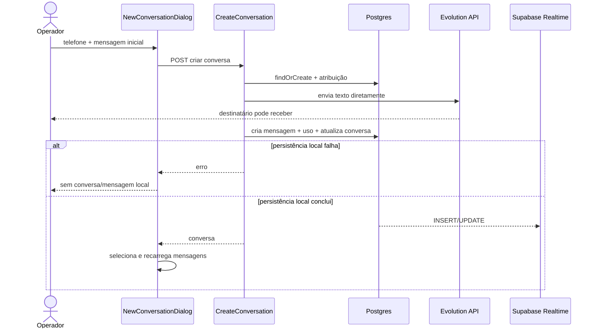
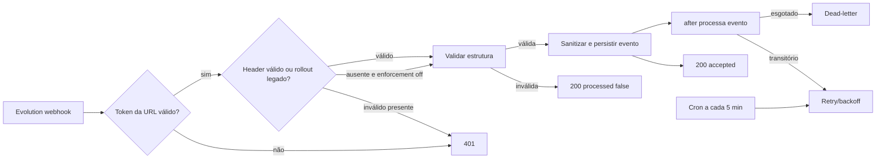
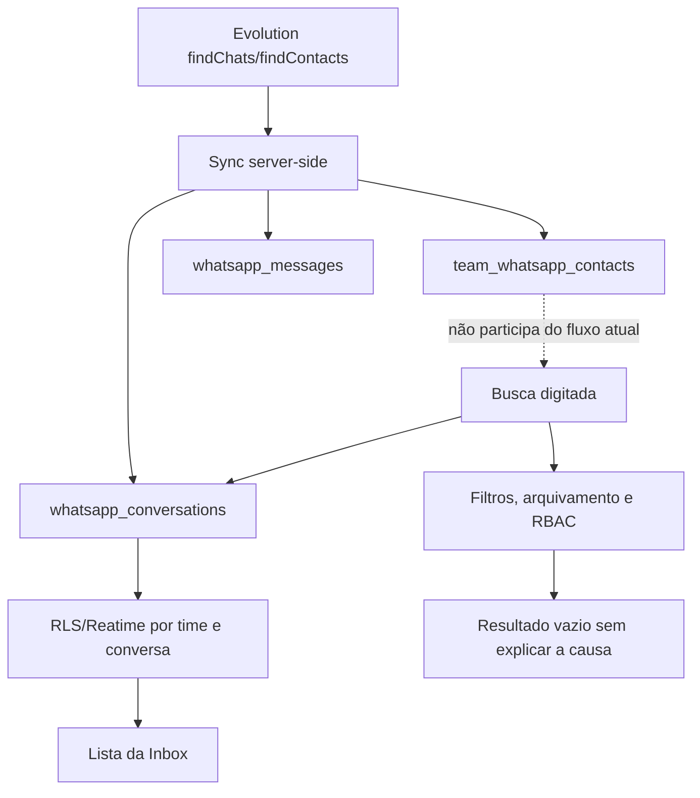

Method: dual-agent (A: `/root/impeccable_critique_a` · B: `/root/impeccable_critique_b`)

# Auditoria aprofundada — WhatsApp Inbox

**Data:** 2026-07-23  
**Status:** **RASCUNHO TÉCNICO — validação read-only do Supabase de produção pendente**  
**Commit auditado:** `aba62930655fcf94cb5fb2d9604068ec38328917`  
**Branch:** `bugfix/ci-skip-pre-push-on-actions`  
**Produto:** Corretor Studio — Inbox de WhatsApp por time  
**Provider:** Evolution API self-hosted  
**Documento canônico de implementação relacionado:** [`WHATSAPP_SPEC.md`](WHATSAPP_SPEC.md)  
**Auditoria anterior preservada:** [`WHATSAPP_AUDIT.md`](WHATSAPP_AUDIT.md)

> Este documento não altera código, API, schema ou migration. Ele registra o estado atual e será a entrada da próxima SPEC de implementação.

## 1. Veredito executivo

A Inbox tem uma boa fundação — adapter de provider, webhook persistido em outbox, Realtime com RLS, estados de entrega, storage privado e layout lista/painel —, mas **a tarefa mais importante ainda não é confiável de ponta a ponta**.

O relato dos usuários de que “a pessoa recebeu a mensagem, mas ela não aparece no Corretor Studio e não é encontrada na busca” é tecnicamente coerente com o fluxo atual:

1. “Nova conversa” cria a conversa;
2. a mensagem inicial é enviada diretamente pelo serviço;
3. o provider pode aceitar a mensagem;
4. a persistência local pode falhar depois do envio;
5. a rota devolve erro e o frontend não seleciona nem insere a conversa/mensagem;
6. o destinatário recebe a mensagem, mas o operador não tem prova local do envio.

Esse é o **P0** da auditoria.

### Resultado geral

| Indicador                        |                         Resultado |
| -------------------------------- | --------------------------------: |
| Achados                          |                            **21** |
| P0 — bloqueadores                |                             **1** |
| P1 — maiores                     |                            **11** |
| P2 — menores                     |                             **9** |
| P3 — polimento                   |                             **0** |
| Impeccable Audit Health Score    |             **12/20 — Aceitável** |
| Impeccable/Nielsen Design Health |             **22/40 — Aceitável** |
| Carga cognitiva                  | **Alta — 5/8 critérios falharam** |
| Testes focados                   |       **66 passaram, 0 falharam** |
| Supabase produção                |   **Não verificado nesta sessão** |

### Cinco riscos que devem orientar a próxima SPEC

1. **Divergência provider × banco no primeiro envio:** mensagem entregue sem registro local ou conversa selecionável.
2. **Idempotência incompleta no cliente:** retry e corrida HTTP × Realtime podem duplicar ou esconder mensagens.
3. **Busca e sincronização desconectadas:** contatos importados não participam do fluxo de iniciar conversa e telefone formatado pode não casar.
4. **Superfície de segurança:** `hostBaseUrl` arbitrário pode provocar SSRF e enviar a chave global da Evolution a um host controlado.
5. **Privacidade/observabilidade:** logs de produção carregam JIDs/telefones e URLs temporárias completas de mídia.

## 2. Escopo, não escopo e método

### 2.1 Incluído

- Inbox web, lista de conversas, painel de mensagens, composer, mídia e áudio.
- Criação de conversa, envio outbound, retry, idempotência e reconciliação.
- Webhook Evolution, outbox, cron, persistência e efeitos laterais.
- Sincronização de histórico, agenda, nomes, telefone e grupos.
- Supabase Postgres, RLS, Realtime e Storage no que atende a Inbox.
- RBAC de master, manager e operator.
- Segurança, privacidade, retenção, logs, métricas e falhas de produção.
- Comparação funcional com o clone local `Whatsapp-Clone-Frontend`.
- Impeccable `audit` e `critique`.

### 2.2 Fora do escopo

- Bethânia, Studio Bot e Backoffice Bot.
- A SPEC de bot dedicado em [`WHATSAPP_BOT_SPEC.md`](WHATSAPP_BOT_SPEC.md).
- Alterações no código, banco, Evolution, Vercel ou Supabase.
- Cópia de marca, ativos, sons, ícones ou código proprietários do WhatsApp.

Erros de Bethânia encontrados nos logs foram descartados. Infraestrutura compartilhada só aparece quando afeta diretamente a Inbox.

### 2.3 Fontes

- Código, Prisma e migrations do commit auditado.
- [`WHATSAPP_SPEC.md`](WHATSAPP_SPEC.md), auditoria histórica e SPEC de bot adiada.
- Capturas fornecidas pelos usuários.
- Clone local `/home/matheuswillock/develop/Whatsapp-Clone-Frontend`, commit `3d79f4a`.
- Export Vercel `/home/matheuswillock/Downloads/corretor-studio-log-export-2026-07-23T17-02-42.json`.
- Vercel Runtime Errors/Logs, janelas de 24 horas e 7 dias.
- Supabase Docs e changelog consultados em 2026-07-23.
- Duas avaliações Impeccable independentes.

### 2.4 Convenção de evidência

| Tipo                    | Significado                                                                                          |
| ----------------------- | ---------------------------------------------------------------------------------------------------- |
| **Produção**            | Confirmado por logs agregados ou captura real.                                                       |
| **Código**              | Confirmado estaticamente na implementação atual.                                                     |
| **Reprodução pendente** | Caminho plausível e sustentado pelo código, mas sem sessão autenticada para reproduzir no navegador. |
| **Supabase pendente**   | Migration sugere risco, mas grants/RLS do banco vivo ainda não foram consultados.                    |

Todos os telefones, JIDs, IDs de time, tokens, URLs assinadas e conteúdo de mensagens foram removidos deste documento.

### 2.5 Limitações

- O MCP do Supabase está configurado em `.mcp.json`, mas suas ferramentas não foram expostas/autenticadas nesta sessão. Advisors, grants e amostras do banco vivo permanecem pendentes.
- A rota da Inbox exige autenticação e contexto de time. Não havia sessão de browser disponível para overlay visual confiável ou teste E2E.
- O detector Impeccable foi executado no source; browser overlay não foi injetado.
- O export Vercel contém múltiplas linhas por request. Contagens HTTP abaixo foram deduplicadas por `requestId`.

## 3. Evidência de produção

### 3.1 Recorte de 24 horas

Janela: **2026-07-22 17:03 UTC → 2026-07-23 17:02 UTC**.

| Métrica                               |  Resultado |
| ------------------------------------- | ---------: |
| Registros totais no export            |     97.089 |
| Registros associados a rotas WhatsApp |      4.922 |
| GET de conversas registrados          | 993 linhas |
| Processamentos do cron de outbox      | 872 linhas |
| Acessos à página da Inbox             | 749 linhas |
| Webhooks Evolution                    | 663 linhas |

#### Respostas 4xx deduplicadas

| Endpoint normalizado                   | Status | Requests |
| -------------------------------------- | -----: | -------: |
| `/whatsapp/unread-count`               |    403 |       28 |
| `/whatsapp/messages/[messageId]/media` |    404 |       26 |
| `/whatsapp/config`                     |    404 |       23 |
| `/whatsapp/usage`                      |    403 |       13 |
| `/whatsapp/conversations`              |    403 |        1 |
| `/whatsapp/messages`                   |    400 |        1 |

Os 403/404 de config, usage e unread podem incluir troca de time, sessão expirada ou acesso ao módulo sem configuração. A UI hoje não diferencia adequadamente esses estados.

#### Latência das funções

| Fluxo                      | Amostras |    Média |      p95 |    Máximo |
| -------------------------- | -------: | -------: | -------: | --------: |
| Sincronizar contatos       |        1 | 8.755 ms | 8.755 ms |  8.755 ms |
| Mensagens, incluindo mídia |       57 |   560 ms | 1.054 ms | 14.940 ms |
| Configuração               |       76 |   824 ms | 4.260 ms |  6.251 ms |
| Webhook                    |      188 |   309 ms | 1.136 ms |  1.350 ms |
| Conversas                  |      491 |   234 ms |   366 ms |  2.674 ms |

Uma amostra não permite generalizar a média de sincronização de contatos, mas comprova que o fluxo pode ultrapassar oito segundos. O máximo de mensagens é compatível com chamadas lentas/timeout no provider.

### 3.2 Clusters Vercel de 7 dias

| Cluster anonimizado                                               | Ocorrências | Interpretação                                                              |
| ----------------------------------------------------------------- | ----------: | -------------------------------------------------------------------------- |
| Evolution falhou ao baixar stream de mídia                        |          34 | Mídia expirada/indisponível; a mesma falha aparece em duas camadas de log. |
| Evolution acessou `ephemeralMessage` inexistente                  |          13 | Incompatibilidade de payload/versão para certas mídias.                    |
| `findChats` timeout                                               |           3 | Sincronização de histórico depende de operação lenta na VPS.               |
| `findChats` JSON inválido                                         |           2 | Resposta truncada/incompatível do provider.                                |
| `findChats` falhou por relação inexistente na Evolution           |           2 | Drift/migration inconsistente no banco da Evolution.                       |
| Side effect de conversa falhou por `unexpected end of hex escape` |           3 | Payload de nome/metadado inválido chegou ao Prisma.                        |
| Criar conversa com instância desconectada                         |           3 | UI/estado de conexão permitiu tentativa inválida.                          |
| Número inexistente na Evolution                                   |           1 | Validação do destinatário chegou tarde e o body completo foi logado.       |

### 3.3 Privacidade dos logs

Foram observados:

- JID e telefone completos no envio;
- nome técnico da instância;
- body integral de erros da Evolution;
- URL temporária completa de mídia do domínio do WhatsApp;
- stack traces com payloads do provider.

Esses valores **não** são reproduzidos aqui. O padrão viola a decisão da SPEC atual de não registrar telefone completo, conteúdo ou URLs sensíveis.

## 4. Fluxos críticos atuais

### 4.1 Primeiro contato e primeiro envio



O envio externo ocorre antes da persistência e fora do `SendMessageUseCase`; não existe transação distribuída nem comando durável específico para esse primeiro envio.

### 4.2 Webhook e outbox



A fundação durável é positiva. O risco restante está na autenticação opcional, observabilidade, sanitização de strings e confirmação de grants das tabelas de outbox.

### 4.3 Contatos, histórico, busca e visibilidade



## 5. Matriz de achados

| ID     | Sev. | Achado                                                           | Evidência         | Confiança |
| ------ | ---: | ---------------------------------------------------------------- | ----------------- | --------- |
| WA-001 |   P0 | Primeiro envio pode chegar e não existir localmente              | Código + relato   | Alta      |
| WA-002 |   P1 | `clientMessageId` não é estável e há corrida HTTP × Realtime     | Código            | Alta      |
| WA-003 |   P1 | Busca não encontra contatos nem normaliza telefone               | Código + relato   | Alta      |
| WA-004 |   P1 | Sync de histórico é sequencial e N+1                             | Código + produção | Alta      |
| WA-005 |   P1 | Pipeline de mídia é frágil e caro                                | Código + produção | Alta      |
| WA-006 |   P1 | `hostBaseUrl` permite SSRF/exfiltração da chave Evolution        | Código            | Alta      |
| WA-007 |   P1 | Logs vazam PII e URLs temporárias                                | Produção + código | Alta      |
| WA-008 |   P1 | Autenticação adicional do webhook é opt-in                       | Código            | Alta      |
| WA-009 |   P1 | Cobertura RLS/grants das tabelas públicas é incerta              | Migrations        | Média     |
| WA-010 |   P1 | Strings inválidas quebram side effects do webhook                | Produção          | Alta      |
| WA-011 |   P1 | Mobile e acessibilidade não cumprem o contrato de 44 px          | Código + crítica  | Alta      |
| WA-012 |   P1 | Recuperação da permissão de microfone não conduz ao sucesso      | Código + captura  | Alta      |
| WA-013 |   P2 | Anexo é enviado imediatamente e não é recuperável                | Código            | Alta      |
| WA-014 |   P2 | Outbound command fica `PENDING` após quota/rate limit            | Código            | Alta      |
| WA-015 |   P2 | Saúde do Realtime é invisível e fallback custa requests          | Código + logs     | Média     |
| WA-016 |   P2 | Temporizador de áudio pausado e reduced motion têm defeitos      | Código            | Alta      |
| WA-017 |   P2 | Contratos HTTP confundem ausência, permissão e indisponibilidade | Código + produção | Alta      |
| WA-018 |   P2 | Retenção/purge de payload e mídia continua pendente              | SPEC + schema     | Alta      |
| WA-019 |   P2 | Origem/licença dos wallpapers não está documentada               | Repositório       | Média     |
| WA-020 |   P2 | Arquivos monolíticos e cobertura insuficiente elevam regressão   | Código + testes   | Alta      |
| WA-021 |   P2 | Lacunas funcionais reduzem paridade com mensageiros maduros      | Clone + crítica   | Alta      |

## 6. Achados detalhados

### WA-001 — P0 — Primeiro envio pode chegar e não existir localmente

**Categoria:** confiabilidade, consistência de dados e UX.  
**Localização:** [`WhatsAppService.ts:707`](app/api/services/whatsapp/WhatsAppService.ts#L707), [`NewConversationDialog.tsx:53`](app/[supabaseId]/whatsapp/features/components/NewConversationDialog.tsx#L53), [`WhatsAppInboxHook.ts:1643`](app/[supabaseId]/whatsapp/features/context/WhatsAppInboxHook.ts#L1643).

**Fato:** `createConversation` chama `this.sendMessage` diretamente quando recebe `initialMessage`. Esse caminho não passa por `SendMessageUseCase`, não recebe `clientMessageId` e não cria comando outbound antes da chamada ao provider. `sendMessage` chama a Evolution e só depois cria mensagem, uso e preview local.

**Impacto:** se a Evolution aceitar e qualquer persistência posterior falhar, o destinatário recebe, a API devolve erro e a UI não insere/seleciona a conversa. O operador interpreta como perda e pode reenviar.

**Causa-raiz:** criação de conversa e envio foram modelados como uma única operação HTTP, mas sem estado durável que represente as etapas da operação distribuída.

**Recomendação:**

- criar a conversa e uma primeira mensagem/comando `PENDING` antes da Evolution;
- gerar `clientMessageId` no cliente e mantê-lo durante toda a jornada;
- selecionar a conversa e renderizar a bolha pendente imediatamente;
- reconciliar provider, banco e Realtime pelo mesmo identificador;
- conservar o rascunho e oferecer erro inline/retry seguro;
- não retornar “criação falhou” se a entrega ficou `UNKNOWN`.

**Aceite:** simular falha de DB após a Evolution aceitar. A UI mantém conversa e bolha `UNKNOWN`, o retry com a mesma chave não duplica e o webhook consegue reconciliar.

**Dependências:** contrato de idempotência, schema do comando/mensagem e reconciliação webhook.  
**Comando Impeccable:** `$impeccable harden`.

### WA-002 — P1 — Idempotência do cliente e corrida Realtime

**Categoria:** confiabilidade e estado frontend.  
**Localização:** [`WhatsAppInboxHook.ts:827`](app/[supabaseId]/whatsapp/features/context/WhatsAppInboxHook.ts#L827), [`WhatsAppInboxHook.ts:933`](app/[supabaseId]/whatsapp/features/context/WhatsAppInboxHook.ts#L933), [`WhatsAppInboxHook.ts:993`](app/[supabaseId]/whatsapp/features/context/WhatsAppInboxHook.ts#L993).

**Fatos:**

- `performSend` gera `crypto.randomUUID()` dentro de cada tentativa;
- `resendMessage` reaproveita a bolha, mas não a chave idempotente;
- a bolha otimista usa `optimistic-*`, diferente do ID local e do `clientMessageId`;
- um INSERT Realtime pode chegar antes da resposta HTTP e ser anexado à lista;
- depois, a resposta HTTP troca o ID da bolha otimista pelo mesmo ID real, deixando duas entradas com o mesmo ID até um refetch.

**Impacto:** duplicidade visual, retry externo duplicado e estado incerto sob latência.

**Recomendação:** criar um identificador por intenção de envio, armazená-lo na mensagem otimista e na tabela local, reutilizá-lo no retry e reconciliar Realtime por `clientMessageId` ou `providerMessageId`, nunca apenas por `message.id`.

**Aceite:** testar as duas ordens — HTTP antes do Realtime e Realtime antes do HTTP — e obter exatamente uma bolha.

### WA-003 — P1 — Busca não significa “buscar ou iniciar conversa”

**Categoria:** produto, busca e sincronização.  
**Localização:** [`ConversationList.tsx:68`](app/[supabaseId]/whatsapp/features/components/ConversationList.tsx#L68), [`WhatsAppRepository.ts:284`](app/api/infra/data/repositories/whatsapp/WhatsAppRepository.ts#L284), [`NewConversationDialog.tsx:30`](app/[supabaseId]/whatsapp/features/components/NewConversationDialog.tsx#L30).

**Fatos:**

- a busca consulta somente `whatsapp_conversations`;
- o texto bruto é usado em `contains` para nome, telefone e telefone normalizado;
- um telefone digitado com máscara não é normalizado antes da query;
- `team_whatsapp_contacts` é carregado principalmente para participantes/menções e não alimenta o diálogo;
- “Nova conversa” e “Novo contato” abrem o mesmo formulário com pequenas diferenças;
- zero resultados vira apenas “Nenhuma conversa encontrada”.

**Impacto:** o usuário não sabe se o contato não existe, não sincronizou, está arquivado, pertence a outro operador, foi ocultado por filtro ou ainda não tem conversa.

**Recomendação:** substituir os dois CTAs por busca unificada com seções “Conversas”, “Contatos” e “Iniciar com este número”; normalizar telefone; incluir nome, push name, agenda e número; explicar resultados ocultos por filtro/arquivamento/permissão sem vazar dados não autorizados.

**Aceite:** encontrar o mesmo contato por nome, número cru, número mascarado e últimos 8/9 dígitos; iniciar conversa a partir de contato sem conversa.

**Comando Impeccable:** `$impeccable shape`.

### WA-004 — P1 — Sincronização sequencial e N+1

**Categoria:** performance e confiabilidade.  
**Localização:** [`WhatsAppService.ts:766`](app/api/services/whatsapp/WhatsAppService.ts#L766).

**Fatos:**

- chats são processados sequencialmente;
- avatar pode gerar chamada extra por chat;
- mensagens são buscadas chat a chat;
- cada mensagem chama `findMessageByProviderMessageId`;
- cada nova mensagem é criada individualmente;
- a conversa é atualizada por chat;
- produção registrou timeout/JSON inválido em `findChats` e `findMessages`;
- a única amostra de sync de contatos no export levou 8,8 s.

**Impacto:** tempo cresce com `chats × mensagens`; a função fica vulnerável aos limites da Evolution/Vercel e pode deixar sync parcial.

**Recomendação:** cursor/checkpoint durável, batches, consulta única dos provider IDs existentes, `createMany`/upsert controlado, concorrência limitada para provider, sync incremental e progresso observável.

**Aceite:** benchmark com 100 chats × 100 mensagens sem query por mensagem, retomada após interrupção e sem duplicidade.

### WA-005 — P1 — Mídia expira, retorna 404 e usa Base64 no caminho crítico

**Categoria:** confiabilidade, performance e storage.  
**Localização:** [`MessageComposer.tsx:303`](app/[supabaseId]/whatsapp/features/components/MessageComposer.tsx#L303), [`WhatsAppService.ts:489`](app/api/services/whatsapp/WhatsAppService.ts#L489), [`GetMessageMediaUseCase.ts:43`](app/api/useCases/whatsapp/GetMessageMediaUseCase.ts#L43), [`media/route.ts:28`](app/api/v1/teams/[teamId]/whatsapp/messages/[messageId]/media/route.ts#L28).

**Fatos:**

- arquivo de até 16 MB é convertido integralmente para Base64 no browser;
- Base64 é enviado em JSON, ampliando uso de memória e payload;
- há upload ao storage antes da Evolution, o que é positivo;
- a recuperação de mídia inbound ainda pode depender de URL/payload efêmero da Evolution;
- 26 requests retornaram 404 em 24 horas;
- clusters de 7 dias mostram stream expirado e payload `ephemeralMessage` incompatível;
- a rota transforma qualquer falha não autorizada em 404.

**Impacto:** mídia quebra depois do envio, causa downloads repetidos, aumenta memória da função e não oferece recuperação clara.

**Recomendação:** upload direto/assinado para storage, provider receber URL ou stream server-side, ingestão de mídia inbound no webhook/worker, estado `AVAILABLE|PROCESSING|EXPIRED|FAILED`, placeholder persistente e reprocessamento controlado.

**Aceite:** mídia antiga continua acessível no storage mesmo após URL do WhatsApp expirar; falha mostra ação coerente, sem loop de 404.

### WA-006 — P1 — SSRF e exfiltração da chave global da Evolution

**Categoria:** segurança.  
**Localização:** [`EvoApiService.ts:14`](app/api/services/whatsapp/evo/EvoApiService.ts#L14), [`config/route.ts:8`](app/api/v1/teams/[teamId]/whatsapp/config/route.ts#L8), [`backoffice/instances/route.ts:20`](app/api/v1/backoffice/whatsapp/instances/route.ts#L20).

**Fatos:**

- `hostBaseUrl` é armazenado a partir de uma URL fornecida por gestor/backoffice;
- a validação de time aceita qualquer `z.string().url()`;
- a validação de backoffice aceita qualquer string;
- `getBaseUrl` usa o host sem allowlist;
- toda request envia `EVO_API_KEY` no header `apikey`;
- redirects e resolução DNS não são validados.

**Impacto:** uma configuração maliciosa ou conta privilegiada comprometida pode apontar para host externo, receber a chave global ou acessar serviços internos da infraestrutura.

**Recomendação:** não aceitar host por tenant; preferir IDs de endpoint cadastrados server-side. Se múltiplas VPS forem necessárias, exigir HTTPS, allowlist de hostname/porta, DNS pinning, bloqueio de IP privado/link-local/metadata, validação de redirects e segredo por host.

**Aceite:** testes bloqueiam HTTP, localhost, RFC1918, IPv6 local, metadata cloud, domínio que resolve para IP privado e redirect para destino não permitido.

### WA-007 — P1 — PII e URLs sensíveis nos logs

**Categoria:** privacidade e observabilidade.  
**Localização:** [`EvoApiService.ts:30`](app/api/services/whatsapp/evo/EvoApiService.ts#L30), [`EvoApiService.ts:576`](app/api/services/whatsapp/evo/EvoApiService.ts#L576), [`WhatsAppService.ts:547`](app/api/services/whatsapp/WhatsAppService.ts#L547).

**Fato:** o cliente loga JID, instância e body integral do provider; o erro propagado repete esse body em camadas superiores.

**Impacto:** telefone e URLs temporárias ficam disponíveis em Vercel/Sentry e podem ter retenção/acesso mais amplo que o banco operacional.

**Recomendação:** logger estruturado central, allowlist de campos, hash/últimos quatro dígitos quando imprescindível, redaction de URL/query/body, error code interno e correlação por IDs técnicos.

**Aceite:** teste de snapshot/redaction garante que JID, telefone, URL assinada, QR, API key e conteúdo nunca aparecem em log.

### WA-008 — P1 — Header do webhook é opt-in e derivável sem pepper

**Categoria:** segurança de webhook.  
**Localização:** [`webhook-header-auth.ts:5`](lib/whatsapp/webhook-header-auth.ts#L5), [`evolution/[teamToken]/route.ts:42`](app/api/webhooks/whatsapp/evolution/[teamToken]/route.ts#L42).

**Fatos:**

- o token na URL é obrigatório;
- o header adicional é aceito, mas ausência só bloqueia se `WHATSAPP_WEBHOOK_HEADER_ENFORCE=true`;
- sem `WHATSAPP_WEBHOOK_HEADER_SECRET`, o valor do header é hash determinístico do segredo da URL;
- as variáveis não aparecem em `.env.example` nem em validação de ambiente;
- o export não mostrou warnings de header ausente, mas isso não prova enforcement.

**Impacto:** vazamento do path pode ser suficiente para forjar eventos durante rollout legado.

**Recomendação:** pepper obrigatório e separado, enforcement default-on após inventário, rotação, segredo por instância, documentação/env validation e métrica de rejeição sem registrar segredo.

**Aceite:** produção rejeita header ausente/inválido; nenhum segredo pode ser derivado do path.

### WA-009 — P1 — RLS e grants de tabelas públicas precisam confirmação

**Categoria:** Supabase/Postgres.  
**Localização:** `supabase/migrations/*whatsapp*.sql`.

**Confirmado nas migrations:**

- `whatsapp_conversations` e `whatsapp_messages` têm RLS e `anon` foi revogado posteriormente;
- `whatsapp_audit_events` tem RLS e grants server-only;
- `whatsapp_send_rate_limit_windows` tem RLS;
- auto-response rules/logs têm RLS.

**Sem `ENABLE ROW LEVEL SECURITY` explícito encontrado no histórico local:**

- `team_whatsapp_configs`;
- `team_whatsapp_contacts`;
- `whatsapp_usage_events`;
- `whatsapp_outbound_commands`;
- `whatsapp_webhook_events`;
- `whatsapp_conversation_tags`;
- `whatsapp_conversation_tag_assignments`.

Também não foi encontrado `REVOKE EXECUTE FROM PUBLIC` para `public.whatsapp_user_can_view_conversation`, função `SECURITY DEFINER`. Ela verifica `auth.uid()`, o que reduz o risco, mas permanece uma API pública por default até confirmação de grants.

**Impacto:** em projetos com privilégios padrão antigos, tabelas em `public` podem estar alcançáveis pela Data API. RLS e grants são camadas diferentes.

**Recomendação:** validar banco vivo; habilitar RLS como defesa em profundidade em toda tabela do schema exposto; revogar `anon/authenticated` de tabelas server-only; mover função privilegiada para schema privado ou restringir `EXECUTE`.

**Aceite:** Advisors sem `rls_disabled_in_public`, `anon_security_definer_function_executable` ou `authenticated_security_definer_function_executable`; matriz explícita de grants por objeto.

**Estado:** **não confirmado em produção**.

### WA-010 — P1 — Payload inválido quebra side effects

**Categoria:** qualidade de dados e webhook.  
**Localização:** [`ProcessEvoWebhookUseCase.ts`](app/api/useCases/whatsapp/ProcessEvoWebhookUseCase.ts).

**Produção:** três ocorrências de Prisma `InvalidArg: unexpected end of hex escape` ao atualizar conversa; o código tentou um update mínimo em seguida.

**Impacto:** nome/avatar/preview ou outro metadado pode não ser aplicado, gerando conversa difícil de localizar e divergência silenciosa.

**Recomendação:** normalizar strings do provider para UTF-8 válido, remover NUL/escapes inválidos, limitar tamanho, guardar motivo seguro e cobrir payload real anonimizado em teste.

**Aceite:** payload com escape truncado não interrompe mensagem nem side effects essenciais; campo inválido é descartado e metrificado.

### WA-011 — P1 — Mobile e acessibilidade abaixo do contrato

**Categoria:** WCAG, responsividade e carga cognitiva.  
**Localização:** [`ConversationList.tsx:68`](app/[supabaseId]/whatsapp/features/components/ConversationList.tsx#L68), [`MessagePanel.tsx:93`](app/[supabaseId]/whatsapp/features/components/MessagePanel.tsx#L93), [`WhatsAppMessageInputShell.tsx:53`](app/[supabaseId]/whatsapp/features/components/WhatsAppMessageInputShell.tsx#L53), [`MessagingMessageBubble.tsx:334`](components/messaging/MessagingMessageBubble.tsx#L334).

**Fatos:**

- filtros usam `py-1`;
- attach/emoji têm 32 px e send 40 px;
- controle de velocidade tem 28 px e slider visual 8 px;
- cabeçalho pode mostrar mais de sete ações;
- busca depende de placeholder;
- item selecionado não expõe `aria-current`/`aria-pressed`;
- lightbox não é dialog, não prende foco nem garante Escape;
- listas de responsável/tags não têm busca.

**Impacto:** erro de toque, overflow com nome longo, navegação por teclado incompleta e excesso de decisões antes da tarefa principal.

**Recomendação:** 44 × 44 px de hit area, safe area do mobile, cabeçalho com identidade + uma ação + overflow, painel/sheet para CRM, labels/estado selecionado semântico e dialog acessível.

**Aceite:** fluxo completo em 320/375/768/1440 px, zoom 200%, teclado e leitor de tela sem perda de ação.

**Comando Impeccable:** `$impeccable adapt` e `$impeccable distill`.

### WA-012 — P1 — Recuperação do microfone não conduz ao sucesso

**Categoria:** UX, permissão e acessibilidade.  
**Localização:** [`MessageComposer.tsx:358`](app/[supabaseId]/whatsapp/features/components/MessageComposer.tsx#L358), [`MessageComposer.tsx:390`](app/[supabaseId]/whatsapp/features/components/MessageComposer.tsx#L390).

**Fato:** o prompt precoce da auditoria histórica foi corrigido; hoje o alerta aparece somente após `NotAllowedError`. Entretanto, a mensagem diz para liberar a permissão sem botão “Como liberar”, “Testar novamente”, instrução por browser/OS ou confirmação de mudança.

**Impacto:** corresponde à captura enviada: a operadora continua bloqueada e depende de suporte.

**Recomendação:** CTA contextual “Como liberar”, instruções Android/iOS/Chrome/Edge/Safari, diagnóstico de HTTPS/suporte, “Testar microfone novamente”, listener de mudança quando suportado e telemetria anonimizada.

**Aceite:** cenários `prompt`, `granted`, `denied`, `unsupported` e permissão alterada em outra aba; texto digitado nunca é perdido.

**Comando Impeccable:** `$impeccable clarify`.

### WA-013 — P2 — Anexo é enviado sem preview e sem retry equivalente

**Categoria:** prevenção e recuperação de erro.  
**Localização:** [`MessageComposer.tsx:303`](app/[supabaseId]/whatsapp/features/components/MessageComposer.tsx#L303), [`WhatsAppInboxHook.ts:933`](app/[supabaseId]/whatsapp/features/context/WhatsAppInboxHook.ts#L933).

Selecionar um arquivo inicia Base64 e envio imediatamente; não há preview, confirmação, remoção ou edição de legenda. `resendMessage` exige `contentText`, portanto mídia falha não pode ser reenviada pelo mesmo mecanismo.

**Recomendação:** fila de preview antes do envio, upload progressivo, cancelamento e retry por command ID.

### WA-014 — P2 — Command permanece `PENDING` em rejeição local

**Categoria:** estado da outbox.  
**Localização:** [`SendMessageUseCase.ts:42`](app/api/useCases/whatsapp/SendMessageUseCase.ts#L42).

O comando é criado antes da verificação de quota e rate limit. Se qualquer uma falhar, o use case retorna sem marcar `FAILED/CANCELLED`. O cron só consegue reconciliar depois como `UNKNOWN`.

**Recomendação:** validar quota/rate antes de criar comando ou finalizar deterministicamente com razão `REJECTED`.

### WA-015 — P2 — Saúde do Realtime é invisível

**Categoria:** observabilidade e confiança.  
**Localização:** [`useWhatsAppRealtime.ts:135`](hooks/useWhatsAppRealtime.ts#L135), [`WhatsAppInboxHook.ts:1281`](app/[supabaseId]/whatsapp/features/context/WhatsAppInboxHook.ts#L1281).

Há boa reconexão e fallback: saudável consulta unread a cada 60 s; degradado recarrega lista/mensagens a cada 12 s. Porém, saúde só aparece em `console.info`, sem métrica, banner discreto ou correlação com polling.

**Recomendação:** métrica de tempo degradado, tentativas, fallback request rate e atraso webhook→UI; UI só deve alertar quando houver impacto persistente.

### WA-016 — P2 — Áudio pausado e reduced motion

**Categoria:** correção de UI e movimento.  
**Localização:** [`useWhatsAppAudioRecorder.ts:93`](app/[supabaseId]/whatsapp/features/hooks/useWhatsAppAudioRecorder.ts#L93).

No estado pausado, `pauseOffset` equivale ao tempo ativo e é subtraído novamente, levando o elapsed exibido a zero. A alternativa de reduced motion ainda mantém classes pulsantes em partes do fluxo.

**Recomendação:** calcular elapsed como `end - startedAt - pausedTotal`; teste com fake timers; remover toda animação pulsante sob reduced motion.

### WA-017 — P2 — HTTP não diferencia estados operacionais

**Categoria:** contrato e recuperação.  
**Localização:** [`media/route.ts:28`](app/api/v1/teams/[teamId]/whatsapp/messages/[messageId]/media/route.ts#L28).

Mídia ausente, expirada, fallback incompleto e erro do provider convergem em 404. Config ausente e acesso negado geram picos distintos, mas a UI usa estados vazios/toasts genéricos.

**Recomendação:** códigos de domínio estáveis (`MEDIA_EXPIRED`, `MEDIA_PROCESSING`, `CONFIG_NOT_FOUND`, `ACCESS_DENIED`, `PROVIDER_OFFLINE`) e copy/ações específicas.

### WA-018 — P2 — Retenção continua pendente

**Categoria:** privacidade e custo.  
**Evidência:** [`WHATSAPP_SPEC.md`](WHATSAPP_SPEC.md).

Purge de mídia/mensagens após 90 dias e limpeza de payload legado seguem pendentes. `rawPayload`, `lastError` e eventos podem conter identificadores ou conteúdo técnico por prazo indefinido.

**Recomendação:** política aprovada, inventário por coluna/bucket, job idempotente, legal hold quando aplicável e métrica de bytes/linhas removidos.

### WA-019 — P2 — Wallpapers sem proveniência documentada

**Categoria:** compliance de ativos.  
**Localização:** `public/whatsapp/chat-background-{light,dark}.png`.

Os arquivos entraram no repositório sem licença/origem identificável. O arquivo com extensão `.png` do tema escuro é JPEG.

**Recomendação:** registrar origem/licença ou substituir por padrão original do Corretor Studio; corrigir extensão/MIME.

### WA-020 — P2 — Concentração de responsabilidade e cobertura

**Categoria:** manutenibilidade e qualidade.  
**Evidência:** `WhatsAppInboxHook` ~1.841 linhas, `WhatsAppService` ~1.138, `WhatsAppRepository` ~1.015 e `ProcessEvoWebhookUseCase` ~916.

Os 66 testes focados passaram, mas quase todos cobrem helpers/use cases. Há apenas um teste de utilitário na feature e nenhum componente, E2E ou visual para os fluxos reportados.

**Recomendação:** extrair query state, Realtime reconciliation, outbound mutations, sync e mídia; adicionar contratos e testes por jornada antes de refatoração ampla.

### WA-021 — P2 — Paridade funcional incompleta

**Categoria:** produto.  
**Evidência:** comparação com clone e Impeccable.

Faltam busca dentro da conversa, resposta citada, encaminhamento, separadores de data, atalhos e presença/typing quando confiáveis. Essas lacunas não são mais graves que os problemas de entrega e busca, mas impedem ergonomia de mensageiro maduro.

**Recomendação:** implementar depois das fases de confiabilidade; presença só entra se a Evolution fornecer sinal confiável.

## 7. Supabase: avaliação local e validação pendente

### 7.1 Estado observado nas migrations

| Objeto                                  | RLS explícito local | Grant/revoke explícito relevante | Avaliação                                      |
| --------------------------------------- | ------------------: | -------------------------------- | ---------------------------------------------- |
| `whatsapp_conversations`                |                 Sim | `anon SELECT` revogado           | Base adequada; validar policies vivas.         |
| `whatsapp_messages`                     |                 Sim | `anon SELECT` revogado           | Base adequada; validar policies vivas.         |
| `whatsapp_audit_events`                 |                 Sim | anon/auth revogados              | Server-only explícito.                         |
| `whatsapp_send_rate_limit_windows`      |                 Sim | Sem policy de cliente            | Server-only por RLS.                           |
| `whatsapp_auto_response_rules/logs`     |                 Sim | Policies por time                | Validar escopo vivo.                           |
| `team_whatsapp_configs`                 |      Não encontrado | Não encontrado                   | Pendente e sensível por conter segredo/config. |
| `team_whatsapp_contacts`                |      Não encontrado | Não encontrado                   | Pendente; contém agenda/telefone.              |
| `whatsapp_usage_events`                 |      Não encontrado | Não encontrado                   | Pendente.                                      |
| `whatsapp_outbound_commands`            |      Não encontrado | Não encontrado                   | Pendente; contém erros/IDs.                    |
| `whatsapp_webhook_events`               |      Não encontrado | Não encontrado                   | Pendente; contém payload.                      |
| `whatsapp_conversation_tags`            |      Não encontrado | Não encontrado                   | Pendente.                                      |
| `whatsapp_conversation_tag_assignments` |      Não encontrado | Não encontrado                   | Pendente.                                      |

“Sem grants na migration” não prova ausência de grants: privilégios padrão variam conforme configuração/idade do projeto.

### 7.2 Função privilegiada

`public.whatsapp_user_can_view_conversation(uuid)`:

- é `SECURITY DEFINER`;
- fixa `search_path = public`, ponto positivo;
- checa `auth.uid()`, ponto positivo;
- vive em schema exposto;
- não possui revoke/grant explícito no histórico auditado.

O Advisor atual do Supabase inclui lints específicos para funções `SECURITY DEFINER` executáveis por `anon` ou `authenticated`.

### 7.3 Consultas read-only obrigatórias para concluir a auditoria

```sql
-- RLS e force RLS
select n.nspname as schema_name, c.relname as table_name,
       c.relrowsecurity, c.relforcerowsecurity
from pg_class c
join pg_namespace n on n.oid = c.relnamespace
where n.nspname = 'public'
  and (c.relname like '%whatsapp%' or c.relname like 'team_whatsapp%')
order by c.relname;

-- Grants de tabelas
select table_schema, table_name, grantee, privilege_type
from information_schema.role_table_grants
where table_schema = 'public'
  and (table_name like '%whatsapp%' or table_name like 'team_whatsapp%')
order by table_name, grantee, privilege_type;

-- Funções privilegiadas e ACL
select n.nspname, p.proname, p.prosecdef, p.proacl,
       pg_get_function_identity_arguments(p.oid) as args
from pg_proc p
join pg_namespace n on n.oid = p.pronamespace
where p.proname like '%whatsapp%'
order by n.nspname, p.proname;

-- Tabelas publicadas no Realtime
select pubname, schemaname, tablename
from pg_publication_tables
where schemaname = 'public'
  and tablename like '%whatsapp%'
order by pubname, tablename;
```

Também executar Security Advisor e Performance Advisor, verificando no mínimo:

- RLS desabilitado em `public`;
- policy com RLS desabilitado;
- função com `search_path` mutável;
- função `SECURITY DEFINER` executável por papéis públicos;
- foreign keys sem índice;
- múltiplas policies permissivas;
- índices ausentes nos filtros de time, conversa, status, retry e provider ID.

### 7.4 Atualizações Supabase relevantes em 2026

- A exposição automática de novas tabelas ao Data/GraphQL API está migrando para opt-in. Projetos existentes ainda precisam validar privilégios padrão.
- O Management API `logs.all` será removido em 2026-09-23; integrações de observabilidade devem migrar para o endpoint ClickHouse `logs`.
- Advisors atuais têm checks específicos para RLS em `public` e execução de `SECURITY DEFINER`.

Referências:

- https://supabase.com/docs/guides/api/securing-your-api
- https://supabase.com/docs/guides/database/database-advisors
- https://supabase.com/changelog?types=breaking-change

## 8. Frontend e paridade funcional

### 8.1 Princípio

Paridade significa reproduzir **modelo mental, densidade, continuidade e confiança**, não aparência proprietária. Permanecem:

- laranja e tokens do Corretor Studio;
- shadcn/Lucide e componentes internos;
- terminologia operacional do CRM;
- dark/light mode próprios.

Não copiar:

- logo, verde exato, wallpaper, SVGs, sons, avatares ou código do clone/WhatsApp;
- limitações do clone, como busca somente no Enter, botões sem nome acessível e layout desktop rígido.

### 8.2 Matriz “atual × clone × alvo”

| Capacidade        | Corretor Studio atual                         | Clone local                  | Alvo recomendado                                   |
| ----------------- | --------------------------------------------- | ---------------------------- | -------------------------------------------------- |
| Estrutura         | Lista + painel; mobile alterna telas          | Lista + painel rígido        | Preservar estrutura atual.                         |
| Busca             | Só conversas existentes                       | “Search or start a new chat” | Busca unificada instantânea com contatos e número. |
| Primeiro contato  | Dois CTAs e formulário manual                 | Busca cria/abre conversa     | Um fluxo contato → conversa → bolha pendente.      |
| Cabeçalho         | Identidade + CRM + tags + atribuição + status | Identidade + poucas ações    | Identidade/status; CRM em sheet/overflow.          |
| Composer          | Texto, emoji, mídia, áudio, menções           | Composer familiar            | Preservar e adicionar preview/retry.               |
| Feedback de envio | PENDING/SENT/DELIVERED/READ/FAILED            | Básico                       | Corretor já é melhor; tornar durável.              |
| Mídia             | Storage + fallback Evolution; 404 recorrente  | Render simples               | Ingestão durável e estado recuperável.             |
| Presença/typing   | Ausente                                       | Presente                     | Só implementar com sinal confiável.                |
| Busca na conversa | Ausente                                       | Ação visual                  | Implementar após confiabilidade.                   |
| Acessibilidade    | Base razoável, gaps manuais                   | Fraca                        | WCAG AA e teclado completo.                        |
| Marca             | Corretor Studio                               | Próxima do WhatsApp          | Manter Corretor Studio.                            |

### 8.3 Hierarquia recomendada

- **Lista:** um CTA/busca unificada, filtros compactos e estado vazio explicativo.
- **Cabeçalho:** voltar/avatar/nome/status e menu; lead, tags e responsável em painel contextual.
- **Histórico:** separadores de data, recuperação de mídia e estado de sincronização.
- **Composer:** ação principal persistente, preview de anexo e recuperação inline.

## 9. Impeccable `audit`

### 9.1 Audit Health Score

| #         | Dimensão       |      Nota | Principal achado                                                         |
| --------- | -------------- | --------: | ------------------------------------------------------------------------ |
| 1         | Acessibilidade |       2/4 | Targets pequenos, lightbox e seleção sem semântica completa.             |
| 2         | Performance    |       2/4 | Base64, sync N+1, polling e arquivos monolíticos.                        |
| 3         | Responsividade |       2/4 | Estrutura mobile existe, mas cabeçalho/targets ainda quebram.            |
| 4         | Theming        |       3/4 | Tokens e dark mode sólidos; assets e opacidades pontuais exigem revisão. |
| 5         | Anti-patterns  |       3/4 | Sem slop evidente; excesso de controles administrativos.                 |
| **Total** |                | **12/20** | **Aceitável — trabalho significativo necessário.**                       |

### 9.2 Veredito anti-patterns

**Aprovado com ressalvas.** A Inbox não parece uma galeria de UI gerada por IA: usa componentes consistentes, tokens semânticos, hierarquia familiar, skeletons e estados de envio. O problema é de foco: em alguns estados ela parece um CRM com chat embutido, não um mensageiro operacional maduro.

**Detector determinístico:**

- comando: `node .agents/skills/impeccable/scripts/detect.mjs --json 'app/[supabaseId]/whatsapp/features'`;
- resultado: `[]`;
- zero findings automáticos;
- slug: `app-supabaseid-whatsapp-features`;
- sem ignore list;
- sem overlay: navegador autenticado/injeção mutável indisponíveis.

Zero findings automáticos não invalida os achados manuais; o detector não reconhece fluxo distribuído, carga cognitiva, corrida de estado ou ausência de recuperação.

### 9.3 Padrões sistêmicos

- targets menores que 44 px se repetem em filtros, composer, tags e áudio;
- feedback existe no happy path, mas recuperação é fraca em mídia, microfone e primeiro envio;
- ações CRM têm o mesmo peso da tarefa primária;
- estados vazios não explicam filtros, permissão ou sincronização;
- monitoramento técnico existe em logs, mas pouco chega como diagnóstico acionável.

### 9.4 Pontos positivos

- design system e dark mode consistentes;
- layout master-detail e mobile lista→painel;
- bolha otimista e estados de entrega;
- teclado para envio e menções;
- waveform RMS e fluxo de permissão just-in-time melhoraram desde a auditoria histórica;
- avatar, preview, hora e unread seguem modelo familiar.

## 10. Impeccable `critique`

### 10.1 Nielsen Design Health

| #         | Heurística                  |      Nota | Problema-chave                                                     |
| --------- | --------------------------- | --------: | ------------------------------------------------------------------ |
| 1         | Visibilidade do status      |       2/4 | Primeiro envio e saúde Realtime não são comprovados ao usuário.    |
| 2         | Sistema × mundo real        |       3/4 | Chat é familiar; filtros/handoff/sync exigem contexto.             |
| 3         | Controle e liberdade        |       2/4 | Há cancelar/voltar/arquivar; faltam undo e recuperação uniforme.   |
| 4         | Consistência e padrões      |       3/4 | Base sólida; “Nova conversa/Novo contato” diverge.                 |
| 5         | Prevenção de erros          |       2/4 | Validações existem; envio inicial e anexos não previnem incerteza. |
| 6         | Reconhecimento, não memória |       2/4 | Usuário precisa inferir filtros, sync e destino do envio.          |
| 7         | Flexibilidade e eficiência  |       2/4 | Enter/menções ajudam; faltam atalhos, busca unificada e lote.      |
| 8         | Estética e minimalismo      |       2/4 | Conteúdo limpo; cabeçalhos acumulam controles.                     |
| 9         | Diagnóstico e recuperação   |       2/4 | Texto pode reenviar; mídia/mic/sync não recuperam bem.             |
| 10        | Ajuda e documentação        |       2/4 | Ajuda existe, mas não é contextual nos vales críticos.             |
| **Total** |                             | **22/40** | **Aceitável — melhorias significativas.**                          |

### 10.2 Carga cognitiva

| Critério               | Resultado |
| ---------------------- | --------- |
| Foco único             | Falha     |
| Chunking ≤4            | Falha     |
| Agrupamento            | Passa     |
| Hierarquia visual      | Falha     |
| Uma coisa por vez      | Passa     |
| Escolhas mínimas       | Falha     |
| Memória de trabalho    | Falha     |
| Divulgação progressiva | Passa     |

**Resultado: 5/8 falhas — carga alta.**

Pontos com mais de quatro decisões:

- lista: dois CTAs, busca, tags e quatro filtros;
- cabeçalho: lead, vínculo, tags, responsável, menu, conexão e sync;
- listas de membros/tags sem busca ou agrupamento.

### 10.3 Jornada emocional

1. **Entrada — confiança moderada:** skeletons e banner de histórico comunicam carregamento.
2. **Orientação — sobrecarga:** dois CTAs e muitos filtros antes da conversa.
3. **Composição — familiaridade:** composer lembra mensageiros conhecidos.
4. **Momento de verdade — vale crítico:** primeiro envio pode desaparecer localmente.
5. **Recuperação — parcial:** texto tem retry; mídia e microfone terminam em suporte.

### 10.4 Red flags por persona

**Alex — power user**

- sem atalhos para busca, próxima conversa, arquivar e composer;
- paginação manual interrompe fluxo;
- atribuição sem busca;
- nenhuma ação em lote.

**Sam — teclado/screen reader/baixa visão**

- busca sem label explícito;
- seleção comunicada principalmente por cor;
- lightbox sem semântica de dialog/focus trap;
- vários alvos abaixo de 44 px.

**Casey — mobile distraído**

- cabeçalho concentra ações longe do polegar;
- nome longo e controles podem comprimir/ocultar ações;
- alerta de microfone empurra composer sem CTA;
- teclado virtual e safe area exigem teste real.

**Bruno — operador sob pressão**

- precisa provar rapidamente que a mensagem saiu;
- “Minhas e CRM” não explica visibilidade;
- zero resultado não diferencia sync, filtro, RBAC ou ausência;
- tarefa localizar→responder compete com administração.

## 11. Testes e cenários obrigatórios da futura SPEC

### 11.1 Baseline executado

```text
bun test --isolate \
  app/[supabaseId]/whatsapp/features/utils \
  app/api/services/whatsapp \
  app/api/useCases/whatsapp \
  lib/whatsapp

66 pass
0 fail
118 expect() calls
20 arquivos
```

### 11.2 Lacunas

- nenhum teste de componente para lista, diálogo, composer, mídia ou áudio;
- nenhum E2E autenticado;
- nenhum contrato Evolution com payloads reais versionados;
- nenhum teste visual/responsivo;
- nenhuma simulação de ordem HTTP × Realtime;
- nenhum teste SSRF;
- nenhuma validação automatizada dos grants vivos.

### 11.3 Matriz de aceite

| Jornada        | Cenários mínimos                                                                           |
| -------------- | ------------------------------------------------------------------------------------------ |
| Primeiro envio | sucesso; provider aceita e DB falha; timeout; retry; refresh; duas abas.                   |
| Reconciliação  | HTTP antes/depois do Realtime; webhook antes/depois da resposta; uma bolha final.          |
| Busca          | nome; acento; telefone cru/formatado; contato sem conversa; arquivada; filtro; RBAC.       |
| Sync           | histórico grande; interrupção; retomada; mensagem duplicada; contato LID; string inválida. |
| Mídia          | upload; cancelamento; expiração; provider offline; storage offline; retry; arquivo 16 MB.  |
| Áudio          | prompt/granted/denied/unsupported; pause/resume; reduced motion; mobile.                   |
| Realtime       | token ausente; CLOSED/TIMED_OUT; reconexão; polling; conversa trocada rapidamente.         |
| Segurança      | SSRF, redirect, DNS rebinding, IP privado, secret leak, webhook sem header.                |
| RLS            | master, manager, operator, outro time, anon, authenticated sem membership, service role.   |
| Acessibilidade | teclado, NVDA/VoiceOver, zoom 200%, contraste e target 44 px.                              |

## 12. Backlog recomendado para a SPEC

### Fase A — contenção imediata

1. Bloquear `hostBaseUrl` arbitrário e rotacionar a chave Evolution se houver dúvida de exposição.
2. Redigir logs e parar de propagar body integral do provider.
3. Corrigir comando `PENDING` em rejeições determinísticas.
4. Ativar/validar header obrigatório do webhook.
5. Executar Advisors e matriz de grants/RLS no Supabase de produção.

### Fase B — confiabilidade da tarefa central

1. Unificar criação + primeiro envio em command durável.
2. Persistir/reutilizar `clientMessageId`.
3. Reconciliar HTTP, webhook e Realtime.
4. Corrigir strings inválidas do provider.
5. Criar testes de falha pós-provider e duas abas.

### Fase C — busca e sincronização

1. Busca unificada de conversas/contatos/número.
2. Sync incremental em batches com checkpoint.
3. Remover N+1 de provider ID.
4. Explicar filtro, arquivamento e permissão no zero state.

### Fase D — mídia, áudio e mobile

1. Ingestão durável de mídia inbound e upload sem Base64 em JSON.
2. Preview/cancel/retry de anexos.
3. Recovery contextual do microfone e correção do timer.
4. Cabeçalho progressivo, targets 44 px e lightbox acessível.

### Fase E — paridade e operação madura

1. Busca dentro da conversa e separadores de data.
2. Resposta citada e encaminhamento.
3. Atalhos e eficiência para power users.
4. Presença/typing somente com sinal confiável.
5. Dashboard de SLOs sem PII.

## 13. Quick wins

- gerar `clientMessageId` fora de `performSend` e reutilizar no retry;
- normalizar telefone antes da busca;
- trocar os dois CTAs por uma entrada única;
- marcar command como `REJECTED/FAILED` em quota/rate limit;
- remover JID/instância/body de logs;
- adicionar “Como liberar” e “Testar microfone”;
- ampliar hit areas sem mudar a aparência;
- adicionar `aria-current` e usar Dialog no lightbox;
- corrigir elapsed pausado;
- documentar/substituir wallpapers.

Quick wins não substituem a correção estrutural do P0.

## 14. Comandos Impeccable recomendados

1. **[P0] `$impeccable harden`** — tornar primeiro envio, retry, mídia e estados incertos recuperáveis.
2. **[P1] `$impeccable shape`** — desenhar busca unificada e jornada contato→conversa→mensagem.
3. **[P1] `$impeccable distill`** — reduzir cabeçalho e mover administração de CRM para contexto progressivo.
4. **[P1] `$impeccable adapt`** — targets, safe area, overflow e zoom/mobile.
5. **[P1] `$impeccable clarify`** — microfone, zero states, sync e erros operacionais.
6. **[P2] `$impeccable optimize`** — Base64, renderização, polling e sync.
7. **[P2] `$impeccable polish`** — passe final após as correções e nova auditoria.

Reexecutar `$impeccable audit` e `$impeccable critique` depois das correções.

## 15. Critérios para retirar o status de rascunho

Esta auditoria se torna **CONCLUÍDA** quando:

- Security e Performance Advisors do Supabase forem anexados;
- RLS/grants/functions/publication do banco vivo forem validados;
- houver confirmação do enforcement do header em produção;
- origem/licença dos wallpapers for resolvida;
- ao menos um teste autenticado reproduzir o primeiro contato no ambiente real/preview;
- as conclusões não exigirem reclassificação de severidade.

Até lá, todos os achados de código e Vercel permanecem válidos; apenas WA-009 está explicitamente condicionado ao estado vivo do Supabase.
