# SPEC — WhatsApp Inbox V3: confiabilidade, busca e paridade operacional

**Versão:** 3.2
**Data:** 2026-07-23
**Status:** pronta para implementação; rollout de produção bloqueado pelos gates da seção 17
**Dona funcional:** Produto / Operação do Corretor Studio
**Domínio:** Inbox de WhatsApp por time
**Provider atual:** Evolution API self-hosted
**Auditoria de origem:** [`WHATSAPP_INBOX_AUDIT.md`](WHATSAPP_INBOX_AUDIT.md)
**SPEC-base preservada:** [`WHATSAPP_SPEC.md`](WHATSAPP_SPEC.md)
**Commit auditado:** `aba62930655fcf94cb5fb2d9604068ec38328917`
**HEAD durante a redação:** `2325ffe3ebbf297c0a9c9cacf044c4b811e1e534`

> Esta SPEC define a implementação da Inbox. Ela não inclui Bethânia, Studio Bot nem Backoffice Bot. Quando houver conflito sobre os itens aqui descritos, esta SPEC prevalece para a Inbox V3; os contratos permanentes de identidade, handoff, RBAC e abstração de provider da `WHATSAPP_SPEC.md` continuam válidos.

## 1. Decisão executiva

A Inbox V3 será entregue em cinco frentes sequenciais:

1. contenção de segurança e validação do banco vivo;
2. envio durável e reconciliação por `clientMessageId`;
3. busca unificada e sincronização incremental;
4. mídia, áudio, mobile e acessibilidade;
5. paridade operacional, observabilidade e limpeza.

A principal mudança arquitetural é esta:

- criar uma conversa não envia mensagem;
- toda intenção de envio, inclusive o primeiro contato, gera no cliente um `clientMessageId` imutável;
- backend persiste mensagem `PENDING` e comando outbound antes de chamar a Evolution;
- HTTP, webhook, Realtime e retry usam o mesmo identificador;
- timeout ou resultado ambíguo vira `UNKNOWN` e nunca dispara reenvio automático;
- o usuário sempre conserva conversa, bolha e contexto para acompanhar ou recuperar a ação.
- `team_whatsapp_contacts` passa a ser o cadastro canônico do time para exibição e busca;
- JIDs/LIDs ficam em uma tabela de identidades técnicas vinculadas e nunca aparecem ao usuário;
- a agenda/Evolution enriquece o cadastro em segundo plano, mas sua ausência não apaga nem invalida contatos internos.

Isso elimina o caminho em que o destinatário recebe uma mensagem que não existe na Inbox.

## 2. Relação com documentos anteriores

| Documento                                | Papel após esta SPEC                                                              |
| ---------------------------------------- | --------------------------------------------------------------------------------- |
| `WHATSAPP_INBOX_AUDIT.md`                | Fonte factual e rastreável dos achados `WA-001` a `WA-025`.                       |
| `WHATSAPP_SPEC.md`                       | Contrato geral do módulo e histórico V2; não deve ser reescrito por esta entrega. |
| `WHATSAPP_AUDIT.md`                      | Histórico congelado.                                                              |
| `WHATSAPP_BOT_SPEC.md`                   | Fora do escopo.                                                                   |
| `BETHANIA_SPEC.md` e `BETHANIA_AUDIT.md` | Fora do escopo.                                                                   |

Antes da primeira PR, o responsável técnico deve comparar o código atual com o commit auditado. Alterações posteriores que já resolvam parte desta SPEC devem ser marcadas como “já atendidas”, com teste e evidência; não devem ser reimplementadas cegamente.

## 3. Problema

O fluxo atual pode aceitar a mensagem na Evolution e falhar antes de persistir a mensagem local. A rota então informa falha, a UI não seleciona a conversa e o operador não encontra prova do envio. Além disso:

- retry cria nova chave de idempotência;
- Realtime e resposta HTTP podem produzir duas bolhas;
- busca não reúne conversas, contatos sincronizados e número digitado;
- o modelo atual usa uma linha de contato por `remoteJid`, mistura pessoa, telefone e identidade do provider e pode duplicar a mesma pessoa entre `@lid` e `@s.whatsapp.net`;
- a agenda do celular/provider é tratada como fonte de nome, embora seja parcial e possa não casar com o JID da conversa;
- sincronização de histórico executa provider e banco em N+1;
- mídia depende de Base64 no browser e de URLs efêmeras no recebimento;
- `hostBaseUrl` arbitrário pode receber a chave global da Evolution;
- logs carregam telefone, JID, body e URLs sensíveis;
- a autenticação adicional do webhook ainda pode operar em modo legado;
- tabelas públicas, grants e funções privilegiadas precisam validação no banco vivo;
- erros de microfone, mídia, sync e Realtime não conduzem o usuário à recuperação;
- o clique direito numa bolha abre o menu do navegador e não oferece ações da mensagem;
- a hierarquia visual dá peso semelhante ao atendimento e às ações administrativas.

## 4. Objetivos e resultados

### 4.1 Objetivos

- Tornar o primeiro envio tão confiável quanto qualquer envio em conversa existente.
- Garantir exatamente uma representação visual por intenção de envio.
- Permitir localizar ou iniciar uma conversa pelo mesmo campo de busca.
- Manter um cadastro interno estável de contatos por time, independente da disponibilidade da agenda do celular/provider.
- Relacionar cada contato canônico a zero ou vários JIDs/aliases técnicos sem expô-los na interface.
- Tornar sync interrompível, retomável e observável.
- Preservar mídia fora do JSON e do `rawPayload`.
- Eliminar a superfície de SSRF/exfiltração da Evolution.
- Aplicar mínimo privilégio a Postgres, Realtime e Storage.
- Aproximar a ergonomia do WhatsApp Web sem copiar marca, ativos ou código.
- Disponibilizar ações contextuais completas sobre cada mensagem por mouse, toque e teclado.
- Oferecer recuperação clara para permissão de microfone, mídia, provider e conexão em tempo real.
- Criar cobertura automatizada para os fluxos que hoje só têm testes de helpers/use cases.

### 4.2 Indicadores de sucesso

| Indicador                                                    |                       Meta de aceite |
| ------------------------------------------------------------ | -----------------------------------: |
| Intenções com registro local antes do provider               |                                 100% |
| Duplicatas externas para o mesmo `(teamId, clientMessageId)` |                                    0 |
| Bolhas finais por `clientMessageId`                          |                         exatamente 1 |
| Webhooks válidos persistidos antes da resposta               |                              ≥ 99,9% |
| Webhook persistido → mensagem visível, p95                   |                                ≤ 3 s |
| Webhook persistido → mensagem visível, p99                   |                               ≤ 10 s |
| Feedback otimista após enviar                                |                  ≤ 100 ms no browser |
| Busca unificada, p95 com 10 mil contatos e mil conversas     |                             ≤ 500 ms |
| JID/LID exibido como nome ou telefone ao usuário             |                                    0 |
| Contatos internos apagados por ausência no snapshot provider |                                    0 |
| Duplicatas por mesmo `(teamId, phoneE164)` confirmado        |                                    0 |
| Aliases LID unidos sem evidência forte                       |                                    0 |
| Frescor p95 do sync de contatos em instância conectada       |                             ≤ 30 min |
| Sync de 100 chats × 100 mensagens                            |    sem query por mensagem; retomável |
| Requests com PII/segredo em logs novos                       |                                    0 |
| Controles interativos no mobile                              |            área mínima de 44 × 44 px |
| Ações da bolha acessíveis por mouse, toque e teclado         |                                 100% |
| Ações externas declaradas como sucesso sem confirmação       |                                    0 |
| Cenários críticos E2E obrigatórios                           | 100% verdes antes de 100% do rollout |

As metas de latência medem infraestrutura do Corretor Studio a partir do ingresso na aplicação; tempo anterior dentro da rede do WhatsApp/Evolution deve ser medido separadamente.

## 5. Não objetivos

- Copiar interface, verde, wallpaper, sons, logo, SVGs ou código do WhatsApp ou do clone local.
- Integrar Bethânia, Studio Bot ou Backoffice Bot à Inbox.
- Migrar para Meta Cloud API nesta entrega.
- Escrever na agenda do celular.
- Prometer sincronização integral da agenda física do aparelho; a Evolution é uma fonte de enriquecimento best-effort.
- Unir contatos por nome, avatar, últimos dígitos ou similaridade heurística.
- Implementar presença ou “digitando” com dados inferidos ou não confiáveis.
- Introduzir IA, resumo ou busca semântica de mensagens.
- Exibir “Pergunte à Meta AI”, integrar Meta AI ou criar uma ação equivalente no menu da bolha.
- Redesenhar o CRM fora dos pontos necessários para reduzir o cabeçalho da Inbox.
- Executar purge definitivo sem política de retenção aprovada por Produto/Jurídico.
- Aplicar migrations no Supabase remoto sem autorização explícita.

## 6. Personas e tarefas críticas

| Persona                     | Tarefa crítica                                   | Falha atual a remover                                        |
| --------------------------- | ------------------------------------------------ | ------------------------------------------------------------ |
| Bruno, operador sob pressão | localizar contato, iniciar e provar o envio      | busca fragmentada e primeiro envio desaparece                |
| Casey, usuária mobile       | responder rapidamente com teclado virtual aberto | alvos pequenos, cabeçalho congestionado e safe area          |
| Sam, teclado/leitor de tela | navegar, selecionar, anexar e inspecionar mídia  | seleção sem semântica, lightbox sem dialog e foco incompleto |
| Alex, power user            | alternar conversas e executar ações repetidas    | ausência de atalhos, busca interna e densidade operacional   |
| Gestor                      | diagnosticar sync, provider, Realtime e fila     | estados técnicos dispersos em logs com PII                   |

## 7. Princípios e invariantes

1. **Persistir antes do efeito externo.** Nenhum envio chama o provider sem mensagem e comando locais.
2. **Uma intenção, uma chave.** `clientMessageId` nasce no gesto do usuário e não muda em retry, refresh, Realtime ou duas abas.
3. **Incerteza não é falha.** Timeout após possível entrega vira `UNKNOWN`.
4. **`UNKNOWN` não reenvia.** Apenas reconciliação ou uma nova intenção explícita podem produzir nova chamada ao provider.
5. **Provider é adaptador.** UI e domínio não importam tipos da Evolution.
6. **Autorização em todas as camadas.** Route/UseCase, consulta, RLS e Realtime aplicam a mesma regra.
7. **Sem PII por padrão.** Logs e métricas usam IDs técnicos, códigos e dados agregados.
8. **Recuperação no contexto.** Erro mostra o estado, a ação segura e o que será preservado.
9. **Paridade é comportamental.** Familiaridade de mensageiro com identidade Corretor Studio.
10. **Progressive disclosure.** A tarefa principal é conversar; CRM e administração ficam em sheet/menu contextual.
11. **Mudança reversível.** Provider, envio, sync e mídia usam rollout controlado e têm rollback sem perder comandos.
12. **Banco exposto é hostil por padrão.** Toda tabela em schema exposto tem RLS; grants são explícitos e independentes das policies.
13. **Contato é entidade do Corretor Studio.** Agenda e provider enriquecem o cadastro interno, mas não o substituem.
14. **JID é endereço técnico, não identidade visual.** `@lid` nunca é interpretado como telefone e nenhum JID aparece ao usuário.
15. **Merge exige evidência forte.** Nome, avatar e últimos dígitos servem para busca assistida, nunca para unir automaticamente identidades.

## 8. Arquitetura alvo

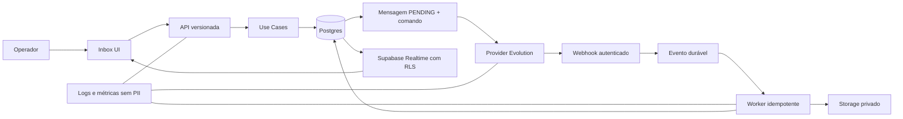

### 8.1 Primeiro contato e envio

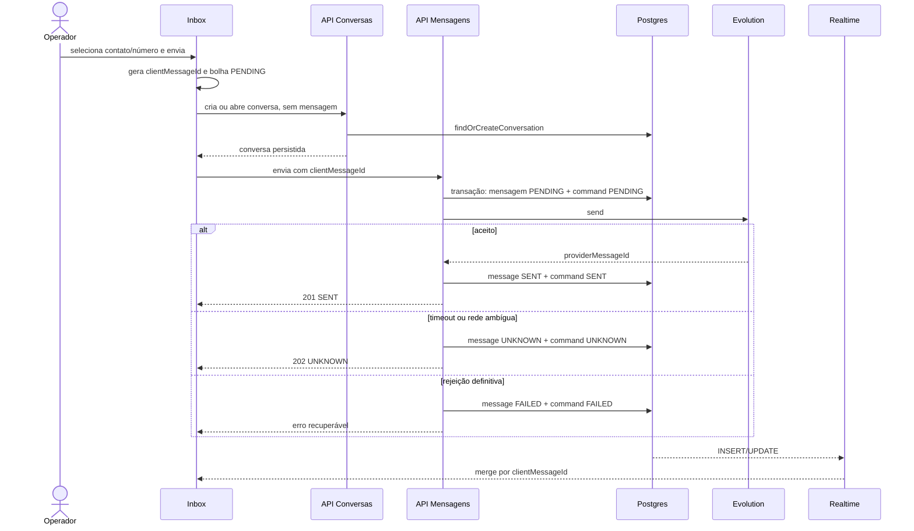

### 8.2 Webhook, outbox e reconciliação

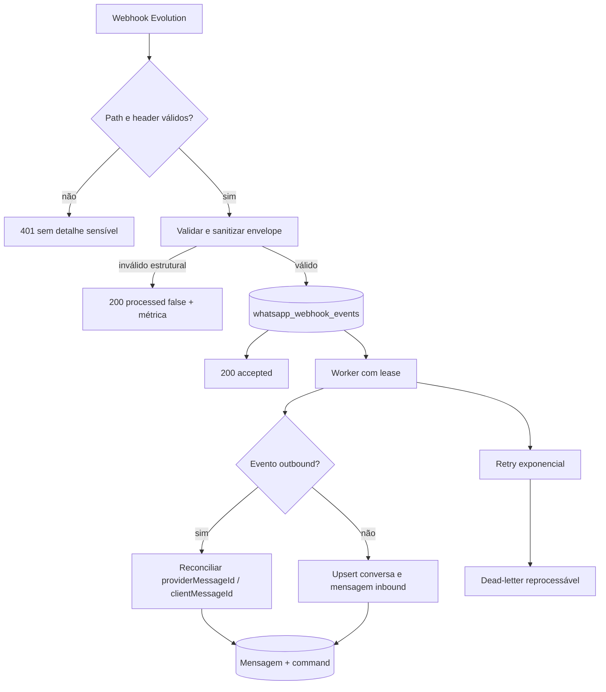

### 8.3 Busca e sincronização

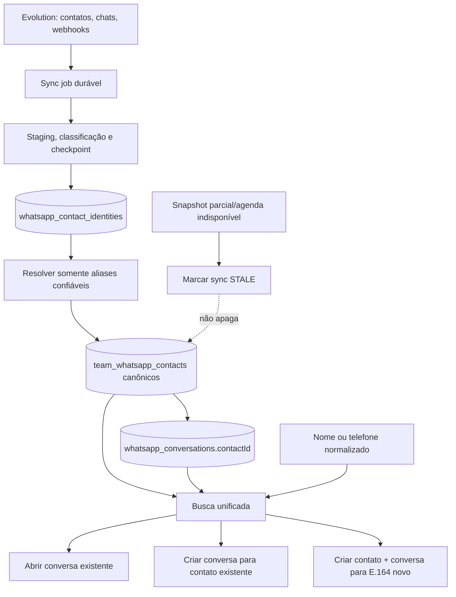

### 8.4 Contato canônico e aliases do provider

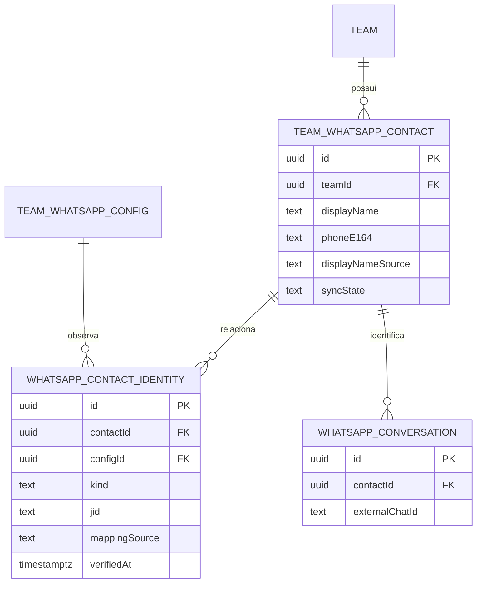

```mermaid
flowchart LR
    C[Contato interno: Maria<br/>+55 11 99999-9999]
    C --> PN[PHONE_JID<br/>5511999999999@s.whatsapp.net]
    C --> LID[LID<br/>identificador opaco@lid]
    C --> CV[Conversa]
    CV --> UI[UI: Maria<br/>+55 11 99999-9999]
    PN --> ROUTE[Roteamento provider]
    LID --> ROUTE
    PN -. nunca exibido .-> UI
    LID -. nunca exibido .-> UI
```

## 9. Modelo de domínio e dados

### 9.1 Alterações em `WhatsAppMessage`

Adicionar:

| Campo                | Tipo                   | Regra                                         |
| -------------------- | ---------------------- | --------------------------------------------- |
| `clientMessageId`    | `String? @db.Text`     | obrigatório para todo outbound criado pela V3 |
| `mediaStatus`        | `WhatsAppMediaStatus?` | nulo para texto; estado explícito para mídia  |
| `mediaAttemptCount`  | `Int @default(0)`      | tentativas de ingestão/recuperação            |
| `mediaLastErrorCode` | `String?`              | código seguro; nunca body do provider         |
| `mediaRetrievedAt`   | `DateTime?`            | confirmação de persistência no storage        |
| `playedAt`           | `DateTime?`            | reprodução confirmada de áudio                |

Alterar:

- `WhatsAppMessageStatus` recebe `UNKNOWN` e `PLAYED`;
- unique parcial lógico por `(teamId, clientMessageId)` quando `clientMessageId IS NOT NULL`;
- índice `(conversationId, createdAt ASC)` permanece;
- índice `(teamId, clientMessageId)` sustenta reconciliação;
- `rawPayload` passa por allowlist e não recebe Base64, URL assinada, QR, telefone completo ou body integral.

`clientMessageId` identifica a intenção do usuário; `message.id` continua sendo a identidade do registro; `providerMessageId` identifica a entrega no provider. Os três não são intercambiáveis.

### 9.2 Alterações em `WhatsAppOutboundCommand`

Adicionar:

| Campo               | Tipo                                      | Regra                                          |
| ------------------- | ----------------------------------------- | ---------------------------------------------- |
| `requestHash`       | `String?` no histórico; obrigatório na V3 | hash canônico de conversa + conteúdo/metadados |
| `providerMessageId` | `String?`                                 | preenchido quando conhecido                    |
| `lastAttemptAt`     | `DateTime?`                               | auditoria e timeout                            |
| `failureCode`       | `String?`                                 | código de domínio seguro                       |

Regras:

- unique `(teamId, clientMessageId)` permanece;
- `messageId` é preenchido na mesma transação que cria o comando;
- reuso da chave com `requestHash` diferente retorna `IDEMPOTENCY_CONFLICT`;
- comando `SENT` retorna o mesmo resultado sem chamar o provider;
- comando `PENDING` retorna processamento em curso;
- comando `UNKNOWN` retorna incerteza e não chama o provider;
- comando `FAILED` só volta a `PENDING` por retry explícito, com o mesmo hash e incremento atômico de `attemptCount`;
- quota/rate/provider offline encerram mensagem e comando com código determinístico; nenhum comando fica abandonado em `PENDING`.

### 9.3 Novos enums

```text
WhatsAppMessageStatus:
  PENDING | SENT | DELIVERED | READ | PLAYED | FAILED | UNKNOWN | RECEIVED

WhatsAppMediaStatus:
  PROCESSING | AVAILABLE | EXPIRED | FAILED

WhatsAppSyncJobKind:
  HISTORY | CONTACTS

WhatsAppSyncJobStatus:
  PENDING | RUNNING | PARTIAL | COMPLETED | FAILED | CANCELLED
```

### 9.4 `WhatsAppSyncJob`

Criar tabela server-only:

| Campo                                                      | Uso                           |
| ---------------------------------------------------------- | ----------------------------- |
| `id`, `teamId`, `configId`, `kind`                         | identidade e escopo           |
| `status`                                                   | estado do job                 |
| `cursor` JSON                                              | checkpoint opaco e versionado |
| `since`                                                    | início incremental            |
| `processedChats`, `processedMessages`, `processedContacts` | progresso                     |
| `attemptCount`, `nextAttemptAt`, `leaseUntil`              | concorrência e retry          |
| `errorCode`, `errorSummary`                                | diagnóstico sanitizado        |
| `startedAt`, `completedAt`, `createdAt`, `updatedAt`       | operação                      |

Uma unique parcial permite no máximo um job `PENDING|RUNNING|PARTIAL` por `(configId, kind)`. `cursor` não armazena mensagem, telefone, JID completo ou payload do provider.

### 9.5 `TeamWhatsAppContact` canônico

`team_whatsapp_contacts` deixa de ser uma linha por `remoteJid` e passa a representar a pessoa/empresa conhecida pelo time. A UI e a busca usam esse registro mesmo quando a agenda do celular ou a Evolution estiverem indisponíveis.

Campos alvo:

| Campo                    | Tipo                                   | Regra                                                              |
| ------------------------ | -------------------------------------- | ------------------------------------------------------------------ |
| `id`, `teamId`           | UUID                                   | identidade interna estável e escopo                                |
| `displayName`            | `String?`                              | nome escolhido conforme precedência; nunca recebe JID              |
| `displayNameSource`      | `MANUAL\|LEAD\|PHONE_BOOK\|PUSH_NAME`  | impede sync de sobrescrever fonte superior                         |
| `phoneE164`              | `String?`                              | telefone canônico com `+` e DDI; nulo para LID ainda não resolvido |
| `phoneDigits`            | `String?`                              | forma derivada para busca; nunca preenchida com dígitos de LID     |
| `searchNameNormalized`   | `String?`                              | forma derivada do nome para busca                                  |
| `isProvisional`          | `Boolean @default(false)`              | contato criado por evento sem telefone/nome confiável              |
| `syncState`              | `CURRENT\|STALE\|UNRESOLVED\|CONFLICT` | qualidade/frescor, sem apagar o cadastro                           |
| `lastSyncedAt`           | `DateTime?`                            | última confirmação por fonte externa                               |
| `createdByProfileId`     | UUID opcional                          | auditoria de criação manual                                        |
| `deletedAt`              | `DateTime?`                            | soft delete; ausência no provider não preenche este campo          |
| `createdAt`, `updatedAt` | timestamps                             | auditoria                                                          |

Regras:

- unique parcial em `(teamId, phoneE164)` quando `phoneE164 IS NOT NULL AND deletedAt IS NULL`;
- como Prisma não expressa todo índice parcial, a migration SQL cria o índice e o domínio também valida conflito;
- telefone é persistido em E.164; máscara é derivada no DTO/UI e nunca armazenada como identidade;
- para Brasil, a apresentação é `+55 (DD) XXXX-XXXX` ou `+55 (DD) XXXXX-XXXX`; outros países usam formatter internacional locale-aware;
- fallback visual: `displayName` → telefone formatado → **“Contato sem número identificado”**;
- precedência de nome: `MANUAL > LEAD > PHONE_BOOK > PUSH_NAME`; sync nunca rebaixa uma fonte;
- o cadastro interno permanece pesquisável quando `syncState=STALE|UNRESOLVED`.

### 9.6 `WhatsAppContactIdentity`

Criar `whatsapp_contact_identities` para armazenar endereços técnicos observados no provider:

| Campo                       | Tipo                                                            | Regra                                                    |
| --------------------------- | --------------------------------------------------------------- | -------------------------------------------------------- |
| `id`, `teamId`              | UUID                                                            | identidade e escopo redundante para RLS/índice           |
| `contactId`                 | UUID FK                                                         | contato canônico                                         |
| `configId`                  | UUID FK                                                         | instância que observou o endereço                        |
| `kind`                      | `PHONE_JID\|LID\|UNKNOWN`                                       | classe explícita; grupo não vira contato pessoal         |
| `jid`                       | `String`                                                        | endereço integral, server-only                           |
| `opaqueId`                  | `String`                                                        | parte opaca para lookup técnico; não é telefone          |
| `phoneE164`                 | `String?`                                                       | somente quando a identidade foi validada como telefônica |
| `mappingSource`             | `CONTACT_SYNC\|WEBHOOK\|HISTORY\|PROVIDER_MAPPING\|MANUAL_LINK` | origem da evidência                                      |
| `verifiedAt`                | `DateTime?`                                                     | obrigatório para merge LID ↔ phone-number JID confiável  |
| `sendable`                  | `Boolean`                                                       | endereço elegível pela versão/capability ativa           |
| `firstSeenAt`, `lastSeenAt` | timestamps                                                      | auditoria e frescor                                      |
| `createdAt`, `updatedAt`    | timestamps                                                      | auditoria                                                |

Constraints e índices:

- unique `(configId, jid)`;
- índices em `(contactId)`, `(teamId, phoneE164)` e `(configId, kind, lastSeenAt)`;
- FKs de `contactId`, `configId` e `teamId` devem validar o mesmo time no domínio/migration;
- `jid` nunca é retornado em DTO de contato nem publicado via Realtime para o browser;
- conflito em que um alias já pertence a outro contato muda os envolvidos para `CONFLICT`, registra evento seguro e exige reconciliação explícita; não move automaticamente a identidade.

Adicionar `contactId String? @db.Uuid` a `WhatsAppConversation`. `externalChatId` continua sendo o endereço usado para conversar com a Evolution; `contactId` determina nome, telefone e identidade visual. Conversas de grupo não criam `TeamWhatsAppContact` pessoal; participantes usam identidades próprias quando disponíveis.

### 9.7 Classificação e resolução de JID

| Entrada                 | Classe      | Telefone canônico                                                |
| ----------------------- | ----------- | ---------------------------------------------------------------- |
| `digits@s.whatsapp.net` | `PHONE_JID` | validar e converter para E.164                                   |
| `digits@c.us`           | `PHONE_JID` | alias legado; canonicalizar para phone-number JID após validação |
| `opaque@lid`            | `LID`       | **nulo** até evidência forte; `opaque` não é número              |
| `id@g.us`               | grupo       | não criar contato pessoal                                        |
| sufixo desconhecido     | `UNKNOWN`   | nulo; quarentena/telemetria sem exposição                        |

O `ContactIdentityResolver` pode unir LID e phone-number JID somente quando existir:

1. par explícito no mesmo evento/provider, como `remoteJidAlt`, `senderPn` ou `participantAlt`;
2. resposta do mapper LID → phone JID suportado pela versão Evolution homologada;
3. vínculo manual autorizado, auditado e protegido contra conflito.

É proibido unir automaticamente por nome, `pushName`, avatar, últimos dígitos, ordem de importação ou similaridade. Busca por últimos 8/9 dígitos é conveniência de recuperação, não prova de identidade.

### 9.8 Campos de busca e apresentação

Adicionar `searchNameNormalized` a `WhatsAppConversation` e manter a forma canônica em `TeamWhatsAppContact`. O helper único:

1. aplica `trim`;
2. converte para minúsculas;
3. remove diacríticos por normalização Unicode;
4. remove caracteres de controle;
5. limita comprimento.

Telefone é consultado em E.164 e dígitos derivados. O DTO devolve `displayPhone` já seguro para apresentação; a UI não mascara JID nem tenta adivinhar DDI.

Backfill é idempotente. Índices trigram/GIN só entram após `EXPLAIN ANALYZE` local e confirmação de extensão disponível; não se fixa versão de extensão na migration.

### 9.9 Migração e compatibilidade

Ordem obrigatória:

1. criar enums, campos nullable, `whatsapp_contact_identities`, tabela de sync e índices sem quebrar leitores antigos;
2. habilitar RLS/revogar grants dos objetos server-only;
3. adicionar `WhatsAppConversation.contactId` nullable e publicar backend com dual-read/dual-write;
4. criar um contato canônico por telefone E.164 confirmado; mover cada JID legado para identidade técnica;
5. manter LIDs sem mapping como contatos provisórios separados, sem preencher telefone nem fazer merge heurístico;
6. detectar duplicatas/conflitos em relatório antes de aplicar o unique parcial;
7. vincular conversas por `externalChatId` e, quando houver evidência forte, consolidar aliases no mesmo contato;
8. backfill de nome, telefone e campos de busca em batches; preservar `MANUAL/LEAD` acima do provider;
9. publicar busca/API lendo o contato canônico e ativar rollout por time;
10. ativar envio V3 para allowlist;
11. tornar `clientMessageId` obrigatório no domínio de novos outbound, mantendo a coluna nullable para histórico;
12. limpar caminho legado de `initialMessage`;
13. remover leitura de `hostBaseUrl`;
14. somente após ao menos um release estável, remover `remoteJid`, `opaqueId`, `phoneNumber` e `pushName` legados da tabela canônica.

Nenhuma migration destrutiva ou `NOT NULL` sobre histórico entra no mesmo deploy que introduz a escrita V3.

Rollback mantém as colunas antigas e dual-read por uma versão. A migration é aditiva; aliases novos podem parar de ser usados sem apagar contato, conversa ou JID já observado.

### 9.10 Persistência das ações de mensagem

Adicionar a `WhatsAppMessage`:

| Campo                     | Tipo        | Regra                                               |
| ------------------------- | ----------- | --------------------------------------------------- |
| `quotedMessageId`         | `String?`   | referência local opcional para resposta citada      |
| `quotedProviderMessageId` | `String?`   | referência exigida pelo provider quando disponível  |
| `deletedForEveryoneAt`    | `DateTime?` | somente após confirmação confiável do provider      |
| `deletedByProfileId`      | `String?`   | auditoria do comando de exclusão externa autorizado |

Criar estruturas server-only:

| Estrutura                      | Escopo e invariantes                                                                                                      |
| ------------------------------ | ------------------------------------------------------------------------------------------------------------------------- |
| `WhatsAppMessageReaction`      | reação local/provider por mensagem e ator; emoji Unicode validado; provider ID quando existir; tombstone para remoção     |
| `WhatsAppMessageFavorite`      | favorito privado por `(messageId, profileId)`; unique; não é enviado à Evolution                                          |
| `WhatsAppMessagePin`           | fixação compartilhada na conversa; ator, `pinnedAt`, `expiresAt` opcional e `removedAt`; limite configurado pelo domínio  |
| `WhatsAppMessageVisibility`    | “apagar para mim” por `(messageId, profileId)`; oculta sem apagar o registro canônico ou a visão de outros operadores     |
| `WhatsAppMessageActionCommand` | comando idempotente para `REACT`, `UNREACT` e `DELETE_FOR_EVERYONE`; `clientActionId`, request hash, status e erro seguro |

Regras:

- resposta e encaminhamento reutilizam `WhatsAppOutboundCommand`; cada destino encaminhado recebe `clientMessageId` próprio;
- favorito e “apagar para mim” são privados ao perfil;
- fixação é compartilhada por operadores autorizados da conversa;
- reação externa e “apagar para todos” só entram quando a capability da versão ativa da Evolution for confirmada por contrato;
- exclusão nunca remove fisicamente a linha da mensagem no caminho interativo;
- todas as tabelas novas começam com RLS habilitado e grants de `anon/authenticated` revogados quando o acesso for exclusivamente server-side;
- payloads de ação não armazenam texto integral, telefone, JID completo ou URL temporária.

## 10. Contratos de API

Toda rota mantém `Route → UseCase → Service → Repository`, valida `teamId` contra a sessão e retorna códigos de domínio estáveis. Nenhuma UI interpreta texto de erro para decidir status HTTP.

### 10.1 Envelope de erro

```ts
type WhatsAppApiErrorCode =
  | "AUTH_REQUIRED"
  | "ACCESS_DENIED"
  | "VALIDATION_ERROR"
  | "CONFIG_NOT_FOUND"
  | "CONTACT_NOT_FOUND"
  | "CONTACT_IDENTITY_CONFLICT"
  | "CONTACT_ADDRESS_UNRESOLVED"
  | "CONVERSATION_NOT_FOUND"
  | "PROVIDER_OFFLINE"
  | "RECIPIENT_INVALID"
  | "IDEMPOTENCY_CONFLICT"
  | "RATE_LIMITED"
  | "QUOTA_EXCEEDED"
  | "DELIVERY_UNKNOWN"
  | "MEDIA_TOO_LARGE"
  | "MEDIA_UNSUPPORTED"
  | "MEDIA_PROCESSING"
  | "MEDIA_EXPIRED"
  | "MEDIA_UNAVAILABLE"
  | "SYNC_ALREADY_RUNNING"
  | "INTERNAL_ERROR"

interface WhatsAppApiError {
  isValid: false
  code: WhatsAppApiErrorCode
  message: string
  retryable: boolean
  correlationId: string
  details?: Record<string, string | number | boolean>
}
```

`details` usa allowlist. Não inclui telefone, JID, mensagem, URL, token, stack ou body externo.

### 10.2 Criar ou abrir conversa

`POST /api/v1/teams/:teamId/whatsapp/conversations`

```ts
interface CreateConversationV3Request {
  contactId?: string
  phone?: string
  contactName?: string
}

interface CreateConversationV3Result {
  conversation: WhatsAppConversation
  contact: WhatsAppTeamContact
  created: boolean
}
```

Regras:

- exigir `contactId` ou telefone;
- quando receber `contactId`, carregar o contato canônico do time e selecionar identidade `sendable` compatível com a configuração;
- quando receber telefone, normalizar para E.164, criar-ou-retornar o contato canônico e só então resolver/criar a identidade `PHONE_JID`;
- retornar `CONTACT_ADDRESS_UNRESOLVED` quando o contato LID provisório ainda não possuir endereço confiável para novo envio;
- criar/restaurar conversa local sem chamar `sendMessage`;
- busca de avatar não participa da resposta crítica; ocorre em job best-effort;
- resposta `201` quando criada/restaurada e `200` quando já existia;
- `initialMessage` deixa de fazer parte do contrato frontend;
- durante uma janela máxima de um release, cliente legado só pode enviar `initialMessage` acompanhado de `clientMessageId`; o servidor o encaminha ao mesmo `SendMessageUseCaseV3`, nunca a `WhatsAppService.sendMessage` diretamente.

### 10.3 Enviar mensagem

`POST /api/v1/teams/:teamId/whatsapp/messages`

```ts
type SendContentV3 =
  | {
      kind: "text"
      text: string
      mentionedJids?: string[]
    }
  | {
      kind: "media"
      storagePath: string
      mimeType: string
      fileName: string
      sizeBytes: number
      sha256: string
      caption?: string
      mentionedJids?: string[]
    }

interface SendMessageV3Request {
  conversationId: string
  clientMessageId: string
  content: SendContentV3
  retryFailed?: boolean
}

interface SendMessageV3Result {
  message: WhatsAppMessage
  commandStatus: "PENDING" | "SENT" | "UNKNOWN" | "FAILED"
  deliveryCertainty: "CONFIRMED" | "UNKNOWN" | "NOT_SENT"
  idempotentReplay: boolean
}
```

Semântica HTTP:

| Status | Código/resultado                             | Uso                                                      |
| -----: | -------------------------------------------- | -------------------------------------------------------- |
|    200 | `SENT` com `idempotentReplay=true`           | repetição de comando já concluído                        |
|    201 | `SENT`                                       | provider confirmou e registro local foi atualizado       |
|    202 | `PENDING` ou `UNKNOWN`                       | não é seguro tratar como falha nem reenviar              |
|    400 | `VALIDATION_ERROR`                           | corpo inválido                                           |
|    403 | `ACCESS_DENIED`                              | usuário sem acesso                                       |
|    404 | `CONVERSATION_NOT_FOUND`                     | conversa inexistente no escopo                           |
|    409 | `PROVIDER_OFFLINE` ou `IDEMPOTENCY_CONFLICT` | pré-condição ou chave reutilizada com conteúdo diferente |
|    413 | `MEDIA_TOO_LARGE`                            | tamanho acima do contrato                                |
|    422 | `RECIPIENT_INVALID` ou `MEDIA_UNSUPPORTED`   | rejeição determinística                                  |
|    429 | `RATE_LIMITED` ou `QUOTA_EXCEEDED`           | limite operacional                                       |
|    500 | `INTERNAL_ERROR`                             | falha local conhecida como não entregue                  |

Timeout/rede depois da chamada ao provider retorna `202 UNKNOWN`, não `500`/`504`.

### 10.4 Busca unificada

`GET /api/v1/teams/:teamId/whatsapp/search?q=:query&limit=20`

```ts
interface WhatsAppUnifiedSearchResult {
  conversations: Array<{
    kind: "conversation"
    conversation: WhatsAppConversation
    match: "NAME" | "PHONE"
    archived: boolean
  }>
  contacts: Array<{
    kind: "contact"
    contact: WhatsAppTeamContact
    existingConversationId: string | null
    match: "NAME" | "PHONE"
    displayPhone: string | null
    isProvisional: boolean
    syncState: "CURRENT" | "STALE" | "UNRESOLVED" | "CONFLICT"
  }>
  startNumber: {
    kind: "number"
    normalizedPhone: string
    displayPhone: string
  } | null
  meta: {
    syncStatus: "IDLE" | "RUNNING" | "PARTIAL" | "COMPLETED" | "FAILED"
    lastSyncAt: string | null
    permissionNotice: boolean
  }
}
```

Regras:

- consulta única para conversas e contatos canônicos;
- respeita RBAC; nunca retorna contagem, nome ou telefone de item oculto;
- pesquisa conversas ativas e arquivadas, identificando arquivadas;
- ignora os filtros visuais correntes da lista, pois representa “buscar ou iniciar”;
- aceita nome com/sem acento, telefone cru/mascarado e últimos 8 ou 9 dígitos;
- `startNumber` só existe para número válido;
- contato que já tem conversa aponta para ela e não cria duplicata;
- resultados nunca retornam `jid`, `remoteJid`, `opaqueId` ou identificador técnico do provider;
- query vazia não lista a agenda completa; mostra recentes por fluxo já existente;
- debounce de 200–300 ms e cancelamento da request anterior no frontend;
- zero state explica sync, arquivamento e permissão sem afirmar que existe resultado oculto.

### 10.5 Criar ou atualizar contato interno

`POST /api/v1/teams/:teamId/whatsapp/contacts`

```ts
interface UpsertWhatsAppTeamContactRequest {
  displayName?: string
  phone: string
}

interface UpsertWhatsAppTeamContactResult {
  contact: WhatsAppTeamContact
  created: boolean
  existingConversationId: string | null
}
```

Regras:

- normalizar/validar o telefone para E.164 dentro do use case;
- serializar criações concorrentes pelo unique parcial e tratar conflito como leitura idempotente;
- se `(teamId, phoneE164)` já existir, retornar o mesmo `contactId` com `200`, sem criar duplicata;
- nome manual não vazio recebe `displayNameSource=MANUAL` e não é sobrescrito por sync;
- criação retorna `201`; o frontend pode iniciar/abrir conversa usando o `contactId`;
- a rota não recebe nem retorna JID.

`PATCH /api/v1/teams/:teamId/whatsapp/contacts/:contactId` permite atualizar nome e telefone sob RBAC. Alterar telefone exige validação de conflito e não reassocia LID automaticamente. Merge manual de contatos conflitantes fica em endpoint administrativo separado, auditado e fora do fluxo normal da Inbox.

### 10.6 Upload de mídia

`POST /api/v1/teams/:teamId/whatsapp/media/uploads`

```ts
interface CreateMediaUploadRequest {
  conversationId: string
  clientMessageId: string
  fileName: string
  mimeType: string
  sizeBytes: number
  sha256: string
}

interface CreateMediaUploadResult {
  bucket: "whatsapp-media"
  storagePath: string
  signedUploadToken: string
  expiresAt: string
}
```

Fluxo:

1. API autoriza a conversa e valida MIME/tamanho;
2. gera path `teamId/conversationId/clientMessageId/<safe-file-name>`;
3. retorna token de upload assinado curto;
4. browser envia binário direto ao bucket privado;
5. envio da mensagem referencia `storagePath`;
6. backend valida objeto, tamanho, MIME e hash antes do provider;
7. upload órfão é removido após 24 horas por job idempotente.

Base64 deixa de existir no contrato browser → API. Caso a versão atual da Evolution exija Base64, a conversão ocorre somente no servidor, a partir do objeto privado, com limite de memória e sem persistir o conteúdo no banco/log.

### 10.7 Recuperar mídia

`GET /api/v1/teams/:teamId/whatsapp/messages/:messageId/media`

|  Status | Código                             | UI                                                   |
| ------: | ---------------------------------- | ---------------------------------------------------- |
| 200/302 | `AVAILABLE`                        | abrir/baixar via URL assinada curta                  |
|     202 | `MEDIA_PROCESSING`                 | placeholder e atualização posterior                  |
|     410 | `MEDIA_EXPIRED`                    | informar expiração; oferecer reprocessar se possível |
|     422 | `MEDIA_UNAVAILABLE`                | informar indisponibilidade definitiva                |
|     503 | `MEDIA_UNAVAILABLE` retryable      | provider/storage temporariamente indisponível        |
|     404 | sem acesso ou mensagem inexistente | não revelar existência fora do RBAC                  |

URL assinada nunca é logada nem persistida em `rawPayload`.

### 10.8 Sincronização

`POST /api/v1/teams/:teamId/whatsapp/sync-jobs`

```ts
interface CreateSyncJobRequest {
  kind: "HISTORY" | "CONTACTS"
  conversationId?: string
}

interface SyncJobResult {
  id: string
  kind: "HISTORY" | "CONTACTS"
  status: "PENDING" | "RUNNING" | "PARTIAL" | "COMPLETED" | "FAILED"
  progress: {
    chats: number
    messages: number
    contacts: number
  }
  errorCode: string | null
}
```

`GET /api/v1/teams/:teamId/whatsapp/sync-jobs/:jobId` devolve progresso. Criar o mesmo tipo de job enquanto houver um ativo retorna o job existente com `200`, não inicia concorrente.

O job `CONTACTS` é agendado em segundo plano e também pode ser solicitado manualmente. Snapshot incompleto ou ausência de um contato na Evolution não apaga `team_whatsapp_contacts`: atualiza frescor/`syncState`, preserva nomes internos e retoma do checkpoint.

Agenda inicial: executar ao conectar/reconectar a instância, ao detectar identidade nova por webhook e a cada 15 minutos enquanto conectada. `WHATSAPP_CONTACT_SYNC_INTERVAL_MINUTES` é server-only, inicia em 15, aceita 5–60 e nunca cria job concorrente; o webhook somente agenda/coalesce o trabalho e não espera o snapshot.

### 10.9 Ações contextuais de mensagem

Todos os endpoints abaixo exigem acesso à conversa e retornam `404` para mensagem inexistente ou invisível, sem revelar dados fora do RBAC.

```ts
type WhatsAppMessageAction =
  | { kind: "REACT"; emoji: string }
  | { kind: "UNREACT"; emoji: string }
  | { kind: "PIN"; expiresAt?: string }
  | { kind: "UNPIN" }
  | { kind: "FAVORITE" }
  | { kind: "UNFAVORITE" }
  | { kind: "DELETE_FOR_ME" }
  | { kind: "DELETE_FOR_EVERYONE" }

interface MessageActionRequest {
  clientActionId: string
  action: WhatsAppMessageAction
}

interface MessageActionResult {
  messageId: string
  action: WhatsAppMessageAction["kind"]
  status: "APPLIED" | "PENDING" | "UNKNOWN" | "FAILED"
  providerCapability: "LOCAL" | "SUPPORTED" | "UNAVAILABLE"
  idempotentReplay: boolean
}
```

Rotas:

| Método/rota                                                               | Uso                                                                  |
| ------------------------------------------------------------------------- | -------------------------------------------------------------------- |
| `POST /messages/:messageId/actions`                                       | reagir, remover reação, fixar, favoritar e apagar                    |
| `POST /messages` com `quotedMessageId`                                    | responder usando o fluxo durável normal                              |
| `POST /messages/:messageId/forward` com destinos + `clientMessageId`/item | encaminhar; cria uma intenção independente e confirmável por destino |
| `GET /messages/:messageId/actions-state`                                  | capability e estado atual quando não vierem no DTO da mensagem       |

Semântica:

- `PIN`, `UNPIN`, `FAVORITE`, `UNFAVORITE` e `DELETE_FOR_ME` são transações locais e retornam `APPLIED`;
- `REACT`, `UNREACT` e `DELETE_FOR_EVERYONE` persistem command antes de chamar o provider;
- timeout posterior à chamada externa retorna `202 UNKNOWN` e é reconciliado; não repete automaticamente;
- `DELETE_FOR_EVERYONE` retorna `409 CAPABILITY_UNAVAILABLE` quando não suportado e nunca é convertido silenciosamente em exclusão local;
- `COPY` não possui endpoint: usa Clipboard API no cliente sobre texto/caption já autorizado e carregado;
- toda resposta inclui código de domínio estável para toast e recuperação; nenhum erro propaga body da Evolution.

## 11. Requisitos funcionais e não funcionais

Os requisitos usam EARS: `QUANDO` identifica evento, `SE` uma condição, `ENQUANTO` um estado e `O SISTEMA DEVE` o comportamento verificável.

### 11.1 Confiabilidade do envio

- **REL-001 / WA-001:** QUANDO o usuário confirmar um envio, O SISTEMA DEVE gerar o `clientMessageId` no browser antes de qualquer request e mantê-lo na bolha otimista.
- **REL-002 / WA-001:** QUANDO o backend aceitar a intenção, O SISTEMA DEVE persistir mensagem `PENDING` e comando `PENDING` numa única transação antes de chamar o provider.
- **REL-003 / WA-001:** QUANDO uma nova conversa for criada, O SISTEMA DEVE persistir e devolver a conversa antes de enviar qualquer mensagem.
- **REL-004 / WA-001:** SE a criação da conversa concluir e o envio falhar, O SISTEMA DEVE manter a conversa selecionada, a mensagem e o rascunho/arquivo necessário ao retry.
- **REL-005 / WA-001:** SE o provider aceitar e a atualização local posterior falhar, O SISTEMA DEVE conservar o comando rastreável e apresentar `UNKNOWN`, nunca “não enviado”.
- **REL-006 / WA-002:** QUANDO HTTP chegar antes ou depois do Realtime, O SISTEMA DEVE terminar com exatamente uma bolha para o `clientMessageId`.
- **REL-007 / WA-002:** QUANDO a página recarregar, O SISTEMA DEVE reconstruir `PENDING|UNKNOWN|FAILED` a partir do banco.
- **REL-008 / WA-002:** SE duas abas enviarem o mesmo `clientMessageId`, O SISTEMA DEVE realizar no máximo uma chamada externa.
- **REL-009 / WA-002:** SE a mesma chave vier com conteúdo diferente, O SISTEMA DEVE rejeitar com `IDEMPOTENCY_CONFLICT`.
- **REL-010 / WA-014:** SE quota, rate limit ou provider offline rejeitarem a operação, O SISTEMA DEVE encerrar comando/mensagem com estado e código determinísticos.
- **REL-011 / WA-014:** QUANDO houver retry explícito de `FAILED`, O SISTEMA DEVE reutilizar o mesmo `clientMessageId`, validar o mesmo hash e incrementar tentativa atomicamente.
- **REL-012 / WA-001:** ENQUANTO o comando estiver `UNKNOWN`, O SISTEMA NÃO DEVE chamar o provider novamente.
- **REL-013:** QUANDO webhook outbound trouxer `providerMessageId`, O SISTEMA DEVE reconciliar mensagem/comando mesmo se o HTTP original tiver expirado.
- **REL-014:** QUANDO comando `PENDING` exceder a janela operacional, O reconciliador DEVE consultar evidência disponível e mudar para `SENT`, `UNKNOWN` ou `FAILED`; nunca deixá-lo indefinidamente em `PENDING`.

### 11.2 Busca e contatos

- **SEA-001 / WA-003:** QUANDO o usuário buscar, O SISTEMA DEVE consultar conversas e contatos canônicos permitidos no mesmo fluxo.
- **SEA-002 / WA-003:** QUANDO a query contiver máscara, espaços, `+`, parênteses ou hífen, O SISTEMA DEVE também buscar a versão somente dígitos.
- **SEA-003 / WA-003:** QUANDO a query contiver acentos ou variação de caixa, O SISTEMA DEVE comparar a forma normalizada.
- **SEA-004 / WA-003:** SE um contato não tiver conversa, O SISTEMA DEVE permitir iniciar uma sem redigitar o número.
- **SEA-005 / WA-003:** SE o número já tiver conversa ativa ou arquivada, O SISTEMA DEVE abrir/restaurar a mesma conversa.
- **SEA-006:** SE o usuário for operador, O SISTEMA DEVE aplicar o filtro de contatos compatível com a visibilidade de conversas/leads existente.
- **SEA-007:** SE houver itens fora do RBAC, O SISTEMA NÃO DEVE expor conteúdo nem contagem desses itens.
- **SEA-008:** QUANDO não houver resultado visível, O SISTEMA DEVE informar separadamente estado de sync, filtros da lista e validade do número.
- **SEA-009:** ENQUANTO a busca anterior estiver em curso e a query mudar, O frontend DEVE cancelá-la ou ignorar sua resposta obsoleta.

### 11.3 Identidade e cadastro de contatos

- **CID-001 / WA-025:** `team_whatsapp_contacts` DEVE ser a fonte canônica de nome e telefone para exibição e busca por time.
- **CID-002 / WA-025:** O frontend NÃO DEVE receber nem exibir `jid`, `remoteJid`, `opaqueId`, sufixo `@lid` ou outro identificador técnico como nome/telefone.
- **CID-003 / WA-025:** O SISTEMA DEVE persistir JIDs/aliases em `whatsapp_contact_identities` e permitir múltiplas identidades para o mesmo contato.
- **CID-004 / WA-025:** QUANDO o JID terminar em `@lid`, O SISTEMA DEVE tratá-lo como opaco e NÃO DEVE derivar `phoneE164` de seus dígitos.
- **CID-005 / WA-025:** QUANDO um phone-number JID válido for observado, O SISTEMA DEVE validar o número antes de preencher E.164.
- **CID-006 / WA-025:** O SISTEMA NÃO DEVE criar contato pessoal para `@g.us`; grupos permanecem conversas e participantes.
- **CID-007 / WA-025:** O SISTEMA só DEVE unir LID e phone-number JID por alias explícito do mesmo evento/provider, mapper homologado ou merge manual auditado.
- **CID-008 / WA-025:** O SISTEMA NÃO DEVE unir contatos automaticamente por nome, `pushName`, avatar, últimos dígitos ou similaridade.
- **CID-009 / WA-025:** QUANDO aliases conflitarem entre contatos, O SISTEMA DEVE marcar `CONFLICT`, preservar ambos e exigir reconciliação explícita.
- **CID-010 / WA-025:** Nome DEVE respeitar `MANUAL > LEAD > PHONE_BOOK > PUSH_NAME`; sync não pode sobrescrever fonte superior.
- **CID-011 / WA-025:** Exibição DEVE usar nome canônico, depois telefone formatado e, sem ambos, “Contato sem número identificado”.
- **CID-012 / WA-025:** Telefone DEVE ser armazenado em E.164 e apresentado como `+55 (DD) XXXX-XXXX` ou `+55 (DD) XXXXX-XXXX` no Brasil.
- **CID-013 / WA-025:** QUANDO o mesmo E.164 já existir no time, criar contato DEVE retornar o registro existente e sua conversa, se houver.
- **CID-014 / WA-025:** QUANDO a agenda/provider omitir um contato antes conhecido, O SISTEMA DEVE mantê-lo e marcar frescor `STALE`, nunca apagá-lo automaticamente.
- **CID-015 / WA-025:** `WhatsAppConversation.contactId` DEVE apontar ao contato canônico; `externalChatId` fica restrito ao roteamento do provider.
- **CID-016 / WA-025:** QUANDO um contato provisório não tiver endereço confiável, O SISTEMA DEVE permitir busca/visualização, mas bloquear novo envio com `CONTACT_ADDRESS_UNRESOLVED`.

### 11.4 Sincronização

- **SYN-001 / WA-004:** QUANDO um sync iniciar, O SISTEMA DEVE criar/retomar job durável com lease e checkpoint.
- **SYN-002 / WA-004:** QUANDO processar histórico, O SISTEMA DEVE consultar provider IDs existentes em lote, não por mensagem.
- **SYN-003 / WA-004:** QUANDO persistir mensagens/contatos, O SISTEMA DEVE usar batches e operações idempotentes.
- **SYN-004 / WA-004:** SE uma execução for interrompida, O próximo worker DEVE retomar do último checkpoint confirmado.
- **SYN-005:** SE a lista de chats falhar ou vier inválida, O job DEVE registrar código sanitizado, aplicar backoff e preservar progresso anterior.
- **SYN-006:** ENQUANTO houver chamadas ao provider, O SISTEMA DEVE limitar concorrência; o valor inicial é 4 e deve ser configurável no servidor.
- **SYN-007:** QUANDO avatar falhar, O SISTEMA NÃO DEVE bloquear conversa/mensagem; avatar segue como job best-effort.
- **SYN-008 / WA-010:** QUANDO texto externo contiver NUL, escape inválido ou Unicode malformado, O SISTEMA DEVE sanitizar/descartar somente o campo inválido e continuar efeitos essenciais.
- **SYN-009:** QUANDO o job avançar, O SISTEMA DEVE expor progresso agregado sem JID/telefone.
- **SYN-010:** SE duas solicitações de mesmo tipo ocorrerem, O SISTEMA DEVE retornar o job ativo em vez de criar trabalho duplicado.
- **SYN-011 / WA-025:** QUANDO sync de contatos rodar, O SISTEMA DEVE classificar JIDs, upsertar identidades e somente depois enriquecer contatos canônicos.
- **SYN-012 / WA-025:** Sync de contatos DEVE rodar em segundo plano por agenda recorrente e checkpoint, sem bloquear abertura, busca ou envio da Inbox.
- **SYN-013 / WA-025:** Snapshot parcial, timeout ou falha da agenda NÃO DEVE apagar nome/telefone internos nem desfazer vínculo `contactId`.
- **SYN-014 / WA-025:** Adapter e webhook DEVEM preservar aliases alternativos disponíveis (`remoteJidAlt`, `senderPn`, `participantAlt` ou equivalentes versionados).

### 11.5 Mídia

- **MED-001 / WA-005:** QUANDO o usuário selecionar arquivo, O frontend NÃO DEVE converter o arquivo inteiro em Base64.
- **MED-002 / WA-013:** QUANDO o arquivo for válido, O SISTEMA DEVE mostrar preview, legenda, tamanho, remover, cancelar e enviar antes do upload final.
- **MED-003:** ENQUANTO o upload estiver em curso, O SISTEMA DEVE mostrar progresso e permitir cancelamento sem enviar mensagem.
- **MED-004:** QUANDO o upload terminar, O backend DEVE validar objeto, MIME, tamanho e SHA-256 antes do provider.
- **MED-005 / WA-013:** SE o envio de mídia falhar definitivamente, O retry DEVE reutilizar o objeto privado e o `clientMessageId`.
- **MED-006 / WA-005:** QUANDO mídia inbound chegar, O worker DEVE tentar persistir no storage privado antes de a URL externa expirar.
- **MED-007 / WA-005:** ENQUANTO a mídia estiver sendo ingerida, O endpoint DEVE retornar `MEDIA_PROCESSING`, não 404.
- **MED-008 / WA-005:** SE a origem expirar e não houver cópia local, O SISTEMA DEVE marcar `EXPIRED` e impedir loop automático de downloads.
- **MED-009:** SE o provider/storage falhar temporariamente, O SISTEMA DEVE aplicar retry limitado com backoff.
- **MED-010 / WA-018:** QUANDO upload ficar órfão por 24 horas, O job de limpeza DEVE removê-lo sem tocar objetos ligados a mensagens.

### 11.6 Áudio e permissão

- **AUD-001 / WA-012:** QUANDO o usuário tocar em gravar, a primeira ação assíncrona DEVE ser `getUserMedia({ audio: true })` no mesmo gesto.
- **AUD-002:** O gravador NÃO DEVE abrir uma segunda solicitação de permissão para o mesmo gesto.
- **AUD-003 / WA-012:** SE a permissão for negada, O SISTEMA DEVE preservar texto/anexo e mostrar “Como liberar” e “Testar novamente”.
- **AUD-004:** SE Permissions API não existir, O fluxo DEVE usar diretamente `getUserMedia`.
- **AUD-005:** SE o contexto não for seguro, o browser não suportar gravação ou nenhum dispositivo existir, O SISTEMA DEVE mostrar causa e alternativa específicas.
- **AUD-006 / WA-016:** ENQUANTO a gravação estiver pausada, elapsed DEVE ser `agora - início - total pausado`, sem dupla subtração.
- **AUD-007:** QUANDO a gravação terminar, O SISTEMA DEVE oferecer preview, descartar e enviar.
- **AUD-008 / WA-016:** SE `prefers-reduced-motion` estiver ativo, O SISTEMA NÃO DEVE pulsar ou simular waveform animada.
- **AUD-009:** QUANDO a permissão mudar e o browser suportar `PermissionStatus.onchange`, O SISTEMA DEVE atualizar o callout e permitir novo teste.
- **AUD-010 / WA-023:** ENQUANTO gravar, a waveform DEVE ocupar toda a largura disponível entre timer e pausar, sem ficar presa ao canto esquerdo.
- **AUD-011 / WA-023:** QUANDO a largura mudar, O SISTEMA DEVE recalcular a quantidade visível de barras sem esticar barras, sobrepor controles ou perder amostras recentes.

### 11.7 Realtime e estado frontend

- **RT-001 / WA-015:** O frontend DEVE modelar `CONNECTING|LIVE|DEGRADED|OFFLINE`.
- **RT-002:** SE Realtime ficar degradado por menos de 10 segundos, O SISTEMA DEVE tentar recuperar sem interromper a tarefa.
- **RT-003:** SE a degradação persistir, O SISTEMA DEVE mostrar aviso discreto “Atualizações podem demorar” e manter envio disponível quando a rede HTTP estiver ativa.
- **RT-004:** ENQUANTO degradado, polling DEVE usar backoff, pausar em aba oculta quando seguro e evitar requests concorrentes.
- **RT-005:** QUANDO Realtime voltar, O SISTEMA DEVE fazer uma reconciliação incremental antes de remover o aviso.
- **RT-006 / WA-002:** O merge de mensagem DEVE priorizar `clientMessageId`, depois `providerMessageId`, depois `id`.
- **RT-007:** Estado mais avançado (`PLAYED > READ > DELIVERED > SENT > PENDING`) NÃO DEVE regredir por evento atrasado; `UNKNOWN` só muda com evidência.
- **RT-008:** QUANDO o usuário trocar rapidamente de conversa, respostas antigas NÃO DEVEM substituir a conversa corrente.

#### Recibos de envio e leitura

- **RCP-001 / WA-022:** QUANDO a Evolution aceitar o envio sem prova de entrega, O SISTEMA DEVE mostrar `SENT` com um check neutro e label “Enviada”.
- **RCP-002 / WA-022:** QUANDO houver `DELIVERY_ACK|DELIVERED` confiável, O SISTEMA DEVE mostrar `DELIVERED` com dois checks neutros e label “Entregue”.
- **RCP-003 / WA-022:** QUANDO houver `READ` confiável, O SISTEMA DEVE mostrar `READ` com dois checks em `semantic-info` e label “Lida”.
- **RCP-004 / WA-022:** SE a confirmação for ambígua, O SISTEMA DEVE mostrar `UNKNOWN` com relógio/alerta neutro e bloquear reenvio automático.
- **RCP-005 / WA-022:** SE o envio falhar definitivamente, O SISTEMA DEVE mostrar alerta destrutivo e ação de retry seguro.
- **RCP-006 / WA-022:** Checks de envio/leitura DEVEM aparecer somente em mensagens outbound.
- **RCP-007 / WA-022:** Cor NÃO DEVE ser a única forma de diferenciar `DELIVERED` e `READ`; cada estado DEVE possuir nome acessível.
- **RCP-008 / WA-022:** O SISTEMA NÃO DEVE mostrar `DELIVERED|READ|PLAYED` sem evento confiável associado ao `providerMessageId`.
- **RCP-009 / WA-022:** QUANDO o status mudar no banco, Realtime DEVE atualizar a bolha aberta sem reload manual.
- **RCP-010 / WA-022:** QUANDO a Evolution emitir `PLAYED` para áudio, O SISTEMA DEVE persistir `PLAYED` e `playedAt` separadamente de `READ`; a UI usa label “Áudio reproduzido”.

### 11.8 Segurança e privacidade

- **SEC-001 / WA-006:** Configuração de time e backoffice NÃO DEVE aceitar `hostBaseUrl`.
- **SEC-002 / WA-006:** O cliente Evolution DEVE usar exclusivamente `EVO_API_BASE_URL` validada no servidor.
- **SEC-003:** Em produção, `EVO_API_BASE_URL` DEVE usar HTTPS, sem userinfo, fragment ou porta fora da allowlist operacional.
- **SEC-004:** O cliente HTTP DEVE rejeitar redirect; a chave Evolution NÃO DEVE ser encaminhada para destino diferente.
- **SEC-005:** Testes DEVEM bloquear localhost, link-local, metadata cloud, RFC1918, IPv6 local, URL HTTP, domínio privado e redirect malicioso.
- **SEC-006 / WA-007:** Logs NÃO DEVEM conter telefone/JID completos, texto, Base64, QR, API key, webhook secret, body externo ou URL assinada.
- **SEC-007:** Erro externo DEVE ser convertido em código interno e resumo allowlisted antes de subir de camada.
- **SEC-008 / WA-008:** Webhook DEVE exigir path secret e header HMAC derivado com pepper independente de no mínimo 32 bytes.
- **SEC-009:** `WHATSAPP_WEBHOOK_HEADER_ENFORCE` DEVE ser `true` em produção antes do rollout funcional.
- **SEC-010:** Ausência/invalidade de header DEVE gerar métrica sem registrar segredo ou valor recebido.
- **SEC-011 / WA-009:** Toda tabela WhatsApp em schema exposto DEVE ter RLS habilitado.
- **SEC-012 / WA-009:** Tabela server-only DEVE revogar `ALL` de `anon` e `authenticated` e conceder apenas o mínimo ao papel servidor.
- **SEC-013:** Conversas e mensagens DEVEM expor somente `SELECT` autenticado sob a função de visibilidade; mutações do browser passam pela API.
- **SEC-014:** Função `SECURITY DEFINER` DEVE residir em schema não exposto, ter `search_path` fixo/vazio, validar `auth.uid()` e revogar `EXECUTE` de `PUBLIC`/`anon`.
- **SEC-015:** Policies de update futuras DEVEM ter `USING` e `WITH CHECK`; `TO authenticated` nunca é autorização suficiente.
- **SEC-016:** Bucket `whatsapp-media` DEVE permanecer privado e não permitir listagem geral por usuário.
- **SEC-017:** Chave `service_role` e `EVO_API_KEY` NÃO DEVEM usar prefixo `NEXT_PUBLIC_` nem chegar ao bundle.
- **SEC-018 / WA-018:** Retenção DEVE ser definida por coluna/bucket; job não entra em produção antes da aprovação do prazo e legal hold.
- **SEC-019 / WA-024:** Toda ação de mensagem DEVE revalidar no servidor time, membership, visibilidade da conversa, tipo/direção da mensagem e permissão específica.
- **SEC-020 / WA-024:** `messageId`, `clientActionId` ou estado vindo do browser NÃO DEVE autorizar reação, pin, favorito, encaminhamento ou exclusão por si só.
- **SEC-021 / WA-025:** `whatsapp_contact_identities` DEVE ter RLS habilitado, revogar `anon/authenticated` e permanecer fora do Realtime/Data API do browser.
- **SEC-022 / WA-025:** Se contatos canônicos forem publicados no Realtime, payload/policy DEVEM limitar-se ao time e excluir JID, alias técnico e metadados de mapping.
- **SEC-023 / WA-025:** Toda tabela/projeção nova DEVE declarar grants e exposição explicitamente, sem depender dos defaults do projeto Supabase.

### 11.9 UX, mobile e acessibilidade

- **UX-001 / WA-003:** A lista DEVE ter uma única entrada principal “Buscar ou iniciar conversa”.
- **UX-002 / WA-011:** Todo controle interativo DEVE ter hit area mínima de 44 × 44 px, mesmo que o ícone visual seja menor.
- **UX-003:** Item selecionado DEVE expor `aria-current="true"` ou semântica equivalente.
- **UX-004:** Campo de busca DEVE possuir label acessível, botão de limpar nomeado e atalho documentado.
- **UX-005 / WA-011:** No mobile, apenas lista ou conversa fica ativa; Voltar restaura lista e posição sem refetch obrigatório.
- **UX-006:** Layout DEVE usar `100dvh`, respeitar safe area e manter cabeçalho/composer utilizáveis com teclado virtual.
- **UX-007:** Cabeçalho DEVE mostrar voltar/avatar, identidade, status confiável e uma ação principal; CRM/tags/responsável ficam em sheet/overflow.
- **UX-008:** Nome longo NÃO DEVE ocultar Voltar, menu ou ação principal em 320 px.
- **UX-009:** Lightbox DEVE ser `Dialog`, prender/restaurar foco, fechar por Escape e ter nome acessível.
- **UX-010:** Filtros DEVEM expor estado por `aria-pressed` e não depender somente de cor.
- **UX-011:** QUANDO o usuário estiver a mais de 80 px do fim, nova mensagem NÃO DEVE forçar scroll; deve aparecer indicador.
- **UX-012:** QUANDO página anterior carregar, O SISTEMA DEVE preservar âncora visual.
- **UX-013:** Texto deve enviar com Enter e quebrar linha com Shift+Enter, salvo preferência existente documentada.
- **UX-014:** Todas as camadas devem fechar por Escape na ordem de foco; o atalho `/` foca busca quando nenhum campo está ativo.
- **UX-015:** Interface DEVE funcionar por teclado, leitor de tela, zoom 200% e larguras 320, 375, 768 e 1440 px.
- **UX-016 / WA-019:** Wallpaper DEVE ter autoria/licença registrada ou ser substituído por padrão original do Corretor Studio; extensão e MIME devem coincidir.
- **UX-017 / WA-023:** No composer de uma linha, anexar, emoji, textarea e microfone DEVEM compartilhar a mesma centerline visual, com desvio máximo de 2 px.
- **UX-018 / WA-023:** Controles do composer DEVEM usar células interativas de 44 × 44 px; diferenças no tamanho do glyph não podem alterar a geometria.
- **UX-019 / WA-023:** Ao crescer para múltiplas linhas, textarea NÃO DEVE sobrepor controles; controles permanecem numa faixa de 44 px alinhada à base com inset consistente.
- **UX-020 / WA-024:** A mesma lista de ações da bolha DEVE ser alcançável por botão direito, long press, tecla Menu/`Shift+F10` e controle “Mais ações”.
- **UX-021 / WA-024:** O menu DEVE mover foco para o primeiro item, navegar por setas/typeahead, fechar por Escape/clique externo e devolver foco ao trigger.
- **UX-022 / WA-024:** `ContextMenuContent` DEVE usar portal e collision handling, sem corte pelo scroll do histórico ou saída do viewport.
- **UX-023 / WA-024:** O menu nativo do navegador DEVE continuar disponível fora das bolhas; a implementação NÃO DEVE cancelar `contextmenu` no painel/documento.
- **UX-024 / WA-024:** Cada item DEVE ter nome acessível em português, ícone Lucide consistente, estado disabled perceptível e área interativa mínima de 44 px no toque.
- **UX-025 / WA-025:** Lista, busca, cabeçalho e formulário de novo contato DEVEM usar somente `displayName`/`displayPhone` canônicos e mostrar estado de sync sem expor identidade técnica.
- **UX-026 / WA-025:** Ao adicionar telefone já cadastrado, O SISTEMA DEVE informar que o contato foi encontrado e abrir/iniciar sua conversa, sem erro de duplicidade.

### 11.10 Paridade funcional

- **PAR-001 / WA-021:** Histórico DEVE mostrar separadores de data acessíveis e estáveis.
- **PAR-002:** Busca dentro da conversa DEVE localizar texto já carregado e oferecer paginação server-side para histórico antigo.
- **PAR-003:** Resposta citada DEVE persistir referência ao `providerMessageId/messageId` e degradar quando original não estiver disponível.
- **PAR-004:** Encaminhamento DEVE exigir seleção explícita de destino e gerar nova intenção/idempotência por destino.
- **PAR-005:** Presença/typing só pode entrar após contrato de capacidade do provider e teste de confiabilidade; sem sinal, a UI não inventa estado.
- **PAR-006:** Recursos de paridade entram somente após os gates de confiabilidade, busca e mídia.
- **PAR-007 / WA-024:** A bolha persistida DEVE usar o `ContextMenu` oficial do shadcn/Radix; não reimplementar posicionamento, foco ou long press manualmente.
- **PAR-008 / WA-024:** O menu DEVE exibir reações rápidas e, nesta ordem, `Responder`, `Copiar`, `Reagir`, `Encaminhar`, `Fixar|Desafixar`, `Favoritar|Desfavoritar`, separador e `Apagar`.
- **PAR-009 / WA-024:** O menu NÃO DEVE renderizar “Pergunte à Meta AI”, ação de IA, ícone ou espaço reservado equivalente.
- **PAR-010 / WA-024:** `Responder` DEVE preencher o composer com preview citável e enviar pelo fluxo durável normal.
- **PAR-011 / WA-024:** `Copiar` DEVE copiar texto/caption autorizado, anunciar sucesso ou falha e não chamar o backend.
- **PAR-012 / WA-024:** `Reagir` DEVE oferecer a faixa rápida `👍 ❤️ 😂 😮 😢 🙏` e “Mais”; atualização otimista só permanece após confirmação/reconciliação.
- **PAR-013 / WA-024:** `Encaminhar` DEVE abrir seleção de destinos, confirmar a ação e criar intenção idempotente independente por destino.
- **PAR-014 / WA-024:** `Fixar` é compartilhado na conversa; `Favoritar` é privado do perfil; ambos alternam label/estado e atualizam por Realtime.
- **PAR-015 / WA-024:** `Apagar` DEVE abrir `AlertDialog`; “para mim” oculta somente para o perfil e “para todos” só existe com capability, direção, janela e permissão confirmadas.
- **PAR-016 / WA-024:** Mensagem otimista ou sem identidade estável DEVE ocultar/desabilitar ações que exigem backend/provider, mantendo apenas as seguras.

### 11.11 Observabilidade e operação

- **OBS-001 / WA-007:** Toda request crítica DEVE receber `correlationId` propagado entre route, use case, provider, command e webhook quando disponível.
- **OBS-002:** Métricas DEVEM usar team/conversation pseudonimizados ou agregados; não usar telefone.
- **OBS-003:** O SISTEMA DEVE medir latência de send, webhook→persistência, persistência→UI, sync batch, mídia, Realtime degradado e polling fallback.
- **OBS-004:** O SISTEMA DEVE contar comandos `PENDING|UNKNOWN|FAILED`, duplicatas evitadas, retries, dead-letter e media status.
- **OBS-005:** Alertas DEVEM existir para crescimento de `UNKNOWN`, comando `PENDING` vencido, dead-letter, webhook rejeitado, sync parado e provider desconectado.
- **OBS-006:** UI só mostra saúde técnica quando ela impactar a tarefa; detalhes operacionais completos ficam no backoffice.
- **OBS-007 / WA-017:** Estado vazio/erro DEVE ser decidido por código de domínio, nunca por `message.includes`.
- **OBS-008:** Snapshot de redaction DEVE falhar se qualquer fixture sensível aparecer no log serializado.
- **OBS-009 / WA-024:** O SISTEMA DEVE contar ações por tipo/resultado/capability, latência até Realtime e commands `UNKNOWN`, sem mensagem, emoji, telefone ou JID em labels/logs.
- **OBS-010 / WA-025:** Métricas DEVEM contar LIDs resolvidos/não resolvidos, conflitos de alias, contatos provisórios, duplicatas evitadas e idade do último sync, sem registrar JID/telefone.
- **OBS-011 / WA-025:** Alerta DEVE existir para aumento de `UNRESOLVED|CONFLICT`, falha recorrente do sync e mudança inesperada no contrato/versionamento da Evolution.

### 11.12 Qualidade e manutenibilidade

- **QLT-001 / WA-020:** Reconciliation e reducer de mensagens DEVEM ser funções puras cobertas por teste de ordem de eventos.
- **QLT-002:** Estado de query/paginação, mutations outbound, Realtime e mídia DEVEM ser extraídos do `WhatsAppInboxHook`.
- **QLT-003:** Sync e envio DEVEM sair do `WhatsAppService` monolítico para serviços/use cases de domínio.
- **QLT-004:** Nenhum componente DEVE fazer fetch direto; acesso passa por service/context.
- **QLT-005:** Contratos Evolution DEVEM usar fixtures reais anonimizadas e versionadas.
- **QLT-006:** Mudança de RBAC DEVE atualizar regra TypeScript, função/policy SQL e teste de paridade na mesma PR.
- **QLT-007:** Toda migration DEVE ser criada pelo comando do projeto, aplicada/resetada localmente e acompanhada de verificação de RLS/grants.
- **QLT-008 / WA-024:** Definição/eligibilidade das ações DEVE ser função pura compartilhada pelo menu, “Mais ações” e testes; handlers não ficam embutidos na bolha.
- **QLT-009 / WA-025:** A imagem Evolution DEVE usar versão/digest homologado, nunca `latest`, com capability matrix e fixtures anonimizadas da mesma versão.
- **QLT-010 / WA-025:** `ContactIdentityResolver` e formatter de telefone DEVEM ser funções/serviços puros com contratos para cada classe de JID, país e conflito.

## 12. Design de frontend

### 12.1 Estrutura alvo

```text
┌ Lista ───────────────────────┬ Conversa ──────────────────────────────────┐
│ Buscar ou iniciar conversa  │ ←  Avatar  Nome/status             ⋯       │
│ [Todas] [Não lidas] [Minhas]├─────────────────────────────────────────────┤
│ Conversas                    │               Histórico                    │
│                              │         separadores + mensagens            │
│                              │                                             │
│                              ├─────────────────────────────────────────────┤
│                              │ preview/anexo · composer · enviar/áudio     │
└──────────────────────────────┴─────────────────────────────────────────────┘
```

No mobile, as duas colunas viram duas telas do mesmo estado. Selecionar uma conversa não destrói query, filtros, scroll ou resultados da lista.

### 12.2 Busca

O campo principal substitui os CTAs duplicados “Nova conversa” e “Novo contato”. Ao digitar:

1. seção **Conversas**, incluindo badge “Arquivada”;
2. seção **Contatos**, usando cadastro canônico, com nome + telefone formatado e indicação quando já existe conversa;
3. ação **Conversar com `<número formatado>`**, somente quando válido.

Contrato visual de contato:

- nome exibido vem de `displayName`; fallback é `displayPhone` e depois “Contato sem número identificado”;
- JID, LID, `opaqueId` e sufixos técnicos nunca são renderizados, nem em tooltip, estado vazio ou mensagem de erro;
- `STALE` não rebaixa o contato: um aviso discreto pode dizer “Sincronização pendente”, sem remover nome/telefone;
- `UNRESOLVED` permite abrir histórico existente, mas desabilita novo envio quando não houver endereço `sendable`, explicando “Aguardando identificação do contato”;
- `CONFLICT` mantém o histórico acessível e encaminha resolução para ação administrativa; a Inbox não oferece merge automático;
- adicionar telefone existente mostra “Contato já cadastrado” e abre/inicia a conversa do mesmo `contactId`;
- o formulário aceita telefone legível, persiste E.164 e apresenta `+55 (DD) XXXX-XXXX` ou `+55 (DD) XXXXX-XXXX` para Brasil.

O zero state escolhe uma destas mensagens:

- “Nenhuma conversa ou contato visível para esta busca.”
- “Os contatos ainda estão sincronizando. Você pode iniciar pelo número enquanto isso.”
- “Este número não parece válido. Inclua DDD e número.”
- “Há filtros ativos na lista; a busca global não é limitada por eles.”

Não usar mensagem que confirme a existência de dados ocultos por RBAC.

### 12.3 Estado da bolha outbound

| Estado      | Sinal visual                                 | Significado                                       | Nome acessível             | Ação                                        |
| ----------- | -------------------------------------------- | ------------------------------------------------- | -------------------------- | ------------------------------------------- |
| `PENDING`   | relógio neutro                               | intenção persistida e envio em processamento      | “Enviando”                 | nenhuma duplicação do botão                 |
| `SENT`      | 1 check neutro                               | aceita pela Evolution, ainda sem prova de entrega | “Enviada”                  | nenhuma                                     |
| `DELIVERED` | 2 checks neutros                             | entregue ao dispositivo do destinatário           | “Entregue”                 | nenhuma                                     |
| `READ`      | 2 checks em `semantic-info`                  | visualizada pelo destinatário                     | “Lida”                     | nenhuma                                     |
| `PLAYED`    | 2 checks em `semantic-info`, estado de áudio | áudio reproduzido pelo destinatário               | “Áudio reproduzido”        | nenhuma                                     |
| `UNKNOWN`   | relógio/alerta neutro                        | confirmação indisponível                          | “Confirmação indisponível” | “Verificar status”; nunca “Reenviar” direto |
| `FAILED`    | alerta destrutivo                            | envio definitivamente falhou                      | “Falha no envio”           | “Tentar novamente” com mesma chave          |

Contrato:

- checks são renderizados somente para mensagem outbound;
- `SENT` não pode ser descrito como entregue;
- `DELIVERED`, `READ` e `PLAYED` exigem evento confiável correlacionado por `providerMessageId`;
- `PLAYED` é válido somente para áudio e não é colapsado em `READ`;
- glyph recomendado: `Check`, `CheckCheck`, `Clock` e `AlertCircle` do Lucide, dentro de wrapper semântico;
- tamanho visual de 12–14 px não reduz a área disponível para foco/tooltip quando houver interação;
- `semantic-info` deve atingir contraste mínimo de 3:1 como indicador gráfico nos temas claro e escuro;
- status não depende somente de cor: quantidade/formato do ícone e nome acessível preservam o significado;
- atualização recebida fora de ordem não regride a bolha.

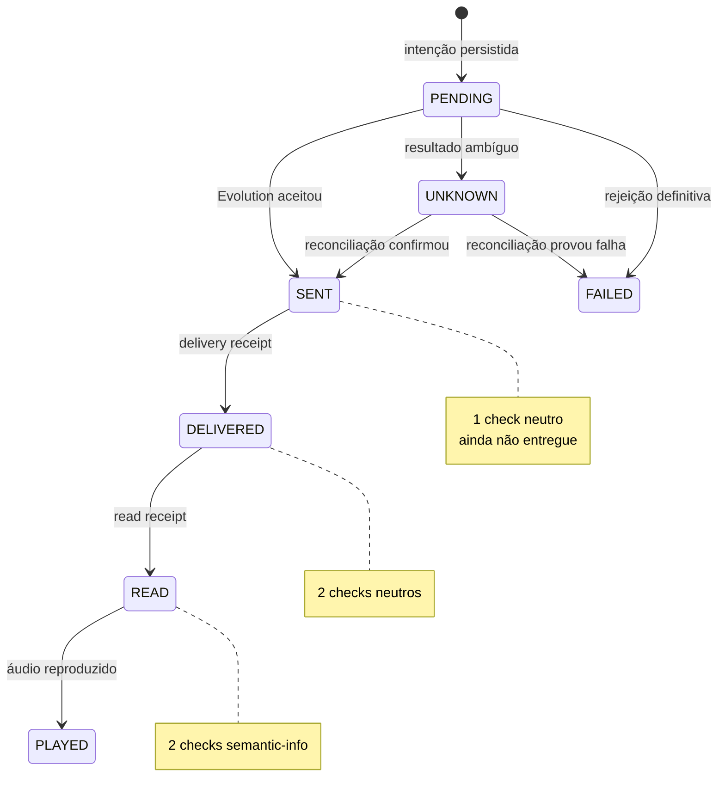

### 12.3.1 Geometria do composer

Estado normal:

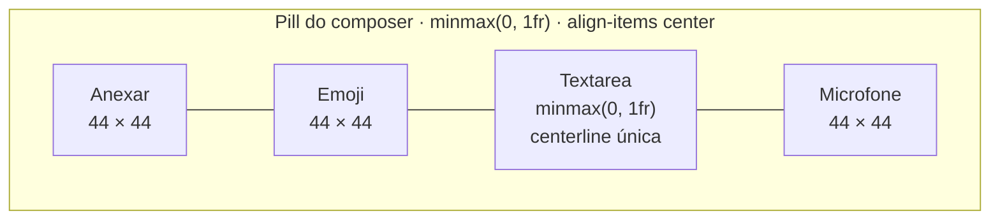

Estado de gravação:

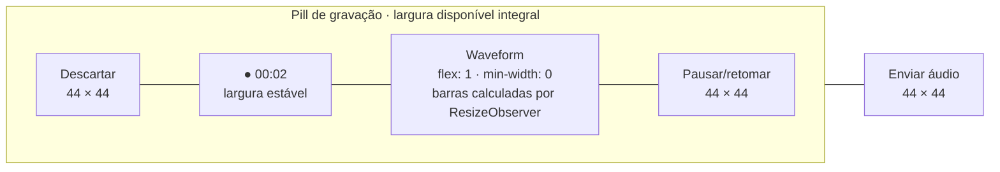

Geometria normativa:

```text
Composer externo:
  grid-template-columns: minmax(0, 1fr) auto
  gap: 8px

Pill normal:
  grid-template-columns: 44px 44px minmax(0, 1fr) 44px
  align-items: center

Pill gravando:
  grid-template-columns: 44px auto minmax(0, 1fr) 44px
  align-items: center
```

Regras:

- não usar a combinação atual de `items-end`, ações de 32 px e microfone de 44 px no estado de uma linha;
- todos os controles usam célula de 44 px e glyph dimensionado sem alterar a célula;
- textarea de uma linha e glyphs compartilham centerline com desvio máximo de 2 px;
- textarea multilinha pode crescer até o limite definido; controles ficam na faixa inferior de 44 px sem sobreposição;
- waveform começa imediatamente após o timer e termina imediatamente antes de pausar;
- waveform ocupa 100% da largura flexível; não estica a largura individual das barras;
- quantidade de barras é `floor(larguraDisponível / (larguraBarra + gap))`, limitada por mínimo/máximo testados;
- `ResizeObserver` recalcula a janela visível e mantém as amostras mais recentes num buffer circular;
- em reduced motion ou sem analisador, a área flexível inteira mostra “Gravando áudio”, não uma onda falsa curta.

### 12.3.2 Menu contextual da bolha

O componente ainda não existe em `components/ui`. Na implementação, adicioná-lo pelo runner do projeto e revisar o arquivo gerado antes de integrar:

```text
BUN_TMPDIR=/tmp/lead-flow-shadcn-tmp \
BUN_INSTALL=/tmp/lead-flow-shadcn-install \
bunx --bun shadcn@latest add context-menu
```

Usar `@/components/ui/context-menu`, base Radix, estilo `new-york`, ícones Lucide e tokens semânticos já configurados. Não construir menu absoluto dentro do histórico: ele seria cortado pelo `overflow`.

Composição:

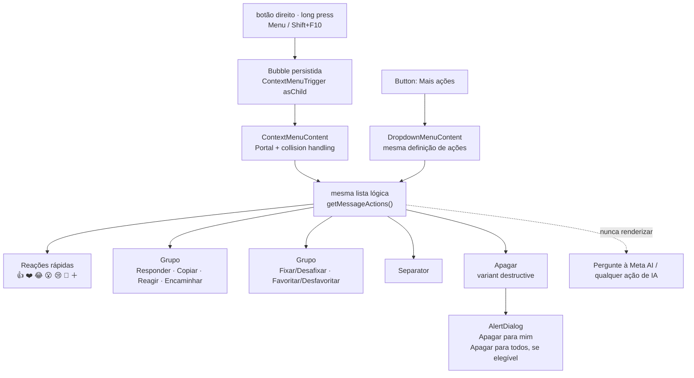

Wireframe normativo:

```text
┌──────────────────────────────┐
│ 👍  ❤️  😂  😮  😢  🙏  ＋ │  reações rápidas
├──────────────────────────────┤
│ ↩  Responder                 │
│ ▣  Copiar                    │
│ ☺  Reagir                    │
│ ↪  Encaminhar                │
│ ⚑  Fixar / Desafixar         │
│ ☆  Favoritar / Desfavoritar  │
├──────────────────────────────┤
│ ⌫  Apagar                    │  semantic destructive
└──────────────────────────────┘
```

| Ação       | Disponibilidade                                     | Resultado esperado                                                                |
| ---------- | --------------------------------------------------- | --------------------------------------------------------------------------------- |
| Responder  | inbound/outbound persistida                         | preview citado no composer; envio normal preserva referência                      |
| Copiar     | texto, caption ou conteúdo textual autorizado       | Clipboard API + feedback; sem request de rede                                     |
| Reagir     | provider/capability confiável e `providerMessageId` | seletor rápido/completo; command idempotente; reconciliação                       |
| Encaminhar | mensagem estável e tipo suportado                   | dialog de destinos; confirmação; uma intenção por destino                         |
| Fixar      | mensagem persistida e usuário com acesso à conversa | estado compartilhado, label vira “Desafixar”                                      |
| Favoritar  | mensagem persistida                                 | estado privado do perfil, label vira “Desfavoritar”                               |
| Apagar     | mensagem persistida                                 | sempre abre confirmação; “para todos” só quando provider e autorização permitirem |

Regras de interação:

- `ContextMenuTrigger asChild` envolve a bolha, não a linha inteira nem o painel;
- `ContextMenuContent` usa o portal do componente; não adicionar `z-index` arbitrário;
- “Mais ações” usa o `DropdownMenu` já instalado e a mesma função pura de definição/eligibilidade; não tenta sintetizar coordenadas de pointer para abrir o `ContextMenu`;
- grupos relacionados usam `ContextMenuGroup` e divisões usam `ContextMenuSeparator`;
- item usa `onSelect`, nunca clique em markup improvisado;
- cada emoji da faixa rápida é um item de menu com nome acessível; não aninhar botões arbitrários dentro de `ContextMenuItem`;
- o menu abre próximo ao ponteiro e se reposiciona nas quatro bordas sem sobrepor o composer;
- no touch, long press não dispara envio, seleção acidental ou menu duplo; “Mais ações” oferece alternativa explícita;
- mensagens otimistas não abrem um menu que prometa mutações indisponíveis;
- ações disabled explicam o motivo por `aria-describedby`/tooltip acessível; não usar somente opacidade;
- ao fechar, o foco retorna à bolha ou ao controle “Mais ações” que abriu o menu;
- o menu do navegador continua aparecendo fora de uma bolha;
- “Pergunte à Meta AI” e qualquer ação equivalente são proibidas por requisito e teste.

Estados:

- loading de ação mantém o item desabilitado e mostra `Spinner` sem fechar prematuramente quando a confirmação for necessária;
- sucesso local/confirmado fecha o menu e usa `sonner` apenas quando o resultado não for visualmente óbvio;
- falha recuperável preserva contexto e permite nova tentativa segura;
- resultado externo `UNKNOWN` informa “Confirmação pendente” e não repete a ação automaticamente;
- `Apagar` abre `AlertDialog` com título, descrição do escopo e foco inicial na ação segura/cancelar.

### 12.4 Composer e anexos

- texto e anexo permanecem se a operação falhar;
- selecionar anexo abre preview, não envia;
- preview permite editar legenda, remover, cancelar e confirmar;
- upload mostra progresso;
- após upload, a mensagem ainda pode ser cancelada enquanto o command não foi criado;
- depois de command `PENDING`, cancelamento de provider não é prometido;
- mídia `UNKNOWN` segue a mesma cautela do texto;
- controles usam componentes/tokens do Corretor Studio, shadcn e Lucide.

### 12.5 Microfone

Estados:

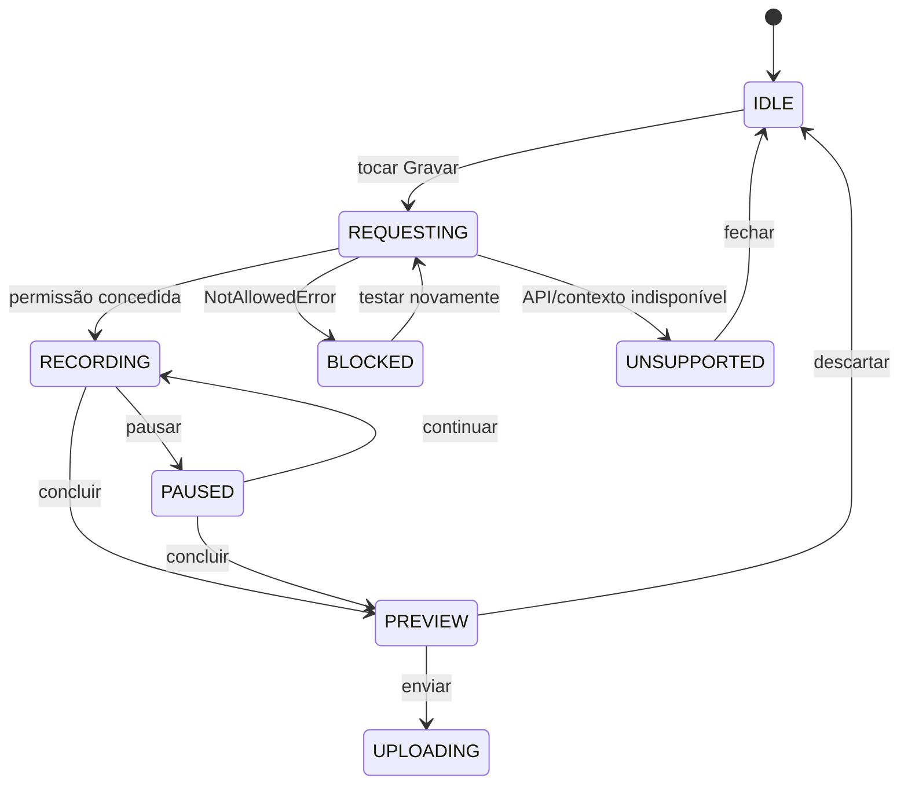

O callout de bloqueio inclui:

- diagnóstico curto;
- “Como liberar” com instrução específica para navegador/OS;
- “Testar microfone novamente”;
- alternativa de anexar áudio existente quando suportada;
- nenhum link que prometa alterar a permissão automaticamente.

### 12.6 Cabeçalho e CRM

Manter no cabeçalho somente:

- voltar no mobile;
- avatar, nome e subtítulo/status confiável;
- uma ação contextual principal;
- menu.

Lead, tags, responsável, handoff e ações destrutivas ficam num sheet “Detalhes do atendimento”, com busca em listas longas. A conversa continua visível atrás do sheet no desktop e o foco retorna ao acionador ao fechar.

### 12.7 Navegação por teclado

| Atalho             | Resultado                                                               |
| ------------------ | ----------------------------------------------------------------------- |
| `/`                | focar busca global quando nenhum input estiver ativo                    |
| `Escape`           | fechar camada atual; no mobile, voltar à lista quando não houver camada |
| `Enter`            | enviar texto                                                            |
| `Shift+Enter`      | nova linha                                                              |
| `Menu`/`Shift+F10` | abrir ações da mensagem focada                                          |
| `Tab`/`Shift+Tab`  | ordem visual previsível                                                 |

Atalhos adicionais só entram após verificar colisões com o shell global da aplicação.

### 12.8 Direção visual

- preservar tokens, tipografia, laranja e dark/light mode do Corretor Studio;
- usar densidade de mensageiro, não cards aninhados;
- manter lista e histórico como superfícies primárias;
- evitar gradientes decorativos, glassmorphism e cores proprietárias do WhatsApp;
- status e erros usam tokens semânticos;
- animação só comunica transição/progresso e respeita reduced motion.

## 13. Design de backend

### 13.1 Componentes alvo

| Componente                      | Responsabilidade                                                   |
| ------------------------------- | ------------------------------------------------------------------ |
| `CreateConversationUseCase`     | normalizar, autorizar, criar/restaurar conversa; sem envio         |
| `SendMessageUseCaseV3`          | idempotência, transação da intenção, limites, provider e resultado |
| `OutboundCommandRepository`     | claim/replay/retry/reconciliação atômicos                          |
| `OutboundReconciliationService` | reconciliar HTTP, webhook e comandos vencidos                      |
| `WhatsAppContactUseCase`        | criar/atualizar/reutilizar contato canônico sob RBAC               |
| `ContactIdentityResolver`       | classificar JID e vincular aliases somente por evidência forte     |
| `WhatsAppContactRepository`     | contato canônico, identidade técnica, conflito e batch upsert      |
| `WhatsAppUnifiedSearchUseCase`  | merge de conversas/contatos canônicos/número sob RBAC              |
| `WhatsAppSyncJobUseCase/Worker` | lease, batch, checkpoint, backoff e progresso                      |
| `WhatsAppMediaUploadUseCase`    | token assinado, validação e limpeza de órfãos                      |
| `WhatsAppInboundMediaWorker`    | ingestão, status e retry                                           |
| `WhatsAppMessageActionUseCase`  | RBAC, capability, estado local e command idempotente               |
| `MessageActionRepository`       | reação, pin, favorito, visibility e claim/reconciliação            |
| `WhatsAppSafeLogger`            | evento estruturado e redaction central                             |
| `EvolutionEndpointPolicy`       | resolver único endpoint confiável e bloquear redirect              |

`IWhatsAppProvider` permanece vendor-neutral. Se um método novo for necessário, ele descreve capacidade de domínio (`sendMediaFromStorage`, `lookupMessageStatus`) e não endpoint da Evolution.

### 13.2 Transação da intenção outbound

Pseudofluxo normativo:

```text
1. autorizar conversa e validar config/conteúdo
2. buscar command por teamId + clientMessageId
3. se existente:
   SENT     -> replay do resultado
   PENDING  -> 202
   UNKNOWN  -> 202 sem envio
   FAILED   -> somente retryFailed=true e requestHash igual
4. transação:
   criar/rearmar command
   criar/rearmar message PENDING ligada ao command
5. avaliar quota e consumir rate limit
   rejeição -> command/message FAILED com failureCode
6. chamar provider
7. aceito -> atualizar message e command para SENT
8. erro ambíguo -> UNKNOWN
9. erro determinístico -> FAILED
10. publicar estado via Postgres/Realtime
```

O passo 5 permanece depois do claim idempotente para evitar que replay consuma quota/rate novamente. Toda saída antecipada após o passo 4 finaliza o comando.

### 13.3 Classificação de erros do provider

| Classe                             | Exemplos                                   | Estado                                                 |
| ---------------------------------- | ------------------------------------------ | ------------------------------------------------------ |
| pré-condição local                 | quota, rate, desconectado antes da chamada | `FAILED`, certeza `NOT_SENT`                           |
| rejeição provider 4xx interpretada | destinatário inválido, tipo não suportado  | `FAILED`, certeza `NOT_SENT`                           |
| timeout/reset/fetch após início    | timeout, socket, resposta truncada         | `UNKNOWN`                                              |
| resposta aceita com ID             | providerMessageId válido                   | `SENT`                                                 |
| falha local antes da chamada       | validação/DB                               | nenhum efeito externo; `FAILED` se intenção já existia |
| falha local após aceite            | DB/rede interna                            | `UNKNOWN`; reconciliar por webhook/provider            |

A classificação deve ser coberta por teste e não por regex genérica de mensagem.

### 13.4 Merge/Reconciliation

O reducer puro recebe evento HTTP, Realtime ou webhook normalizado. Identidade:

1. `clientMessageId`;
2. `providerMessageId`;
3. `message.id`.

Precedência de status:

```text
PLAYED > READ > DELIVERED > SENT > PENDING
RECEIVED é terminal para inbound
FAILED só substitui PENDING quando a falha é determinística
UNKNOWN só substitui PENDING por timeout/reconciliação
SENT/DELIVERED/READ/PLAYED substituem UNKNOWN
evento atrasado nunca regride estado
```

Campos não nulos mais confiáveis vencem; conteúdo local não é apagado por evento parcial.

Normalização do receipt:

| Evento Evolution              | Estado local | Timestamp       |
| ----------------------------- | ------------ | --------------- |
| `SERVER_ACK` ou `SENT`        | `SENT`       | mantém `sentAt` |
| `DELIVERY_ACK` ou `DELIVERED` | `DELIVERED`  | `deliveredAt`   |
| `READ`                        | `READ`       | `readAt`        |
| `PLAYED` em áudio             | `PLAYED`     | `playedAt`      |
| `FAILED` ou `ERROR`           | `FAILED`     | `failedAt`      |

`PLAYED` em mensagem que não seja áudio é descartado, metrificado e não promove o status. Nenhum timestamp é preenchido por relógio local sem o evento correspondente, exceto `sentAt` da própria intenção.

### 13.5 Sync

- worker processa no máximo 20 chats por batch;
- consultas de IDs existentes usam blocos de até 500;
- persistência usa transação curta por batch;
- concorrência inicial de provider é 4;
- cada execução deve terminar antes de 45 segundos e renovar checkpoint/lease;
- job interrompido com lease vencido pode ser assumido por outro worker;
- `findChats` sem paginação é tratado como snapshot do provider, e o cursor registra posição/hash do snapshot sem armazenar JIDs completos;
- sync de contatos usa upsert em batch, não loop de `upsert` individual;
- mensagens usam unique existente por provider ID e `skipDuplicates`/upsert controlado;
- side effects não essenciais (avatar, enriquecimento) ficam fora da transação principal.

Pipeline normativo do sync de contatos:

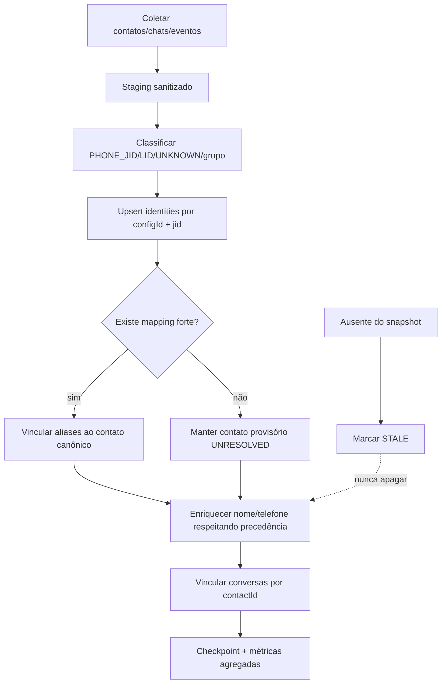

Ordem:

1. o adapter captura `remoteJid`, `remoteJidAlt`, `senderPn`, `participantAlt` e equivalentes conhecidos na versão homologada;
2. `ContactIdentityResolver` classifica cada endereço sem remover a semântica do sufixo;
3. identities são persistidas antes de qualquer merge;
4. aliases são unidos somente pela política da seção 9.7;
5. dados externos enriquecem o contato conforme precedência, sem sobrescrever `MANUAL/LEAD`;
6. conversas recebem `contactId` quando a resolução é inequívoca;
7. itens não vistos atualizam frescor para `STALE`; exclusão física não faz parte do sync;
8. job roda em conexão/reconexão, descoberta de identidade e cron configurável de 15 minutos, retoma checkpoint e não bloqueia a experiência da Inbox.

### 13.6 Sanitização

`sanitizeProviderText(value, maxLength)`:

- aceita apenas string;
- substitui Unicode inválido;
- remove NUL e controles não permitidos;
- normaliza quebra de linha;
- limita comprimento por campo;
- devolve `null` e código de descarte se não houver conteúdo válido.

Fixtures incluem o caso de produção `unexpected end of hex escape`, sem reproduzir dado real.

### 13.7 Ações de mensagem e capabilities

Adicionar ao contrato vendor-neutral apenas capabilities verificadas:

```ts
interface WhatsAppMessageActionCapabilities {
  reactions: boolean
  quotedReply: boolean
  forward: boolean
  deleteForEveryone: boolean
}

interface IWhatsAppProvider {
  getMessageActionCapabilities(): WhatsAppMessageActionCapabilities
  reactToMessage?(input: ProviderReactionInput): Promise<ProviderActionResult>
  deleteMessageForEveryone?(input: ProviderDeleteInput): Promise<ProviderActionResult>
}
```

Regras:

- capability é derivada da versão/configuração conhecida da Evolution no servidor, nunca de flag enviada pelo browser;
- método opcional ausente significa `CAPABILITY_UNAVAILABLE`, não sucesso local;
- responder e encaminhar usam o pipeline de envio durável e preservam referências do original;
- reação e exclusão externa usam `WhatsAppMessageActionCommand` com request hash, claim, timeout `UNKNOWN` e reconciliação por webhook/consulta quando disponível;
- evento de reação recebido por webhook é deduplicado por provider event ID e publicado por Realtime;
- `MESSAGES_DELETE` recebido só marca `deletedForEveryoneAt` após correlacionar team/config/provider message;
- pin, favorito e “apagar para mim” não chamam a Evolution;
- toda mutação produz audit event sem conteúdo da mensagem, emoji em texto livre não validado, telefone ou JID completo.

## 14. Segurança, Supabase e Storage

### 14.1 Endpoint Evolution

Decisão V3: existe um único endpoint confiável definido por `EVO_API_BASE_URL`. `hostBaseUrl` deixa de ser entrada de tenant e backoffice e deixa de ser lido pelo provider.

Validação de startup:

- URL absoluta;
- HTTPS obrigatório em produção;
- HTTP permitido apenas para loopback no desenvolvimento local;
- sem username/password, query ou fragment;
- hostname e porta compatíveis com a configuração operacional;
- `redirect: "error"` em requests;
- timeout separado para consulta e envio;
- erro de configuração impede inicialização da integração, sem imprimir URL com credenciais.

Migração segura:

1. inventariar valores distintos de `hostBaseUrl` no banco vivo sem expô-los no relatório;
2. confirmar que todas as instâncias da Inbox usam o endpoint oficial;
3. publicar provider que ignora a coluna;
4. remover campo das rotas/forms;
5. rotacionar `EVO_API_KEY`;
6. manter coluna somente para rollback por um release;
7. remover a coluna em migration posterior.

Suporte futuro a múltiplas VPS exige outra SPEC com endpoint cadastrado server-side e segredo por host. Não se reabre URL livre por tenant.

A imagem `evoapicloud/evolution-api:latest` é proibida em produção. Operação deve homologar e fixar versão ou digest, registrar capabilities/payloads esperados e executar testes de contrato antes de upgrade. A documentação oficial recente registra mudanças específicas de LID e mapping LID → phone-number JID; esse suporte é uma capability versionada, não um invariante presumido pelo domínio. Fontes: [releases da Evolution API](https://github.com/evolution-foundation/evolution-api/releases) e [changelog oficial](https://github.com/evolution-foundation/evolution-api/blob/main/CHANGELOG.md).

### 14.2 Webhook

Autenticação:

```text
path token: segredo aleatório por config
header apikey: HMAC-SHA256(WHATSAPP_WEBHOOK_HEADER_SECRET, path token)
```

Requisitos operacionais:

- `WHATSAPP_WEBHOOK_HEADER_SECRET` obrigatório em produção, mínimo 32 bytes;
- `WHATSAPP_WEBHOOK_HEADER_ENFORCE=true`;
- comparação constant-time;
- rotação com janela dual somente quando explicitamente ativada e metrificada;
- evento válido é persistido antes de qualquer side effect;
- payload persistido é sanitizado e minimizado;
- request inválida não revela qual credencial falhou;
- replay não duplica mensagem, uso ou automação.

Adicionar as duas variáveis à `.env.example` e à validação central de ambiente. A ausência em produção deve falhar cedo.

### 14.3 Matriz RLS/grants alvo

| Objeto                        | RLS                  | `anon` | `authenticated`                   | `service_role` | Realtime   |
| ----------------------------- | -------------------- | ------ | --------------------------------- | -------------- | ---------- |
| `whatsapp_conversations`      | habilitada           | nenhum | `SELECT` com policy               | CRUD           | sim        |
| `whatsapp_messages`           | habilitada           | nenhum | `SELECT` com policy               | CRUD           | sim        |
| `team_whatsapp_configs`       | habilitada           | nenhum | nenhum                            | CRUD           | não        |
| `team_whatsapp_contacts`      | habilitada           | nenhum | API ou `SELECT` mínimo por time\* | CRUD           | opcional\* |
| `whatsapp_contact_identities` | habilitada           | nenhum | nenhum                            | CRUD           | não        |
| `whatsapp_usage_events`       | habilitada           | nenhum | nenhum                            | CRUD           | não        |
| `whatsapp_outbound_commands`  | habilitada           | nenhum | nenhum                            | CRUD           | não        |
| `whatsapp_webhook_events`     | habilitada           | nenhum | nenhum                            | CRUD           | não        |
| `whatsapp_sync_jobs`          | habilitada           | nenhum | nenhum                            | CRUD           | não        |
| `whatsapp_audit_events`       | habilitada           | nenhum | nenhum                            | CRUD           | não        |
| action commands/reactions     | habilitada           | nenhum | nenhum                            | CRUD           | sim\*      |
| pins/favorites/visibility     | habilitada           | nenhum | nenhum                            | CRUD           | sim\*      |
| tags e assignments            | habilitada           | nenhum | nenhum na V3                      | CRUD           | não        |
| `storage.objects` no bucket   | policies específicas | nenhum | sem listagem geral                | gestão         | não        |

\* Preferir API. Se atualização imediata de contato justificar Realtime/Data API, publicar somente tabela/projeção canônica sem JID/alias, com policy por time e grants mínimos. Command, identity e payload operacional permanecem fora do Realtime.

As rotas de tags e ações continuam server-side; se algum cliente realmente usar Data API direta, a PR deve provar a necessidade e adicionar policy mínima explícita, não concessão ampla.

Em projetos Supabase novos, tabelas já não são expostas automaticamente à Data/GraphQL API. Isso não substitui o contrato: cada migration deve declarar RLS, grants e publicação explicitamente, inclusive para provar que `whatsapp_contact_identities` permanece server-only. Fonte: [Supabase changelog](https://supabase.com/changelog/45329-breaking-change-tables-not-exposed-to-data-and-graphql-api-automatically).

### 14.4 Função de visibilidade

Mover `public.whatsapp_user_can_view_conversation` para `private.whatsapp_user_can_view_conversation`, ou recriá-la de modo compatível:

- `SECURITY DEFINER` somente se necessário para consultar membership;
- `SET search_path = ''`;
- referências totalmente qualificadas;
- validação de `(select auth.uid()) is not null`;
- regra idêntica a `buildConversationVisibilityWhere`;
- `REVOKE ALL ON FUNCTION ... FROM PUBLIC, anon`;
- `GRANT EXECUTE ... TO authenticated`;
- testes para master, manager, operator, outro time, authenticated sem membership e anon.

Policies de conversas/mensagens chamam a função privada. A migration troca policies e função na mesma transação quando possível.

### 14.5 Storage

- bucket `whatsapp-media` privado;
- token assinado de upload gerado após autorização da conversa;
- path contém IDs internos, nunca telefone/JID;
- leitura exige autorização da conversa antes de gerar URL curta;
- sem `list` para o browser;
- upload upsert não é necessário por padrão; cada `clientMessageId` gera path imutável;
- se upsert for introduzido, policies devem cobrir `INSERT`, `SELECT` e `UPDATE`;
- orphan cleanup e purge usam service role e auditam somente contagens/bytes.

### 14.6 Validação Supabase

Antes do deploy remoto:

1. criar migration com `bun run db:migrate:new <nome>`;
2. aplicar/resetar banco local;
3. executar testes SQL/RLS locais;
4. consultar `supabase --help` e a ajuda do subcomando antes de usar CLI;
5. executar Advisors de security/performance;
6. inspecionar grants, policies, owners, functions e publication;
7. fazer dry-run de push;
8. aplicar remoto apenas com autorização;
9. repetir Advisors e matriz de impersonation após deploy.

O changelog Supabase consultado em 2026-07-23 informa que tabelas novas deixam de ser expostas automaticamente à Data API; a SPEC ainda exige grants e RLS explícitos para não depender de default de projeto.

## 15. Observabilidade

### 15.1 Eventos estruturados

Exemplos de nomes:

```text
whatsapp.send.intent_created
whatsapp.send.provider_accepted
whatsapp.send.unknown
whatsapp.send.reconciled
whatsapp.send.duplicate_prevented
whatsapp.webhook.accepted
whatsapp.webhook.rejected
whatsapp.webhook.dead_letter
whatsapp.sync.batch_completed
whatsapp.sync.failed
whatsapp.contact.identity_resolved
whatsapp.contact.identity_unresolved
whatsapp.contact.identity_conflict
whatsapp.contact.duplicate_prevented
whatsapp.media.ingested
whatsapp.media.expired
whatsapp.realtime.degraded
whatsapp.realtime.recovered
```

Campos permitidos:

- `correlationId`;
- `clientMessageId`;
- `messageId`, `commandId`, `eventId`, `syncJobId`;
- `provider` e código de operação;
- status, tentativa, duração, contadores e bytes;
- team/conversation pseudonimizados quando agregação exigir.

Campos proibidos:

- telefone/JID, mesmo em mensagem de erro;
- nome do contato/instância;
- conteúdo/caption;
- Base64;
- URL inteira ou query;
- QR, token, path secret, header, API key;
- body/stack externo não sanitizado.

### 15.2 Métricas e alertas

| Métrica                                     | Dimensões permitidas      | Alerta inicial                    |
| ------------------------------------------- | ------------------------- | --------------------------------- |
| `whatsapp_send_total`                       | status/certainty/provider | `UNKNOWN` > 1% por 10 min         |
| `whatsapp_command_age_seconds`              | status                    | `PENDING` p95 > 120 s             |
| `whatsapp_webhook_persist_latency_ms`       | result                    | p95 > 1 s                         |
| `whatsapp_webhook_to_ui_ms`                 | result                    | p95 > 3 s                         |
| `whatsapp_webhook_dead_letter_total`        | eventType seguro          | qualquer crescimento sustentado   |
| `whatsapp_sync_batch_ms`                    | kind/result               | job sem progresso > 10 min        |
| `whatsapp_contact_identity_total`           | kind/result/source        | `CONFLICT` ou `UNRESOLVED` cresce |
| `whatsapp_contact_sync_age_seconds`         | result                    | p95 acima da agenda operacional   |
| `whatsapp_contact_duplicate_total`          | result                    | duplicata persistida sempre 0     |
| `whatsapp_provider_contract_mismatch_total` | operação/versão           | qualquer ocorrência               |
| `whatsapp_media_ingest_total`               | status/type               | FAILED/EXPIRED acima do baseline  |
| `whatsapp_realtime_degraded_seconds`        | recovery                  | p95 > 30 s                        |
| `whatsapp_poll_fallback_total`              | reason                    | aumento 3× baseline               |
| `whatsapp_log_redaction_violation_total`    | campo                     | sempre 0                          |

Os thresholds serão calibrados após sete dias de baseline, mas `PENDING` vencido, segredo/PII e dead-letter não aguardam calibração para alertar.

### 15.3 Diagnóstico visível

Operador vê apenas:

- conectado/desconectado quando confiável;
- atualizações demorando;
- sincronização em andamento/parcial/falhou;
- contato com identificação pendente ou conflito que impeça novo envio;
- envio pendente, incerto ou falhou;
- mídia processando/expirada/indisponível.

Backoffice vê:

- status da instância;
- último webhook e última reconciliação;
- comandos por estado;
- backlog/dead-letter;
- jobs de sync;
- totais agregados de LID resolvido/não resolvido, conflitos e duplicatas evitadas;
- falhas de mídia;
- métricas agregadas e ação de reprocessar autorizada.

Nenhuma tela de diagnóstico exibe conteúdo ou telefone completo.

## 16. Estratégia de testes

### 16.1 Baseline

A auditoria registrou:

```text
66 pass
0 fail
118 expect() calls
20 arquivos
```

Esse baseline deve continuar verde. Ele não substitui os testes abaixo.

### 16.2 Pirâmide

| Camada            | Cobertura obrigatória                                                                    |
| ----------------- | ---------------------------------------------------------------------------------------- |
| unitária          | JID/telefone/nome, identity resolver, sanitizer, request hash, merge, timer, redaction   |
| integração        | contatos/identities, use cases + banco local, constraints, sync lease/checkpoint         |
| contrato provider | fixtures da versão Evolution, aliases LID/PN, timeout, 4xx, payload/webhook inválido     |
| RLS/SQL           | roles e membership, grants, function execute, publication e storage                      |
| componente/estado | busca, composer, preview, mic, bolha, menu contextual, ações e zero states               |
| E2E               | primeiro envio, duas abas, Realtime, mídia, ações da bolha, mobile, teclado e permissões |
| visual/a11y       | 320/375/768/1440, zoom 200%, dark/light, axe e leitor de tela manual                     |
| carga             | 100 × 100 sync, mil conversas, 30 envios concorrentes e webhook duplicado                |

Se o repositório adotar Playwright/axe, as versões devem ser exatas e o lockfile deve ser commitado.

### 16.3 Cenários obrigatórios

#### Envio e reconciliação

1. primeiro envio com provider e DB saudáveis;
2. provider aceita e update local falha;
3. timeout depois de possível entrega;
4. provider rejeita definitivamente;
5. quota e rate limit;
6. retry de `FAILED` com mesma chave;
7. retry de `UNKNOWN` não chama provider;
8. HTTP antes do Realtime;
9. Realtime antes do HTTP;
10. webhook antes/depois da resposta;
11. refresh com `PENDING`/`UNKNOWN`;
12. duas abas;
13. mesma chave com conteúdo diferente.

Critério: uma bolha e no máximo uma entrega externa por intenção.

#### Recibos de envio, entrega, leitura e reprodução

1. `SENT → DELIVERED → READ` troca um check neutro por dois checks neutros e, por fim, dois checks em `semantic-info`;
2. evento atrasado `SENT` ou `DELIVERED` não regride mensagem já em `READ`;
3. evento atrasado `READ` não regride áudio já em `PLAYED`;
4. evento válido recebido por Realtime atualiza imediatamente a bolha, sem refresh e sem duplicá-la;
5. mensagens inbound e mensagens de sistema não renderizam checks;
6. cada estado expõe nome acessível correto: “Enviada”, “Entregue”, “Lida”, “Reproduzida”, “Confirmação indisponível” ou “Falha no envio”;
7. os sinais mantêm contraste de componente não textual ≥3:1 em tema claro e escuro e continuam distinguíveis sem cor;
8. `READ` não é inferido por tempo, resposta HTTP, entrega ou estado otimista: exige sinal confiável da Evolution correlacionado ao `providerMessageId`;
9. `UNKNOWN` mostra confirmação indisponível e nunca oferece ou dispara reenvio automático;
10. `PLAYED` permanece distinto de `READ`, só é aceito para áudio e grava `playedAt`.

Critério: o indicador sempre descreve a maior evidência confiável já observada, nunca uma expectativa do cliente.

#### Busca

- nome exato/parcial;
- nome com/sem acento;
- telefone E.164, cru, mascarado e últimos 8/9 dígitos;
- contato sem conversa;
- conversa ativa;
- conversa arquivada;
- contato oculto por RBAC;
- filtros ativos;
- sync em andamento/falhou;
- número inválido.

#### Contatos e identidades

1. phone-number JID válido cria/reutiliza contato com E.164;
2. `@c.us` é canonicalizado sem duplicar o mesmo `@s.whatsapp.net`;
3. LID sem alias cria/usa contato provisório `UNRESOLVED`, sem preencher telefone;
4. par confiável `remoteJid` + `remoteJidAlt`/`senderPn`/`participantAlt` liga LID e phone-number JID ao mesmo `contactId`;
5. LID jamais é unido por nome, avatar ou últimos dígitos;
6. alias já ligado a outro contato produz `CONFLICT` e não move dados;
7. grupo `@g.us` não cria contato pessoal;
8. sufixo desconhecido fica em quarentena técnica e não aparece na UI;
9. nome manual sobrevive a sync com `PHONE_BOOK`/`PUSH_NAME`;
10. contato interno sobrevive a snapshot vazio, timeout e remoção da agenda, mudando no máximo para `STALE`;
11. criar o mesmo E.164 concorrentemente devolve um único `contactId`;
12. telefone brasileiro de 8 e 9 dígitos usa as máscaras previstas; países não brasileiros usam formato internacional;
13. busca encontra o contato por nome, E.164, máscara e últimos dígitos, mas esses critérios não executam merge;
14. lista, busca, cabeçalho, toast e erro nunca renderizam JID/LID;
15. `UNRESOLVED` permite histórico e bloqueia novo envio sem endereço `sendable`;
16. contato existente sem conversa inicia uma; com conversa ativa/arquivada abre/restaura a existente;
17. dois times podem ter o mesmo E.164 sem compartilhar nome, aliases ou conversa.

#### Sync

- 100 chats × 100 mensagens;
- interrupção após cada batch;
- lease vencido;
- retry de `findChats`;
- JSON inválido;
- provider ID duplicado;
- contato LID resolvido e não resolvido;
- snapshot de contatos vazio/parcial não apaga cadastro interno;
- alias alternativo chega primeiro por webhook e depois por `findContacts`, e vice-versa;
- upgrade de fixture/versionamento Evolution falha quando o contrato de alias mudar;
- string com NUL/escape inválido;
- duas solicitações concorrentes;
- avatar indisponível.

#### Mídia

- preview, cancelamento e legenda;
- upload direto e hash;
- arquivo 16 MB;
- MIME divergente;
- provider offline;
- storage offline;
- retry do mesmo objeto;
- URL externa expirada com cópia local;
- mídia `PROCESSING`, `EXPIRED` e `FAILED`;
- usuário sem acesso;
- cleanup de órfão.

#### Microfone

- `prompt`, `granted`, `denied`, `unsupported`;
- contexto não HTTPS;
- navegador sem Permissions API;
- permissão alterada em outra aba;
- pause/resume com fake timers;
- preview, descarte e envio;
- reduced motion;
- mobile com teclado virtual.

#### Composer e waveform

- texto de uma linha centralizado com anexo, emoji e microfone, com desvio máximo de 2 px entre eixos;
- texto multilinha preserva uma faixa inferior de 44 px para ações, sem sobreposição;
- modo normal e gravação em 320, 375, 768 e 1440 px;
- zoom de 200%, teclado virtual, safe area e textos traduzidos maiores;
- waveform ocupa toda a coluna flexível entre timer e pausa, sem bloco vazio à direita;
- `ResizeObserver` recalcula a quantidade de barras após resize e mudança de orientação;
- buffer circular mantém a onda preenchida sem crescimento ilimitado;
- reduced motion conserva largura, timer, estado textual e controles, mesmo sem animação.

#### Menu contextual e ações da bolha

1. botão direito numa bolha persistida abre o menu da mensagem e não o menu do navegador;
2. botão direito fora das bolhas preserva o menu nativo do navegador;
3. long press abre uma única instância sem também selecionar texto, clicar link ou disparar ação;
4. tecla Menu/`Shift+F10` e o controle “Mais ações” abrem o mesmo conteúdo;
5. foco inicial, setas, typeahead, Escape, clique externo e retorno de foco seguem o padrão de menu;
6. portal e collision handling mantêm o menu visível nas quatro bordas, dentro do histórico rolado e acima do composer;
7. ações aparecem na ordem definida, com labels alternados `Fixar|Desafixar` e `Favoritar|Desfavoritar`;
8. “Pergunte à Meta AI”, qualquer item de IA e espaço reservado equivalente não existem no DOM;
9. `Copiar` trata texto, caption, conteúdo ausente, permissão de Clipboard negada e anúncio de resultado;
10. reação rápida e picker completo tratam sucesso, timeout `UNKNOWN`, webhook duplicado, rollback e remoção;
11. resposta citada trata original disponível, apagado, não carregado e mídia sem caption;
12. encaminhamento para um/múltiplos destinos cria uma intenção por destino e não duplica em retry;
13. fixar/favoritar alternam estado por Realtime e respeitam escopo compartilhado/privado;
14. “Apagar” nunca executa no primeiro clique; “para mim” não afeta outro perfil;
15. “Apagar para todos” só aparece com capability, mensagem outbound elegível e RBAC; timeout não é tratado como sucesso;
16. mensagem otimista, tipo incompatível, usuário sem acesso e provider sem capability não oferecem ação enganosa;
17. menu e confirmação passam em 320/375/768/1440 px, zoom 200%, temas claro/escuro e leitor de tela.

#### Segurança

- HTTP, localhost, RFC1918, link-local, metadata cloud e IPv6 local;
- DNS que resolve para IP privado;
- redirect para host diferente;
- ausência/invalidez do header;
- path válido + header inválido;
- replay de webhook;
- snapshot de PII/segredos;
- `clientMessageId` de outro time;
- `clientActionId` repetido, com payload diferente e de outro time;
- reação, pin, favorito, forward ou delete sobre mensagem sem visibilidade;
- path de storage de outra conversa.

#### RLS

| Perfil                       | Conversas/mensagens                            | Tabelas server-only  |
| ---------------------------- | ---------------------------------------------- | -------------------- |
| master                       | todas do time                                  | nenhum acesso direto |
| manager                      | todas do time                                  | nenhum acesso direto |
| operator                     | atribuídas, sem responsável e leads permitidos | nenhum acesso direto |
| outro time                   | nenhuma                                        | nenhum               |
| authenticated sem membership | nenhuma                                        | nenhum               |
| anon                         | nenhuma                                        | nenhum               |
| service role                 | conforme backend                               | CRUD operacional     |

Aplicar a mesma matriz a reactions, pins, favorites, visibility e action commands, validando adicionalmente que favorito/“apagar para mim” de um perfil não sejam observáveis por outro.

Aplicar também a `team_whatsapp_contacts` e `whatsapp_contact_identities`: usuários só acessam o contato canônico se a arquitetura optar por leitura direta autorizada; identidades técnicas permanecem sem acesso direto para todos os perfis/anon e fora da publication.

#### Acessibilidade

- navegação completa sem mouse;
- ordem de foco;
- dialog/lightbox;
- context menu por mouse, toque e teclado;
- AlertDialog de exclusão e retorno de foco;
- anúncio de status;
- seleção não dependente de cor;
- 44 px;
- zoom 200%;
- NVDA ou VoiceOver;
- contraste AA;
- reduced motion.

### 16.4 Gates automáticos por PR

```text
bun test --isolate <escopo-whatsapp-afetado>
bun run typecheck
bun run lint
bun run governance:check
bun run lint:pt-br
bun run design:check
bun run db:migrate:reset:local    # quando houver schema/migration
```

Adicionar suites E2E/RLS ao CI antes de ativar a flag de envio V3 em produção.

### 16.5 Gate Impeccable pós-frontend

Depois que todas as mudanças de frontend da Inbox estiverem implementadas e os testes funcionais estiverem verdes, executar obrigatoriamente, nesta ordem:

```text
$impeccable audit app/[supabaseId]/whatsapp/features
$impeccable critique app/[supabaseId]/whatsapp/features
```

O `audit` deve verificar a implementação em cinco dimensões:

1. acessibilidade;
2. performance;
3. responsividade;
4. theming/design tokens;
5. anti-patterns.

O `critique` deve executar duas avaliações independentes — revisão de design e detector/evidência de browser — seguindo o fluxo dual-agent da skill quando subagentes estiverem disponíveis e autorizados. A execução deve incluir:

- detector determinístico sobre o source;
- browser autenticado quando disponível;
- fluxos de lista, busca, adicionar/reutilizar contato, primeiro contato, conversa, menu/ações da bolha, mídia, microfone e detalhes do atendimento;
- viewports de 320, 375, 768 e 1440 px;
- temas claro e escuro;
- teclado, foco, zoom 200%, reduced motion e estados de erro/loading/empty;
- Nielsen, carga cognitiva, jornada emocional e personas relevantes;
- snapshot persistido em `.impeccable/critique/`.

Fluxo de tratamento:

1. registrar score, método, evidência e achados `P0–P3`;
2. converter cada `P0/P1` e todo `P2` que afete jornada crítica, WCAG AA ou contrato desta SPEC em tarefa rastreável;
3. executar os comandos Impeccable recomendados para corrigir os achados;
4. implementar e testar as correções;
5. repetir `audit` e `critique`;
6. manter o loop até atender os critérios abaixo.

Critérios para aprovação:

- zero `P0` e zero `P1`;
- Audit Health Score mínimo de `18/20`;
- Nielsen Design Health mínimo de `32/40`;
- zero falha de WCAG AA, target de 44 px, teclado, foco, contraste ou responsividade crítica;
- nenhum anti-pattern proibido pela skill;
- nenhum problema sem tratamento na jornada buscar/adicionar contato → abrir/criar → enviar → comprovar resultado;
- `P2/P3` remanescentes documentados com justificativa, responsável e prazo;
- execução final não degradada; exceção exige aceite formal de Produto e Engenharia.

Uma rodada inicial limpa não dispensa a segunda execução após qualquer correção material. A Inbox não pode ser marcada como concluída nem avançar a 100% do rollout sem anexar os dois relatórios finais e o snapshot da crítica.

## 17. Rollout, gates e rollback

### 17.1 Flags

Flags server-side:

```text
WHATSAPP_SEND_V3_ROLLOUT_PERCENT
WHATSAPP_CONTACT_IDENTITY_V1_ROLLOUT_PERCENT
WHATSAPP_CONTACT_SYNC_INTERVAL_MINUTES
WHATSAPP_SEARCH_V3_ROLLOUT_PERCENT
WHATSAPP_SYNC_V3_ROLLOUT_PERCENT
WHATSAPP_MEDIA_V3_ROLLOUT_PERCENT
WHATSAPP_MESSAGE_ACTIONS_V1_ROLLOUT_PERCENT
WHATSAPP_V3_ALLOWLIST_TEAM_IDS
WHATSAPP_WEBHOOK_HEADER_ENFORCE
```

Percentuais são calculados por hash estável de `teamId`; allowlist é server-only. O frontend recebe apenas capacidades booleanas na resposta de config, nunca a allowlist.

O flag controla a experiência/DTO V3, não a garantia “persistir antes do provider”. Durante a compatibilidade, clientes fora do rollout usam um adapter legado que também cria mensagem/comando duráveis. O caminho antigo que chama `WhatsAppService.sendMessage` diretamente é removido antes do primeiro percentual em produção.

### 17.2 Gates bloqueadores de produção

- [ ] comparar HEAD de implementação com o commit auditado;
- [ ] consultar Advisors de Security e Performance no Supabase vivo;
- [ ] confirmar RLS, grants, owner, functions e publication;
- [ ] executar matriz de impersonation;
- [ ] confirmar `WHATSAPP_WEBHOOK_HEADER_SECRET` e enforcement;
- [ ] inventariar/remover `hostBaseUrl` e rotacionar `EVO_API_KEY`;
- [ ] provar redaction em logs de preview;
- [ ] reproduzir primeiro contato autenticado no preview;
- [ ] E2E de ordem HTTP × Realtime e duas abas verde;
- [ ] versão/digest Evolution homologado no lugar de `latest` e fixtures de aliases LID/PN verdes;
- [ ] migration/backfill de contatos executada em dry-run com relatório de duplicatas/conflitos;
- [ ] provar que JID/LID não chega aos DTOs/Realtime/UI e que identities são server-only;
- [ ] contrato de capabilities da Evolution e E2E das ações da bolha verdes;
- [ ] executar o gate Impeccable pós-frontend, tratar os achados e repetir `audit`/`critique`;
- [ ] origem/licença dos wallpapers resolvida;
- [ ] dashboard mínimo e rollback exercitado.

Até esses itens serem atendidos, código pode chegar a preview/staging, mas não a 100% de produção.

### 17.3 Etapas

1. local com Evolution de teste e Supabase local;
2. preview com replay sanitizado;
3. staging/time interno por allowlist;
4. 5% por 24 horas;
5. 25% por 48 horas;
6. 100% após SLOs e ausência de regressão.

Avanço exige:

- duplicata externa zero;
- `UNKNOWN` dentro do threshold;
- nenhuma violação de redaction;
- nenhuma duplicata de contato canônico ou merge LID heurístico;
- `UNRESOLVED|CONFLICT` dentro do baseline e sem JID visível;
- sem aumento de 403/404/5xx;
- Realtime e mídia dentro do baseline;
- suporte sem relato de mensagem entregue e ausente.

### 17.4 Rollback

- `send V3`: flag volta a 0 e a UI usa o adapter compatível, que preserva a mesma outbox durável; comandos existentes continuam reconciliados e o envio direto legado não volta;
- busca: volta para lista atual, preservando campos/índices;
- contatos: flag volta a 0 e o backend usa dual-read legado; contatos/identities canônicos não são apagados e dual-write pode continuar para reconciliação;
- sync: interrompe novos jobs, deixa worker concluir/expirar leases; caminho legado só pode voltar se não criar concorrência;
- mídia: objetos V3 permanecem legíveis; upload legado não volta a persistir Base64;
- ações da bolha: flag volta a 0, menu não é exibido e commands já criados continuam reconciliados; dados locais de favoritos/pins não são apagados;
- webhook header: não desativar como rollback funcional; incidentes exigem corrigir/rotacionar segredo;
- schema aditivo não é revertido no mesmo incidente; rollback de aplicação deve continuar lendo campos extras.

## 18. Plano de implementação

Cada tarefa inclui código, testes, observabilidade e documentação do contrato afetado. Nenhuma tarefa de fase posterior pode furar o gate indicado.

### Fase 0 — contenção e banco vivo

#### T0.1 — Validar Supabase de produção

**Depende de:** acesso read-only/autenticação do conector.
**Entrega:** Advisors, grants, RLS, functions, publication, índices e consistência anexados à auditoria.
**Aceite:** WA-009 deixa de ser “não verificado”; nenhum segredo/dado é alterado.

#### T0.2 — Remover host arbitrário

**Depende de:** inventário T0.1.
**Entrega:** endpoint único validado, rotas/forms sem `hostBaseUrl`, redirects bloqueados, chave rotacionada.
**Testes:** matriz SSRF completa.
**Cobre:** WA-006.

#### T0.3 — Logger seguro

**Entrega:** `WhatsAppSafeLogger`, catálogo de códigos e remoção de body/JID/URL nas camadas.
**Testes:** snapshot de redaction.
**Cobre:** WA-007, WA-010, WA-017.

#### T0.4 — Webhook obrigatório

**Entrega:** pepper/env validation, enforcement, comparação segura e métricas.
**Testes:** path/header/rotação/replay.
**Cobre:** WA-008.

#### T0.5 — Hardening RLS/grants

**Depende de:** T0.1.
**Entrega:** migration aditiva, função privada, grants explícitos e teste de roles.
**Cobre:** WA-009.

**Gate da fase:** T0.1–T0.5 verdes em preview; sem host livre, PII em logs ou webhook legado antes de expor envio V3.

### Fase 1 — envio durável

#### T1.1 — Schema de intenção

**Entrega:** `clientMessageId`, `UNKNOWN`, campos do command, índices e backfill compatível.
**Testes:** constraints, unique e migration reset.
**Cobre:** WA-001, WA-002, WA-014.

#### T1.2 — Repositório atômico

**Depende de:** T1.1.
**Entrega:** create/claim/replay/retry/reconcile em transações curtas.
**Testes:** concorrência, hash divergente, duas abas e estados terminais.

#### T1.3 — `SendMessageUseCaseV3`

**Depende de:** T1.2, T0.3.
**Entrega:** classificação de erro, persist-before-provider e respostas 200/201/202.
**Testes:** falha antes/depois do provider, quota/rate, timeout e replay.

#### T1.4 — Separar criação do primeiro envio

**Depende de:** T1.3.
**Entrega:** create sem provider, avatar assíncrono, diálogo usa create → send.
**Testes:** conversa preservada em todos os resultados.

#### T1.5 — Reducer de reconciliação frontend

**Depende de:** T1.1.
**Entrega:** `clientMessageId` persistente na bolha, merge puro e retry seguro.
**Testes:** ordens HTTP/Realtime/webhook, refresh e duas abas.

#### T1.6 — Reconciliador de comandos

**Depende de:** T1.3.
**Entrega:** worker/cron para PENDING vencido e UNKNOWN; métricas/alertas.
**Aceite:** comando não fica PENDING sem prazo.

#### T1.7 — Contrato de recibos e progressão monotônica

**Depende de:** T1.1, T1.5 e normalização de eventos do provider.
**Entrega:** normalizador separado para `SENT`, `DELIVERED`, `READ`, `PLAYED`, `UNKNOWN` e `FAILED`; componente único de indicador; `playedAt`; atualização por Realtime.
**Testes:** transição monotônica, evento atrasado, outbound-only, labels acessíveis, contraste nos dois temas, ausência de `READ` sem sinal confiável e distinção `READ` × `PLAYED`.
**Cobre:** WA-022.

**Gate da fase:** cenário “provider aceitou + DB falhou” mantém conversa/bolha UNKNOWN, não duplica e reconcilia; recibos não regridem nem alegam leitura sem prova.

### Fase 2 — busca e sync

#### T2.1 — Schema canônico de contatos e identities

**Depende de:** T0.1, T0.5.
**Entrega:** adaptar `team_whatsapp_contacts`, criar `whatsapp_contact_identities`, `contactId` nullable em conversa, enums, constraints e migration aditiva.
**Testes:** RLS/grants, unique parcial, isolamento por time, LID sem telefone e conflitos.
**Cobre:** WA-025.

#### T2.2 — Backfill, dual-read e rollback

**Depende de:** T2.1.
**Entrega:** relatório prévio, migração em batches dos JIDs legados, contatos provisórios para LID, vínculo de conversas, dual-read/dual-write e runbook de rollback.
**Testes:** base com PN/LID duplicado, interrupção/retomada e nenhum merge heurístico.
**Cobre:** WA-025.

#### T2.3 — Resolver de JID e contrato Evolution

**Depende de:** T2.1.
**Entrega:** `ContactIdentityResolver`, captura de `remoteJidAlt`/`senderPn`/`participantAlt`, capability matrix, imagem Evolution fixada e fixtures anonimizadas.
**Testes:** PHONE_JID, `@c.us`, LID resolvido/não resolvido, grupo, unknown e conflito.
**Cobre:** WA-025, QLT-005/009.

#### T2.4 — Normalização e índices de busca

**Depende de:** T2.1.
**Entrega:** E.164, formatter internacional, precedência de nomes, campos/backfill e benchmark de índice.
**Testes:** acento, máscaras BR 8/9 dígitos, outros países e últimos dígitos sem merge.
**Cobre:** WA-003, WA-025.

#### T2.5 — APIs de contato e busca unificada

**Depende de:** T2.2–T2.4, T0.5.
**Entrega:** create-or-return/update de contato, busca unificada, DTO sem JID, RBAC e meta de sync.
**Testes:** concorrência, visibilidade, arquivamento, contato existente e `UNRESOLVED`.
**Cobre:** WA-003, WA-025.

#### T2.6 — Experiência “buscar, adicionar ou iniciar”

**Depende de:** T2.5, T1.4.
**Entrega:** CTA único, seções, formulário create-or-return, zero states/frescor, cancelamento de request e foco.
**Testes:** nenhum JID visível, contato existente sem duplicata, `STALE|UNRESOLVED|CONFLICT`, mobile e teclado.
**Cobre:** WA-003, WA-011, WA-021, WA-025.

#### T2.7 — Schema e worker de sync

**Depende de:** T2.2–T2.3.
**Entrega:** `WhatsAppSyncJob`, pipeline de identities, lease/checkpoint, agenda recorrente, endpoint e cron.
**Testes:** interrupção/retomada, concorrência, snapshot parcial/vazio e preservação de nome manual.
**Cobre:** WA-004, WA-025.

#### T2.8 — Batches, reconciliação e remoção de N+1

**Depende de:** T2.7.
**Entrega:** provider IDs em lote, bulk upsert/create, reconciliação de aliases e avatar best-effort.
**Benchmark:** 100 × 100.
**Cobre:** WA-004, WA-010, WA-025.

**Gate da fase:** cadastro interno continua íntegro sem agenda; nenhum JID é exibido; mesmo E.164 retorna um contato; LID só é unido por evidência forte; busca encontra contato sem conversa; sync retoma após kill sem duplicar.

### Fase 3 — mídia, áudio e interface

#### T3.1 — Upload binário assinado

**Depende de:** T0.5.
**Entrega:** endpoint de token, path privado, validação/hash e cleanup.
**Cobre:** WA-005, WA-013, WA-018.

#### T3.2 — Preview e retry de anexo

**Depende de:** T3.1, T1.5.
**Entrega:** preview/caption/cancel/progress e retry por command.
**Testes:** mídia em desktop/mobile e provider offline.

#### T3.3 — Ingestão inbound durável

**Depende de:** T3.1.
**Entrega:** media status, worker, backoff e endpoint sem 404 genérico.
**Testes:** URL expirada, ephemeral payload e storage indisponível.

#### T3.4 — Recuperação de microfone

**Entrega:** state machine, “Como liberar”, novo teste e estados específicos.
**Cobre:** WA-012.

#### T3.5 — Timer, preview e reduced motion

**Depende de:** T3.4.
**Entrega:** cálculo correto, preview e waveform acessível/fallback.
**Cobre:** WA-016.

#### T3.6 — Mobile e acessibilidade

**Entrega:** 44 px, safe area, header progressivo, semântica de seleção e dialog de mídia.
**Testes:** viewport, zoom, teclado, axe e leitor de tela.
**Cobre:** WA-011.

#### T3.7 — Geometria responsiva do composer

**Depende de:** T3.4–T3.6.
**Entrega:** grid compartilhado entre os modos texto/gravação, células de ação 44 × 44 px, textarea sem colisão e waveform dimensionada pela largura útil via `ResizeObserver`.
**Testes:** eixo vertical, uma/múltiplas linhas, onda preenchendo a coluna flexível, resize/orientação, 320/375/768/1440 px, zoom 200% e reduced motion.
**Cobre:** WA-023.

**Gate da fase:** nenhum Base64 no browser/DB novo; mídia e microfone possuem recuperação contextual; composer alinhado e waveform responsiva; E2E mobile verde.

### Fase 4 — paridade e maturidade operacional

#### T4.1 — Separadores e busca interna

**Depende de:** fases 1–3.
**Entrega:** separadores de data e busca na conversa paginada.

#### T4.2 — Resposta citada

**Entrega:** modelo, webhook/provider mapping, composer e fallback.

#### T4.3 — Encaminhamento

**Depende de:** T4.2, T2.6.
**Entrega:** seleção de destinos, nova intenção por destino e confirmação.

#### T4.4 — Atalhos e eficiência

**Entrega:** atalhos sem colisão, busca de responsável/tags e navegação rápida.

#### T4.5 — Dashboard e SLOs

**Depende de:** instrumentação das fases anteriores.
**Entrega:** painel sem PII, alertas, runbook e reprocessamento autorizado.

#### T4.6 — Assets e limpeza de legado

**Entrega:** wallpaper original/licenciado, MIME correto, remoção do caminho `initialMessage`, Base64 legado e `hostBaseUrl` após janela.
**Cobre:** WA-019, WA-020, WA-021.

#### T4.7 — Domínio e APIs de ações da mensagem

**Depende de:** T0.5, T1.2–T1.7, T4.2–T4.3 e contrato real da Evolution.
**Entrega:** schema da seção 9.10, capabilities vendor-neutral, commands idempotentes, reply/forward, reaction, pin, favorite, visibility e delete.
**Testes:** provider fixtures, idempotência, timeout `UNKNOWN`, webhook/Realtime, RLS por perfil e exclusão “para mim” × “para todos”.
**Cobre:** WA-024.

#### T4.8 — Context menu e ações da bolha

**Depende de:** T4.7.
**Entrega:** adicionar/revisar shadcn `ContextMenu`; compartilhar a definição das ações com o `DropdownMenu` de “Mais ações”; integrar trigger por bolha, reações rápidas, grupos, separator, `AlertDialog`, long press e teclado.
**Aceite:** sete ações completas e contextuais; portal/colisão/foco corretos; menu nativo fora da bolha; nenhuma referência a Meta AI.
**Cobre:** WA-024.

#### T4.9 — Loop de aceitação Impeccable

**Depende de:** todo o frontend das fases 1–4 e E2E crítico verde.
**Entrega:** executar `audit` e `critique`, persistir os relatórios, transformar achados em tarefas, implementar as correções e repetir as duas avaliações.
**Aceite:** atender integralmente a seção 16.5; execução degradada ou primeiro relatório sem tratamento não satisfaz o gate.
**Cobre:** WA-011, WA-012, WA-013, WA-015, WA-016 e WA-019–WA-025.

**Gate da fase:** T4.7–T4.9 aprovados, SLOs por sete dias e nenhum achado P0/P1 aberto.

## 19. Mapa provável de mudanças

O mapa orienta ownership; nomes podem variar se a refatoração preservar as responsabilidades.

| Área             | Arquivos/módulos esperados                                                                                  |
| ---------------- | ----------------------------------------------------------------------------------------------------------- |
| schema           | `prisma/schema.prisma`, nova migration em `supabase/migrations`                                             |
| contatos         | contact use cases/repository, `ContactIdentityResolver`, formatter e serviço de busca                       |
| envio            | `SendMessageUseCase.ts`, `WhatsAppRepository.ts`, contratos de repository/service                           |
| primeiro contato | `CreateConversationUseCase.ts`, `WhatsAppService.ts`, rota de conversas                                     |
| HTTP             | rotas `contacts`, `conversations`, `messages`, `message actions`, `media`, `search`, `uploads`, `sync-jobs` |
| provider         | `IWhatsAppProvider.ts`, capabilities/actions, `EvolutionWhatsAppProvider.ts`, `EvoApiService.ts`            |
| webhook          | rota Evolution, `ProcessEvoWebhookUseCase`, outbox/retry                                                    |
| segurança        | `webhook-header-auth.ts`, validação de env, logger/redaction, `.env.example`                                |
| frontend state   | `WhatsAppInboxHook.ts`, módulos de query/mutations/reconciliation/actions                                   |
| frontend UI      | lista, dialogs, painel, composer, bubble/context menu, reaction picker e lightbox                           |
| shadcn           | novo `components/ui/context-menu.tsx`; `alert-dialog`, `separator`, `sonner` existentes                     |
| áudio            | `useWhatsAppAudioRecorder.ts` e componentes associados                                                      |
| Realtime         | `useWhatsAppRealtime.ts` e reducer de merge                                                                 |
| Storage          | `WhatsAppMediaStorage.ts`, upload e ingest worker                                                           |
| testes           | unitários, integração, RLS, provider contract e nova suite E2E                                              |
| documentação     | Postman/contratos, runbook, changelog e atualização controlada da SPEC-base                                 |

Não concentrar a V3 em novos blocos dentro dos arquivos monolíticos atuais. Primeiro criar testes de caracterização, depois extrair por responsabilidade.

## 20. Rastreabilidade dos achados

| Achado | Requisitos principais                                                       | Tarefas               |
| ------ | --------------------------------------------------------------------------- | --------------------- |
| WA-001 | REL-001–005, REL-012–014                                                    | T1.1–T1.6             |
| WA-002 | REL-006–009, RT-006–008                                                     | T1.1, T1.2, T1.5      |
| WA-003 | SEA-001–009, UX-001                                                         | T2.4–T2.6             |
| WA-004 | SYN-001–010                                                                 | T2.7–T2.8             |
| WA-005 | MED-001, MED-004, MED-006–009                                               | T3.1–T3.3             |
| WA-006 | SEC-001–005                                                                 | T0.2                  |
| WA-007 | SEC-006–007, OBS-001–008                                                    | T0.3, T4.5            |
| WA-008 | SEC-008–010                                                                 | T0.4                  |
| WA-009 | SEC-011–017                                                                 | T0.1, T0.5            |
| WA-010 | SYN-008, QLT-005                                                            | T0.3, T2.8            |
| WA-011 | UX-002–015                                                                  | T3.6, T4.9            |
| WA-012 | AUD-001–005, AUD-009                                                        | T3.4, T4.9            |
| WA-013 | MED-002–005                                                                 | T3.1–T3.2, T4.9       |
| WA-014 | REL-010–011                                                                 | T1.2–T1.3             |
| WA-015 | RT-001–005, OBS-003–006                                                     | T1.5, T4.5, T4.9      |
| WA-016 | AUD-006–008                                                                 | T3.5, T4.9            |
| WA-017 | OBS-007 e contratos 10.1/10.7                                               | T0.3, T3.3            |
| WA-018 | SEC-018, MED-010                                                            | T3.1, T4.6            |
| WA-019 | UX-016                                                                      | T4.6, T4.9            |
| WA-020 | QLT-001–007                                                                 | transversal, T4.9     |
| WA-021 | PAR-001–006                                                                 | T2.6, T4.1–T4.4, T4.9 |
| WA-022 | RCP-001–010, RT-007                                                         | T1.7, T4.9            |
| WA-023 | AUD-010–011, UX-017–019                                                     | T3.7, T4.9            |
| WA-024 | PAR-007–016, UX-020–024, SEC-019–020, OBS-009, QLT-008                      | T4.2–T4.3, T4.7–T4.9  |
| WA-025 | CID-001–016, SYN-011–014, SEC-021–023, UX-025–026, OBS-010–011, QLT-009–010 | T2.1–T2.8, T4.9       |

## 21. Riscos e mitigação

| Risco                                                 | Prob. | Impacto | Mitigação                                                                          |
| ----------------------------------------------------- | ----: | ------: | ---------------------------------------------------------------------------------- |
| webhook não oferece correlação suficiente com command | média |    alto | persistir mensagem antes, mapear provider ID, reconciliador e `UNKNOWN` sem resend |
| Evolution não aceita URL/stream de mídia              |  alta |   médio | converter server-side a partir do storage com limites; browser continua sem Base64 |
| sync excede limites Vercel                            |  alta |    alto | batches ≤45 s, lease/checkpoint e cron recorrente                                  |
| índice de busca encarece escrita                      | média |   médio | benchmark/EXPLAIN, backfill em batches e rollout separado                          |
| merge incorreto vincula LID à pessoa errada           | média |    alto | evidência forte somente, conflito explícito, fixtures e merge manual auditado      |
| LID permanece sem número                              |  alta |   médio | contato provisório, histórico acessível e envio bloqueado com causa clara          |
| snapshot provider apaga cadastro interno              | média |    alto | sync apenas enriquece, estado STALE e teste de snapshot vazio/parcial              |
| tag `latest` muda contrato Evolution                  |  alta |    alto | fixar versão/digest, capability matrix e contract tests antes de upgrade           |
| migration RLS bloqueia Realtime legítimo              | média |    alto | teste de impersonation e paridade antes do deploy                                  |
| flag desativada deixa commands V3 em aberto           | baixa |    alto | reconciliador independe da flag e continua até estado terminal/incerto             |
| rotação Evolution desconecta instâncias               | média |    alto | janela operacional, health check e rollback da credencial no secret manager        |
| instruções de microfone divergem por browser          |  alta |   médio | conteúdo por capability/browser, não promessa universal; teste real                |
| UI tenta implementar paridade antes da confiabilidade | média |    alto | gates de fase e PAR-006                                                            |
| recibo visual afirma leitura sem evidência confiável  | média |    alto | provider ID obrigatório, progressão monotônica e testes de contrato                |
| waveform volta a ficar curta em novas larguras        | média |   médio | largura observada, grid normativo e regressão visual nos quatro viewports          |
| UI promete ação não suportada pela Evolution          |  alta |    alto | capability server-side, command `UNKNOWN` e item contextual                        |
| menu intercepta o navegador fora da mensagem          | média |   médio | trigger restrito à bolha e teste negativo no painel/documento                      |
| exclusão afeta escopo ou operador errado              | média |    alto | AlertDialog, escopo explícito, soft visibility, RBAC e auditoria                   |
| auditoria e HEAD divergiram                           |  alta |   médio | diff obrigatório no kickoff e atualização de rastreabilidade                       |

## 22. Decisões registradas

| ID         | Decisão                                                                         | Motivo                                           |
| ---------- | ------------------------------------------------------------------------------- | ------------------------------------------------ |
| ADR-WA-001 | criação da conversa e envio são duas operações coordenadas no frontend          | conversa sobrevive a qualquer resultado do envio |
| ADR-WA-002 | mensagem e command são persistidos antes do provider                            | rastreabilidade sem transação distribuída        |
| ADR-WA-003 | `clientMessageId` é a identidade da intenção e nasce no browser                 | dedupe entre retry, HTTP, Realtime e abas        |
| ADR-WA-004 | `UNKNOWN` é estado explícito e não reenvia                                      | timeout não prova falha                          |
| ADR-WA-005 | retry de `FAILED` reutiliza chave e hash; `UNKNOWN` exige reconciliação         | segurança contra duplicidade                     |
| ADR-WA-006 | busca unificada ignora filtros visuais, mas nunca RBAC                          | atende “buscar ou iniciar” sem vazamento         |
| ADR-WA-007 | `hostBaseUrl` livre é removido; um endpoint env é a única origem V3             | elimina SSRF/exfiltração com menor complexidade  |
| ADR-WA-008 | mídia sai do JSON do browser e usa storage privado                              | reduz memória, payload e retenção sensível       |
| ADR-WA-009 | tabelas não usadas diretamente pelo browser são server-only                     | mínimo privilégio e menor superfície Data API    |
| ADR-WA-010 | sync usa job durável, batch, lease e checkpoint                                 | retoma falhas sem N+1/timeout monolítico         |
| ADR-WA-011 | paridade é funcional/ergonômica com marca Corretor Studio                       | familiaridade sem copiar ativos proprietários    |
| ADR-WA-012 | presença só entra com capability confiável do provider                          | não exibir informação inventada                  |
| ADR-WA-013 | contratos retornam códigos de domínio, não inferência por texto                 | recuperação consistente e observável             |
| ADR-WA-014 | rollout de envio pode parar, mas reconciliador nunca para commands existentes   | rollback não pode criar perda/duplicidade        |
| ADR-WA-015 | frontend conclui pelo loop `audit → critique → correção → reavaliação`          | qualidade técnica e de experiência é gate        |
| ADR-WA-016 | recibo visual expressa somente evidência confiável e progride sem regressão     | evita falsa confirmação de entrega ou leitura    |
| ADR-WA-017 | composer usa grid comum e waveform calculada pela largura útil                  | mantém alinhamento e feedback em qualquer tela   |
| ADR-WA-018 | ações da bolha usam shadcn/Radix `ContextMenu`, restrito ao trigger da mensagem | foco, portal, teclado e long press consistentes  |
| ADR-WA-019 | provider-facing action persiste command antes da Evolution                      | idempotência e reconciliação de efeitos externos |
| ADR-WA-020 | favorito/“apagar para mim” são privados; fixação é compartilhada                | expectativa clara entre operadores do mesmo time |
| ADR-WA-021 | Meta AI e qualquer ação equivalente ficam fora da Inbox                         | fora do produto e da identidade Corretor Studio  |
| ADR-WA-022 | contato interno por time é a fonte canônica de exibição e busca                 | agenda/provider são enriquecimento best-effort   |
| ADR-WA-023 | JID é alias técnico server-only; `@lid` nunca vira telefone                     | elimina vazamento e associação incorreta         |
| ADR-WA-024 | merge LID ↔ phone JID exige evidência forte ou ação manual auditada             | precisão prevalece sobre deduplicação agressiva  |
| ADR-WA-025 | sync marca frescor e enriquece; ausência externa nunca apaga contato interno    | cadastro estável mesmo com provider parcial      |
| ADR-WA-026 | Evolution usa versão/digest homologado com fixtures de contrato                 | reduzir volatilidade de payload/capabilities     |

## 23. Definition of Done

A Inbox V3 só é considerada concluída quando:

- [ ] todos os requisitos P0/P1 desta SPEC possuem teste e evidência;
- [ ] WA-001 é reproduzido como teste e passa com bolha `UNKNOWN` reconciliável;
- [ ] o mesmo `clientMessageId` nunca gera duas chamadas externas;
- [ ] recibos percorrem `SENT → DELIVERED → READ` por Realtime sem regressão, duplicidade ou refresh;
- [ ] checks aparecem somente em outbound e expõem labels acessíveis corretas nos temas claro/escuro;
- [ ] `READ` nunca aparece sem sinal confiável correlacionado e `PLAYED` de áudio permanece distinto;
- [ ] `UNKNOWN` comunica confirmação indisponível e não permite reenvio automático;
- [ ] criação com primeira mensagem não usa envio direto do service;
- [ ] busca reúne conversa, contato canônico e número sob RBAC;
- [ ] nenhuma superfície de usuário recebe ou exibe JID/LID/`opaqueId`;
- [ ] mesmo E.164 no mesmo time retorna um único `contactId`, inclusive sob concorrência;
- [ ] contato interno e nome manual sobrevivem a snapshot vazio/parcial e agenda indisponível;
- [ ] LID não preenche telefone e só compartilha contato com phone JID após evidência forte;
- [ ] conflitos de alias permanecem explícitos e não executam merge automático;
- [ ] contato sem conversa inicia uma e contato com conversa abre/restaura a existente;
- [ ] telefone é persistido em E.164 e formatado corretamente para BR/outros países;
- [ ] `whatsapp_contact_identities` é server-only, sem grants/publication ao browser;
- [ ] imagem Evolution está fixada por versão/digest e fixtures da versão homologada passam;
- [ ] sync retoma após interrupção sem query por mensagem;
- [ ] browser não envia Base64 e novos `rawPayload` não guardam conteúdo sensível;
- [ ] mídia inbound possui estado e ingestão durável;
- [ ] host livre foi removido e a chave Evolution rotacionada;
- [ ] webhook exige header com pepper;
- [ ] logs de preview/produção passam redaction;
- [ ] Advisors e matriz RLS/grants do banco vivo estão verdes ou têm exceção formal;
- [ ] mobile 320/375 px, zoom 200%, teclado, axe e leitor de tela passam;
- [ ] microfone tem recuperação por browser e timer correto;
- [ ] composer mantém eixo visual em uma/múltiplas linhas, 320/375/768/1440 px e zoom 200%;
- [ ] waveform ocupa toda a largura útil, responde a resize/orientação e mantém fallback em reduced motion;
- [ ] botão direito, long press, Menu/`Shift+F10` e “Mais ações” abrem o mesmo menu contextual da bolha;
- [ ] menu contém responder, copiar, reagir, encaminhar, fixar, favoritar e apagar, sem Meta AI;
- [ ] portal, colisão, foco, Escape, retorno de foco, temas e zoom do context menu passam;
- [ ] ações respeitam RBAC/capability e não simulam efeito externo em `UNKNOWN` ou unsupported;
- [ ] “Apagar” exige confirmação; “para mim” é privado e “para todos” só aparece quando elegível;
- [ ] reações, pins, favoritos e exclusões atualizam por Realtime sem duplicar estado;
- [ ] SLOs são medidos por sete dias no rollout;
- [ ] nenhuma regressão nos 66 testes baseline;
- [ ] E2E crítico bloqueia CI;
- [ ] Impeccable `audit` e `critique` foram executados após todo o frontend, seus achados foram tratados e as duas avaliações foram repetidas;
- [ ] execução final Impeccable atende `≥18/20`, Nielsen `≥32/40`, zero P0/P1 e possui snapshot/evidência anexados;
- [ ] origem/licença dos assets da Inbox está documentada;
- [ ] runbook de incidentes e rollback foi exercitado;
- [ ] `WHATSAPP_SPEC.md` recebe somente o registro final da implementação, sem apagar seu histórico.

## 24. Runbook mínimo de incidentes

### Mensagem recebida pelo destinatário e ausente na UI

1. localizar por `clientMessageId/correlationId`, nunca por telefone no log;
2. consultar message e command;
3. verificar webhook/providerMessageId;
4. reconciliar para `SENT/DELIVERED/READ` se houver evidência;
5. manter `UNKNOWN` se não houver prova;
6. não disparar resend automático;
7. registrar incidente agregado e causa.

### Crescimento de `UNKNOWN`

1. pausar aumento do rollout V3;
2. manter reconciliador ativo;
3. verificar latência/erros Evolution e DB;
4. comparar timeout antes/depois do início da request;
5. reconciliar backlog;
6. só reabrir rollout com threshold normal.

### Mídia 404/expirada

1. conferir `mediaStatus` e storage sem expor URL;
2. se `PROCESSING`, acionar worker;
3. se origem ainda válida, reingerir;
4. se `EXPIRED`, não repetir download em loop;
5. comunicar estado ao operador.

### Realtime degradado

1. manter HTTP/send se saudável;
2. ativar polling com backoff;
3. medir atraso;
4. ao recuperar, fazer refetch incremental;
5. remover aviso somente após reconciliação.

### Suspeita de vazamento da chave Evolution

1. bloquear endpoint/config suspeito;
2. rotacionar `EVO_API_KEY`;
3. validar instâncias/webhooks;
4. auditar acessos sem copiar payload sensível;
5. tratar como incidente de segurança.

## 25. Pendências externas que não mudam as decisões

Estas verificações são gates, não perguntas de produto:

- estado vivo de RLS/grants/Advisors;
- inventário real de `hostBaseUrl`;
- suporte exato da versão Evolution a envio por URL/stream;
- política final de retenção e legal hold;
- origem/licença dos wallpapers;
- sessão autenticada para E2E/overlay;
- baseline de métricas após instrumentação.

Se a Evolution não aceitar URL/stream, aplica-se o fallback server-side definido em 10.5. Se o Supabase vivo divergir das migrations, T0.5 deve corrigir o banco por migration revisada antes do rollout. Nenhuma dessas pendências reabre o P0, a identidade por `clientMessageId` ou a proibição de `hostBaseUrl` livre.
