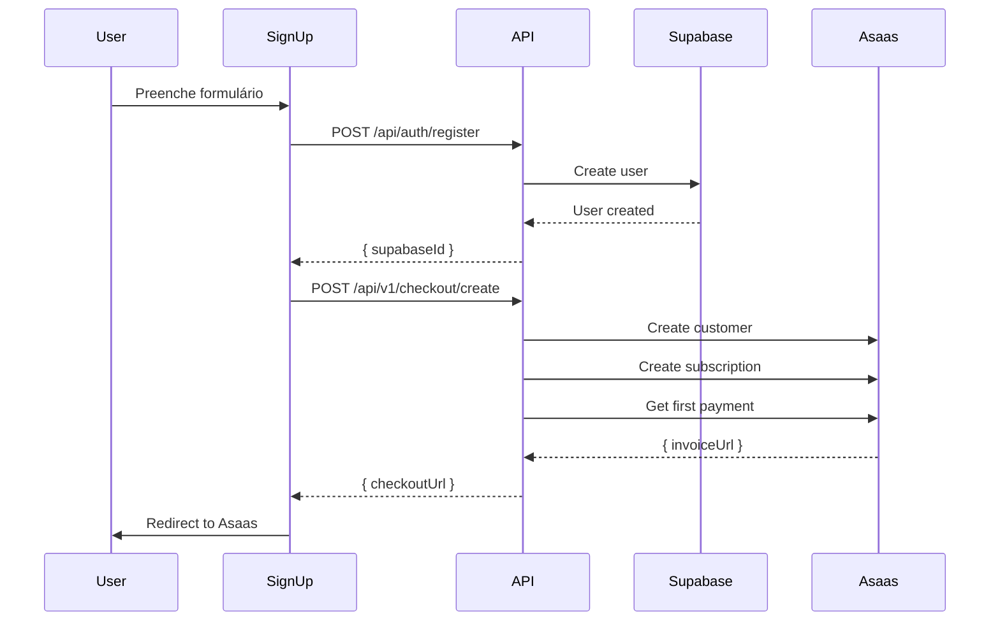

# 🛒 Fluxo de Checkout Asaas

> Documentação do fluxo de assinatura usando Checkout hospedado pelo Asaas

## ⚠️ ATENÇÃO: Callback Desabilitado (Limitação Asaas)

**Problema**: O Asaas requer que você configure um domínio na conta antes de usar callbacks (redirecionamento automático após pagamento).

**Erro**: `"Não há nenhum domínio configurado em sua conta. Cadastre um site em Minha Conta na aba Informações."`

**Solução Atual**: O callback está **desabilitado** no código. Após o pagamento:
1. Usuário permanece na página do Asaas
2. Deve **fechar manualmente** a aba do checkout
3. Acessar manualmente: `http://seusite.com/checkout-return`
4. A página verificará o status da assinatura

**Para Habilitar Callback** (Opcional):
1. Acesse o painel Asaas: https://sandbox.asaas.com/myAccount
2. Vá em **Minha Conta > Informações**
3. Configure um domínio (ex: `seusite.com`)
4. Descomente o código de callback no arquivo:
   ```typescript
   // app/api/useCases/subscriptions/CheckoutAsaasUseCase.ts
   callback: {
     successUrl: `${process.env.NEXT_PUBLIC_APP_URL}/checkout-return`,
     autoRedirect: true,
   }
   ```

## 📋 Visão Geral

O novo fluxo de assinatura redireciona o usuário para a página de checkout do Asaas (fatura) após o cadastro, eliminando a necessidade de capturar dados sensíveis de cartão de crédito na nossa aplicação.

## 🔄 Fluxo Completo

### 1. Sign-Up

**Arquivo**: `app/(auth)/sign-up/features/signUpContainer.tsx`



**Fluxo**:
1. Usuário preenche formulário de cadastro
2. Sistema cria conta no Supabase
3. Sistema chama `/api/v1/checkout/create` com dados do usuário
4. API cria cliente no Asaas (se não existir)
5. API cria assinatura MONTHLY de R$ 59,90
6. API obtém URL da primeira fatura (invoiceUrl)
7. Usuário é redirecionado para checkout Asaas

### 2. Checkout Asaas (CheckoutAsaasUseCase)

**Arquivo**: `app/api/useCases/subscriptions/CheckoutAsaasUseCase.ts`

**Método**: `createSubscriptionCheckout()`

```typescript
const subscriptionData = {
  customer: asaasCustomerId,
  billingType: 'UNDEFINED', // Cliente escolhe: PIX, Cartão ou Boleto
  nextDueDate: '2025-11-27', // 7 dias após criação
  value: 59.90,
  cycle: 'MONTHLY',
  description: 'Plano Manager Lead Flow',
  callback: {
    successUrl: 'https://seusite.com/checkout-return',
    autoRedirect: true,
  },
};
```

**Campos criados no Profile**:
- `asaasCustomerId`: ID do cliente Asaas
- `asaasSubscriptionId`: ID da assinatura
- `subscriptionNextDueDate`: Data do próximo vencimento
- `subscriptionCycle`: 'MONTHLY'
- `subscriptionStatus`: 'pending' (aguardando pagamento)
- `subscriptionPlan`: 'manager_base'

### 3. Pagamento no Asaas

**Página**: Checkout hospedado pelo Asaas

O cliente escolhe a forma de pagamento:
- **PIX**: QR Code instantâneo
- **Cartão de Crédito**: Processamento imediato
- **Boleto**: Geração de boleto

### 4. Webhook de Confirmação

**Arquivo**: `app/api/webhooks/asaas/route.ts`

Quando o pagamento é confirmado, Asaas envia webhook com evento:
- `PAYMENT_RECEIVED` (Boleto/PIX)
- `PAYMENT_CONFIRMED` (Cartão)

```typescript
// Processar ativação da assinatura
if (result.isPaid && body?.payment?.subscription) {
  const activationResult = await checkoutAsaasUseCase.processCheckoutPaid(
    body.payment.id
  );
  // Atualiza subscriptionStatus para 'active'
}
```

**Método**: `processCheckoutPaid()`
- Busca Profile pela assinatura
- Atualiza `subscriptionStatus` para 'active'
- Define `subscriptionStartDate` como data atual

### 5. Retorno ao Site

**Arquivo**: `app/checkout-return/page.tsx`

Após pagamento (sucesso ou pendente), Asaas redireciona para:
```
https://seusite.com/checkout-return
```

**Comportamento**:
1. Aguarda 2 segundos para webhook processar
2. Verifica status da assinatura via `/api/v1/profiles/{supabaseId}`
3. Mostra mensagem apropriada:
   - ✅ **Active**: "Assinatura confirmada!" → Dashboard
   - ⏳ **Pending**: "Pagamento pendente" → Dashboard (com aviso)
   - ❌ **Error**: "Erro ao verificar" → Login

## 📊 Estados da Assinatura

| Status | Descrição | Quando ocorre |
|--------|-----------|---------------|
| `null` | Sem assinatura | Usuário nunca assinou |
| `pending` | Aguardando pagamento | Após criar checkout |
| `active` | Assinatura ativa | Após webhook confirmar pagamento |
| `canceled` | Assinatura cancelada | Usuário cancelou |
| `expired` | Assinatura expirada | Falta de pagamento |

## 🔐 Segurança

### Vantagens do Checkout Asaas

1. **PCI Compliance**: Asaas é certificado PCI-DSS
2. **Sem captura de cartão**: Nunca manipulamos dados sensíveis
3. **Validação de cartão**: Asaas valida na hora
4. **Proteção contra fraude**: Sistema antifraude do Asaas
5. **3D Secure**: Autenticação adicional quando necessário

### Webhooks

- **Token de autenticação**: `asaas-access-token` header
- **HTTPS obrigatório**: Apenas URLs HTTPS aceitas
- **Retries automáticos**: Asaas tenta reenviar em caso de falha

## 🛠️ Configuração

### Variáveis de Ambiente

```env
# Asaas
ASAAS_API_KEY=aact_hmlg_...
ASAAS_URL=https://sandbox.asaas.com
ASAAS_ENV=sandbox

# App
NEXT_PUBLIC_APP_URL=http://localhost:3000

# Webhook (opcional)
ASAAS_WEBHOOK_TOKEN=seu_token_secreto
```

### Configurar Webhook no Asaas

1. Acesse: https://sandbox.asaas.com/webhooks
2. Adicione: `https://seusite.com/api/webhooks/asaas`
3. Eventos necessários:
   - `PAYMENT_RECEIVED`
   - `PAYMENT_CONFIRMED` 
   - `SUBSCRIPTION_CREATED`
   - `SUBSCRIPTION_UPDATED`

## 📝 Endpoints da API

### POST /api/v1/checkout/create

Cria checkout Asaas para assinatura.

**Request**:
```json
{
  "supabaseId": "uuid",
  "fullName": "Nome Completo",
  "email": "email@example.com",
  "phone": "(11) 99999-9999",
  "cpfCnpj": "123.456.789-00" // opcional
}
```

**Response**:
```json
{
  "isValid": true,
  "successMessages": ["Checkout criado com sucesso"],
  "errorMessages": [],
  "result": {
    "checkoutUrl": "https://www.asaas.com/i/...",
    "subscriptionId": "sub_...",
    "paymentId": "pay_...",
    "dueDate": "2025-11-27",
    "value": 59.90
  }
}
```

### POST /api/webhooks/asaas

Recebe notificações do Asaas.

**Headers**:
```
asaas-access-token: seu_token_secreto
Content-Type: application/json
```

**Body (exemplo)**:
```json
{
  "event": "PAYMENT_CONFIRMED",
  "payment": {
    "id": "pay_...",
    "subscription": "sub_...",
    "customer": "cus_...",
    "status": "CONFIRMED",
    "value": 59.90
  }
}
```

## 🧪 Testes

### Sandbox Asaas

**Cartão de teste (aprovado)**:
```
Número: 5162 3062 1937 8829
Validade: 05/2027
CVV: 318
Nome: Marcelo Almeida
```

**Cartão de teste (recusado)**:
```
Número: 5448 2802 6075 8460
Validade: 05/2027
CVV: 318
Nome: João Silva
```

**PIX**: 
- No sandbox, o pagamento é confirmado automaticamente após 30 segundos

**Boleto**:
- No sandbox, pode marcar como pago manualmente no painel Asaas

### Testar Fluxo Completo

1. **Sign-up**:
   ```bash
   # Acesse
   http://localhost:3000/sign-up
   
   # Preencha dados
   # Clique "Cadastrar"
   ```

2. **Checkout**:
   ```bash
   # Você será redirecionado para
   https://sandbox.asaas.com/i/...
   
   # Escolha forma de pagamento
   # Complete pagamento
   ```

3. **Webhook**:
   ```bash
   # Use ngrok para receber webhook local
   ngrok http 3000
   
   # Configure webhook no Asaas:
   https://seu-ngrok-url.ngrok.io/api/webhooks/asaas
   ```

4. **Retorno**:
   ```bash
   # Após pagamento, você volta para
   http://localhost:3000/checkout-return
   
   # Aguarda confirmação
   # Redireciona para dashboard
   ```

## 🔄 Próximos Passos

1. ✅ Implementar checkout Asaas
2. ✅ Webhook de confirmação
3. ✅ Página de retorno
4. ⏳ Testar em produção
5. ⏳ Configurar emails transacionais
6. ⏳ Implementar recuperação de pagamento
7. ⏳ Dashboard de assinatura ativa

## 📚 Referências

- [Documentação Asaas - Assinaturas](https://docs.asaas.com/docs/assinaturas)
- [Documentação Asaas - Webhooks](https://docs.asaas.com/docs/webhook-para-cobrancas)
- [Documentação Asaas - Checkout](https://docs.asaas.com/docs/redirecionamento-apos-o-pagamento)
