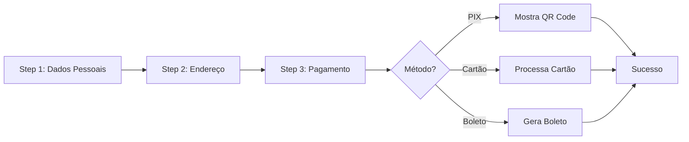

# 📝 Formulário Multi-Step de Assinatura

## 📋 Visão Geral

Formulário de assinatura redesenhado com fluxo multi-step, melhorando a experiência do usuário ao dividir o processo em etapas menores e mais gerenciáveis.

## ✨ Características

### 🎯 Fluxo em 3 Etapas

1. **Dados Pessoais** - Informações básicas do usuário
2. **Endereço** - Dados de localização e cobrança  
3. **Pagamento** - Método de pagamento com abas

### 🎨 Componentes Visuais

- **Indicador de Progresso**: Barra visual mostrando o progresso do usuário
- **Validação por Etapa**: Cada step valida seus campos antes de avançar
- **Abas de Pagamento**: PIX, Cartão de Crédito e Boleto
- **Navegação Intuitiva**: Botões Voltar/Continuar/Confirmar
- **Responsivo**: Adaptado para desktop e mobile

## 🏗️ Estrutura de Componentes

```
app/subscribe/features/components/
├── StepIndicator.tsx              # Indicador visual de progresso
├── SubscriptionFormMultiStep.tsx  # Formulário principal multi-step
├── PixPayment.tsx                 # Componente de pagamento PIX
├── SubscriptionSuccess.tsx        # Tela de sucesso
└── SubscriptionError.tsx          # Tela de erro
```

## 📊 Fluxo de Estados



## 🎨 UI/UX

### Indicador de Progresso

```
[1] ────────── [2] ────────── [3]
 ✓  Dados      ●  Endereço   ○  Pagamento
   Completo     Atual         Pendente
```

- **Verde**: Etapa completa (✓)
- **Azul**: Etapa atual (●)
- **Cinza**: Etapa pendente (○)

### Layout Responsivo

#### Desktop
```
┌──────────────────────────────────┐
│      [1] ──── [2] ──── [3]       │
│  ✓ Dados   ● Endereço  ○ Pag.   │
├──────────────────────────────────┤
│                                   │
│        Card com formulário        │
│                                   │
├──────────────────────────────────┤
│  [Voltar]         [Continuar]    │
└──────────────────────────────────┘
```

#### Mobile
```
┌────────────┐
│ ● 2/3      │
│  Endereço  │
├────────────┤
│            │
│   Form     │
│            │
├────────────┤
│ [← Voltar] │
│            │
│ [Continuar →]│
└────────────┘
```

## 🔧 Uso

### Exemplo Básico

```tsx
import { SubscriptionFormMultiStep } from './components/SubscriptionFormMultiStep';

<SubscriptionFormMultiStep
  onSuccess={(customerId, subscriptionId, paymentUrl, pix, paymentId) => {
    // Handle success
  }}
  onError={(error) => {
    // Handle error
  }}
/>
```

## 📝 Steps Detalhados

### Step 1: Dados Pessoais

**Campos**:
- Nome Completo (obrigatório)
- Email (obrigatório)
- CPF/CNPJ (obrigatório)
- Telefone (obrigatório)

**Validação**:
- Nome: mínimo 2 caracteres
- Email: formato válido
- CPF/CNPJ: validação de formato
- Telefone: formato brasileiro

### Step 2: Endereço

**Campos**:
- CEP (obrigatório)
- Endereço (obrigatório)
- Número (obrigatório)
- Complemento (opcional)
- Bairro (obrigatório)
- Cidade (obrigatório)
- Estado - UF (obrigatório, 2 caracteres)

**Validação**:
- CEP: formato 00000-000
- Estado: exatamente 2 letras

### Step 3: Pagamento

**Métodos Disponíveis** (em abas):

#### 1. PIX
- Sem campos adicionais
- Mostra preview do que acontecerá
- Após submissão, exibe QR Code

#### 2. Cartão de Crédito
- Nome no Cartão
- Número do Cartão
- Mês de Validade
- Ano de Validade
- CVV

#### 3. Boleto
- Sem campos adicionais
- Mostra preview do que acontecerá
- Após submissão, gera boleto

## 🎯 Validação

### Validação por Etapa

Cada step valida apenas seus campos antes de permitir avançar:

```typescript
const validateStep = async (step: number): Promise<boolean> => {
  let fieldsToValidate: (keyof SubscriptionFormSchema)[] = [];

  switch (step) {
    case 1:
      fieldsToValidate = ['fullName', 'email', 'cpfCnpj', 'phone'];
      break;
    case 2:
      fieldsToValidate = ['postalCode', 'address', 'addressNumber', 'province', 'city', 'state'];
      break;
    case 3:
      fieldsToValidate = ['billingType'];
      if (billingType === 'CREDIT_CARD') {
        fieldsToValidate.push('creditCard');
      }
      break;
  }

  const result = await form.trigger(fieldsToValidate as any);
  return result;
};
```

### Validação Final

Ao clicar em "Confirmar Assinatura", todos os campos são validados novamente usando o schema Zod completo.

## 🎨 Componentes shadcn/ui Utilizados

- `Card` - Container de cada step
- `Tabs` - Métodos de pagamento
- `Input` - Campos de texto
- `Button` - Navegação e submit
- `Form` - Wrapper react-hook-form
- `FormField` - Campos controlados
- `FormLabel` - Labels acessíveis
- `FormMessage` - Mensagens de erro

## 📱 Responsividade

### Breakpoints

- **Mobile** (`< 640px`): 1 coluna, labels completos ocultos
- **Tablet** (`640px - 768px`): 2 colunas em alguns campos
- **Desktop** (`> 768px`): Layout completo com 2 colunas

### Adaptações Mobile

1. **Indicador**: Mostra apenas step atual abaixo dos círculos
2. **Grid**: Campos empilhados verticalmente
3. **Botões**: Largura total
4. **Tabs**: Stack vertical se necessário

## 🔄 Fluxo de Navegação

```typescript
// Avançar
handleNext() → validateStep() → setCurrentStep(current + 1)

// Voltar
handleBack() → setCurrentStep(current - 1)

// Submeter
onSubmit() → validateAll() → createSubscription() → onSuccess/onError
```

## 🎯 Experiência do Usuário

### Feedback Visual

1. **Progresso**: Usuário sempre sabe em que etapa está
2. **Validação**: Erros mostrados em tempo real
3. **Loading**: Indicador durante processamento
4. **Sucesso**: Tela dedicada com próximos passos

### Acessibilidade

- ✅ Labels associadas aos inputs
- ✅ Mensagens de erro com aria-live
- ✅ Navegação por teclado
- ✅ Focus trap no modal
- ✅ Cores com contraste adequado

## 🚀 Melhorias Futuras

- [ ] Auto-save de rascunho no localStorage
- [ ] Preview de resumo antes de confirmar
- [ ] Consulta de CEP automática (ViaCEP)
- [ ] Máscara de inputs (CPF, telefone, CEP)
- [ ] Animações de transição entre steps
- [ ] Indicador de força de senha (se adicionar)
- [ ] Modo offline com sync posterior

## 📊 Métricas Sugeridas

- Taxa de conclusão por step
- Tempo médio em cada etapa
- Taxa de erro por campo
- Método de pagamento mais usado
- Taxa de abandono por etapa

---

**Desenvolvido por**: Matheus Willock  
**Última atualização**: Outubro 2025
