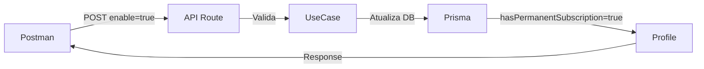

# 👑 API de Assinatura Permanente (Vitalícia)

> Documentação do endpoint para tornar usuários vitalícios na plataforma

## 📋 Visão Geral

Esta API permite transformar usuários em **vitalícios**, fazendo com que eles **nunca mais passem por validação de assinatura** no Asaas.

### ✨ Características

- ✅ **Bypass total** da validação de assinatura Asaas
- ✅ **Permanente** até ser desativado manualmente
- ✅ **Simples** de usar via Postman ou qualquer cliente HTTP
- ✅ **Seguro** - requer apenas o Profile ID

---

## 🚀 Endpoint

```
POST /api/v1/profiles/permanent-subscription
```

### 📍 URL Completa

**Produção:**
```
https://www.corretorstudio.com.br/api/v1/profiles/permanent-subscription
```

**Desenvolvimento:**
```
http://localhost:3000/api/v1/profiles/permanent-subscription
```

---

## 📥 Requisição

### Headers

```http
Content-Type: application/json
```

### Body

```json
{
  "profileId": "a1b2c3d4-e5f6-7890-abcd-ef1234567890",
  "enable": true
}
```

**Parâmetros:**

| Campo | Tipo | Obrigatório | Descrição |
|-------|------|-------------|-----------|
| `profileId` | string (UUID) | ✅ Sim | ID do profile do usuário |
| `enable` | boolean | ✅ Sim | `true` para ativar, `false` para desativar |

---

## 📤 Resposta

### Sucesso (200)

```json
{
  "isValid": true,
  "successMessages": ["Assinatura permanente ativada com sucesso"],
  "errorMessages": [],
  "result": {
    "id": "a1b2c3d4-e5f6-7890-abcd-ef1234567890",
    "email": "usuario@exemplo.com",
    "fullName": "João da Silva",
    "hasPermanentSubscription": true
  }
}
```

### Erro (400)

```json
{
  "isValid": false,
  "successMessages": [],
  "errorMessages": ["Profile não encontrado"],
  "result": null
}
```

---

## 🧪 Testando com Postman

### 1️⃣ Importar Collection

1. Abra o Postman
2. **Import** → **File**
3. Selecione: `/postman/Permanent-Subscription-API-Collection.json`

### 2️⃣ Configurar Variáveis

No Postman, configure as variáveis de ambiente:

```
BASE_URL = https://www.corretorstudio.com.br
PROFILE_ID = [cole o ID do profile aqui]
```

### 3️⃣ Obter o Profile ID

**Opção 1: Pela URL**
- Acesse o sistema logado
- Na URL, copie o `supabaseId`: `https://www.corretorstudio.com.br/{supabaseId}/dashboard`
- Use este ID como `PROFILE_ID`

**Opção 2: Pelo Prisma Studio**
```bash
bun run prisma:studio
```
- Abra a tabela `profiles`
- Copie o `id` do usuário desejado

**Opção 3: Pela tela de Manager Users**
- Acesse Manager Users
- Na tabela, o ID do usuário está disponível nos logs ao interagir

### 4️⃣ Executar Request

1. Selecione **"Ativar Assinatura Permanente"**
2. Clique em **Send**
3. Verifique a resposta

---

## 💡 Exemplos de Uso

### Ativar Assinatura Permanente

```bash
curl -X POST \
  https://www.corretorstudio.com.br/api/v1/profiles/permanent-subscription \
  -H 'Content-Type: application/json' \
  -d '{
    "profileId": "a1b2c3d4-e5f6-7890-abcd-ef1234567890",
    "enable": true
  }'
```

### Desativar Assinatura Permanente

```bash
curl -X POST \
  https://www.corretorstudio.com.br/api/v1/profiles/permanent-subscription \
  -H 'Content-Type: application/json' \
  -d '{
    "profileId": "a1b2c3d4-e5f6-7890-abcd-ef1234567890",
    "enable": false
  }'
```

---

## 🔍 Como Funciona

### Fluxo de Ativação



### Impacto no Sistema

**Antes** (usuário normal):
```typescript
// Sistema valida assinatura Asaas
if (!profile.asaasSubscriptionId || status !== 'ACTIVE') {
  // Bloqueia acesso
}
```

**Depois** (usuário vitalício):
```typescript
// Sistema faz bypass da validação
if (profile.hasPermanentSubscription) {
  // Acesso liberado permanentemente ✅
}
```

---

## ⚠️ Considerações Importantes

### ✅ Boas Práticas

- **Documente** quais usuários são vitalícios e por quê
- **Monitore** o uso desta funcionalidade
- **Revise** periodicamente quem tem acesso vitalício

### 🚨 Atenção

- Esta ação **não pode ser desfeita automaticamente**
- Usuário vitalício **não gera receita** no Asaas
- Use apenas para **casos especiais**:
  - Parceiros estratégicos
  - Funcionários da empresa
  - Testes internos permanentes
  - Usuários compensados por outros meios

---

## 🔐 Segurança

### Quem Pode Usar?

Qualquer pessoa com:
- Acesso ao Postman/cURL
- Conhecimento do Profile ID

**Recomendação**: Proteja o acesso a esta API em produção através de:
- API Key
- Token de autenticação
- Whitelist de IPs

*(Implementação futura conforme necessidade)*

---

## 📊 Monitoramento

### Verificar Usuários Vitalícios

**Via Prisma Studio:**
```bash
bun run prisma:studio
```
- Abra tabela `profiles`
- Filtre por `hasPermanentSubscription = true`

**Via SQL:**
```sql
SELECT 
  id,
  email,
  fullName,
  role,
  hasPermanentSubscription,
  createdAt
FROM "profiles"
WHERE "hasPermanentSubscription" = true
ORDER BY createdAt DESC;
```

---

## 🐛 Troubleshooting

### Erro: "Profile não encontrado"

**Causa**: Profile ID inválido ou inexistente

**Solução**:
- Verifique se o ID está correto
- Confirme que o profile existe no banco
- Use Prisma Studio para validar

### Erro: "Campo 'enable' deve ser boolean"

**Causa**: Valor de `enable` não é boolean

**Solução**:
```json
// ❌ Errado
{"profileId": "...", "enable": "true"}
{"profileId": "...", "enable": 1}

// ✅ Correto
{"profileId": "...", "enable": true}
{"profileId": "...", "enable": false}
```

### Erro: "Campo 'profileId' é obrigatório"

**Causa**: profileId não foi enviado no body

**Solução**:
```json
// ❌ Errado
{"enable": true}

// ✅ Correto
{"profileId": "a1b2c3d4-...", "enable": true}
```

### Usuário continua bloqueado após ativação

**Causa**: Cache do middleware ou sessão não atualizada

**Solução**:
1. Faça logout do usuário
2. Limpe cookies do navegador
3. Faça login novamente
4. Ou aguarde ~5 minutos para cache expirar

---

## 📝 Changelog

| Versão | Data | Mudanças |
|--------|------|----------|
| 1.0.0 | 04/01/2026 | Lançamento inicial |

---

## 📞 Suporte

Em caso de dúvidas ou problemas:

1. Verifique os logs do servidor (`bun run dev`)
2. Consulte este documento
3. Entre em contato com o time de desenvolvimento

---

**Última atualização**: 04 de Janeiro de 2026
