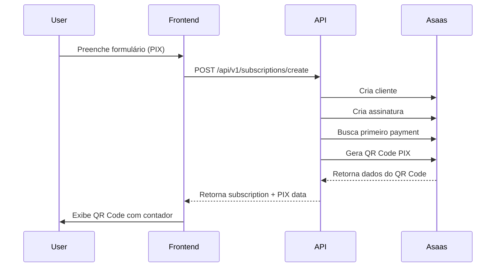
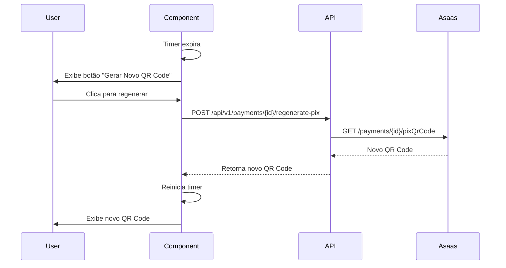
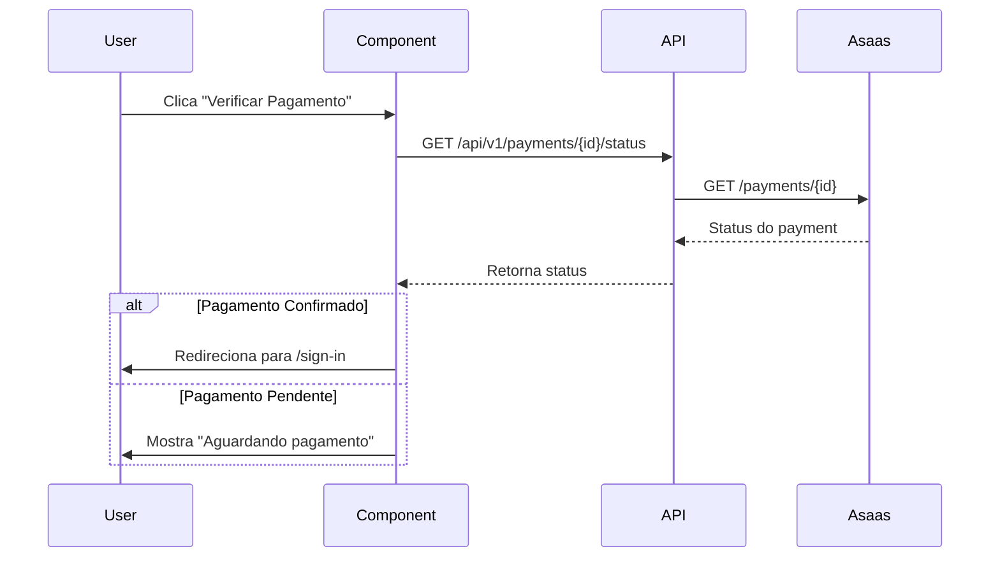

# 💳 Implementação de Pagamento PIX

## 📋 Visão Geral

Este documento descreve a implementação completa do fluxo de pagamento via PIX na plataforma Lead Flow, incluindo geração de QR Code, contador de expiração e regeneração automática.

## 🎯 Funcionalidades

### ✨ Principais Features

- **QR Code Dinâmico**: Geração automática de QR Code PIX para cada assinatura
- **Contador de Expiração**: Timer em tempo real mostrando o tempo restante do QR Code
- **Código Copia e Cola**: Opção de copiar código PIX para pagamento manual
- **Regeneração Automática**: Gera novo QR Code quando o anterior expira
- **Verificação de Pagamento**: Botão para verificar status do pagamento em tempo real
- **Feedback Visual**: Indicadores visuais de status (pendente, expirado, confirmado)

## 🏗️ Arquitetura

### Componentes Frontend

```
app/subscribe/features/components/
├── PixPayment.tsx           # Componente principal de pagamento PIX
├── SubscriptionForm.tsx     # Formulário de assinatura
└── SubscriptionSuccess.tsx  # Tela de sucesso com integração PIX
```

### Endpoints da API

```
app/api/v1/
├── subscriptions/create/           # Cria assinatura e retorna dados PIX
├── payments/[id]/regenerate-pix/   # Regenera QR Code expirado
└── payments/[id]/status/           # Verifica status do pagamento
```

## 🔧 Uso do Componente PixPayment

### Props

```typescript
interface PixPaymentProps {
  encodedImage: string;      // Base64 do QR Code
  payload: string;           // Código copia e cola
  expirationDate: string;    // Data de expiração do QR Code
  paymentId: string;         // ID do pagamento para regenerar
  onPaymentConfirmed?: () => void;  // Callback quando pagamento confirmado
  onQrCodeExpired?: () => void;     // Callback quando QR Code expira
}
```

### Exemplo de Uso

```tsx
<PixPayment
  encodedImage={qrCodeBase64}
  payload="00020126580014..."
  expirationDate="2025-10-09T23:59:59"
  paymentId="pay_123456789"
  onPaymentConfirmed={() => {
    router.push('/dashboard');
  }}
  onQrCodeExpired={() => {
    console.log('QR Code expirou');
  }}
/>
```

## 📡 Fluxo de Dados

### 1. Criação da Assinatura PIX



### 2. Regeneração de QR Code



### 3. Verificação de Pagamento



## 🔄 Estados do QR Code

### 1. **Ativo** (Tempo restante > 0)
- QR Code visível e escaneável
- Timer mostrando tempo restante (MM:SS)
- Botão "Verificar Pagamento" ativo
- Código copia e cola disponível

### 2. **Expirado** (Tempo restante = 0)
- QR Code ocultado
- Mensagem de expiração
- Botão "Gerar Novo QR Code" em destaque
- Indicador visual de erro

### 3. **Confirmado** (Pagamento recebido)
- Redirecionamento automático para /sign-in
- Toast de sucesso
- Atualização do status no banco

## ⏱️ Timer de Expiração

### Implementação

```typescript
useEffect(() => {
  const calculateTimeRemaining = () => {
    const now = new Date().getTime();
    const expiration = new Date(expirationDate).getTime();
    const diff = expiration - now;

    if (diff <= 0) {
      setIsExpired(true);
      setTimeRemaining(0);
      onQrCodeExpired?.();
      return;
    }

    setTimeRemaining(Math.floor(diff / 1000));
  };

  calculateTimeRemaining();
  const interval = setInterval(calculateTimeRemaining, 1000);

  return () => clearInterval(interval);
}, [expirationDate]);
```

### Formato do Timer

- **Formato**: `MM:SS` (Minutos:Segundos)
- **Atualização**: A cada 1 segundo
- **Visual**: 
  - Verde quando > 5 minutos
  - Amarelo quando 1-5 minutos
  - Vermelho quando < 1 minuto ou expirado

## 🎨 UI/UX

### Componentes Visuais

1. **Card Principal**
   - Header com ícone PIX
   - Timer de expiração em destaque
   - QR Code centralizado

2. **Timer**
   ```tsx
   <div className="flex items-center justify-center gap-2 p-3 rounded-lg bg-muted">
     <Timer className="h-5 w-5 text-primary" />
     <span className="text-lg font-mono font-semibold">
       {formatTime(timeRemaining)}
     </span>
   </div>
   ```

3. **QR Code**
   - Imagem Base64 em alta resolução
   - Fundo branco para melhor leitura
   - Tamanho: 256x256px

4. **Código Copia e Cola**
   - Campo com scroll horizontal
   - Botão de copiar integrado
   - Feedback visual ao copiar

## 🔔 Notificações

### Toast Messages

```typescript
// Sucesso ao copiar
toast.success('Código Pix copiado!', {
  description: 'Cole no seu aplicativo de pagamento',
});

// QR Code regenerado
toast.success('QR Code regenerado!', {
  description: 'Um novo código foi gerado para você',
});

// Pagamento confirmado
toast.success('Pagamento confirmado!', {
  description: 'Seu pagamento foi processado com sucesso',
});
```

## 🧪 Testes

### Cenários de Teste

1. **Criação de Assinatura PIX**
   ```bash
   curl -X POST http://localhost:3000/api/v1/subscriptions/create \
     -H "Content-Type: application/json" \
     -d '{
       "fullName": "João Silva",
       "email": "joao@example.com",
       "cpfCnpj": "12345678900",
       "billingType": "PIX",
       ...
     }'
   ```

2. **Regenerar QR Code**
   ```bash
   curl -X POST http://localhost:3000/api/v1/payments/{paymentId}/regenerate-pix
   ```

3. **Verificar Status**
   ```bash
   curl -X GET http://localhost:3000/api/v1/payments/{paymentId}/status
   ```

### Ambiente Sandbox Asaas

- URL: `https://sandbox.asaas.com/api/v3`
- Documentação: https://docs.asaas.com/docs/sandbox
- QR Code expira em 24h no sandbox (sem chave PIX)
- QR Code expira em 12 meses no produção (com chave PIX)

## 📚 Referências

### Documentação Asaas

- [Criação de Cobrança PIX](https://docs.asaas.com/reference/criar-nova-cobranca-com-dados-resumidos-na-resposta)
- [Obter QR Code PIX](https://docs.asaas.com/reference/obter-qr-code-para-pagamentos-via-pix)
- [Consultar Pagamento](https://docs.asaas.com/reference/recuperar-uma-unica-cobranca)

### Componentes UI

- [shadcn/ui Card](https://ui.shadcn.com/docs/components/card)
- [shadcn/ui Button](https://ui.shadcn.com/docs/components/button)
- [Sonner Toast](https://sonner.emilkowal.ski/)

## 🚀 Melhorias Futuras

- [ ] Webhook para atualização automática de status
- [ ] Notificação push quando pagamento confirmado
- [ ] Histórico de tentativas de pagamento
- [ ] Suporte a múltiplos QR Codes simultâneos
- [ ] Analytics de taxa de conversão PIX
- [ ] Modo escuro otimizado para QR Code

## 🐛 Troubleshooting

### QR Code não aparece

1. Verificar se a chave PIX está cadastrada no Asaas
2. Conferir logs do servidor para erros na API
3. Validar se o payment foi criado corretamente

### Timer não funciona

1. Verificar se `expirationDate` está no formato ISO 8601
2. Confirmar que o timezone está correto
3. Testar o cálculo do tempo localmente

### Pagamento não confirma

1. Usar endpoint de status para verificar
2. Conferir webhooks do Asaas
3. Validar logs de erro no console

---

**Desenvolvido por**: Matheus Willock  
**Última atualização**: Outubro 2025
