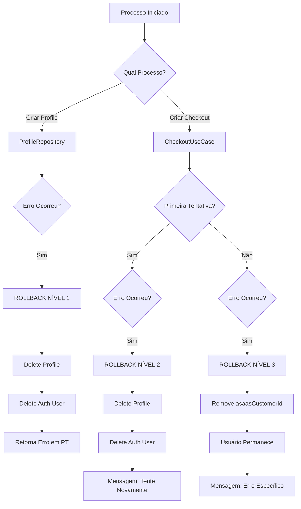

# 🔄 Estratégia de Rollback - Lead Flow

## 📋 Visão Geral

O sistema implementa rollback automático em **todos os processos** iniciados pela criação de novos usuários para evitar dados órfãos.

## 🎯 Objetivo

**Garantir que nenhum usuário fique em estado órfão** quando qualquer parte do processo de registro falhar.

## 🏗️ Arquitetura de Rollback

```
┌─────────────────────────────────────────────────────────────┐
│                   PROCESSO DE REGISTRO                       │
├─────────────────────────────────────────────────────────────┤
│                                                              │
│  1. Criar Usuário (Supabase Auth)                           │
│  2. Criar Profile (Database)                                │
│  3. Criar Cliente Asaas (Payment Gateway)                   │
│  4. Criar Checkout/Assinatura (Payment)                     │
│                                                              │
│  ❌ SE FALHAR EM QUALQUER PONTO:                            │
│     → Rollback de TODOS os passos anteriores                │
│                                                              │
└─────────────────────────────────────────────────────────────┘
```

## 🔴 Nível 1: Rollback no Registro de Profile

**Localização**: `app/api/infra/data/repositories/profile/ProfileRepository.ts`

### Quando acontece:
Durante `createProfile()` quando ocorre erro na criação do profile ou usuário Auth.

### O que é desfeito:
1. ✅ Profile deletado do banco de dados
2. ✅ Usuário deletado do Supabase Auth

### Exemplo de Cenário:
```typescript
try {
  // 1. Criar usuário no Supabase Auth
  const { data: authUser } = await supabase.auth.admin.createUser({...});
  
  // 2. Criar profile no banco
  const profile = await prisma.profile.create({...});
  
} catch (error) {
  // ❌ Erro detectado
  
  // 🔄 ROLLBACK:
  if (profileCreated) {
    await prisma.profile.delete({ where: { id: profileId }});
  }
  
  if (authUserCreated) {
    await supabase.auth.admin.deleteUser(supabaseUserId);
  }
}
```

### Mensagens de Erro (Português):
- "Este e-mail já está cadastrado"
- "Este telefone já está cadastrado"
- "Erro ao criar conta de acesso"
- "Erro ao criar conta. Tente novamente em alguns instantes."

---

## 🔴 Nível 2: Rollback Completo no Checkout (Primeira Tentativa)

**Localização**: `app/api/useCases/subscriptions/CheckoutAsaasUseCase.ts`

### Quando acontece:
Durante `createSubscriptionCheckout()` na **primeira tentativa** de checkout após registro.

### Critério de Primeira Tentativa:
```typescript
isFirstCheckoutAttempt = !profile.asaasCustomerId && !profile.subscriptionId
```

### O que é desfeito:
1. ✅ Cliente Asaas (se foi criado)
2. ✅ Profile deletado do banco de dados
3. ✅ Usuário deletado do Supabase Auth

### Exemplo de Cenário:
```typescript
// Usuário acabou de se registrar
// Profile criado: ✅
// Auth criado: ✅
// asaasCustomerId: null
// subscriptionId: null

try {
  // 1. Criar cliente Asaas
  const customer = await asaasFetch('/customers', {...});
  
  // 2. Criar assinatura
  const subscription = await asaasFetch('/subscriptions', {...});
  
} catch (error) {
  // ❌ Erro: Domínio não configurado
  
  if (isFirstCheckoutAttempt) {
    // 🔄 ROLLBACK COMPLETO:
    await prisma.profile.delete({ where: { id: profileId }});
    await supabase.auth.admin.deleteUser(supabaseId);
  }
}
```

### Mensagens de Erro:
- "Erro no processo de registro. Por favor, tente criar sua conta novamente."
- "Detalhes: [mensagem específica do erro]"

---

## 🟡 Nível 3: Rollback Parcial no Checkout (Tentativas Subsequentes)

**Localização**: `app/api/useCases/subscriptions/CheckoutAsaasUseCase.ts`

### Quando acontece:
Durante `createSubscriptionCheckout()` quando **NÃO** é a primeira tentativa.

### Critério de Tentativa Subsequente:
```typescript
isFirstCheckoutAttempt = false // Já tem asaasCustomerId ou subscriptionId
```

### O que é desfeito:
1. ✅ Apenas `asaasCustomerId` removido do profile (se foi criado nesta tentativa)
2. ❌ Usuário **permanece** no sistema

### Exemplo de Cenário:
```typescript
// Usuário já existe
// Profile criado: ✅
// Auth criado: ✅
// asaasCustomerId: "cus_xxxxx" (já existia)
// subscriptionId: null

try {
  // Criar assinatura
  const subscription = await asaasFetch('/subscriptions', {...});
  
} catch (error) {
  // ❌ Erro: Domínio não configurado
  
  if (!isFirstCheckoutAttempt && customerWasCreated) {
    // 🔄 ROLLBACK PARCIAL:
    await prisma.profile.update({
      where: { id: profileId },
      data: { asaasCustomerId: null }
    });
  }
  
  // ✅ Usuário permanece no sistema
}
```

### Mensagens de Erro:
- "Erro ao criar checkout: [mensagem específica]"

---

## 📊 Tabela Comparativa

| Nível | Onde | Quando | O que Desfaz | Usuário Fica? |
|-------|------|--------|--------------|---------------|
| **1. Profile** | ProfileRepository | Erro ao criar profile/auth | Profile + Auth | ❌ Não |
| **2. Checkout Completo** | CheckoutUseCase | Primeira tentativa falha | Cliente Asaas + Profile + Auth | ❌ Não |
| **3. Checkout Parcial** | CheckoutUseCase | Tentativas posteriores | Apenas asaasCustomerId | ✅ Sim |

---

## 🔍 Como Identificar Cada Nível

### Debug Logs:

**Nível 1 (Profile)**:
```
🔄 [ProfileRepository] Rollback: Deletando profile criado...
🔄 [ProfileRepository] Rollback: Deletando usuário do Supabase Auth...
```

**Nível 2 (Checkout Completo)**:
```
🆕 [createSubscriptionCheckout] Primeira tentativa de checkout - rollback ativo
⚠️ [createSubscriptionCheckout] Primeira tentativa falhou - iniciando rollback completo
🗑️ [createSubscriptionCheckout] Rollback: Deletando profile do banco...
🗑️ [createSubscriptionCheckout] Rollback: Deletando usuário do Supabase Auth...
```

**Nível 3 (Checkout Parcial)**:
```
🔄 [createSubscriptionCheckout] Rollback parcial: Removendo asaasCustomerId...
```

---

## 🎯 Fluxo de Decisão do Rollback



---

## 🛡️ Garantias de Segurança

### ✅ O que ESTÁ protegido:

1. **Registro de novo usuário falhando** → Rollback completo (Nível 1)
2. **Primeiro checkout falhando** → Rollback completo (Nível 2)
3. **Checkouts subsequentes falhando** → Rollback parcial (Nível 3)

### ⚠️ O que NÃO está protegido (por design):

1. **Usuário já registrado com sucesso anteriormente** → Permanece no sistema mesmo se checkout falhar
2. **Processos após pagamento confirmado** → Não há rollback (pagamento já foi processado)

---

## 🧪 Cenários de Teste

### Teste 1: Erro ao Criar Profile
```bash
# Simular: CPF duplicado
POST /api/v1/profiles/register
{
  "cpfCnpj": "111.111.111-11" # Já existe
}

# Esperado:
# - Profile não criado
# - Auth não criado
# - Mensagem: "Este CPF já está cadastrado"
```

### Teste 2: Erro no Primeiro Checkout
```bash
# 1. Criar usuário com sucesso
POST /api/v1/profiles/register
# ✅ Sucesso

# 2. Tentar checkout SEM configurar domínio Asaas
POST /api/v1/checkout/create

# Esperado:
# - Profile deletado
# - Auth deletado
# - Mensagem: "Erro no processo de registro. Tente novamente."
```

### Teste 3: Erro em Checkout Subsequente
```bash
# 1. Usuário já existe e já tentou checkout antes
# profile.asaasCustomerId = "cus_xxxxx"

# 2. Tentar criar novo checkout
POST /api/v1/checkout/create

# Esperado:
# - Profile PERMANECE
# - Auth PERMANECE
# - Apenas asaasCustomerId limpo
# - Mensagem: "Erro ao criar checkout: [detalhes]"
```

---

## 📝 Boas Práticas

### Para Desenvolvedores:

1. **Sempre use try-catch** em processos que criam/modificam usuários
2. **Rastreie o estado** com flags como `isFirstAttempt`, `wasCreated`
3. **Limpe recursos na ordem inversa** da criação
4. **Log detalhado** de cada passo do rollback
5. **Mensagens em português** para usuários finais

### Para QA/Testes:

1. Testar **todos os níveis** de rollback
2. Verificar **banco de dados** após cada teste
3. Confirmar **usuário Auth** foi removido
4. Validar **mensagens de erro** estão em português
5. Testar **fluxo completo** de registro → checkout

---

## 🔗 Arquivos Relacionados

- [ProfileRepository.ts](../app/api/infra/data/repositories/profile/ProfileRepository.ts)
- [CheckoutAsaasUseCase.ts](../app/api/useCases/subscriptions/CheckoutAsaasUseCase.ts)
- [ASAAS_DOMAIN_CONFIG.md](./ASAAS_DOMAIN_CONFIG.md)
- [ARCHITECTURE_GUIDE.md](./ARCHITECTURE_GUIDE.md)

---

## 📊 Métricas de Sucesso

### Indicadores de Rollback Funcionando:

- ✅ Zero usuários órfãos no banco após erros
- ✅ Zero registros no Supabase Auth sem profile correspondente
- ✅ Logs claros de rollback em desenvolvimento
- ✅ Usuários conseguem re-tentar registro sem conflitos
- ✅ Mensagens de erro claras e acionáveis

---

**Última Atualização**: Janeiro 2026  
**Versão**: 2.0 - Rollback Completo Implementado
