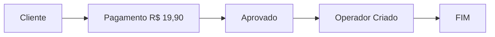
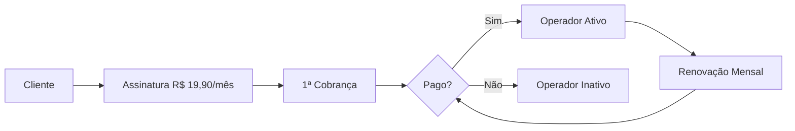

# 🔄 Fluxo de Assinaturas - Lead Flow

> Documentação completa sobre o sistema de assinaturas recorrentes com Asaas

## 📋 Índice

1. [Visão Geral](#visão-geral)
2. [Diferenças: Payment vs Subscription](#diferenças-payment-vs-subscription)
3. [Fluxo de Pagamento com PIX](#fluxo-de-pagamento-com-pix)
4. [Fluxo de Pagamento com Cartão de Crédito](#fluxo-de-pagamento-com-cartão-de-crédito)
5. [Estrutura do Banco de Dados](#estrutura-do-banco-de-dados)
6. [Webhooks](#webhooks)
7. [Monitoramento e Renovação](#monitoramento-e-renovação)

---

## 🎯 Visão Geral

A partir desta implementação, o **Lead Flow** utiliza **assinaturas recorrentes** ao invés de pagamentos únicos para adicionar operadores. Isso significa que:

- **Antes**: Pagamento único de R$ 19,90 por operador adicional
- **Agora**: Assinatura mensal de R$ 19,90 cobrada automaticamente todo mês

### Por que mudar para assinaturas?

1. **Recorrência automática**: Operadores permanecem ativos enquanto a assinatura estiver paga
2. **Controle financeiro**: Manager paga apenas pelos operadores que utiliza mensalmente
3. **Facilidade de gestão**: Cancelar assinatura = desativar operador automaticamente
4. **Conformidade com modelo SaaS**: Padrão da indústria para software como serviço

---

## ⚖️ Diferenças: Payment vs Subscription

### Payment Único (Antigo)



**Características:**
- ✅ Pagamento único
- ❌ Sem renovação automática
- ❌ Operador permanece ativo indefinidamente após pagamento
- ❌ Difícil controlar inadimplência

### Subscription (Novo)



**Características:**
- ✅ Cobrança recorrente automática
- ✅ Renovação mensal sem intervenção
- ✅ Operador ativo enquanto assinatura paga
- ✅ Cancelamento automático em caso de inadimplência
- ✅ Fácil upgrade/downgrade de plano

---

## 💳 Fluxo de Pagamento com PIX

### 1. Criação da Assinatura

```typescript
// Manager solicita adicionar operador
POST /api/v1/operators/add-payment
{
  "operatorData": {
    "name": "João Silva",
    "email": "joao@example.com",
    "role": "operator"
  },
  "paymentMethod": "PIX",
  "managerId": "uuid-manager"
}
```

**O que acontece:**

1. **Backend valida manager** → Verifica se tem assinatura ativa
2. **Cria assinatura no Asaas**:
   ```typescript
   POST https://sandbox.asaas.com/api/v3/subscriptions
   {
     "customer": "cus_MANAGER_ID",
     "billingType": "PIX",
     "value": 19.90,
     "cycle": "MONTHLY",
     "nextDueDate": "2025-11-24", // 7 dias a partir de hoje
     "description": "Assinatura operador: João Silva"
   }
   ```
3. **Asaas gera primeira cobrança** → 40 dias antes do vencimento (conforme doc)
4. **Backend busca cobrança gerada** → `GET /v3/subscriptions/{id}/payments`
5. **Backend busca QR Code PIX** → `GET /v3/payments/{paymentId}/pixQrCode`
6. **Salva `PendingOperator`** no banco:
   ```typescript
   {
     managerId: "uuid-manager",
     name: "João Silva",
     email: "joao@example.com",
     role: "operator",
     subscriptionId: "sub_ABC123", // ID da assinatura
     paymentId: "pay_XYZ789",      // ID da primeira cobrança
     paymentStatus: "PENDING",
     paymentMethod: "PIX"
   }
   ```

**Retorno para o Frontend:**

```typescript
{
  "isValid": true,
  "successMessages": ["Assinatura criada com sucesso. Aguardando pagamento da primeira cobrança via PIX."],
  "result": {
    "paymentId": "pay_XYZ789",
    "paymentStatus": "PENDING",
    "paymentMethod": "PIX",
    "dueDate": "2025-11-24",
    "pixQrCode": "data:image/png;base64,iVBORw0KG...",
    "pixCopyPaste": "00020126580014...",
    "operatorCreated": false
  }
}
```

### 2. Pagamento via PIX

**Cliente escaneia QR Code ou copia código PIX**

### 3. Webhook Confirma Pagamento

```typescript
// Asaas envia webhook
POST /api/webhooks/asaas
{
  "event": "PAYMENT_RECEIVED",
  "payment": {
    "id": "pay_XYZ789",
    "subscription": "sub_ABC123", // ← Campo importante!
    "status": "RECEIVED",
    "value": 19.90,
    "customer": "cus_MANAGER_ID"
  }
}
```

**O que acontece:**

1. **Webhook identifica subscription** → `payment.subscription` existe
2. **Busca `PendingOperator`** por `subscriptionId`
3. **Cria usuário Supabase** com email/senha temporária
4. **Cria `Profile` no banco**:
   ```typescript
   {
     supabaseId: "uuid-supabase",
     fullName: "João Silva",
     email: "joao@example.com",
     role: "operator",
     managerId: "uuid-manager",
     asaasSubscriptionId: "sub_ABC123",
     subscriptionCycle: "MONTHLY",
     subscriptionNextDueDate: "2025-12-24" // próxima cobrança
   }
   ```
5. **Atualiza `PendingOperator`**:
   ```typescript
   {
     operatorCreated: true,
     operatorId: "uuid-profile",
     paymentStatus: "CONFIRMED"
   }
   ```
6. **Incrementa contador** do manager: `operatorCount += 1`

### 4. Renovação Automática

**Todo mês, Asaas gera nova cobrança automaticamente:**

- **40 dias antes do vencimento**: Cobrança criada no sistema
- **10 dias antes**: Cliente recebe notificação (configurável)
- **Data de vencimento**: Cliente deve pagar
- **Webhook `PAYMENT_RECEIVED`**: Confirma pagamento e mantém operador ativo

**Se não pagar:**
- Operador pode ser desativado após X dias (lógica a implementar)
- Assinatura marcada como `OVERDUE`
- Notificações de cobrança em atraso

---

## 💳 Fluxo de Pagamento com Cartão de Crédito

### 1. Criação da Assinatura

```typescript
// Manager solicita adicionar operador
POST /api/v1/operators/add-payment
{
  "operatorData": {
    "name": "Maria Santos",
    "email": "maria@example.com",
    "role": "operator"
  },
  "paymentMethod": "CREDIT_CARD",
  "creditCard": {
    "holderName": "Maria Santos",
    "number": "5162306219378829",
    "expiryMonth": "05",
    "expiryYear": "2025",
    "ccv": "318"
  },
  "creditCardHolderInfo": {
    "name": "Maria Santos",
    "email": "maria@example.com",
    "cpfCnpj": "12345678900",
    "postalCode": "89223005",
    "addressNumber": "123",
    "phone": "4799999999",
    "mobilePhone": "47999999999"
  },
  "remoteIp": "192.168.1.100",
  "managerId": "uuid-manager"
}
```

**O que acontece:**

1. **Backend valida manager** → Verifica se tem assinatura ativa
2. **Cria assinatura no Asaas** com dados do cartão:
   ```typescript
   POST https://sandbox.asaas.com/api/v3/subscriptions
   {
     "customer": "cus_MANAGER_ID",
     "billingType": "CREDIT_CARD",
     "value": 19.90,
     "cycle": "MONTHLY",
     "nextDueDate": "2025-11-24",
     "description": "Assinatura operador: Maria Santos",
     "creditCard": { ... },
     "creditCardHolderInfo": { ... },
     "remoteIp": "192.168.1.100"
   }
   ```
3. **Asaas valida cartão** → HTTP 200 = válido, HTTP 400 = inválido
4. **Se válido, Backend cria operador IMEDIATAMENTE**:
   - Cria usuário Supabase
   - Cria `Profile` com `asaasSubscriptionId`
   - **NÃO cria `PendingOperator`** (operador já está ativo!)
5. **Primeira cobrança** → Ocorrerá automaticamente no `nextDueDate`

**Retorno para o Frontend:**

```typescript
{
  "isValid": true,
  "successMessages": ["Assinatura criada! Usuário ativado com sucesso. Primeira cobrança no cartão em 2025-11-24"],
  "result": {
    "paymentId": "sub_ABC123",
    "paymentStatus": "CONFIRMED",
    "paymentMethod": "CREDIT_CARD",
    "dueDate": "2025-11-24",
    "operatorCreated": true
  }
}
```

### 2. Cobrança Automática no Vencimento

**No dia `nextDueDate` (ex: 2025-11-24):**

- **Asaas cobra o cartão automaticamente**
- **Webhook `PAYMENT_CONFIRMED`** é enviado
- **Sistema atualiza** `subscriptionNextDueDate` para próximo mês

**Se cartão for negado:**
- **Webhook `PAYMENT_REPROVED`** é enviado
- **Sistema pode desativar operador** (lógica a implementar)
- **Notificar manager** para atualizar cartão

### 3. Renovação Mensal Automática

**Todo mês:**
1. Asaas tenta cobrar o cartão
2. Se aprovado: operador permanece ativo
3. Se negado: processo de recuperação (retry, notificações, etc.)

---

## 🗄️ Estrutura do Banco de Dados

### Tabela `profiles`

Campos adicionados para assinaturas:

```prisma
model Profile {
  // ... campos existentes ...
  
  asaasSubscriptionId     String?   @db.Text  // ID da assinatura no Asaas
  subscriptionNextDueDate DateTime? @db.Timestamptz(6) // Próxima cobrança
  subscriptionCycle       String?   @db.Text  // MONTHLY, QUARTERLY, etc
}
```

**Uso:**
- `asaasSubscriptionId`: Vincular profile à assinatura do Asaas
- `subscriptionNextDueDate`: Monitorar quando será cobrado
- `subscriptionCycle`: Frequência de cobrança (sempre `MONTHLY` por enquanto)

### Tabela `pending_operators`

Campos atualizados:

```prisma
model PendingOperator {
  // ... campos existentes ...
  
  paymentId      String?  @db.Text  // ID do payment (opcional agora)
  subscriptionId String?  @db.Text  // ID da subscription (novo)
  
  @@index([subscriptionId])
}
```

**Uso:**
- `paymentId`: ID da primeira cobrança gerada pela assinatura (PIX)
- `subscriptionId`: ID da assinatura recorrente
- Webhook busca por `subscriptionId` primeiro, depois por `paymentId` (compatibilidade)

---

## 🔔 Webhooks

### Eventos Relevantes

| Evento | Descrição | Ação |
|--------|-----------|------|
| `PAYMENT_CREATED` | Nova cobrança criada pela assinatura | Atualizar `nextDueDate` no Profile |
| `PAYMENT_RECEIVED` | Pagamento confirmado (PIX/Boleto) | Criar operador se for primeira cobrança |
| `PAYMENT_CONFIRMED` | Pagamento confirmado (Cartão) | Atualizar `nextDueDate` no Profile |
| `PAYMENT_OVERDUE` | Pagamento vencido | Notificar manager, considerar desativar operador |
| `SUBSCRIPTION_UPDATED` | Assinatura atualizada | Atualizar dados no Profile |
| `SUBSCRIPTION_INACTIVE` | Assinatura cancelada/expirada | Desativar operador |

### Processamento no Webhook

```typescript
// app/api/webhooks/asaas/route.ts

if (result.isPaid && body?.payment?.id) {
  const paymentId = body.payment.id;
  const subscriptionId = body.payment.subscription;
  
  // Prioridade: buscar por subscriptionId (assinatura)
  const operatorResult = subscriptionId
    ? await subscriptionUpgradeUseCase.confirmPaymentAndCreateOperatorBySubscription(
        subscriptionId, 
        paymentId
      )
    : await subscriptionUpgradeUseCase.confirmPaymentAndCreateOperator(paymentId);
  
  if (operatorResult.isValid && operatorResult.result?.operatorCreated) {
    console.info('✅ Operador criado automaticamente');
  }
}
```

---

## 📊 Monitoramento e Renovação

### Como Monitorar Assinaturas

**1. Buscar assinatura no Asaas:**

```typescript
import { AsaasSubscriptionService } from '@/app/api/services/AsaasSubscription/AsaasSubscriptionService';

const subscription = await AsaasSubscriptionService.getSubscription(
  profile.asaasSubscriptionId
);

console.log({
  status: subscription.status,     // ACTIVE, EXPIRED, INACTIVE
  nextDueDate: subscription.nextDueDate,
  value: subscription.value,
  cycle: subscription.cycle
});
```

**2. Listar cobranças de uma assinatura:**

```typescript
const payments = await AsaasSubscriptionService.getSubscriptionPayments(
  profile.asaasSubscriptionId
);

// Verificar últimos pagamentos
payments.data.forEach(payment => {
  console.log({
    id: payment.id,
    status: payment.status,  // PENDING, CONFIRMED, RECEIVED, OVERDUE
    dueDate: payment.dueDate,
    value: payment.value
  });
});
```

### Cancelar Assinatura

```typescript
// Desativar operador e cancelar assinatura
await AsaasSubscriptionService.cancelSubscription(
  profile.asaasSubscriptionId
);

// Atualizar Profile
await prisma.profile.update({
  where: { id: profile.id },
  data: {
    subscriptionStatus: 'canceled',
    asaasSubscriptionId: null
  }
});
```

### Atualizar Assinatura

```typescript
// Exemplo: Mudar data de vencimento
await AsaasSubscriptionService.updateSubscription(
  profile.asaasSubscriptionId,
  {
    nextDueDate: '2025-12-01',
    updatePendingPayments: true // Atualizar cobranças pendentes
  }
);
```

---

## 🚀 Próximos Passos

### Implementações Futuras

1. **Tokenização de Cartão**
   - Salvar `creditCardToken` no Profile
   - Permitir atualizar cartão sem recriar assinatura
   - Método: `PUT /v3/subscriptions/{id}/creditCard`

2. **Parcelamento**
   - Permitir parcelar primeira cobrança (2-21x)
   - Campos: `installmentCount`, `installmentValue`

3. **Gerenciamento de Inadimplência**
   - Cron job para verificar assinaturas vencidas
   - Notificar managers com pagamentos atrasados
   - Desativar operadores automaticamente após X dias

4. **Dashboard de Assinaturas**
   - Listar todas assinaturas ativas
   - Mostrar próximas cobranças
   - Histórico de pagamentos

5. **Upgrade/Downgrade de Planos**
   - Adicionar planos: Basic, Pro, Enterprise
   - Cálculo proporcional ao mudar de plano
   - API para gerenciar mudanças de plano

---

## 📚 Referências

- [Documentação Oficial Asaas - Assinaturas](https://docs.asaas.com/reference/criar-nova-assinatura)
- [Webhook Asaas - Cobranças](https://docs.asaas.com/docs/webhook-para-cobrancas)
- [Diferença entre Assinaturas e Parcelamentos](https://docs.asaas.com/docs/assinaturas)
- Código: `app/api/useCases/subscriptions/SubscriptionUpgradeUseCase.ts`
- Código: `app/api/services/AsaasSubscription/AsaasSubscriptionService.ts`
- Código: `app/api/webhooks/asaas/route.ts`

---

💡 **Dica**: Sempre teste em sandbox antes de implementar em produção. Use o cartão de teste `5162306219378829` com CVV `318`.
