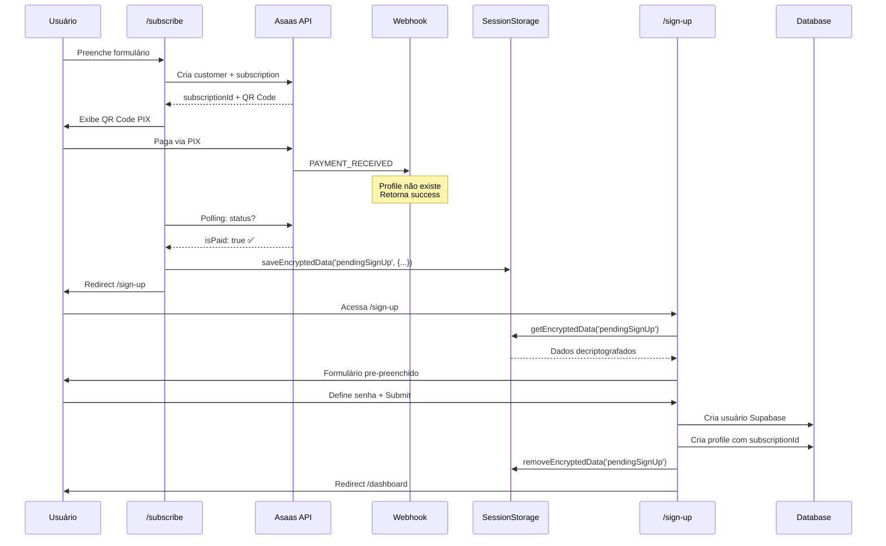

# Fluxo de Subscription e Sign-Up

## 📋 Visão Geral

O sistema utiliza uma abordagem **separada** entre **criação de subscription** e **criação de profile/usuário**, garantindo que o usuário só seja persistido no banco após completar o cadastro no sign-up.

## 🔐 Segurança

- **Dados sensíveis** são armazenados **criptografados** no `sessionStorage`
- A criptografia usa **XOR + Base64** com chave configurável
- Dados são **temporários** e **removidos** após uso

## 🔄 Fluxo Completo

### 1️⃣ Subscription Flow (`/subscribe`)

**Responsabilidades:**
- Coletar dados do usuário (nome, email, CPF, endereço)
- Criar cliente no **Asaas** (gateway de pagamento)
- Criar assinatura no **Asaas**
- Gerar QR Code PIX ou Boleto
- **NÃO** criar profile no banco de dados

**Código:**
```typescript
// app/api/useCases/subscriptions/CreateSubscriptionUseCase.ts

// ✅ Cria apenas no Asaas (sem profile no DB)
const customer = await customerService.createCustomer({
  name: input.fullName,
  email: input.email,
  cpfCnpj,
  phone,
  postalCode,
  address,
  externalReference: input.email // Email como referência temporária
});

const subscription = await subscriptionService.createManagerSubscription({
  customer: customerId,
  billingType: input.billingType,
  value: 59.90,
  cycle: 'MONTHLY',
  externalReference: input.email // Email como referência temporária
});

// Retorna dados SEM criar profile
return {
  customerId,
  subscriptionId,
  pix: { ... }
};
```

### 2️⃣ Payment Confirmation (Webhook + Polling)

**Webhook Asaas:**
```typescript
// app/api/webhooks/asaas/route.ts

// ✅ Aceita que profile não exista ainda
if (!profile) {
  console.warn('⚠️ Profile não encontrado. Será criado no sign-up.');
  return true; // NÃO é erro - profile será criado depois
}
```

**Polling Frontend:**
```typescript
// hooks/usePaymentPolling.ts

// Consulta API a cada 3 segundos
const checkPaymentStatus = async () => {
  const response = await fetch(`/api/v1/subscriptions/${subscriptionId}/status`);
  const data = await response.json();
  
  if (data.isPaid) {
    onPaymentConfirmed(); // ✅ Pagamento confirmado!
  }
};
```

**Status Endpoint:**
```typescript
// app/api/v1/subscriptions/[subscriptionId]/status/route.ts

// Se profile não existe, consulta Asaas diretamente
if (!profile) {
  const subscription = await fetch(`${ASAAS_API_URL}/subscriptions/${id}`);
  const payments = await fetch(`${ASAAS_API_URL}/payments?subscription=${id}`);
  
  const hasPaidPayment = payments.some(p => 
    ['RECEIVED', 'CONFIRMED'].includes(p.status)
  );
  
  return { isPaid: hasPaidPayment, status: 'paid_pending_signup' };
}
```

### 3️⃣ Data Storage (Encrypted)

**Após confirmação de pagamento:**
```typescript
// app/subscribe/features/components/SubscriptionFormMultiStep.tsx

import { saveEncryptedData } from '@/lib/crypto';

const signUpData: PendingSignUpData = {
  // Dados pessoais
  fullName: formData.fullName,
  email: formData.email,
  cpfCnpj: unmask(formData.cpfCnpj), // ⚠️ Sem máscara
  phone: unmask(formData.phone),
  
  // Endereço
  postalCode: unmask(formData.postalCode),
  address: formData.address,
  addressNumber: formData.addressNumber,
  complement: formData.complement,
  city: formData.city,
  state: formData.state,
  
  // Asaas IDs
  subscriptionId: subscriptionData.subscriptionId,
  customerId: subscriptionData.customerId,
  
  // Metadata
  subscriptionConfirmed: true,
  timestamp: new Date().toISOString(),
};

// 🔐 Salva CRIPTOGRAFADO
saveEncryptedData('pendingSignUp', signUpData);

// Redireciona para sign-up
router.push('/sign-up?from=subscription');
```

### 4️⃣ Sign-Up Flow (`/sign-up`)

**Responsabilidades:**
- Recuperar dados criptografados do `sessionStorage`
- Pre-preencher formulário
- Coletar senha do usuário
- Criar usuário no **Supabase Auth**
- Criar profile no **banco de dados** com:
  - Dados pessoais
  - `subscriptionId` (do Asaas)
  - `customerId` (do Asaas)
  - `subscriptionStatus: 'active'`

**Implementação (TODO):**
```typescript
// app/(auth)/sign-up/page.tsx

import { getEncryptedData, removeEncryptedData } from '@/lib/crypto';
import type { PendingSignUpData } from '@/types/subscription';

export default function SignUpPage() {
  const [pendingData, setPendingData] = useState<PendingSignUpData | null>(null);
  
  useEffect(() => {
    // Recuperar dados criptografados
    const data = getEncryptedData<PendingSignUpData>('pendingSignUp');
    
    if (data?.subscriptionConfirmed) {
      console.info('✅ Dados de subscription recuperados');
      setPendingData(data);
      
      // Pre-preencher formulário
      form.setValue('fullName', data.fullName);
      form.setValue('email', data.email);
      form.setValue('phone', data.phone);
      // ... outros campos
    }
  }, []);
  
  const handleSubmit = async (formData: SignUpFormData) => {
    try {
      // 1. Criar usuário Supabase
      const { data: authData, error } = await supabase.auth.signUp({
        email: pendingData.email,
        password: formData.password,
      });
      
      if (error) throw error;
      
      // 2. Criar profile no DB com dados da subscription
      const profile = await fetch('/api/v1/profiles/register', {
        method: 'POST',
        body: JSON.stringify({
          supabaseId: authData.user.id,
          fullName: pendingData.fullName,
          email: pendingData.email,
          cpfCnpj: pendingData.cpfCnpj,
          phone: pendingData.phone,
          address: pendingData.address,
          // ... outros campos
          
          // ⚠️ IMPORTANTE: Vincular com Asaas
          asaasCustomerId: pendingData.customerId,
          subscriptionId: pendingData.subscriptionId,
          subscriptionStatus: 'active',
          subscriptionPlan: 'manager_base',
          role: 'manager',
        }),
      });
      
      // 3. Limpar dados do sessionStorage
      removeEncryptedData('pendingSignUp');
      
      // 4. Redirecionar para dashboard
      router.push(`/${authData.user.id}/dashboard`);
      
    } catch (error) {
      console.error('Erro no sign-up:', error);
    }
  };
  
  return (
    <Form onSubmit={handleSubmit}>
      {/* Formulário pre-preenchido */}
      <Input 
        value={pendingData?.fullName} 
        disabled 
        label="Nome Completo"
      />
      <Input 
        value={pendingData?.email} 
        disabled 
        label="Email"
      />
      
      {/* Senha (único campo editável) */}
      <Input 
        type="password"
        label="Defina sua senha"
        required
      />
      
      <Button type="submit">Completar Cadastro</Button>
    </Form>
  );
}
```

## 🔑 Estrutura de Dados

### `pendingSignUp` (sessionStorage - criptografado)
```typescript
{
  // Pessoais
  fullName: "João Silva",
  email: "joao@example.com",
  cpfCnpj: "12345678900", // ⚠️ Sem máscara
  phone: "11999999999",
  
  // Endereço
  postalCode: "01310100",
  address: "Avenida Paulista",
  addressNumber: "1000",
  complement: "Apto 101",
  city: "São Paulo",
  state: "SP",
  
  // Asaas
  subscriptionId: "sub_abc123",
  customerId: "cus_xyz789",
  
  // Flags
  subscriptionConfirmed: true,
  timestamp: "2025-10-10T14:30:00.000Z"
}
```

## 🔒 Segurança

### Criptografia
```typescript
// lib/crypto.ts

// XOR + Base64 encryption
export function encryptData(data: any): string {
  const jsonString = JSON.stringify(data);
  const key = process.env.ENCRYPTION_KEY || 'default-key';
  
  let encrypted = '';
  for (let i = 0; i < jsonString.length; i++) {
    encrypted += String.fromCharCode(
      jsonString.charCodeAt(i) ^ key.charCodeAt(i % key.length)
    );
  }
  
  return btoa(encrypted); // Base64
}
```

### Configuração
```env
# .env.local
ENCRYPTION_KEY=sua-chave-secreta-aqui-2025
```

## ⚠️ Considerações Importantes

### Expiração de Dados
- Dados no `sessionStorage` **expiram** quando a aba é fechada
- Adicionar timestamp para validar idade dos dados
- Implementar lógica de expiração (ex: 30 minutos)

### Validação no Sign-Up
```typescript
// Verificar se dados são recentes (< 30 minutos)
const data = getEncryptedData<PendingSignUpData>('pendingSignUp');

if (data) {
  const age = Date.now() - new Date(data.timestamp).getTime();
  const maxAge = 30 * 60 * 1000; // 30 minutos
  
  if (age > maxAge) {
    console.warn('⚠️ Dados expirados - solicitar novo pagamento');
    removeEncryptedData('pendingSignUp');
    router.push('/subscribe');
    return;
  }
}
```

### Profile Duplicado
```typescript
// No sign-up, verificar se já existe profile
const existingProfile = await prisma.profile.findFirst({
  where: { email: pendingData.email }
});

if (existingProfile) {
  // Atualizar ao invés de criar
  await prisma.profile.update({
    where: { id: existingProfile.id },
    data: {
      supabaseId: authData.user.id,
      subscriptionId: pendingData.subscriptionId,
      // ...
    }
  });
}
```

## 📊 Diagrama de Sequência



## ✅ Checklist de Implementação

- [x] Criar `lib/crypto.ts` com funções de criptografia
- [x] Criar `types/subscription.ts` com tipos
- [x] Remover criação de profile do `CreateSubscriptionUseCase`
- [x] Atualizar webhook para aceitar profile inexistente
- [x] Atualizar status endpoint para consultar Asaas
- [x] Implementar `saveEncryptedData` no polling callback
- [ ] **TODO:** Implementar recuperação de dados no `/sign-up`
- [ ] **TODO:** Implementar criação de profile no sign-up submit
- [ ] **TODO:** Adicionar validação de expiração de dados
- [ ] **TODO:** Adicionar tratamento de profile duplicado
- [ ] **TODO:** Testar fluxo completo end-to-end

## 🧪 Como Testar

1. Acessar `/subscribe`
2. Preencher formulário com dados válidos
3. Selecionar PIX como forma de pagamento
4. Aguardar QR Code ser gerado
5. Simular pagamento no Asaas Sandbox
6. Aguardar polling detectar pagamento (3-5 segundos)
7. Verificar redirecionamento para `/sign-up`
8. Abrir DevTools > Application > Session Storage
9. Verificar chave `pendingSignUp` (valor criptografado)
10. Verificar formulário pre-preenchido
11. Definir senha e submeter
12. Verificar criação de profile no DB
13. Verificar redirecionamento para dashboard
