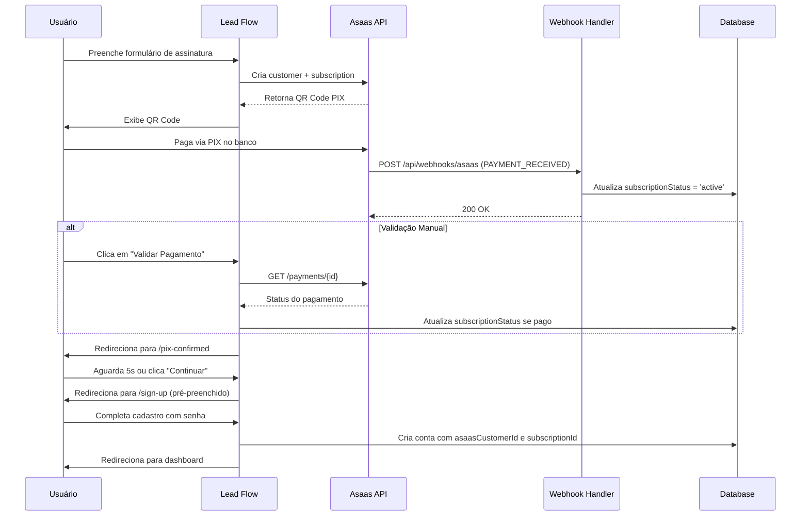

# Configuração do Webhook do Asaas

Este documento descreve como configurar o webhook do Asaas para receber notificações de pagamento automáticas.

## 🎯 Objetivo

Quando um pagamento PIX é confirmado no Asaas, o sistema deve:
1. Receber uma notificação via webhook
2. Atualizar o status da assinatura do usuário para `active`
3. Permitir que o usuário complete o cadastro na plataforma

## 🔧 Configuração no Painel do Asaas

### 1. Acessar Configurações de Webhook

1. Acesse [https://www.asaas.com](https://www.asaas.com) (ou sandbox: [https://sandbox.asaas.com](https://sandbox.asaas.com))
2. Faça login na sua conta
3. Vá em **Menu do usuário** > **Integrações** > **Webhooks**
4. Clique em **Criar Webhook**

### 2. Configurar Webhook

Preencha os seguintes campos:

#### Informações Básicas

- **Nome**: `Lead Flow - Pagamentos`
- **URL**: `https://seu-dominio.com/api/webhooks/asaas`
  - Para desenvolvimento local use ngrok: `https://sua-url.ngrok.io/api/webhooks/asaas`
- **E-mail para notificações**: Seu e-mail de administrador
- **Versão da API**: `v3`
- **Token de Autenticação** (opcional mas recomendado):
  - Gere um token seguro (ex: use `openssl rand -hex 32`)
  - Salve este token na variável de ambiente `ASAAS_WEBHOOK_TOKEN`
- **Fila de sincronização**: ✅ Ativada
- **Status**: ✅ Ativado
- **Tipo de envio**: `SEQUENTIALLY` (Sequencial)

#### Eventos a Serem Monitorados

Selecione os seguintes eventos:

**Eventos de Pagamento (Essenciais)**:
- ✅ `PAYMENT_RECEIVED` - Pagamento recebido
- ✅ `PAYMENT_CONFIRMED` - Pagamento confirmado
- ✅ `PAYMENT_OVERDUE` - Pagamento vencido (opcional)
- ✅ `PAYMENT_REFUNDED` - Pagamento estornado (opcional)

**Outros Eventos Úteis** (opcional):
- `PAYMENT_UPDATED` - Pagamento atualizado
- `PAYMENT_DELETED` - Pagamento excluído
- `PAYMENT_RESTORED` - Pagamento restaurado

## 🌐 Variáveis de Ambiente

Adicione as seguintes variáveis no seu arquivo `.env`:

```bash
# Asaas API
ASAAS_API_URL=https://sandbox.asaas.com/api/v3  # Production: https://api.asaas.com/v3
ASAAS_API_KEY=sua_api_key_aqui

# Webhook Token (opcional mas recomendado)
ASAAS_WEBHOOK_TOKEN=seu_token_secreto_aqui
```

## 🧪 Testando o Webhook

### 1. Desenvolvimento Local com ngrok

Para testar localmente:

```bash
# Instalar ngrok (se não tiver)
npm install -g ngrok

# Expor sua aplicação local
ngrok http 3000
```

Use a URL fornecida pelo ngrok na configuração do webhook.

### 2. Teste Manual via Postman/Insomnia

Você pode testar o endpoint manualmente:

**POST** `http://localhost:3000/api/webhooks/asaas`

Headers:
```
Content-Type: application/json
asaas-access-token: seu_token_secreto (se configurado)
```

Body:
```json
{
  "event": "PAYMENT_RECEIVED",
  "payment": {
    "id": "pay_123456789",
    "customer": "cus_000005219613",
    "subscription": "sub_123456789",
    "status": "RECEIVED",
    "value": 59.90,
    "netValue": 58.50,
    "originalValue": 59.90,
    "billingType": "PIX",
    "confirmedDate": "2025-01-10T14:30:00.000Z",
    "paymentDate": "2025-01-10T14:30:00.000Z"
  }
}
```

### 3. Verificar Logs

Após enviar um webhook, verifique os logs da aplicação:

```bash
# No terminal onde está rodando o Next.js
# Você deve ver logs como:
[Webhook Asaas] Evento recebido: PAYMENT_RECEIVED
[PaymentValidationService] Processando webhook: PAYMENT_RECEIVED
[PaymentValidationService] Profile atualizado: <profile-id>
[Webhook Asaas] Resultado: { success: true, isPaid: true, ... }
```

## 🔍 Endpoint de Validação Manual

Além do webhook automático, existe um endpoint para validação manual do pagamento:

**POST** `/api/v1/payments/validate`

Body:
```json
{
  "paymentId": "pay_123456789"
}
```

Este endpoint é usado pelo botão "Validar Pagamento" na tela do PIX.

## 🔒 Segurança

### Token de Autenticação

O token de autenticação é enviado no header `asaas-access-token` em todas as requisições do webhook.

Nosso endpoint valida este token antes de processar:

```typescript
const asaasToken = request.headers.get('asaas-access-token');
const expectedToken = process.env.ASAAS_WEBHOOK_TOKEN;

if (expectedToken && asaasToken !== expectedToken) {
  return NextResponse.json({ error: 'Unauthorized' }, { status: 401 });
}
```

### Idempotência

O webhook do Asaas garante entrega "at least once", ou seja, você pode receber o mesmo evento múltiplas vezes.

Nosso sistema trata isso automaticamente:
- Usa o `paymentId` como identificador único
- Atualiza o status apenas se necessário
- Registra os eventos processados

## 📊 Fluxo Completo



## ⚠️ Troubleshooting

### Webhook não está recebendo eventos

1. Verifique se a URL está acessível publicamente
2. Confirme que o webhook está ativo no painel do Asaas
3. Verifique se a fila não está pausada (veja próxima seção)

### Fila de Webhook Pausada

Se o sistema retornar erros 15 vezes consecutivas, a fila será pausada.

Para reativar:
1. Acesse **Menu do usuário** > **Integrações** > **Webhooks**
2. Encontre o webhook com status "Pausado"
3. Clique em "Reativar Fila"
4. Os eventos pendentes serão processados em ordem cronológica

### Eventos Perdidos

O Asaas guarda eventos por **14 dias**. Se a fila ficar pausada por mais tempo, eventos serão excluídos permanentemente.

**Importante**: Resolva problemas de webhook dentro de 14 dias!

### Verificar Logs de Webhook no Asaas

1. Acesse o webhook no painel
2. Veja histórico de eventos enviados
3. Verifique respostas HTTP recebidas
4. Analise erros e reenvios

## 📚 Referências

- [Documentação Oficial do Asaas - Webhooks](https://docs.asaas.com/docs/webhooks)
- [Criar Webhook pela API](https://docs.asaas.com/reference/criar-novo-webhook)
- [Eventos de Webhooks](https://docs.asaas.com/docs/eventos-de-webhooks)
- [Boas Práticas](https://docs.asaas.com/docs/criar-novo-webhook-pela-aplicacao-web)
