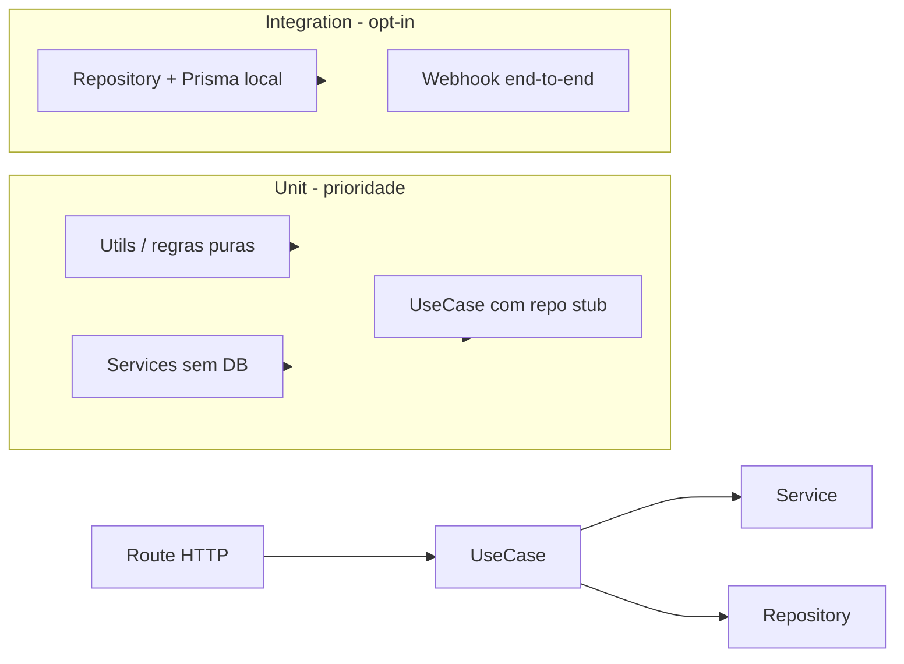

# Auditoria de Testes Backend — Corretor Studio

**Data:** 2026-07-02  
**Fonte de dados:** inventário estático do repositório (`**/*.test.ts`, contagem por camada em `app/api` e `lib/`) cruzado com hotspots da [auditoria de performance](performance-audit-2026-07-02.md).  
**Escopo:** somente diagnóstico — nenhum código de produção foi alterado.

**Relatórios detalhados (anexos):**

- [Inventário de testes existentes](sections/backend-test-inventory.md)
- [Lacunas por camada](sections/backend-test-gaps-by-layer.md)
- [Backlog priorizado P0–P3](sections/backend-test-priority-backlog.md)

---

## 1. Sumário executivo — Top 5 lacunas por risco

### 1.1 Pagamentos / Asaas — zero testes nos fluxos de receita

Webhook Asaas ([`app/api/webhooks/asaas/`](../../app/api/webhooks/asaas/)), `PaymentValidation`, `SubscriptionCheck`, rotas `subscriptions/*` e `billing/*` não possuem testes. O webhook já implementa padrão correto (`after()` async, idempotência via `AsaasWebhookEventRepository.claimForProcessing`), mas **nenhum teste garante** token validation, deduplicação ou mapeamento de status de pagamento. Regressão aqui impacta receita diretamente.

### 1.2 Leads (core) — ~2.7k linhas sem teste de UseCase

[`LeadUseCase.ts`](../../app/api/useCases/leads/LeadUseCase.ts) concentra create, status transition, transfer e integrações (schedule, e-mail, Google Calendar). Há 22 routes em `app/api/v1/leads/` e [`LeadRepository`](../../app/api/infra/data/repositories/lead/LeadRepository.ts) sem testes. Única cobertura: util [`resolveTransferSchedule.test.ts`](../../app/api/useCases/leads/utils/resolveTransferSchedule.test.ts) — modelo ideal de TDD. Rota de leads é hotspot de performance e tráfego.

### 1.3 Webhooks externos — entrada sem sessão, zero testes nas routes

Evolution WhatsApp, Meta, Studio, Resend (route), 3cplus e backoffice webhooks não têm testes de route. A auditoria de performance documentou **32 timeouts de 300s** no webhook Evolution e perda de mensagens. UseCases Resend têm 2 testes parciais; o restante é superfície de ataque e regressão.

### 1.4 Autorização — `getTeamAccess` e `FeatureAccessUseCase` sem testes

[`teamAccess.ts`](../../app/api/v1/utils/teamAccess.ts) executa ~5 queries Prisma sequenciais por request (hotspot #1 da perf audit). `FeatureAccessUseCase` adiciona cache e re-resolução redundante. Apenas [`getCdpAccess.test.ts`](../../app/api/v1/cdp/utils/getCdpAccess.test.ts) cobre parcialmente o padrão de autorização HTTP. Refactors para cache/`WithCtx` precisam de rede de segurança.

### 1.5 Segurança pura em `lib/` — alto ROI, zero cobertura

[`lib/studio-bot/`](../../lib/studio-bot/) (11 arquivos), [`lib/whatsapp/`](../../lib/whatsapp/) (10 arquivos), [`lib/webhooks/`](../../lib/webhooks/), [`lib/env/`](../../lib/env/) e [`lib/features/`](../../lib/features/) contêm lógica pura ideal para unit tests TDD (HMAC, validação de payload, rate limits, startup validation). Contraste com `lib/cdp/`, que tem **6 testes unitários + 1 integration** — melhor cobertura relativa do repositório.

---

## 2. Estado da infraestrutura de testes

| Item | Situação |
|------|----------|
| Runner | Bun nativo (`bun:test`) — sem Vitest/Jest |
| Scripts | `test` (subset fixo), `test:proxy`, `test:integration` (CDP opt-in) |
| CI | Apenas `bun run test:proxy`; `continue-on-error: true` em branches feature/develop |
| Coverage | Inexistente |
| Padrão de arquivo | Co-localizado: `*.test.ts` ao lado do código |
| Fixtures | Nenhuma biblioteca compartilhada |

**Gap de CI:** o script `test` inclui apenas `leads/utils`, `lib/email`, `lib/cdp`, `lib/web-push`, `lib/proxy` — ignorando testes existentes em Resend webhook, BotPolicy, billing rules, EvoApi, etc.

---

## 3. Cobertura quantitativa

| Camada | Escala | Com teste | Taxa |
|--------|--------|-----------|------|
| UseCases | ~58 pastas, ~208 arquivos | 6 pastas parciais | ~3% |
| Services | ~44 pastas, ~139 arquivos | 4 arquivos | ~3% |
| Repositories | ~36 pastas, ~122 arquivos | 0 | **0%** |
| Routes v1 | ~35 domínios, ~305 handlers | 0 routes (1 util) | **~0%** |
| Webhooks | ~14 arquivos | 0 routes | **0%** |
| `lib/` | ~174 arquivos | 15 testes | ~9% |
| **`app/api` total** | **~500+** | **12** | **~2%** |

### Qualidade dos 12 testes em `app/api`

| Classificação | Qtd | Exemplos |
|---------------|-----|----------|
| Real | 7 | `resolveTransferSchedule`, `ResendDomainWebhook`, `BotPolicyService`, `memberProBillingRules`, `getCdpAccess`, `EvoApiService.adopt` |
| Parcial | 3 | `ResendWebhookUseCase`, `AssociateProposalService`, `EmailCampaignDispatch` (só parse) |
| Smoke | 2 | `EmailAnalyticsUseCase`, `AssociateBackofficeAccessUseCase` |
| Débito | 1 | `TeamMembersAssociatePrivacy` (lógica no teste, não em produção) |

---

## 4. Padrões recomendados (TDD + arquitetura)

Fluxo alvo: **Route → UseCase → Service → Repository** ([`app/api/services/README.md`](../../app/api/services/README.md))

### Regras por camada

| Camada | Estratégia | Referência no repo |
|--------|------------|-------------------|
| **Utils / regras puras** | Unit direto, zero mocks | [`resolveTransferSchedule.test.ts`](../../app/api/useCases/leads/utils/resolveTransferSchedule.test.ts) |
| **Service** | Testar funções puras exportadas | [`memberProBillingRules.test.ts`](../../app/api/shared/billing/memberProBillingRules.test.ts) |
| **UseCase** | Stub de `I*Repository`, nunca Prisma real | [`ResendDomainWebhookUseCase.test.ts`](../../app/api/useCases/resendWebhook/ResendDomainWebhookUseCase.test.ts) |
| **Route helper** | Spy em deps, assert status/Output | [`getCdpAccess.test.ts`](../../app/api/v1/cdp/utils/getCdpAccess.test.ts) |
| **HTTP externo** | Mock `globalThis.fetch` | [`EvoApiService.adopt.test.ts`](../../app/api/services/whatsapp/evo/EvoApiService.adopt.test.ts) |
| **Repository** | Integration opt-in + Prisma local | [`customer-data-platform.integration.test.ts`](../../lib/cdp/customer-data-platform.integration.test.ts) |
| **Webhook route** | Token + idempotência + resposta rápida | Asaas já usa `after()` — testar contrato |

### Iron Law TDD

1. Teste falha **antes** da implementação
2. Smoke tests existentes **não contam** como cobertura
3. Teste importa código de produção — nunca duplicar lógica no arquivo de teste
4. Um comportamento por teste; nome descreve o comportamento esperado

---

## 5. Backlog resumido (P0–P3)

Detalhes completos em [backend-test-priority-backlog.md](sections/backend-test-priority-backlog.md).

### P0 — receita, core, segurança externa

| Módulo | Comportamentos-chave |
|--------|---------------------|
| Asaas webhook | Token 401, idempotência claim, `after()` async |
| PaymentValidation / SubscriptionCheck | Status CONFIRMED/OVERDUE, gates de assinatura |
| LeadUseCase (fatias) | Create validation, status transition, value limits |
| Evolution webhook | Secret URL, payload validation, contrato 200 rápido |
| `lib/whatsapp`, `lib/webhooks` | Payload validation, rate limits, HMAC |

### P1 — auth, WhatsApp, feature access

- `getTeamAccess` — 401/403/404, ban, assinatura
- `FeatureAccessUseCase` — cache, slugs por role
- WhatsApp use cases — inbound, sync, auto-response
- `lib/studio-bot` — HMAC, auth-code, rate limits
- `lib/env/startup-validation`

### P2 — email, notifications, integrations

- Email dispatch (além de parse batch)
- Notification crons (meeting, lead-status, task)
- Meta + Studio webhooks
- `lib/validations` (checkout, public lead form)

### P3 — backoffice, dashboard, performance

- Backoffice por subdomínio (payments → leads → bot)
- DashboardInfos, Performance aggregations

---

## 6. Débito técnico de testes existentes

| Item | Problema | Ação |
|------|----------|------|
| Smoke tests | Só verificam `typeof method === "function"` | Reescrever com stub de repo |
| `TeamMembersAssociatePrivacy` | Função definida no teste | Extrair para produção e importar |
| `ResendWebhookUseCase` | Patch de `prototype.handle` | Preferir injeção de dependência |
| CI | Só `test:proxy`; falhas ignoradas | Expandir suite gradualmente |
| Script `test` | Subset não inclui testes existentes | Alinhar paths ou usar `bun test app/api lib/proxy proxy.test.ts` |

---

## 7. Correlação com auditoria de performance

Testes não substituem otimizações de infra (região `gru1`, pool Prisma, cache), mas **protegem refactors** documentados em [`backend-hotspots.md`](sections/backend-hotspots.md):

| Fix de performance planejado | Teste necessário |
|------------------------------|------------------|
| Cache `getTeamAccess` / `WithCtx` | P1.1 — comportamento idêntico, menos queries |
| Webhook Evolution → `after()` | P0.4 — 200 imediato, processamento async |
| `AbortSignal.timeout` em EvoApi | Expandir `EvoApiService.adopt.test.ts` |
| Índice em `webhookSecret` | P0.4 — lookup mockado |
| Cache `FeatureAccessUseCase` | P1.2 — hit/miss, invalidação |

---

## 8. Recomendações de processo (próximos passos)

1. **Sprint 1 (P0):** `lib/whatsapp` puro + Asaas webhook — maior ROI, baixo acoplamento
2. **Sprint 2 (P0):** fatias de `LeadUseCase` — extrair validações puras primeiro
3. **CI:** adicionar `bun run test` ao pipeline; remover `continue-on-error` quando suite estiver estável
4. **Coverage:** introduzir `bun test --coverage` após massa P0 verde
5. **Governança:** exigir `*.test.ts` em PRs que criem UseCase/Service (política TDD)
6. **Inventário reprodutível:** script futuro para regenerar anexos desta auditoria

---

## 9. Conclusão

O backend possui **infraestrutura mínima de testes**: Bun nativo, 12 testes em ~500 arquivos `app/api` (~2%), zero testes de repository, zero testes de webhook routes. A cobertura existente concentra-se em utilitários puros (CDP, email, proxy, billing rules) — padrão correto para TDD.

As maiores lacunas coincidem com os domínios de maior risco de negócio e com os hotspots de performance: **Asaas/leads/webhooks/autorização**. Priorizar testes de lógica pura em `lib/` e contratos de webhook antes de integration tests de repository reduz custo e maximiza confiança nos refactors já identificados.
