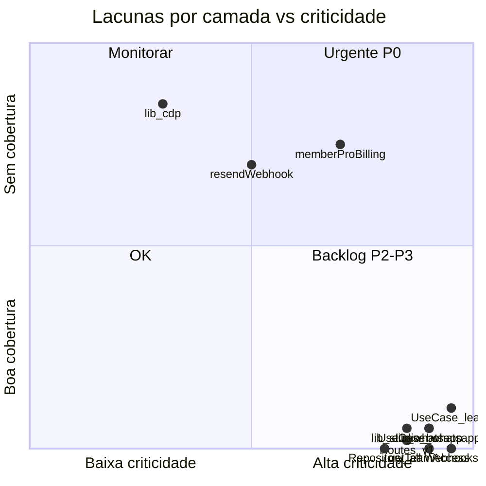

# Auditoria de Testes Backend — Lacunas por Camada

**Data:** 2026-07-02  
**Escopo:** Matriz de cobertura por camada arquitetural (`Route → UseCase → Service → Repository`) e módulos `lib/` compartilhados.

Fluxo canônico: [`app/api/services/README.md`](../../app/api/services/README.md)

---

## Legenda

| Símbolo | Significado |
|---------|-------------|
| ✅ | Tem teste(s) com comportamento real |
| ⚠️ | Cobertura parcial ou smoke test |
| ❌ | Sem testes |
| 🔒 | Prioridade alta (receita, segurança externa, core product) |

---

## 1. Use Cases — `app/api/useCases/` (58 pastas, ~208 arquivos)

| Domínio | Arquivos | Testes | Gap |
|---------|----------|--------|-----|
| **whatsapp** 🔒 | 27 | ❌ | Maior domínio; inbound, sync, config, auto-resposta |
| **backoffice** 🔒 | 14 | ❌ | Clientes, pagamentos, billing incremental |
| **backofficeBot** | 14 | ❌ (service ⚠️) | Inbound webhook, actions, outbox — só `BotPolicyService` testado |
| **subscriptions** 🔒 | 8 | ❌ | Checkout Asaas, upgrade, status |
| **email** | 8 | ⚠️ smoke | `EmailAnalyticsUseCase` smoke; dispatch não testado no UseCase |
| **notifications** | 7 | ❌ | Crons: meeting, task, lead-status batch |
| **leads** 🔒 | 6 + utils | ⚠️ util only | `LeadUseCase.ts` (~2.7k linhas) sem teste; só `resolveTransferSchedule` |
| **resendWebhook** | 5 | ✅ | 2 testes reais |
| **task** | 9 | ❌ | CRUD + Google Calendar |
| **profiles** | 5 | ❌ | Perfil, timezone |
| **integrations** 🔒 | 4 | ❌ | Lead-form público, studio webhook |
| **associateProposal** | 4 | ⚠️ | Smoke no UseCase; service parcial |
| **performance** | 3 | ❌ | KPIs, rankings |
| **portfolio** | 3 | ❌ | Carteira, renovações |
| **payments** 🔒 | 2 | ❌ | Validação de pagamento |
| **auth** 🔒 | 2 | ❌ | Login, sessão |
| **metaLeads** 🔒 | 2 | ❌ | Integração Meta |
| **featureAccess** 🔒 | 2 | ❌ | Cache de features — hotspot perf (13k+ calls/3d) |
| **billing** 🔒 | 2 | ❌ | Cobrança incremental |
| **subscriptionManagement** 🔒 | 2 | ❌ | Gestão de assinatura |
| **addOnCheckout** 🔒 | 2 | ❌ | Checkout de add-ons |
| **teamMembers** | 2 | ⚠️ débito | Privacy filter duplicado no teste |
| **cdp** | 2 | ❌ | UseCase não testado (lib CDP bem coberta) |
| Demais (~35 pastas, 1–3 arq.) | ~60 | ❌ | backoffice*, calendar, google, metrics, support, etc. |

**Resumo UseCase:** 6 pastas com algum teste (~10%); 52 pastas sem teste.

---

## 2. Services — `app/api/services/` (44 pastas, ~139 arquivos)

| Domínio | Arquivos | Testes | Gap |
|---------|----------|--------|-----|
| **whatsapp** 🔒 | 10 | ⚠️ | Só `EvoApiService.adopt` — falta inbound, sync, rate limit |
| **Backoffice** 🔒 | 13 | ❌ | Calendar, meta webhook, lead schedule |
| **billing** 🔒 | 6 | ❌ | Incremental billing, credits |
| **EmailCampaignDispatch** | 5 | ⚠️ | Só `parseResendBatchSendItems` |
| **DashboardInfos** | 5 | ❌ | Métricas dashboard |
| **backofficeBot** | 5 | ✅ | `BotPolicyService` |
| **lead** 🔒 | 4 | ❌ | Core lead operations |
| **PaymentValidation** 🔒 | 3 | ❌ | Tipos e validação Asaas webhook |
| **SubscriptionCheck/Status** 🔒 | 4 | ❌ | Gates de assinatura |
| **AsaasCustomer/Operator/Subscription** 🔒 | 6 | ❌ | Integração Asaas |
| **associateProposal** | 2 | ⚠️ | Parcial |
| **resend** | 2 | ❌ | Webhook service não testado diretamente |
| **cdp** | 2 | ❌ | Service layer (lib testada) |
| **Performance** | 4 | ❌ | Agregações |
| **StudioWebhookIntegration** 🔒 | 2 | ❌ | Integração studio |
| Demais (~20 pastas) | ~40 | ❌ | profile, leadSchedule, featureAccess, etc. |

**Resumo Service:** 4 arquivos de teste em 4 pastas (~3%).

---

## 3. Repositories — `app/api/infra/data/repositories/` (36 pastas, ~122 arquivos)

| Repositório | Arquivos | Testes | Gap |
|-------------|----------|--------|-----|
| **backoffice/** 🔒 | 40 | ❌ | Maior repositório — Client, Payment, Lead, Feature |
| **whatsapp/** 🔒 | 5 | ❌ | Config, conversas, mensagens |
| **billing/** 🔒 | 5 | ❌ | Créditos, cobrança |
| **lead/** 🔒 | 2 | ❌ | `LeadRepository` — queries CRM |
| **payment/** 🔒 | 2 | ❌ | Pagamentos |
| **subscription/** 🔒 | 2 | ❌ | Assinaturas |
| **featureAccess/** 🔒 | 2 | ❌ | Resolução de features |
| **asaasWebhook/** 🔒 | 1 | ❌ | Idempotência claim/process |
| **pendingAction/** | 2 | ❌ | Ações pendentes |
| **teamMembers/** | 2 | ❌ | Membros do time |
| **cdp/** | 2 | ❌ | Perfis CDP |
| Demais (~25 pastas) | ~55 | ❌ | email*, notification, task, etc. |

**Resumo Repository:** **0%** — nenhum teste. Candidatos a integration opt-in com Prisma local (modelo CDP).

---

## 4. Routes v1 — `app/api/v1/` (35 domínios, ~305 handlers)

| Domínio | Routes | Testes | Gap |
|---------|--------|--------|-----|
| **backoffice/** 🔒 | 83 | ❌ | Módulo isolado — pagamentos, leads, bot |
| **teams/** 🔒 | 42 | ❌ | Membros, CRM presets, WhatsApp |
| **email/** 🔒 | 38 | ❌ | Campanhas, templates, crons, créditos |
| **leads/** 🔒 | 22 | ❌ | CRUD, schedule, transfer, import |
| **cdp/** | 11 | ⚠️ | Só `getCdpAccess` util |
| **notifications/** | 10 | ❌ | Push + crons |
| **bot/** 🔒 | 9 | ❌ | Auth por código, actions |
| **subscriptions/** 🔒 | 8 | ❌ | Checkout, status |
| **integrations/** 🔒 | 8 | ❌ | Lead-form público |
| **operators/** 🔒 | 7 | ❌ | Pagamentos operador |
| **payments/** 🔒 | 4 | ❌ | Validação |
| **billing/** 🔒 | 2 | ❌ | Resumo billing |
| **features/** 🔒 | 1 | ❌ | Hotspot perf — 13.150 calls/3d |
| Demais (~22 domínios) | ~60 | ❌ | auth, google, meta, dashboard, etc. |

**Resumo Routes:** ~0% de handlers testados; 1 helper utilitário (`getCdpAccess`).

---

## 5. Webhooks — `app/api/webhooks/` (14 arquivos)

| Entrypoint | Arquivos | Testes | Gap | Hotspot perf |
|------------|----------|--------|-----|--------------|
| **asaas/** 🔒 | 2 | ❌ | Token, idempotência, `after()` async | Sim — receita |
| **whatsapp/evolution/** 🔒 | 1 | ❌ | Secret na URL, processamento sync | Sim — 32 timeouts 300s |
| **resend/** | 1 | ❌ route | UseCase ✅ | Médio |
| **meta/** 🔒 | 1 | ❌ | Verificação challenge + leads | Sim |
| **studio/** 🔒 | 4 | ❌ | Lead ingestion por token | Sim |
| **backoffice/** | 3 | ❌ | Meta lead, studio-bot inbound/action | Médio |
| **3cplus/** | 1 | ❌ | Telefonia | Baixo |

**Resumo Webhooks:** 0 routes testadas; lógica Resend parcialmente coberta nos UseCases.

---

## 6. Rotas legadas (fora `/v1`)

| Path | Testes | Gap |
|------|--------|-----|
| `app/api/auth/login/` 🔒 | ❌ | Login |
| `app/api/email/` | ❌ | Rotas legadas email |

---

## 7. Shared — `app/api/shared/`

| Módulo | Testes | Gap |
|--------|--------|-----|
| **billing/** | ✅ | `memberProBillingRules` — expandir para `billingSummary` edge cases |
| Demais | ❌ | — |

---

## 8. Utilitários — `lib/` (~174 arquivos, 15 testes)

| Módulo | Arquivos `.ts` | Testes | Gap | Prioridade |
|--------|------------------|--------|-----|------------|
| **cdp/** | 10 | 6 + integration | ⚠️ | BAIXA — melhor cobertura do repo |
| **email/** | 13 | 2 | ⚠️ | MÉDIA |
| **web-push/** | 8 | 2 | ⚠️ | MÉDIA |
| **studio-bot/** 🔒 | 11 | 0 | ❌ | **ALTA** — HMAC, auth-code, rate limits |
| **whatsapp/** 🔒 | 10 | 0 | ❌ | **ALTA** — webhook-signature, auto-response, rate limit |
| **env/** 🔒 | 6 | 0 | ❌ | **ALTA** — startup-validation |
| **features/** 🔒 | 5 | 0 | ❌ | **ALTA** — feature-slugs, route-access |
| **validations/** | 5 | 0 | ❌ | MÉDIA — checkoutSchema, publicLeadForm |
| **dates/** | 7 | 0 | ❌ | MÉDIA — schedules/timezone |
| **webhooks/** 🔒 | 2 | 0 | ❌ | **ALTA** — backofficeWebhookSecurity |
| **subscription/** 🔒 | 2 | 0 | ❌ | **ALTA** — getEffectiveSubscription |
| **security/** | 1 | 1 | ⚠️ | MÉDIA |
| **proxy/** | 2 | 1 | ⚠️ | BAIXA |
| **google/** | 3 | 1 | ⚠️ | MÉDIA |
| Raiz (`lib/*.ts`) | ~23 | 0 | ❌ | leadStatusTransition*, crypto |

---

## 9. Middleware

| Arquivo | Testes | Gap |
|---------|--------|-----|
| [`proxy.ts`](../../proxy.ts) | ✅ | Único teste no CI |
| [`middleware.ts`](../../middleware.ts) | ❌ | Session refresh Supabase (se distinto de proxy) |

---

## Mapa de calor (camada × criticidade)

---

## Correlação com auditoria de performance

Domínios sem testes que também aparecem como hotspots em [`backend-hotspots.md`](backend-hotspots.md):

| Hotspot perf | Camada | Lacuna de teste |
|--------------|--------|-----------------|
| `GET /api/v1/features/access` | UseCase + Route + Repository | ❌ em todas |
| `getTeamAccess` (5 queries/request) | `app/api/v1/utils/teamAccess.ts` | ❌ |
| Webhook Evolution (300s timeout) | Route + UseCase whatsapp | ❌ |
| Pool Prisma P2024 | Repositories (volume de queries) | ❌ |
| `GET /api/v1/leads` | Route + UseCase + Repository | ❌ |
| Chamadas Evolution sem timeout | Service EvoApiService | ⚠️ parcial |

Testes não substituem fixes de performance, mas **impedem regressão** quando refactors (cache `WithCtx`, `after()`, timeouts) forem implementados.
