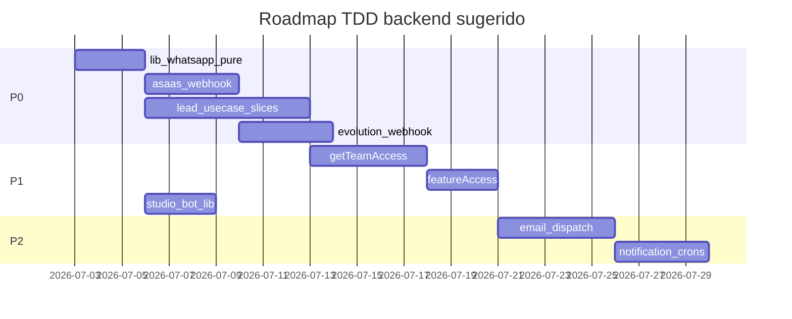

# Auditoria de Testes Backend — Backlog Priorizado

**Data:** 2026-07-02  
**Escopo:** Backlog P0–P3 com comportamentos concretos a testar (TDD-first). Cada item inclui arquivo alvo, tipo de teste e dependências.

Correlacionado com: [`backend-hotspots.md`](backend-hotspots.md), [`prisma-queries.md`](prisma-queries.md)

---

## Como ler este backlog

| Campo | Significado |
|-------|-------------|
| **Tipo** | `unit` (puro/stub), `integration` (Prisma local), `route` (HTTP mock) |
| **Deps** | `stub` = mock de interface; `fetch-mock` = mock HTTP; `db` = DATABASE_URL local |
| **Perf** | Item citado na auditoria de performance |

---

## P0 — Receita, core product, segurança externa

### P0.1 Asaas webhook

| Campo | Valor |
|-------|-------|
| Arquivos | [`app/api/webhooks/asaas/route.ts`](../../app/api/webhooks/asaas/route.ts), [`processAsaasWebhookEvent.ts`](../../app/api/webhooks/asaas/processAsaasWebhookEvent.ts), [`AsaasWebhookEventRepository`](../../app/api/infra/data/repositories/asaasWebhook/AsaasWebhookEventRepository.ts) |
| Tipo | `route` + `unit` |
| Deps | stub repo; env `ASAAS_WEBHOOK_TOKEN` |

**Comportamentos mínimos:**

1. Retorna **401** quando header `asaas-access-token` ausente ou diferente de `ASAAS_WEBHOOK_TOKEN`
2. Retorna **200** com mensagem de ignorado quando `payment` sem `id`
3. Retorna **200** imediato quando `claimForProcessing` retorna `already_processed` ou `already_processing` (idempotência)
4. Chama `after()` para processar evento sem bloquear resposta (padrão já implementado)
5. `resolveAsaasWebhookEventId` gera ID estável para o mesmo payload

**Perf:** fluxo de receita; reduz risco em refactors de async processing.

---

### P0.2 PaymentValidation e SubscriptionCheck

| Campo | Valor |
|-------|-------|
| Arquivos | [`PaymentValidationService.ts`](../../app/api/services/PaymentValidation/PaymentValidationService.ts), [`AsaasWebhookTypes.ts`](../../app/api/services/PaymentValidation/AsaasWebhookTypes.ts), [`SubscriptionCheckService`](../../app/api/services/SubscriptionCheck/), [`SubscriptionStatusService`](../../app/api/services/SubscriptionStatus/) |
| Tipo | `unit` |
| Deps | stub Prisma ou payloads JSON fixture |

**Comportamentos mínimos:**

1. `isAsaasPayment` / `isAsaasSubscription` discriminam corretamente payloads
2. Pagamento com status `CONFIRMED` ativa assinatura; `OVERDUE` bloqueia acesso
3. Assinatura expirada retorna gate negativo em `SubscriptionCheck`
4. Member PRO bypass interage corretamente com [`memberProBillingRules`](../../app/api/shared/billing/memberProBillingRules.ts) (já testado — integrar cenário)
5. Webhook duplicado não duplica efeito colateral (coordenar com P0.1)

---

### P0.3 LeadUseCase (core)

| Campo | Valor |
|-------|-------|
| Arquivos | [`LeadUseCase.ts`](../../app/api/useCases/leads/LeadUseCase.ts), [`ILeadUseCase.ts`](../../app/api/useCases/leads/ILeadUseCase.ts), utils em `leads/utils/` |
| Tipo | `unit` (fatias) |
| Deps | stub `ILeadRepository`, services injetados |

**Comportamentos mínimos (fatias incrementais — não monolito):**

1. **Create:** campos obrigatórios ausentes → `Output` inválido com mensagem clara
2. **Status transition:** transição ilegal (ex.: FINALIZED → NEW) → erro de negócio
3. **Transfer schedule:** expandir [`resolveTransferSchedule`](../../app/api/useCases/leads/utils/resolveTransferSchedule.test.ts) — já coberto parcialmente
4. **Value limits:** valor acima de `MAX_DECIMAL_VALUE` rejeitado
5. **Transfer between teams:** sanitização de campos sensíveis (`TransferToTeamSanitization`)

**Perf:** `GET /api/v1/leads` é rota de alto tráfego; testes protegem refactors de `select` vs `include`.

**Estratégia TDD:** extrair funções puras de validação antes de testar orquestração completa (~2.7k linhas).

---

### P0.4 Evolution webhook

| Campo | Valor |
|-------|-------|
| Arquivos | [`app/api/webhooks/whatsapp/evolution/[teamToken]/route.ts`](../../app/api/webhooks/whatsapp/evolution/[teamToken]/route.ts), [`lib/whatsapp/webhook-signature.ts`](../../lib/whatsapp/webhook-signature.ts) |
| Tipo | `unit` + `route` |
| Deps | stub UseCase; payloads Evolution fixture |

**Comportamentos mínimos:**

1. Token inválido na URL → **401/404** sem processar payload
2. `isValidEvoWebhookPayload` rejeita payload malformado / event type desconhecido
3. Payload válido `MESSAGES_UPSERT` aceito
4. **Comportamento desejado pós-fix perf:** resposta **200** antes de processamento pesado (testar contrato, falhar até implementar `after()`)
5. Config lookup por `webhookSecret` — mock repo retorna team ou null

**Perf:** 32 timeouts de 300s documentados; testes garantem contrato async após fix.

---

### P0.5 Segurança pura — `lib/whatsapp` e `lib/webhooks`

| Campo | Valor |
|-------|-------|
| Arquivos | [`webhook-signature.ts`](../../lib/whatsapp/webhook-signature.ts), [`auto-response-evaluation.ts`](../../lib/whatsapp/auto-response-evaluation.ts), [`send-rate-limit.ts`](../../lib/whatsapp/send-rate-limit.ts), [`lib/webhooks/backofficeWebhookSecurity.ts`](../../lib/webhooks/backofficeWebhookSecurity.ts) |
| Tipo | `unit` |
| Deps | nenhuma |

**Comportamentos mínimos:**

1. Payload Evolution inválido rejeitado (tipos, campos obrigatórios)
2. Rate limit: N+1 envios na janela → bloqueio
3. Auto-response: horário comercial vs off-hours
4. Backoffice webhook: token/HMAC inválido rejeitado

**ROI:** lógica pura — ideal para TDD; alto retorno com baixo esforço.

---

## P1 — Auth, WhatsApp, feature access

### P1.1 getTeamAccess

| Campo | Valor |
|-------|-------|
| Arquivo | [`app/api/v1/utils/teamAccess.ts`](../../app/api/v1/utils/teamAccess.ts) |
| Tipo | `unit` |
| Deps | stub Prisma ou extrair funções puras testáveis |

**Comportamentos mínimos:**

1. Sem `x-supabase-user-id` → 401 Output
2. Profile inexistente → 404
3. TeamMember inexistente ou inativo → 403
4. Account master banido → mensagem `ACCOUNT_MASTER_BANNED_MESSAGE`
5. Assinatura inativa → gate negativo

**Perf:** 5 queries sequenciais por request — testes validam refactors `WithCtx` e cache.

---

### P1.2 FeatureAccessUseCase

| Campo | Valor |
|-------|-------|
| Arquivo | [`FeatureAccessUseCase.ts`](../../app/api/useCases/featureAccess/FeatureAccessUseCase.ts) |
| Tipo | `unit` |
| Deps | stub `FeatureAccessService` |

**Comportamentos mínimos:**

1. Cache hit retorna slugs sem re-query (mock service chamado 1x)
2. Banimento remove todos os slugs
3. Assinatura inativa → lista vazia ou slugs mínimos
4. Role MANAGER vs OPERATOR → slugs diferentes
5. Feature beta habilitada apenas para principals corretos

**Perf:** 13.150 invocações / 3 dias — proteger cache `"use cache"`.

---

### P1.3 WhatsApp use cases críticos

| Campo | Valor |
|-------|-------|
| Pastas | `app/api/useCases/whatsapp/` (27 arquivos) |
| Tipo | `unit` |
| Deps | stub repos + fetch-mock para Evolution |

**Priorizar arquivos (por risco):**

1. Inbound message handler
2. Instance config / adopt (expandir [`EvoApiService.adopt.test.ts`](../../app/api/services/whatsapp/evo/EvoApiService.adopt.test.ts))
3. Contact sync (eventos `CONTACTS.*` — causam timeouts)
4. Auto-response dispatch
5. Conversation access rules

---

### P1.4 lib/studio-bot

| Campo | Valor |
|-------|-------|
| Arquivos | [`hmac.ts`](../../lib/studio-bot/hmac.ts), [`auth-code.ts`](../../lib/studio-bot/auth-code.ts), [`push-rate-limit.ts`](../../lib/studio-bot/push-rate-limit.ts), [`team-access.ts`](../../lib/studio-bot/team-access.ts) |
| Tipo | `unit` |

**Comportamentos mínimos:**

1. HMAC válido vs assinatura adulterada
2. Auth code expirado rejeitado
3. Rate limit de push por usuário/time
4. Quiet hours respeitadas

---

### P1.5 lib/env startup-validation

| Campo | Valor |
|-------|-------|
| Arquivo | [`lib/env/startup-validation.ts`](../../lib/env/startup-validation.ts) |
| Tipo | `unit` |

**Comportamentos mínimos:**

1. Variável obrigatória ausente → erro descritivo
2. URL malformada rejeitada
3. Ambiente de teste não exige secrets de produção

---

## P2 — Email, notifications, integrations

### P2.1 Email campaign dispatch (expandir)

| Campo | Valor |
|-------|-------|
| Arquivos | [`EmailCampaignDispatchService.ts`](../../app/api/services/EmailCampaignDispatch/EmailCampaignDispatchService.ts), crons em `app/api/v1/email/` |
| Tipo | `unit` |

**Comportamentos além de `parseResendBatchSendItems`:**

1. Créditos insuficientes → abort com mensagem
2. Lista vazia → skip dispatch
3. Retry em falha parcial de batch
4. Enriquecimento CDP integrado (coordenar com `lib/cdp/enrich-campaign-recipients.test.ts`)

---

### P2.2 Notification crons

| Campo | Valor |
|-------|-------|
| UseCases | `notifications/` (meeting reminder, lead-status batch, task overdue) |
| Tipo | `unit` |
| Deps | stub repos, clock mock |

**Comportamentos mínimos:**

1. Meeting reminder: dispara apenas dentro da janela configurada
2. Lead-status batch: idempotência por lead+status
3. Task overdue: não notifica tarefa já concluída

---

### P2.3 Meta leads e Studio webhook

| Campo | Valor |
|-------|-------|
| Arquivos | [`meta/route.ts`](../../app/api/webhooks/meta/route.ts), [`studio/handleStudioWebhookLeadRequest.ts`](../../app/api/webhooks/studio/handleStudioWebhookLeadRequest.ts), [`MetaLeadService.ts`](../../app/api/services/MetaLeadService.ts) |
| Tipo | `route` + `unit` |

**Comportamentos mínimos:**

1. Meta GET challenge retorna `hub.challenge` quando token válido
2. Studio webhook: token inválido → 401
3. Lead deduplicado por phone/email no mesmo team
4. Payload mínimo cria lead com status inicial correto

---

### P2.4 lib/validations

| Campo | Valor |
|-------|-------|
| Arquivos | `lib/validations/checkoutSchema.ts`, `publicLeadForm*.ts` |
| Tipo | `unit` |

**Comportamentos:** schemas Zod rejeitam/aceitam campos edge (CPF, phone BR, e-mail vazio).

---

## P3 — Backoffice, dashboard, performance

### P3.1 Backoffice (por subdomínio)

Módulo grande (~83 routes, 40 repo files). Testar **por fatia**, não monolito:

| Subdomínio | Arquivos foco | Prioridade dentro P3 |
|------------|---------------|----------------------|
| Payments | `backoffice/Payment*`, webhooks | Alta |
| Leads | `backoffice/Lead*` | Alta |
| Bot | `backofficeBot/*` (expandir BotPolicy) | Média |
| Features | `backoffice/Feature*` | Média |
| Calendar | `backofficeCalendarAvailability` | Baixa |

---

### P3.2 Dashboard e Performance

| Domínio | Arquivos | Tipo |
|---------|----------|------|
| DashboardInfos | `app/api/services/DashboardInfos/` | unit com fixtures |
| Performance | `app/api/useCases/performance/`, `app/api/services/Performance/` | unit — agregações puras |

---

## Repositories — estratégia transversal

Aplicar **integration opt-in** (modelo [`customer-data-platform.integration.test.ts`](../../lib/cdp/customer-data-platform.integration.test.ts)):

| Prioridade | Repository | Comportamentos |
|------------|------------|----------------|
| P0 | `asaasWebhook/AsaasWebhookEventRepository` | claim, markProcessed, concorrência |
| P0 | `lead/LeadRepository` | filtros CRM, paginação, `select` mínimo |
| P1 | `featureAccess/FeatureAccessRepository` | slugs por principal |
| P1 | `subscription/` | status efetivo |
| P2 | `billing/` | créditos, consumo |

**Requisitos integration:** `DATABASE_URL` local, `describe.skipIf(!RUN_INTEGRATION)`, cleanup em `afterAll`.

---

## Débito — reescrever antes de expandir

| Teste atual | Ação |
|-------------|------|
| `EmailAnalyticsUseCase.test.ts` | Substituir smoke por casos com repo stub |
| `AssociateBackofficeAccessUseCase.test.ts` | Testar matriz de autorização real |
| `TeamMembersAssociatePrivacy.test.ts` | Importar função de produção ou extrair para util |
| `ResendWebhookUseCase.test.ts` | Migrar de prototype patch para DI |

---

## Ordem sugerida de execução (sprints)

---

## Critérios de "done" por item de backlog

- [ ] Teste escrito **antes** da implementação (Red-Green-Refactor)
- [ ] Teste falhou pelo motivo correto (feature ausente, não typo)
- [ ] Código mínimo para passar
- [ ] Teste importa código de produção (sem lógica duplicada)
- [ ] Item adicionado ao script `test` ou suite CI quando estável

---

## Processo futuro (fora desta entrega)

1. Expandir CI: incluir `bun run test` completo; remover `continue-on-error` gradualmente
2. Adicionar `test:coverage` quando massa P0 estiver verde
3. Gate de PR: novo UseCase/Service **deve** incluir `*.test.ts`
4. Script de inventário reprodutível (opcional) para atualizar este documento
