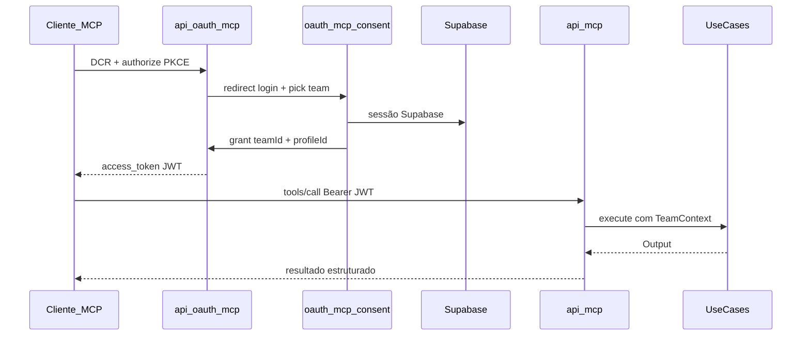
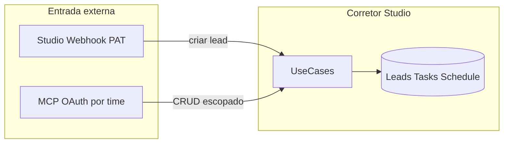

---
tags:
  - spec
  - mcp
  - corretor-studio
  - oauth
  - vercel
aliases:
  - MCP Corretor Studio
  - Studio MCP
canonical: specs/corretor-studio-mcp.md
created: 2026-06-30
updated: 2026-06-30
status: planned
---

# Spec: MCP Corretor Studio — Servidor MCP por time (OAuth + Vercel)

> Fonte canônica no repositório: `specs/corretor-studio-mcp.md`  
> Repo: `lead-flow-app`

Expõe o Corretor Studio como **servidor MCP HTTP** hospedado no mesmo deploy Next.js/Vercel, com **OAuth 2.1** (PKCE + DCR), conexão **por time** e tools de **CRUD** para leads, reuniões, tarefas e anexos.

## Referência rápida (dev)

| Item | Caminho / comando |
|------|-------------------|
| SPEC canônica | `specs/corretor-studio-mcp.md` |
| Notas satélite | [[corretor-studio-mcp/oauth]] · [[corretor-studio-mcp/tools]] · [[corretor-studio-mcp/security]] · [[corretor-studio-mcp/implementation-phases]] |
| Auth por time (existente) | `app/api/v1/utils/teamAccess.ts` |
| Padrão integração | `StudioWebhookIntegration.tsx` em `app/[supabaseId]/integrations/` |
| MCP endpoint (futuro) | `POST /api/mcp` |
| OAuth (futuro) | `/api/oauth/mcp/*`, `/oauth/mcp/consent` |
| Feature slug (futuro) | `studio-mcp` |
| Deploy | Vercel `corretor-studio` |

## Resumo

| Decisão | Escolha |
|---------|---------|
| Hospedagem | Mesmo deploy Next.js (`app/api/mcp/route.ts`) |
| Auth | OAuth 2.1 PKCE + DCR |
| Escopo | JWT com `team_id` + `profile_id` fixos no consentimento |
| Feature | `studio-mcp` PUBLIC |
| Widgets | Fora do escopo v1 |

## Diagramas

### Fluxo OAuth + MCP

### Studio Webhook vs MCP

## Goals (primários)

1. Servidor MCP HTTP stateless na Vercel
2. OAuth 2.1 elegível para diretório de conectores
3. Conexão por time — dados somente do time do token
4. CRUD leads, reuniões, tarefas, anexos
5. Feature PUBLIC + UI em Integrações

## Non-Goals v1

- Widgets MCP (`build-mcp-app`)
- PAT estático para MCP
- Subprojeto Vercel separado
- Listar todos os times via tool MCP
- Hard delete de tarefas

## Conteúdo completo

Ver [[corretor-studio-mcp/implementation-phases]] para roadmap de código.

Documentação detalhada:

- [[corretor-studio-mcp/oauth]] — fluxo OAuth, schema Prisma, env vars
- [[corretor-studio-mcp/tools]] — catálogo `studio_*` com permissões
- [[corretor-studio-mcp/security]] — threat model, rate limit
- [[corretor-studio-mcp/implementation-phases]] — fases 0–5

Spec completa: `specs/corretor-studio-mcp.md` no repositório.

## Relacionadas

- [[studio-bot-n8n]] — bot conversacional Bethânia (domínio diferente)
- Studio Webhook — PAT inbound para criar leads
