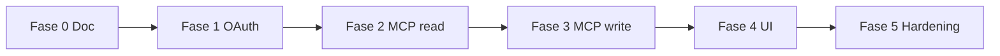

---
tags:
  - spec
  - mcp
  - roadmap
  - corretor-studio
parent: corretor-studio-mcp
canonical: specs/corretor-studio-mcp.md
updated: 2026-06-30
---

# MCP Corretor Studio — Fases de Implementação

Nota satélite de [[corretor-studio-mcp]]. Roadmap de **código** (fase documental concluída).

## Fase 0 — Fundação documental ✅

- [x] `specs/corretor-studio-mcp.md`
- [x] `docs/obsidian/specs/corretor-studio-mcp.md`
- [x] Notas satélite (oauth, tools, security, implementation-phases)
- [x] Diagramas mermaid

## Fase 1 — Schema + OAuth

- [ ] Models `McpOAuthClient`, `TeamMcpOAuthGrant` + migration
- [ ] `lib/mcp/auth/` (JWT, getMcpAccess)
- [ ] Rotas `/api/oauth/mcp/*` + well-known
- [ ] Bypass `proxy.ts`
- [ ] `lib/env/validation.ts` — `MCP_OAUTH_JWT_SECRET`, `MCP_OAUTH_ISSUER`
- [ ] Página `/oauth/mcp/consent`

## Fase 2 — Servidor MCP + tools read

- [ ] `app/api/mcp/route.ts` + `@modelcontextprotocol/sdk`
- [ ] `lib/mcp/server.ts`
- [ ] Tools read-only (`studio_list_*`, `studio_get_*`, `studio_search_leads`)
- [ ] `lib/mcp/rate-limit.ts`
- [ ] `export const maxDuration = 60`

## Fase 3 — Tools write

- [ ] Leads: create, update, delete
- [ ] Tasks: create, update, cancel
- [ ] Meetings: schedule, update, cancel
- [ ] Attachments: upload base64, delete

## Fase 4 — Feature + UI

- [ ] `bun run db:migrate:new seed-studio-mcp`
- [ ] `lib/features/feature-slugs.ts` — `STUDIO_MCP: "studio-mcp"`
- [ ] `prisma/seed-backoffice-products.ts`
- [ ] Card MCP em `IntegrationsContainer`
- [ ] `GET/DELETE /api/v1/integrations/mcp`

## Fase 5 — Hardening + publicação

- [ ] Postman — pasta OAuth MCP
- [ ] Evaluations XML (10 QA read-only)
- [ ] Testes integração OAuth + MCP Inspector
- [ ] Screenshots diretório conectores (3–5 PNG)
- [ ] `bun run governance:check`
- [ ] Deploy produção Vercel

## Dependências entre fases



## Teste local (pós Fase 2)

```bash
npx @modelcontextprotocol/inspector
# ou
npx mcp-remote http://localhost:3000/api/mcp --allow-http --transport http-only
```

Ver: [[corretor-studio-mcp/oauth]] · [[corretor-studio-mcp/tools]] · [[corretor-studio-mcp/security]]
