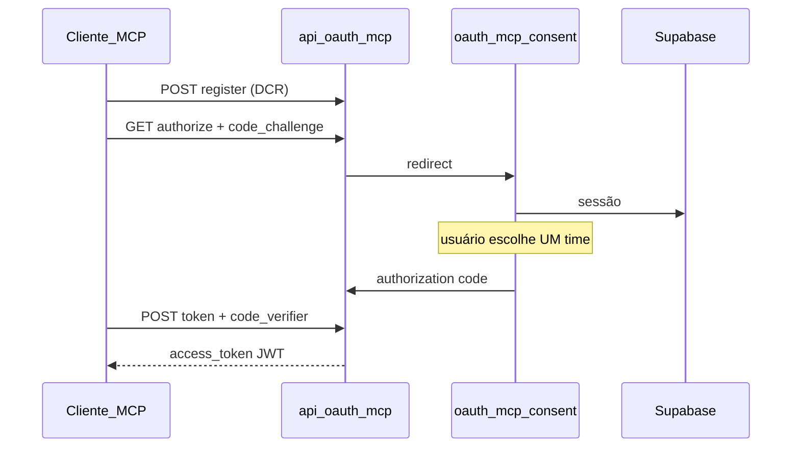

---
tags:
  - spec
  - mcp
  - oauth
  - corretor-studio
parent: corretor-studio-mcp
canonical: specs/corretor-studio-mcp.md
updated: 2026-06-30
---

# MCP Corretor Studio — OAuth 2.1

Nota satélite de [[corretor-studio-mcp]]. Fonte canônica: `specs/corretor-studio-mcp.md`.

## Endpoints propostos

| Método | Path | Propósito |
|--------|------|-----------|
| GET | `/.well-known/oauth-protected-resource` | Metadata resource server |
| GET | `/.well-known/oauth-authorization-server` | Metadata authorization server |
| POST | `/api/oauth/mcp/register` | Dynamic Client Registration |
| GET | `/api/oauth/mcp/authorize` | Início PKCE (S256) |
| POST | `/api/oauth/mcp/token` | Troca code por tokens |
| GET | `/oauth/mcp/consent` | UI login + seletor de time |

## Fluxo

## JWT claims

| Claim | Descrição |
|-------|-----------|
| `sub` | profileId |
| `team_id` | time autorizado (fixo no consentimento) |
| `client_id` | cliente OAuth MCP |
| `scope` | escopos concedidos |
| `iss` | `NEXT_PUBLIC_APP_URL` |
| `exp` | TTL sugerido 3600s |

## Escopos sugeridos

- `leads:read` / `leads:write`
- `tasks:read` / `tasks:write`
- `meetings:read` / `meetings:write`
- `attachments:read` / `attachments:write`

## Schema Prisma (proposto)

- `McpOAuthClient` → `corretor_studio_mcp_oauth_clients`
- `TeamMcpOAuthGrant` → `corretor_studio_team_mcp_oauth_grants`
- Unique: `[teamId, profileId, clientId]`

## Env vars

| Variável | Propósito |
|----------|-----------|
| `MCP_OAUTH_JWT_SECRET` | Assinatura access tokens |
| `MCP_OAUTH_ISSUER` | Issuer OAuth |

## Proxy bypass

Em `proxy.ts`, bypass de sessão (como webhooks) para:

- `/api/mcp`
- `/api/oauth/mcp`
- `/.well-known/oauth-*`

## UI consentimento

1. Redirect sign-in se sem sessão Supabase
2. Listar memberships ativas do usuário
3. Selecionar **um** time
4. Confirmar escopos
5. Redirect com `code` + `state`

## Open questions

- TTL access token: 1h vs 24h?
- Refresh token rotation obrigatória?
- Escopos granulares vs bundle `crm:full` em v1?

Ver também: [[corretor-studio-mcp/security]] · [[corretor-studio-mcp/tools]]
