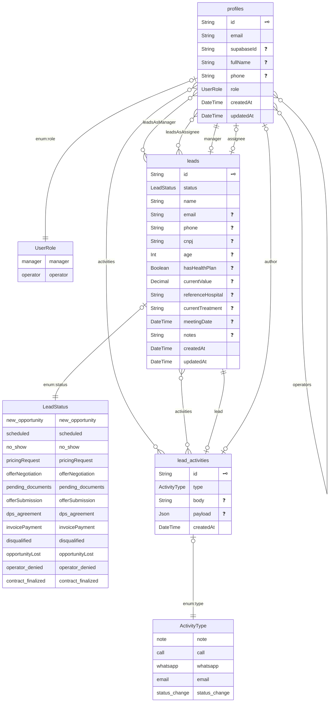

```mermaid
erDiagram

        UserRole {
            manager manager
operator operator
        }
    


        LeadStatus {
            new_opportunity new_opportunity
scheduled scheduled
no_show no_show
pricingRequest pricingRequest
offerNegotiation offerNegotiation
pending_documents pending_documents
offerSubmission offerSubmission
dps_agreement dps_agreement
invoicePayment invoicePayment
disqualified disqualified
opportunityLost opportunityLost
operator_denied operator_denied
contract_finalized contract_finalized
        }
    


        ActivityType {
            note note
call call
whatsapp whatsapp
email email
status_change status_change
        }
    
  "profiles" {
    String id "🗝️"
    String email 
    String supabaseId "❓"
    String fullName "❓"
    String phone "❓"
    UserRole role 
    DateTime createdAt 
    DateTime updatedAt 
    }
  

  "leads" {
    String id "🗝️"
    LeadStatus status 
    String name 
    String email "❓"
    String phone "❓"
    String cnpj "❓"
    Int age "❓"
    Boolean hasHealthPlan "❓"
    Decimal currentValue "❓"
    String referenceHospital "❓"
    String currentTreatment "❓"
    DateTime meetingDate "❓"
    String notes "❓"
    DateTime createdAt 
    DateTime updatedAt 
    }
  

  "lead_activities" {
    String id "🗝️"
    ActivityType type 
    String body "❓"
    Json payload "❓"
    DateTime createdAt 
    }
  
    "profiles" o|--|| "UserRole" : "enum:role"
    "profiles" o|--|o "profiles" : "manager"
    "profiles" o{--}o "profiles" : "operators"
    "profiles" o{--}o "leads" : "leadsAsManager"
    "profiles" o{--}o "leads" : "leadsAsAssignee"
    "profiles" o{--}o "lead_activities" : "activities"
    "leads" o|--|| "LeadStatus" : "enum:status"
    "leads" o|--|| "profiles" : "manager"
    "leads" o|--|o "profiles" : "assignee"
    "leads" o{--}o "lead_activities" : "activities"
    "lead_activities" o|--|| "ActivityType" : "enum:type"
    "lead_activities" o|--|| "leads" : "lead"
    "lead_activities" o|--|o "profiles" : "author"
```
