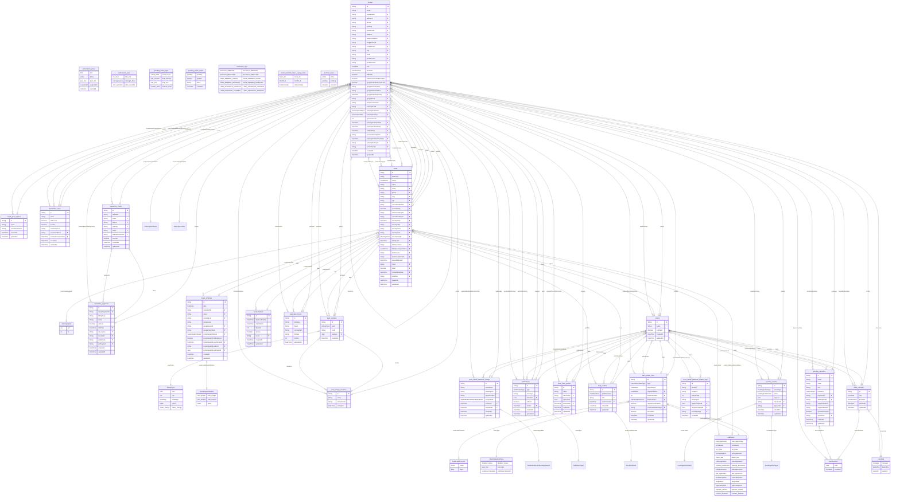

```mermaid
erDiagram

        UserRole {
            manager manager
backoffice backoffice
operator operator
        }
    


        UserFunction {
            SDR SDR
CLOSER CLOSER
        }
    


        MeetingHeald {
            yes yes
no no
        }
    


        LeadStatus {
            new_opportunity new_opportunity
scheduled scheduled
no_show no_show
pricingRequest pricingRequest
future_sale future_sale
offerNegotiation offerNegotiation
pending_documents pending_documents
offerSubmission offerSubmission
dps_agreement dps_agreement
invoicePayment invoicePayment
disqualified disqualified
opportunityLost opportunityLost
operator_denied operator_denied
contract_finalized contract_finalized
        }
    


        TeamStatusRuleType {
            disabled_status disabled_status
lead_time lead_time
combined_transition combined_transition
        }
    


        TeamLeadTimeUnit {
            hours hours
days days
        }
    


        ActivityType {
            note note
call call
whatsapp whatsapp
email email
status_change status_change
        }
    


        InviteDispatchStatus {
            sent_google sent_google
sent_resend sent_resend
failed failed
        }
    


        subscription_status {
            trial trial
active active
past_due past_due
suspended suspended
canceled canceled
        }
    


        subscription_plan {
            free_trial free_trial
manager_base manager_base
with_operators with_operators
        }
    


        pending_action_type {
            create_team create_team
add_member add_member
add_user add_user
transfer_team transfer_team
        }
    


        pending_action_status {
            pending pending
applied applied
failed failed
canceled canceled
        }
    


        notification_type {
            ACTIVITY_MENTION ACTIVITY_MENTION
ACTIVITY_REACTION ACTIVITY_REACTION
TEAM_MEMBER_ADDED TEAM_MEMBER_ADDED
TEAM_MEMBER_REMOVED TEAM_MEMBER_REMOVED
LEAD_SCHEDULE_CREATED LEAD_SCHEDULE_CREATED
LEAD_PROPOSAL_PENDING LEAD_PROPOSAL_PENDING
        }
    


        studio_webhook_token_expiry_mode {
            hours_24 hours_24
months_6 months_6
indeterminate indeterminate
        }
    


        portfolio_status {
            active active
pending pending
canceled canceled
        }
    
  "profiles" {
    String id "🗝️"
    String email 
    String supabaseId "❓"
    String fullName "❓"
    String phone "❓"
    String cpfCnpj "❓"
    String postalCode "❓"
    String address "❓"
    String addressNumber "❓"
    String neighborhood "❓"
    String complement "❓"
    String city "❓"
    String state "❓"
    String profileIconId "❓"
    String profileIconUrl "❓"
    UserRole role 
    UserFunction functions 
    Boolean isMaster 
    Boolean hasPermanentSubscription 
    Boolean googleCalendarConnected 
    String googleAccessToken "❓"
    String googleRefreshToken "❓"
    DateTime googleTokenExpiresAt "❓"
    String googleEmail "❓"
    String asaasCustomerId "❓"
    String subscriptionId "❓"
    SubscriptionStatus subscriptionStatus "❓"
    SubscriptionPlan subscriptionPlan "❓"
    Int operatorCount 
    DateTime subscriptionStartDate "❓"
    DateTime subscriptionEndDate "❓"
    DateTime trialEndDate "❓"
    String asaasSubscriptionId "❓"
    DateTime subscriptionNextDueDate "❓"
    String subscriptionCycle "❓"
    String activeTeamId "❓"
    DateTime createdAt 
    DateTime updatedAt 
    }
  

  "health_plan_options" {
    String id "🗝️"
    String name 
    String normalizedName 
    DateTime createdAt 
    DateTime updatedAt 
    }
  

  "backoffice_users" {
    String id "🗝️"
    String email 
    Boolean fullAccess 
    Boolean isActive 
    String mailboxStatus 
    String mailboxAddress "❓"
    DateTime mailboxProvisionedAt "❓"
    DateTime createdAt 
    DateTime updatedAt 
    }
  

  "backoffice_clients" {
    String id "🗝️"
    String fullName 
    String email "❓"
    String phone "❓"
    String cpfCnpj "❓"
    String notes "❓"
    String asaasCustomerId "❓"
    Boolean isActive 
    DateTime createdAt 
    DateTime updatedAt 
    }
  

  "backoffice_payments" {
    String id "🗝️"
    String asaasPaymentId "❓"
    String billingType 
    String status 
    Decimal amount 
    DateTime dueDate "❓"
    String description "❓"
    String invoiceUrl "❓"
    String pixQrCode "❓"
    String pixPayload "❓"
    DateTime createdAt 
    DateTime updatedAt 
    }
  

  "leads" {
    String id "🗝️"
    String leadCode 
    LeadStatus status 
    String name 
    String email "❓"
    String phone "❓"
    String cnpj "❓"
    String age "❓"
    String currentHealthPlan "❓"
    Decimal currentValue "❓"
    String referenceHospital "❓"
    String currentTreatment "❓"
    DateTime meetingDate "❓"
    String meetingTitle "❓"
    String meetingNotes "❓"
    String meetingLink "❓"
    MeetingHeald meetingHeald "❓"
    DateTime followUpAt "❓"
    String followUpNotes "❓"
    LeadStatus followUpSourceStatus "❓"
    String lossReason "❓"
    String lossReasonDetails "❓"
    DateTime statusEnteredAt 
    String notes "❓"
    Decimal ticket "❓"
    DateTime contractDueDate "❓"
    String soldPlan "❓"
    DateTime createdAt 
    DateTime updatedAt 
    }
  

  "lead_activities" {
    String id "🗝️"
    ActivityType type 
    String body "❓"
    Json payload "❓"
    DateTime createdAt 
    }
  

  "lead_activity_reactions" {
    String id "🗝️"
    String emoji 
    String emojiUnified 
    DateTime createdAt 
    }
  

  "leads_schedule" {
    String id "🗝️"
    DateTime date 
    String meetingTitle "❓"
    String notes "❓"
    String meetingLink "❓"
    String extraGuests 
    String googleEventId "❓"
    String googleCalendarId "❓"
    InviteDispatchStatus inviteDispatchStatus "❓"
    Boolean inviteDispatchFallbackUsed 
    DateTime inviteDispatchLastAttemptAt "❓"
    String inviteDispatchLastError "❓"
    Json inviteDispatchLastPayload "❓"
    DateTime createdAt 
    DateTime updatedAt 
    }
  

  "lead_finalized" {
    String id "🗝️"
    DateTime finalizedDateAt 
    DateTime startDateAt 
    Int duration 
    Decimal amount 
    String notes "❓"
    DateTime createdAt 
    DateTime updatedAt 
    }
  

  "lead_portfolio" {
    String id "🗝️"
    PortfolioStatus portfolioStatus 
    String note "❓"
    DateTime lastContactAt "❓"
    DateTime createdAt 
    DateTime updatedAt 
    }
  

  "lead_attachments" {
    String id "🗝️"
    String fileName 
    String fileUrl 
    String storagePath 
    String fileType 
    Int fileSize 
    DateTime uploadedAt 
    }
  

  "pending_operators" {
    String id "🗝️"
    String name 
    String email 
    String role 
    UserFunction functions 
    String paymentId "❓"
    String subscriptionId "❓"
    String paymentStatus 
    String paymentMethod 
    Boolean operatorCreated 
    String operatorId "❓"
    DateTime createdAt 
    DateTime updatedAt 
    }
  

  "teams" {
    String id "🗝️"
    String name 
    Boolean isDefault 
    DateTime createdAt 
    DateTime updatedAt 
    }
  

  "team_filter_presets" {
    String id "🗝️"
    String name 
    String description "❓"
    Json queryJson 
    DateTime lastUsedAt "❓"
    DateTime createdAt 
    DateTime updatedAt 
    }
  

  "team_status_rules" {
    String id "🗝️"
    TeamStatusRuleType type 
    LeadStatus targetStatus 
    LeadStatus requiredStatus "❓"
    Int leadTimeValue "❓"
    TeamLeadTimeUnit leadTimeUnit "❓"
    Boolean requireConfirmation 
    String confirmationMessage "❓"
    Boolean isEnabled 
    DateTime createdAt 
    DateTime updatedAt 
    }
  

  "team_studio_webhook_configs" {
    String id "🗝️"
    String tokenHash 
    String tokenCipher "❓"
    String tokenPreview 
    StudioWebhookTokenExpiryMode expiryMode 
    DateTime expiresAt "❓"
    DateTime lastUsedAt "❓"
    DateTime createdAt 
    DateTime updatedAt 
    }
  

  "team_studio_webhook_request_logs" {
    String id "🗝️"
    String method 
    String endpoint 
    Int statusCode 
    String resultType 
    Json requestPayload "❓"
    Json responsePayload "❓"
    String errorMessage "❓"
    DateTime createdAt 
    }
  

  "notifications" {
    String id "🗝️"
    NotificationType type 
    String message 
    Json metadata "❓"
    Boolean isRead 
    DateTime readAt "❓"
    DateTime createdAt 
    DateTime updatedAt 
    }
  

  "pending_actions" {
    String id "🗝️"
    PendingActionType actionType 
    PendingActionStatus status 
    Json payload 
    String checkoutId "❓"
    String paymentId "❓"
    DateTime createdAt 
    DateTime updatedAt 
    }
  

  "team_members" {
    String id "🗝️"
    UserRole role 
    UserFunction functions 
    DateTime createdAt 
    DateTime updatedAt 
    }
  
    "profiles" o|--|| "UserRole" : "enum:role"
    "profiles" o|--}o "UserFunction" : "enum:functions"
    "profiles" o|--|o "SubscriptionStatus" : "enum:subscriptionStatus"
    "profiles" o|--|o "SubscriptionPlan" : "enum:subscriptionPlan"
    "profiles" o|--|o "profiles" : "manager"
    "profiles" o{--}o "profiles" : "operators"
    "profiles" o{--}o "leads" : "leadsAsManager"
    "profiles" o{--}o "leads" : "leadsAsAssignee"
    "profiles" o{--}o "leads" : "leadsAsCloser"
    "profiles" o{--}o "leads" : "leadsAsCreator"
    "profiles" o{--}o "leads" : "leadsAsUpdater"
    "profiles" o{--}o "lead_activities" : "activities"
    "profiles" o{--}o "lead_activity_reactions" : "activityReactions"
    "profiles" o{--}o "lead_attachments" : "attachments"
    "profiles" o{--}o "pending_operators" : "pendingOperators"
    "profiles" o{--}o "pending_actions" : "pendingActions"
    "profiles" o{--}o "teams" : "teamsOwned"
    "profiles" o{--}o "team_members" : "teamMemberships"
    "profiles" o{--}o "health_plan_options" : "createdHealthPlanOptions"
    "profiles" o{--}o "backoffice_users" : "backofficeUser"
    "profiles" o{--}o "backoffice_users" : "createdBackofficeUsers"
    "profiles" o{--}o "backoffice_clients" : "createdBackofficeClients"
    "profiles" o{--}o "backoffice_payments" : "createdBackofficePayments"
    "profiles" o{--}o "notifications" : "receivedNotifications"
    "profiles" o{--}o "notifications" : "sentNotifications"
    "profiles" o{--}o "team_studio_webhook_configs" : "updatedStudioWebhookConfigs"
    "profiles" o{--}o "team_filter_presets" : "createdTeamFilterPresets"
    "profiles" o{--}o "team_status_rules" : "createdTeamStatusRules"
    "health_plan_options" o|--|o "profiles" : "creator"
    "backoffice_users" o|--|| "profiles" : "profile"
    "backoffice_users" o|--|o "profiles" : "creator"
    "backoffice_clients" o|--|o "profiles" : "creator"
    "backoffice_clients" o{--}o "backoffice_payments" : "payments"
    "backoffice_payments" o|--|| "backoffice_clients" : "client"
    "backoffice_payments" o|--|o "profiles" : "creator"
    "leads" o|--|| "LeadStatus" : "enum:status"
    "leads" o|--|o "MeetingHeald" : "enum:meetingHeald"
    "leads" o|--|o "LeadStatus" : "enum:followUpSourceStatus"
    "leads" o|--|| "profiles" : "manager"
    "leads" o|--|o "teams" : "team"
    "leads" o|--|o "profiles" : "assignee"
    "leads" o|--|o "profiles" : "closer"
    "leads" o|--|o "profiles" : "creator"
    "leads" o|--|o "profiles" : "updater"
    "leads" o{--}o "lead_activities" : "activities"
    "leads" o{--}o "leads_schedule" : "LeadsSchedule"
    "leads" o{--}o "lead_finalized" : "LeadFinalized"
    "leads" o{--}o "lead_portfolio" : "portfolio"
    "leads" o{--}o "lead_attachments" : "attachments"
    "lead_activities" o|--|| "ActivityType" : "enum:type"
    "lead_activities" o|--|| "leads" : "lead"
    "lead_activities" o|--|o "profiles" : "author"
    "lead_activities" o{--}o "lead_activity_reactions" : "reactions"
    "lead_activity_reactions" o|--|| "lead_activities" : "activity"
    "lead_activity_reactions" o|--|| "profiles" : "profile"
    "leads_schedule" o|--|o "InviteDispatchStatus" : "enum:inviteDispatchStatus"
    "leads_schedule" o|--|| "leads" : "lead"
    "lead_finalized" o|--|| "leads" : "lead"
    "lead_portfolio" o|--|| "PortfolioStatus" : "enum:portfolioStatus"
    "lead_portfolio" o|--|| "leads" : "lead"
    "lead_portfolio" o|--|| "teams" : "team"
    "lead_attachments" o|--|| "leads" : "lead"
    "lead_attachments" o|--|| "profiles" : "uploader"
    "pending_operators" o|--}o "UserFunction" : "enum:functions"
    "pending_operators" o|--|| "profiles" : "manager"
    "pending_operators" o|--|o "teams" : "team"
    "teams" o|--|| "profiles" : "master"
    "teams" o{--}o "team_members" : "members"
    "teams" o{--}o "leads" : "leads"
    "teams" o{--}o "pending_operators" : "pendingOperators"
    "teams" o{--}o "pending_actions" : "pendingActions"
    "teams" o{--}o "notifications" : "notifications"
    "teams" o{--}o "team_studio_webhook_configs" : "studioWebhookConfig"
    "teams" o{--}o "team_studio_webhook_request_logs" : "studioWebhookRequestLogs"
    "teams" o{--}o "team_filter_presets" : "filterPresets"
    "teams" o{--}o "team_status_rules" : "statusRules"
    "teams" o{--}o "lead_portfolio" : "portfolioEntries"
    "team_filter_presets" o|--|| "teams" : "team"
    "team_filter_presets" o|--|| "profiles" : "creator"
    "team_status_rules" o|--|| "TeamStatusRuleType" : "enum:type"
    "team_status_rules" o|--|| "LeadStatus" : "enum:targetStatus"
    "team_status_rules" o|--|o "LeadStatus" : "enum:requiredStatus"
    "team_status_rules" o|--|o "TeamLeadTimeUnit" : "enum:leadTimeUnit"
    "team_status_rules" o|--|| "teams" : "team"
    "team_status_rules" o|--|| "profiles" : "creator"
    "team_studio_webhook_configs" o|--|| "StudioWebhookTokenExpiryMode" : "enum:expiryMode"
    "team_studio_webhook_configs" o|--|| "teams" : "team"
    "team_studio_webhook_configs" o|--|| "profiles" : "updatedBy"
    "team_studio_webhook_request_logs" o|--|| "teams" : "team"
    "notifications" o|--|| "NotificationType" : "enum:type"
    "notifications" o|--|| "profiles" : "recipient"
    "notifications" o|--|o "profiles" : "actor"
    "notifications" o|--|| "teams" : "team"
    "pending_actions" o|--|| "PendingActionType" : "enum:actionType"
    "pending_actions" o|--|| "PendingActionStatus" : "enum:status"
    "pending_actions" o|--|| "profiles" : "master"
    "pending_actions" o|--|o "teams" : "team"
    "team_members" o|--|| "UserRole" : "enum:role"
    "team_members" o|--}o "UserFunction" : "enum:functions"
    "team_members" o|--|| "teams" : "team"
    "team_members" o|--|| "profiles" : "profile"
```
