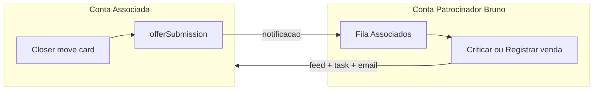
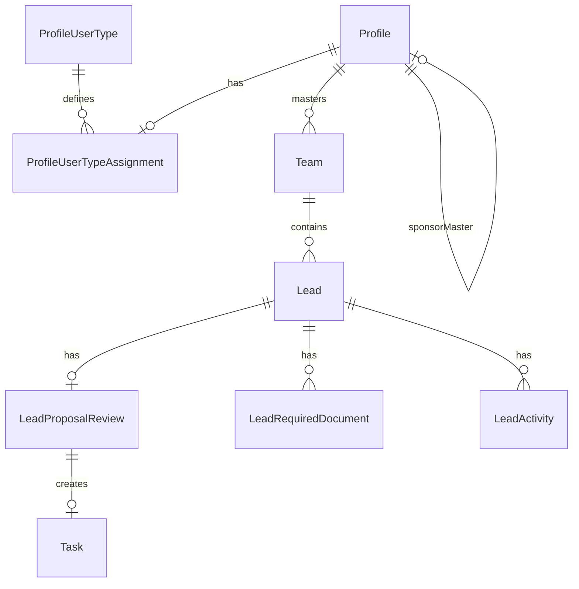
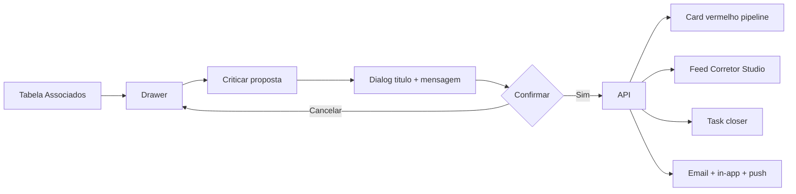
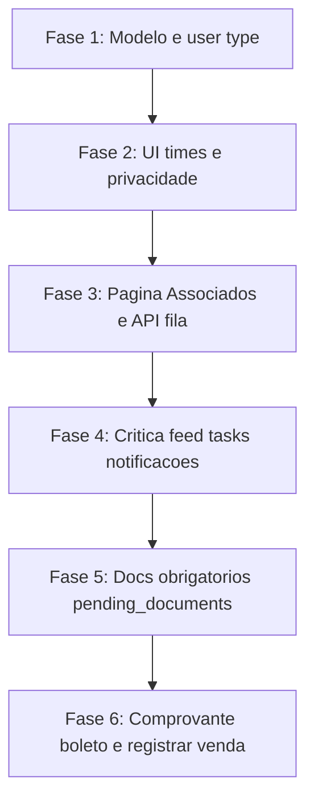

# Spec: Usuário Associado e fluxo Backoffice/Associados

Introduz o tier de produto **Associado** — conta separada com master e times próprios, patrocinada por um master sponsor (inicialmente Bruno, `bruno@onseidemarketing.com.br`) — e a fila operacional **CRM > Backoffice > Associados** para registro de vendas na operadora, crítica de propostas, documentos obrigatórios e notificações multi-canal.

## Background

### Problema

Corretores parceiros precisam operar o CRM de forma autônoma (times, SDR, closer, pipeline), mas a subida de proposta na operadora de saúde e o feedback estruturado (críticas, pendências de documentos, confirmação de venda) são responsabilidade do backoffice do patrocinador.

Hoje o produto distingue apenas tiers `common` e `member_pro` (`profile_user_types`), sem vínculo patrocinador ↔ conta parceira nem superfície consolidada para o backoffice processar propostas de múltiplas contas associadas.

### Estado atual relevante

| Área | Referência no código |
|------|----------------------|
| Tipos de usuário | `ProfileUserType` com slugs `common`, `member_pro` — `prisma/schema.prisma`, seed em `supabase/migrations/20260607174554_add-profile-user-types.sql` |
| Conversão de tipo (admin) | `BackofficeProfileUserTypeDialog.tsx`, `BackofficeProfileUserTypeUseCase.ts` |
| Times | `Team`, `TeamMember` — listagem em `app/api/v1/teams/route.ts` com `isOwnAccount`, `accountMasterId` |
| Team switcher | `components/team-switcher.tsx` |
| Atividade do time | `hooks/useTeamPresence.ts`, `components/app-sidebar.tsx` — lista todos os membros; presença em `studio-presence:{masterId}` |
| Status Proposta | `LeadStatus.offerSubmission` — alerta em `LeadUseCase.handleOfferSubmissionAlert` |
| Status Docs / Boleto | `pending_documents`, `invoicePayment` já existem no enum `LeadStatus` |
| Features / menu | `lib/features/feature-slugs.ts`, `prisma/seed-backoffice-products.ts`, padrão colapsável em `app-sidebar.tsx` |
| Notificações | `NotificationService`, `EmailService`, `app/api/infra/webPush/dispatchWebPush.ts` |

### Gatilho

Reunião de brainstorm com o time Corretor Studio (anotações: docs obrigatórios RG/Comprovante/Contrato Social, crítica com tarefa para closer, identidade "Corretor Studio" no feed, comprovante para sair de Boleto, conversão de cliente para Associado no backoffice admin).

## Goals

### Primários (must-have)

1. Novo slug `associate` em `profile_user_types`, conversível no backoffice admin junto a `common` e `member_pro`.
2. Vínculo `Profile.sponsorMasterId` entre conta associada e patrocinador (Bruno como caso inicial).
3. Sponsor master visualiza times de contas associadas no switcher e em Gerenciar Times, com badge **Associado**.
4. Membros de times associados **não** veem o patrocinador (Bruno) na seção Atividade do Time, independente de status online/offline.
5. Submenu **CRM > Backoffice > Associados** na sidebar do produto (`/{supabaseId}/associados`).
6. Fila cross-account de leads em `offerSubmission` provenientes de contas com `sponsorMasterId` do patrocinador ativo.
7. Ação **Criticar proposta** com título + mensagem, destaque vermelho no pipeline do associado, entrada no feed como **Corretor Studio**, tarefa automática para o closer, e-mail + in-app + push.
8. Ação **Registrar venda** (subida manual na operadora) pelo backoffice do patrocinador.
9. Notificações ao mover card para Proposta em conta associada: patrocinador, master da conta associada e backoffice do patrocinador.

### Secundários (escopo completo do brainstorm)

10. Checklist de documentos obrigatórios: RG, Comprovante de Endereço, Contrato Social — integrado ao status `pending_documents`.
11. Upload de comprovante de pagamento para permitir saída do status Boleto (`invoicePayment`).
12. Toda ação do backoffice no contexto associado aparece no feed com identidade **Corretor Studio** (ícone `/corretor-studio-icon.svg`), nunca com o nome do operador humano.

## Non-Goals

- Integração API direta com operadoras de saúde (registro é formulário/manual nesta fase).
- Página Associados no módulo admin `app/backoffice/` — permanece no CRM do produto (`app/[supabaseId]/associados`).
- Reutilizar tabelas `BackofficeLead` ou enums do CRM interno do backoffice.
- Multi-patrocinador com UI de seleção na v1 (modelo suporta `sponsorMasterId`; UI assume um patrocinador por conta associada).
- Alterar copy ou fluxo da landing page.
- Substituir o pipeline Kanban do associado pela fila Associados (a fila é operacional para o backoffice do patrocinador).

## Design

### Technical Approach

Seguir arquitetura canônica do projeto (`agents.md`):

```text
Route -> UseCase -> [Service] -> Repository -> Prisma
```

**Camadas previstas:**

| Camada | Responsabilidade |
|--------|------------------|
| `AssociateProposalsRoute` (`app/api/v1/associates/proposals/`) | HTTP, auth, mapeamento de status |
| `AssociateProposalUseCase` | Orquestra fila, crítica, registro de venda, docs, comprovante |
| `AssociateProposalService` | Regras de negócio, notificações, criação de activity/task |
| `AssociateProposalRepository` | Queries com filtro `sponsorMasterId` |
| `AssociateAccessService` | Verifica sponsor master, backoffice role, manager delegado |

**Autorização da fila Associados:**

- `Profile.isMaster` do patrocinador ativo **ou**
- `TeamMember.role === "backoffice"` no time ativo do patrocinador **ou**
- `TeamMember.role === "manager"` com `canManageAccountTeams === true` no time do patrocinador

Recomendação v1: reutilizar `canManageAccountTeams` para manager delegado (evita nova flag até validação de produto).

**Feature slug:** `crm-backoffice-associados` (filho de `crm`), registrado em `backoffice_features` + `prisma/seed-backoffice-products.ts` + migration de seed.

**Identidade de sistema no feed:**

- `LeadActivity.createdBy = null`
- `LeadActivity.payload.displayAuthor = "Corretor Studio"`
- `LeadActivity.payload.authorAvatarUrl = "/corretor-studio-icon.svg"`
- `LeadActivity.payload.kind` discrimina o tipo de evento (ver Data Model)



### Data Model



#### Alterações em modelos existentes

**`profile_user_types` (seed)**

| slug | name | description |
|------|------|-------------|
| `associate` | Associado | Conta parceira patrocinada; opera CRM autônomo com backoffice do patrocinador responsável pela subida na operadora. |

**`Profile`**

| Campo | Tipo | Descrição |
|-------|------|-----------|
| `sponsorMasterId` | `UUID?` FK → `Profile.id` | Patrocinador da conta. Obrigatório quando `userType.slug === "associate"`. `ON DELETE RESTRICT`. |

Índice: `@@index([sponsorMasterId])`

**`LeadActivity.payload` (JSON estendido — sem novo enum obrigatório na v1)**

Campos comuns em eventos de sistema:

```typescript
{
  kind: "proposal_criticism" | "sale_registered" | "docs_complete" | "payment_proof_uploaded";
  displayAuthor: "Corretor Studio";
  authorAvatarUrl: "/corretor-studio-icon.svg";
  title?: string;       // crítica
  message?: string;     // corpo da crítica ou resumo da ação
  metadata?: Record<string, unknown>;
}
```

#### Novos modelos

**`LeadProposalReview`** (`corretor_studio_lead_proposal_reviews`)

| Campo | Tipo | Descrição |
|-------|------|-----------|
| `id` | UUID | PK |
| `leadId` | UUID | FK unique → `Lead` |
| `status` | enum | `pending`, `submitted`, `criticized`, `approved` |
| `criticizedTitle` | Text? | Título da crítica |
| `criticizedMessage` | Text? | Mensagem da crítica |
| `criticizedAt` | Timestamptz? | Quando criticado |
| `reviewedByProfileId` | UUID? | Operador backoffice (auditoria interna; não exibido no feed) |
| `saleRegisteredAt` | Timestamptz? | Quando venda registrada |
| `salePayload` | Json? | Dados do formulário registrar venda |
| `createdAt` / `updatedAt` | Timestamptz | Auditoria |

**`LeadRequiredDocument`** (`corretor_studio_lead_required_documents`)

| Campo | Tipo | Descrição |
|-------|------|-----------|
| `id` | UUID | PK |
| `leadId` | UUID | FK → `Lead` |
| `documentType` | enum | `rg`, `address_proof`, `social_contract` |
| `status` | enum | `pending`, `uploaded`, `approved`, `rejected` |
| `attachmentId` | UUID? | FK → anexo do lead |
| `reviewedByProfileId` | UUID? | Quem aprovou/rejeitou |
| `createdAt` / `updatedAt` | Timestamptz | Auditoria |

Unique: `@@unique([leadId, documentType])`

#### DTOs estendidos (API teams)

```typescript
interface TeamSummaryExtended {
  // campos existentes...
  isAssociateAccount?: boolean;
  associateAccountName?: string; // nome do master da conta associada
}
```

#### Migration strategy

| Tipo | Comando |
|------|---------|
| Schema (Prisma) | `bun run db:migrate:from-prisma -- associate-user-type-and-proposal-review` |
| Seed user type + feature slug | `bun run db:migrate:new seed-associate-user-type-and-feature` |
| Seed Bruno como patrocinador inicial (dados) | SQL idempotente na mesma migration ou migration dedicada após profile existir |
| Seed local | Atualizar `prisma/seed-backoffice-products.ts` |

Todas as migrations devem ser idempotentes (`ON CONFLICT DO NOTHING`, `IF NOT EXISTS`).

### API

Prefixo produto: `/api/v1/`. Todos os endpoints retornam `Output` (`lib/output/index.ts`).

#### Autorização compartilhada

Helper `getAssociateBackofficeAccess(request)`:

1. Resolve `TeamContext` via `getTeamAccess()`.
2. Verifica feature `crm-backoffice-associados` via `FeatureAccessService`.
3. Confirma papel: sponsor master (`isMaster` + contas com `sponsorMasterId`), `backoffice`, ou `manager` com `canManageAccountTeams`.

#### Endpoints novos

| Método | Path | Descrição |
|--------|------|-----------|
| `GET` | `/associates/proposals` | Lista leads `offerSubmission` de contas onde `master.sponsorMasterId = sponsorMasterId` do contexto |
| `GET` | `/associates/proposals/[leadId]` | Detalhe: lead, docs, review, últimas activities |
| `POST` | `/associates/proposals/[leadId]/register-sale` | Registra venda na operadora |
| `POST` | `/associates/proposals/[leadId]/criticize` | Crítica + task + notificações |
| `POST` | `/associates/proposals/[leadId]/documents` | Upload/vinculação de documento obrigatório |
| `POST` | `/associates/proposals/[leadId]/documents/[documentType]/approve` | Aprova documento (backoffice) |
| `POST` | `/associates/proposals/[leadId]/payment-proof` | Anexa comprovante e permite transição de Boleto |

**Query params `GET /associates/proposals`:**

- `associateAccountId` (UUID master da conta associada)
- `teamId`
- `closerId`
- `from` / `to` (datas de entrada em `offerSubmission`)
- `search` (nome, telefone, leadCode)
- `page` / `pageSize`

**Request `POST .../criticize`:**

```typescript
{
  title: string;    // min 3, max 120
  message: string;  // min 10, max 2000
}
```

**Request `POST .../register-sale`:**

```typescript
{
  operatorName: string;       // operadora
  proposalNumber?: string;    // número na operadora
  notes?: string;
  attachmentIds?: string[];   // anexos de confirmação
}
```

> Campos do formulário registrar venda estão sujeitos a validação com produto — ver Open Questions.

**Response item da fila:**

```typescript
{
  leadId: string;
  leadCode: string;
  leadName: string;
  leadPhone: string | null;
  associateAccountId: string;
  associateAccountName: string;
  teamId: string;
  teamName: string;
  closerId: string | null;
  closerName: string | null;
  soldPlan: string | null;
  ticket: number | null;
  statusEnteredAt: string;
  reviewStatus: "pending" | "submitted" | "criticized" | "approved";
  criticizedTitle: string | null;
  requiredDocumentsSummary: { pending: number; uploaded: number; approved: number };
}
```

#### Endpoints estendidos

| Método | Path | Alteração |
|--------|------|-----------|
| `GET` | `/teams` | Incluir times de masters com `sponsorMasterId = profile.id` do usuário; flag `isAssociateAccount` |
| `GET` | `/teams/[teamId]/members` | Filtrar membros do patrocinador quando viewer é de conta associada |
| `PUT` | `/api/v1/backoffice/clients/all-users/[profileId]/user-type` | Aceitar `associate` + `sponsorMasterId` obrigatório |

#### Códigos de erro

| HTTP | Condição |
|------|----------|
| 400 | Payload inválido, lead não em `offerSubmission`, docs incompletos |
| 403 | Sem acesso à feature ou papel inadequado |
| 404 | Lead não pertence a conta associada do patrocinador |
| 409 | Crítica duplicada em lead já criticado sem resolução |

#### Postman

Atualizar `postman/Lead-Flow-API-Collection.json` e `postman/Lead-Flow-Environment.json` na implementação.

### UI/UX

#### Navegação

Novo grupo colapsável **Backoffice** em `components/app-sidebar.tsx`, posicionado entre **Navegação** e **Email**, seguindo padrão de `emailItems` / `whatsAppItems`.

```typescript
const backofficeItems: SidebarItem[] = [
  {
    title: "Associados",
    url: `/${supabaseId}/associados`,
    icon: Handshake, // lucide-react
    featureSlug: FEATURE_SLUGS.CRM_BACKOFFICE_ASSOCIADOS,
    // visível: sponsor master | backoffice | manager com canManageAccountTeams
  },
];
```

Persistência de colapso: `sidebar-backoffice-collapsed:{supabaseId}:{activeTeamId}`.

**Matriz de visibilidade:**

| Papel | Grupo Backoffice | Associados |
|-------|------------------|------------|
| Usuário de conta associada | Não | Não |
| Sponsor master (Bruno) | Sim | Sim |
| Backoffice do patrocinador | Sim | Sim |
| Manager delegado (`canManageAccountTeams`) | Sim | Sim |

#### Telas e componentes

| Superfície | Rota / arquivo | Descrição |
|------------|----------------|-----------|
| Fila Associados | `app/[supabaseId]/associados/page.tsx` | Feature scaffold: context, services, container |
| Team switcher | `components/team-switcher.tsx` | Grupo **Associados** + badge |
| Gerenciar Times | `app/[supabaseId]/teams/` | Badge em linhas de times associados |
| Pipeline CRM | `app/[supabaseId]/crm`, board, pipeline | Card criticado |
| Feed do lead | `LeadDialog.tsx` | Entrada Corretor Studio |
| Admin tipos | `BackofficeProfileUserTypeDialog.tsx` | Opção Associado + sponsor |

**Componentes novos sugeridos:**

- `AssociadosFiltersBar` — conta, time, closer, período, busca
- `AssociadosTable` — densidade operacional
- `AssociadoLeadDrawer` — detalhe + ações
- `CriticizeProposalDialog` — título + mensagem, request lock
- `RegisterSaleDialog` — formulário registrar venda
- `AssociateAccountBadge` — reutilizável
- `CriticizedLeadCardOverlay` — wrapper no card do pipeline

#### Layout da página Associados

**Híbrido: tabela densa + drawer lateral** (não kanban).

```
┌─────────────────────────────────────────────────────────┐
│ Associados                                              │
│ Propostas aguardando registro de venda na operadora     │
├─────────────────────────────────────────────────────────┤
│ [Conta ▾] [Time ▾] [Closer ▾] [Período] [Busca]        │
│ 12 propostas pendentes                                  │
├─────────────────────────────────────────────────────────┤
│ Conta | Time | Lead | Plano | Valor | Closer | Enviado  │
│ [Associado] ...                              [Ações ⋮]  │
└─────────────────────────────────────────────────────────┘
                              │
                              ▼ Drawer 480px
                    Detalhe + histórico + checklist docs
                    [Registrar venda]  [Criticar proposta]
```

Responsivo: desktop tabela + drawer; mobile cards empilhados (não kanban).

#### Team switcher (sponsor)

Grupos no popover:

1. **Minha conta**
2. **Associados** — times de contas patrocinadas com badge inline
3. **Outras contas** (legado cross-account, se aplicável)

```typescript
type TeamSwitcherTeam = {
  id: string;
  name: string;
  accountName?: string;
  isOwnAccount?: boolean;
  isAccessible?: boolean;
  isAssociateAccount?: boolean;
};
```

#### Badges e tokens visuais

| Contexto | Label | Classes semânticas |
|----------|-------|-------------------|
| Conta/time associado | Associado | `border-precision-border-soft bg-precision-indigo/10 text-precision-indigo` |
| Card criticado | Proposta criticada | `border-semantic-danger-border bg-semantic-danger-surface text-semantic-danger` |
| Card criticado (kanban) | — | `bg-semantic-danger-surface/30 ring-1 ring-semantic-danger-border` |
| Docs pendentes | Docs pendentes | `semantic-warning` |

Nunca usar hex hardcoded em UI temável (`DESIGN.md`, `design-system-guard`).

#### Fluxo — Criticar proposta



- Botão **Criticar** é secundário/destructive-outline; **Registrar venda** é primário.
- Dialog: `max-h-[90vh] flex flex-col`, área scrollável, footer fixo.
- Submit com request lock (disabled + loading até `finally`).
- Lead já criticado: botão desabilitado + tooltip; retornar 409 na API se reenviado.

#### Fluxo — Documentos obrigatórios

1. Ao entrar em fluxo de proposta em conta associada, sistema garante 3 registros `LeadRequiredDocument` (pending).
2. Gate de status: não permite `offerSubmission` se algum doc obrigatório não estiver `approved` (configurável via gate em `LeadStatusTransitionGateEvaluatorService`).
3. Transição para `pending_documents` quando backoffice ou sistema identifica pendência.
4. Quando todos aprovados: activity `docs_complete` como Corretor Studio + notificação.

#### Fluxo — Comprovante Boleto

1. Lead em `invoicePayment` em conta associada.
2. Backoffice do patrocinador faz upload via `POST .../payment-proof`.
3. Activity `payment_proof_uploaded` + transição para próximo status permitido (`dps_agreement` ou conforme regras de transição existentes).

#### Atividade do Time — privacidade

- **Backend obrigatório:** `GET /teams/[teamId]/members` exclui perfis cujo `profileId` pertence à conta do patrocinador (`sponsorMasterId` chain) quando o time pertence a conta associada.
- UI não exibe placeholder nem mensagem sobre usuários ocultos.
- Complementar: revisar escopo do canal `studio-presence:{masterId}` para não vazar presença do patrocinador em times associados.

#### Estados vazios, loading e erro

| Cenário | Título | CTA |
|---------|--------|-----|
| Nenhuma proposta pendente | Nenhuma proposta aguardando registro | — |
| Filtro sem resultado | Nenhum resultado | Limpar filtros |
| Sem permissão | Acesso restrito | Suporte |
| Sponsor sem associados | Nenhuma conta associada | — |
| Fetch falhou | — | Tentar novamente (Alert destructive) |
| Criticar falhou | toast.error | Manter dialog com texto |

Loading: `Skeleton` em tabela (5–8 linhas), nunca `animate-pulse` manual.

## Edge Cases & Error Handling

| Cenário | Comportamento |
|---------|---------------|
| Crítica duplicada | 409; UI desabilita botão |
| Lead transferido para time não associado | Remove da fila Associados; notifica backoffice |
| `sponsorMasterId` removido da conta | Lead permanece; fila usa vínculo no momento da query; conversão reversa bloqueada se houver propostas abertas |
| Patrocinador inativo / sem assinatura | Times associados com `isAccessible: false` no switcher (padrão existente) |
| Closer ausente no lead | Crítica cria task sem assignee → fallback notifica master associado |
| Registro de venda parcial (API ok, e-mail falha) | Transação principal commitada; e-mail em retry/log; não reverter review |
| Doc rejeitado | Status `rejected` + activity com motivo; closer notificado |
| Múltiplos backoffices do patrocinador | Todos recebem notificação de nova proposta; auditoria em `reviewedByProfileId` |
| Race: dois operadores criticam simultaneamente | Unique `leadId` em `LeadProposalReview`; segundo recebe 409 |

## Security & Privacy

- Associados listam apenas dados do próprio time/conta; **não** acessam `/associates/proposals`.
- Sponsor lista apenas contas com `sponsorMasterId = seu profileId`.
- Filtragem de Bruno na Atividade do Time no **servidor** (defense in depth; não confiar em filtro client-only).
- RLS em `LeadProposalReview` e `LeadRequiredDocument`: políticas por `teamId` via join com `Lead`.
- Autorização via `app_metadata` / tabelas `Profile` e `TeamMember` — **nunca** `user_metadata` em JWT/RLS.
- `reviewedByProfileId` é dado de auditoria interna; não expor no feed público do lead.
- Anexos de documentos e comprovantes: mesmas regras de storage do lead (`teamId` scope).
- Endpoints do patrocinador validam que `lead.team.master.sponsorMasterId` corresponde ao sponsor resolvido no contexto.

## Testing Strategy

### Unit

- `AssociateAccessService`: matriz de papéis e feature slug.
- Filtro de membros do patrocinador em conta associada.
- Gate de docs obrigatórios antes de `offerSubmission`.
- Idempotência de crítica e registro de venda.

### Integration

- `GET /associates/proposals` com 2 contas associadas + 1 conta não associada.
- `POST .../criticize` cria `LeadActivity`, `Task`, notificações.
- `PUT user-type` para `associate` exige `sponsorMasterId`.
- `GET /teams` para Bruno inclui times associados com `isAssociateAccount: true`.

### E2E manual

1. Converter conta teste para Associado com Bruno como sponsor.
2. Bruno vê badge no switcher; associado não vê Bruno na Atividade do Time.
3. Mover lead para Proposta → aparece em Associados + notificações.
4. Criticar → card vermelho no pipeline associado + feed Corretor Studio + e-mail closer.
5. Registrar venda → lead sai da fila + activity no feed.
6. Upload docs + aprovação → gate libera transição de status.
7. Comprovante boleto → transição de `invoicePayment`.

### Validação de projeto

```bash
bun run typecheck
bun run lint
bun run governance:check
bun run design:check
bun run lint:pt-br
```

## Success Criteria

| # | Critério | Verificação |
|---|----------|-------------|
| 1 | Slug `associate` existe e é atribuível no backoffice admin | Migration + seed + UI |
| 2 | Bruno vê times associados com badge **Associado** | Team switcher + `/teams` |
| 3 | Associado não vê Bruno na Atividade do Time | API members filtrada |
| 4 | Menu Backoffice > Associados visível para papéis autorizados | Sidebar + feature slug |
| 5 | Lead em `offerSubmission` de conta associada aparece na fila | GET proposals |
| 6 | Crítica gera destaque vermelho, feed Corretor Studio, task closer, 3 canais | E2E |
| 7 | Registrar venda remove da fila e registra `salePayload` | API + UI |
| 8 | Docs obrigatórios bloqueiam avanço quando configurado | Gate + UI checklist |
| 9 | Comprovante permite sair de Boleto | API payment-proof |
| 10 | Notificações de nova proposta chegam a Bruno, master associado e backoffice Bruno | E-mail + in-app + push |

## Implementation Phases



### Fase 1 — Modelo + user type associate + sponsor link

**Entregas:** `Profile.sponsorMasterId`, seed `associate`, `LeadProposalReview`, `LeadRequiredDocument`, migration seed feature slug, seed-backoffice-products.

**Aceite:** converter usuário para Associado no admin com `sponsorMasterId`; tipos `common`/`member_pro` inalterados.

### Fase 2 — UI times/badge + privacidade presença

**Entregas:** `GET /teams` estendido, badge no switcher e Gerenciar Times, filtro em `GET /teams/[teamId]/members`.

**Aceite:** Bruno vê grupo Associados; membro de conta associada não vê Bruno na sidebar Atividade do Time.

### Fase 3 — Página Associados + API fila

**Entregas:** rota `app/[supabaseId]/associados`, `GET /associates/proposals`, submenu Backoffice na sidebar, feature access.

**Aceite:** proposta de conta associada listada; associado e usuário sem permissão não acessam a rota.

### Fase 4 — Crítica + feed + tasks + notificações

**Entregas:** `POST .../criticize`, overlay no pipeline, feed Corretor Studio, `NotificationService` + `EmailService` dedicados, task automática.

**Aceite:** crítica end-to-end com título/mensagem; closer recebe e-mail, in-app e push; card vermelho no pipeline.

### Fase 5 — Docs obrigatórios + pending_documents

**Entregas:** CRUD docs, checklist no drawer, gate de transição, activity `docs_complete`.

**Aceite:** não avança para Proposta sem docs aprovados (quando gate ativo); `pending_documents` funcional.

### Fase 6 — Comprovante boleto + registrar venda completo

**Entregas:** `POST .../register-sale`, `POST .../payment-proof`, formulários no drawer, notificações de conclusão.

**Aceite:** venda registrada sai da fila; comprovante libera saída de Boleto; payloads persistidos em `salePayload`.

## Open Questions

- [ ] **Campos do formulário Registrar venda:** operadora, número da proposta e anexos são suficientes? Há campos obrigatórios por operadora?
- [ ] **Manager delegado:** `canManageAccountTeams` basta ou criar `canManageAssociates`?
- [ ] **Resolução de crítica:** closer reenvia proposta e limpa highlight automaticamente ao voltar para `offerSubmission`, ou backoffice marca manualmente como resolvida?
- [ ] **Multi-patrocinador:** UI de seleção de patrocinador no admin ou apenas Bruno na v1?
- [ ] **Expiração do tier Associado:** segue modelo Member PRO (`accessExpiresAt`) ou sem prazo?
- [ ] **Profile de sistema:** criar `Profile` técnico "Corretor Studio" para `createdBy` ou manter `null` + payload?
- [ ] **Bruno seed:** migration de dados referencia e-mail `bruno@onseidemarketing.com.br` — confirmar profileId em cada ambiente?

## Decisions Log

> **Q:** Qual modelo de conta para Associado?
> **A:** Conta separada (master próprio + times normais), vinculada ao patrocinador via `Profile.sponsorMasterId`. Bruno é o patrocinador inicial.

> **Q:** Onde fica a página Associados?
> **A:** Submenu **CRM > Backoffice > Associados** na sidebar do produto (`app/[supabaseId]/associados`), não no admin `app/backoffice/`.

> **Q:** Qual layout da fila?
> **A:** Tabela operacional + drawer lateral. Kanban permanece no CRM do associado.

> **Q:** Qual escopo do SPEC?
> **A:** Completo — inclui docs obrigatórios, pending_documents, crítica com tasks, comprovante boleto e notificações multi-canal.

> **Q:** Como exibir ações do backoffice no feed?
> **A:** Sempre como **Corretor Studio** com ícone `/corretor-studio-icon.svg`; nome do operador humano não aparece para o associado.

> **Q:** Onde filtrar Bruno na Atividade do Time?
> **A:** No backend (`GET /teams/[teamId]/members`), com revisão complementar do canal de presença Realtime.

> **Q:** Manager delegado na v1?
> **A:** Reutilizar `canManageAccountTeams` até produto decidir por flag dedicada (registrado em Open Questions).
