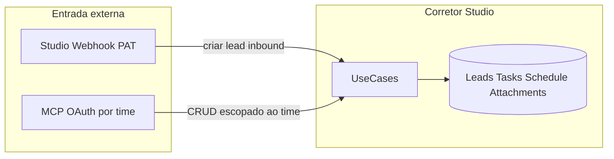
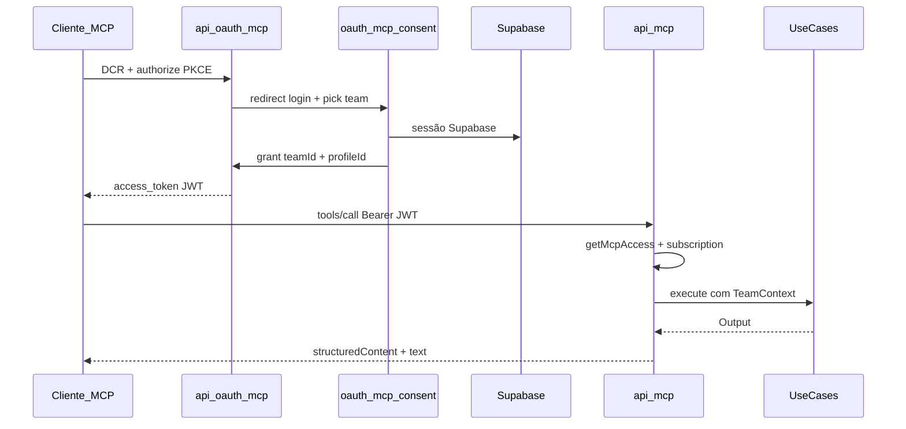

# Spec: MCP Corretor Studio — Servidor MCP por time (OAuth + Vercel)

Expõe o Corretor Studio como **servidor MCP HTTP** hospedado no mesmo deploy Next.js/Vercel, com **OAuth 2.1** (PKCE + DCR), conexão **por time** e tools de **CRUD** para leads, reuniões, tarefas e anexos — permitindo que agentes de IA (Claude, Cursor, ChatGPT) operem o CRM no escopo autorizado do usuário.

## Background

### Problema

Corretores e gestores usam cada vez mais assistentes de IA no dia a dia. Hoje o Corretor Studio só é acessível via **app web** (sessão Supabase) ou integrações pontuais (Studio Webhook para **criar** leads, WhatsApp por time para **leads**). Não há um protocolo padrão para que um **cliente MCP** liste, edite e gerencie leads, agenda e tarefas de forma programática e segura.

### Estado atual relevante

| Área | Referência no código |
|------|----------------------|
| Auth por time | `app/api/v1/utils/teamAccess.ts` — `getTeamAccess`, `hasLeadAccess`, `hasLeadActivityAccess` |
| Proxy / sessão | `proxy.ts` — injeta `x-supabase-user-id`; webhooks bypassam sessão |
| Leads CRUD | `app/api/v1/leads/`, `app/api/v1/leads/[id]/route.ts` |
| Busca de leads | `app/api/v1/leads/search/route.ts` |
| Reuniões (agenda) | `app/api/v1/leads/[id]/schedule/`, `LeadsSchedule`, `LeadScheduleService` |
| Tarefas | `app/api/v1/tasks/`, `CreateTaskUseCase`, `ListTasksUseCase` |
| Anexos | `app/api/v1/leads/[id]/attachments/`, `LeadAttachmentUseCase` |
| Times do usuário | `app/api/v1/teams/route.ts` |
| Integração webhook (PAT) | `TeamStudioWebhookConfig`, `app/api/v1/integrations/studio-webhook/` |
| UI integrações | `app/[supabaseId]/integrations/` — `StudioWebhookIntegration.tsx` |
| Feature gating | `lib/features/feature-slugs.ts`, `FeatureAccessService`, `backoffice_features` |
| Deploy | Vercel projeto `corretor-studio`, `vercel.json` (crons), CI `vercel deploy` |
| MCP no repo | **Não implementado** — apenas skills em `.claude/skills/mcp-builder/` |

### Lacunas

- Sem endpoint MCP (`/api/mcp`) nem transport Streamable HTTP.
- Sem OAuth 2.1 para clientes MCP (requisito do diretório de conectores Claude/ChatGPT).
- Sem modelo de grant OAuth por time + usuário.
- Sem tools MCP mapeadas aos use cases existentes.
- Sem feature slug `studio-mcp` nem UI de gestão de conexões MCP.
- `CreateTaskUseCase` não exposto em rota REST dedicada (`POST /api/v1/tasks`) — apenas via `leads/[id]/activities`.
- Tarefas: existe cancelamento (`POST .../cancel`), **não** existe hard delete.
- Anexos: rota usa auth inline (não `getTeamAccess`) — MCP deve unificar via `getMcpAccess`.

### Gatilho

Necessidade de uma **funcionalidade pública** que permita conectar assistentes de IA ao CRM **por time**, com autenticação OAuth e escopo estrito — sem expor dados de outros times ou contas.

### Separação Studio Webhook vs MCP



| Integração | Auth | Direção | Escopo |
|------------|------|---------|--------|
| Studio Webhook | PAT na URL | Inbound (externo → Studio) | Criar lead |
| MCP Corretor Studio | OAuth 2.1 JWT | Bidirecional (agente ↔ Studio) | CRUD leads, reuniões, tarefas, anexos |

## Goals

### Primários (must-have)

1. Servidor MCP HTTP em `POST /api/mcp` (Streamable HTTP, stateless) no deploy Vercel existente.
2. OAuth 2.1 com PKCE + Dynamic Client Registration (DCR) — elegível para diretório de conectores.
3. Conexão **por time**: no consentimento o usuário escolhe um time; o JWT carrega `team_id` + `profile_id` fixos.
4. Escopo de dados: **somente** o time do token; nenhuma tool retorna ou altera dados de outro time.
5. Tool `studio_list_my_teams` retorna **apenas** o time vinculado ao token (id, name, role, functions).
6. CRUD completo de **leads** do time (listar, buscar, criar, atualizar, excluir).
7. CRUD de **reuniões** (`LeadsSchedule`): agendar, atualizar, cancelar, consultar.
8. CRUD de **tarefas**: criar, atualizar, cancelar, listar, detalhar (sem hard delete em v1).
9. CRUD de **anexos** em leads: listar, upload (base64), excluir.
10. Feature `studio-mcp` registrada como **PUBLIC** com UI em Integrações para revogar grants.
11. Permissões alinhadas a `teamAccess` (SDR para leitura de leads, etc.).

### Secundários

12. Rate limiting por `client_id` + `profile_id`.
13. Log de uso (`lastUsedAt` em grants).
14. Evaluations XML (10 perguntas read-only) para QA do servidor MCP.
15. Postman: pasta OAuth MCP + exemplos de tools.

## Non-Goals

- **Widgets MCP** (`build-mcp-app`) em v1 — tools retornam JSON; degradação natural sem iframe.
- **PAT estático** por time para MCP — substituído por OAuth (PAT permanece só no Studio Webhook).
- **Subprojeto Vercel** separado — mesmo monólito Next.js.
- **Listar todos os times** do usuário via tool MCP — lista completa só na UI de consentimento OAuth.
- Hard delete de tarefas.
- Transferência de leads, billing, WhatsApp, e-mail, backoffice via MCP em v1.
- Alterar copy da landing page.
- Implementação de código nesta fase documental — ver **Implementation Phases**.

## Design

### Technical Approach

Seguir arquitetura canônica (`agents.md`):

```text
MCP Route -> getMcpAccess(JWT) -> UseCase -> [Service] -> Repository -> Prisma
```

**Componentes propostos:**

| Componente | Responsabilidade |
|------------|------------------|
| `app/api/mcp/route.ts` | Transport MCP Streamable HTTP (stateless) |
| `lib/mcp/server.ts` | Registro de tools, handler |
| `lib/mcp/auth/getMcpAccess.ts` | JWT → `TeamContext` (espelha `getTeamAccess`) |
| `lib/mcp/auth/jwt.ts` | Sign/verify access tokens |
| `app/api/oauth/mcp/*` | authorize, token, register (DCR) |
| `app/.well-known/oauth-*` | Metadata OAuth para clientes MCP |
| `app/oauth/mcp/consent/page.tsx` | Login Supabase + seletor de time + consentimento |
| `app/api/v1/integrations/mcp/route.ts` | GET grants / DELETE revoke (UI) |



### Data Model

**Proposto** — migration via `bun run db:migrate:from-prisma` após adicionar ao `schema.prisma`:

```prisma
model McpOAuthClient {
  id           String   @id @default(uuid()) @db.Uuid
  clientId     String   @unique @db.Text
  clientSecret String?  @db.Text
  name         String   @db.Text
  redirectUris String[] @db.Text
  createdAt    DateTime @default(now()) @db.Timestamptz(6)
  updatedAt    DateTime @updatedAt @db.Timestamptz(6)
  grants       TeamMcpOAuthGrant[]

  @@map("corretor_studio_mcp_oauth_clients")
}

model TeamMcpOAuthGrant {
  id               String    @id @default(uuid()) @db.Uuid
  teamId           String    @db.Uuid
  profileId        String    @db.Uuid
  clientId         String    @db.Text
  scopes           String[]  @db.Text
  refreshTokenHash String?   @db.Text
  revokedAt        DateTime? @db.Timestamptz(6)
  lastUsedAt       DateTime? @db.Timestamptz(6)
  createdAt        DateTime  @default(now()) @db.Timestamptz(6)
  updatedAt        DateTime  @updatedAt @db.Timestamptz(6)

  team    Team           @relation(fields: [teamId], references: [id], onDelete: Cascade)
  profile Profile        @relation(fields: [profileId], references: [id], onDelete: Cascade)
  client  McpOAuthClient @relation(fields: [clientId], references: [clientId], onDelete: Cascade)

  @@unique([teamId, profileId, clientId])
  @@index([profileId])
  @@index([teamId])
  @@map("corretor_studio_team_mcp_oauth_grants")
}
```

**JWT access token claims:**

| Claim | Tipo | Descrição |
|-------|------|-----------|
| `sub` | uuid | `profileId` |
| `team_id` | uuid | Time autorizado |
| `client_id` | string | Cliente OAuth MCP |
| `scope` | string | Escopos space-separated |
| `iss` | url | `NEXT_PUBLIC_APP_URL` |
| `exp` | number | TTL sugerido: 3600s |

### API

#### OAuth 2.1

| Método | Path | Propósito |
|--------|------|-----------|
| GET | `/.well-known/oauth-protected-resource` | Metadata do resource server MCP |
| GET | `/.well-known/oauth-authorization-server` | Metadata do authorization server |
| POST | `/api/oauth/mcp/register` | Dynamic Client Registration |
| GET | `/api/oauth/mcp/authorize` | Início do fluxo (PKCE S256) |
| POST | `/api/oauth/mcp/token` | Troca code + verifier por tokens |
| GET | `/app/oauth/mcp/consent` | UI consentimento (sessão Supabase) |

**Parâmetros authorize:** `client_id`, `redirect_uri`, `response_type=code`, `code_challenge`, `code_challenge_method=S256`, `state`, `scope`.

**Escopos sugeridos:** `leads:read`, `leads:write`, `tasks:read`, `tasks:write`, `meetings:read`, `meetings:write`, `attachments:read`, `attachments:write`.

#### MCP

| Método | Path | Auth |
|--------|------|------|
| POST | `/api/mcp` | `Authorization: Bearer <access_token>` |

Transport: `StreamableHTTPServerTransport` com `sessionIdGenerator: undefined` (stateless).

#### Integrações (UI)

| Método | Path | Auth |
|--------|------|------|
| GET | `/api/v1/integrations/mcp` | `getTeamAccess` — lista grants do time |
| DELETE | `/api/v1/integrations/mcp` | `getTeamAccess` — revoga grant |

#### Proxy bypass (`proxy.ts`)

Como `/api/webhooks`, bypass de injeção de sessão para:

- `/api/mcp`
- `/api/oauth/mcp`
- `/.well-known/oauth-*`

### Tools MCP (catálogo v1)

Prefixo `studio_`. Nomes ≤ 64 caracteres. Toda tool define `annotations.title` e hints (`readOnlyHint`, `destructiveHint`, `idempotentHint`, `openWorldHint`).

#### Leitura

| Tool | Input principal | Output | Permissão |
|------|-----------------|--------|-----------|
| `studio_list_my_teams` | — | `{ id, name, role, functions }` do time do token | membership ativa |
| `studio_list_leads` | `status?`, `assigneeId?`, `page?`, `limit?` | lista paginada | `hasLeadAccess` |
| `studio_get_lead` | `leadId` | lead + campos UI | `hasLeadAccess` + `lead.teamId === token.team_id` |
| `studio_search_leads` | `query`, `limit?` | resultados busca | `hasLeadAccess` |
| `studio_list_tasks` | `leadId?`, `dateFrom?`, `dateTo?` | tarefas do time | membership |
| `studio_get_task` | `taskId` | tarefa + assignees | via lead.teamId |
| `studio_get_meeting` | `leadId` | `LeadsSchedule` do lead | `hasLeadAccess` |
| `studio_list_meetings` | `dateFrom`, `dateTo` | agendas do time no período | membership |
| `studio_list_attachments` | `leadId` | anexos do lead | `hasLeadAccess` |

#### Escrita

| Tool | Input principal | Use case / serviço | Notas |
|------|-----------------|-------------------|-------|
| `studio_create_lead` | campos lead | `LeadUseCase` | validação schema existente |
| `studio_update_lead` | `leadId`, patch | `LeadUseCase` | |
| `studio_delete_lead` | `leadId` | `LeadUseCase` | `destructiveHint: true` |
| `studio_create_task` | `leadId`, title, body, ... | `CreateTaskUseCase` | |
| `studio_update_task` | `taskId`, patch | task repository / use case | |
| `studio_cancel_task` | `taskId` | cancel route logic | sem hard delete |
| `studio_schedule_meeting` | `leadId`, date, closerId?, ... | `LeadScheduleService` | |
| `studio_update_meeting` | `leadId`, patch | schedule PATCH | |
| `studio_cancel_meeting` | `leadId` | schedule cancel | |
| `studio_upload_attachment` | `leadId`, fileName, mimeType, contentBase64 | `LeadAttachmentUseCase` | limite 10 MB |
| `studio_delete_attachment` | `leadId`, `attachmentId` | `LeadAttachmentUseCase` | |

**Regra transversal:** antes de qualquer operação em lead/task/meeting/attachment, validar `resource.teamId === jwt.team_id`.

**Implementação interna:** tools chamam use cases diretamente — **não** HTTP loopback para `/api/v1`.

### UI/UX

**Página Integrações** (`app/[supabaseId]/integrations/`):

- Novo card **Conexão MCP** (espelhar `StudioWebhookIntegration.tsx`).
- Exibir: URL do servidor MCP (`{APP_URL}/api/mcp`), instruções OAuth, lista de grants ativos por time.
- Ação: revogar conexão (DELETE grant).
- Gated por `hasAccess(FEATURE_SLUGS.STUDIO_MCP)`.

**Página consentimento** (`/oauth/mcp/consent`):

1. Se sem sessão → redirect sign-in Supabase.
2. Listar times do usuário (memberships ativas).
3. Usuário seleciona **um** time.
4. Exibir escopos solicitados pelo cliente MCP.
5. Confirmar → redirect com `code` para `redirect_uri`.

Estados: loading, empty (sem times), error (assinatura inativa), success.

### Feature registration

Slug: `studio-mcp`

| Campo | Valor proposto |
|-------|----------------|
| `accessMode` | `PUBLIC` |
| `defaultAccessLevel` | `NONE` |
| `betaEnabled` | `true` (inicial) |
| `productSlug` | `null` |
| `parentSlug` | `integration` (filha de Integrações) |

**Regras de acesso propostas:**

| Principal | Nível |
|-----------|-------|
| MASTER | FULL |
| MANAGER | FULL |
| SDR | FULL |
| CLOSER | READ (somente tools read-only?) |

> Ver Open Questions sobre nível CLOSER.

**Dois passos (`agents.md`):**

1. `bun run db:migrate:new seed-studio-mcp` — SQL idempotente
2. `prisma/seed-backoffice-products.ts` + `lib/features/feature-slugs.ts`

### Deploy Vercel

- **Mesmo projeto** `corretor-studio` — sem segundo deploy.
- URL pública: `https://<NEXT_PUBLIC_APP_URL>/api/mcp`
- `export const maxDuration = 60` em `app/api/mcp/route.ts`.
- Rate limiting: `lib/mcp/rate-limit.ts` (ver `build-mcp-app/references/abuse-protection.md`).
- CI existente: `.github/workflows/ci-main.yml` → `vercel deploy --prod`.

**Env vars novas:**

| Variável | Propósito |
|----------|-----------|
| `MCP_OAUTH_JWT_SECRET` | Assinatura HMAC dos access tokens |
| `MCP_OAUTH_ISSUER` | Issuer OAuth (default: `NEXT_PUBLIC_APP_URL`) |

Registrar em `lib/env/validation.ts`.

## Edge Cases & Error Handling

| Cenário | Comportamento |
|---------|---------------|
| JWT expirado | 401 com mensagem acionável: "Reautorize o conector MCP" |
| Membership revogada após grant | 403 em toda tool; grant pode ser invalidado lazy |
| Assinatura da conta inativa | 403 (mesmo `isAccountSubscriptionActive`) |
| Lead de outro time | 404 (não vazar existência) |
| Upload > 10 MB | 400 com limite explícito |
| `contentBase64` inválido | 400 |
| Prisma cold start / timeout Vercel | Paginação obrigatória; `maxDuration`; mensagem de retry |
| Cliente OAuth revogado | 401 no token endpoint e nas tools |
| PKCE verifier incorreto | 400 no token endpoint |
| redirect_uri mismatch | 400 no authorize |

Mensagens de erro MCP devem ser **acionáveis** para o agente (skill mcp-builder).

## Security & Privacy

### Threat model

| Vetor | Mitigação |
|-------|-----------|
| Token theft | TTL curto, refresh token com hash, revogação na UI |
| Cross-team data leak | `team_id` no JWT + validação em toda tool |
| CSRF no consent | `state` parameter OAuth |
| DCR abuse | Rate limit no register; validação redirect_uri |
| DoS / abuse | Rate limit por IP + client_id + profile_id |
| PII em logs | Não logar payloads de leads; logar `tool`, `profileId`, `teamId`, status |

### Autorização

- `getMcpAccess(bearerToken)` resolve JWT → valida grant não revogado → carrega `teamMember` → checa assinatura.
- Reutilizar `hasLeadAccess`, `hasLeadActivityAccess` de `teamAccess.ts`.
- Escrita destrutiva (`studio_delete_lead`, `studio_delete_attachment`) exige permissões equivalentes à API web.

### Diretório de conectores

Requisitos (`.claude/skills/build-mcp-app/references/directory-checklist.md`):

- OAuth (não bearer estático) — atendido.
- Annotations em todas as tools.
- Screenshots 3–5 PNG (fase de implementação).

## Testing Strategy

### Fase de implementação

| Tipo | Escopo |
|------|--------|
| Unit | `getMcpAccess`, JWT sign/verify, scope checks |
| Integration | OAuth flow PKCE end-to-end (mock Supabase session) |
| MCP Inspector | `npx @modelcontextprotocol/inspector` contra `/api/mcp` |
| Headless | JSON-RPC via `mcp-remote` (ver build-mcp-app skill) |
| Evaluations | 10 QA pairs XML read-only (mcp-builder Phase 4) |

### Cenários manuais críticos

1. OAuth completo: DCR → authorize → consent → token → `tools/list`.
2. `studio_list_leads` retorna só leads do time do token.
3. Tentativa de `studio_get_lead` com ID de outro time → 404.
4. Revogar grant na UI → tools falham com 401.
5. Upload anexo base64 válido → aparece no lead na UI web.

## Success Criteria

### Documentação (esta fase)

- [x] `specs/corretor-studio-mcp.md` com todas as seções create-spec.
- [x] Notas Obsidian espelhadas em `docs/obsidian/specs/`.
- [x] Diagramas mermaid e catálogo de tools completo.

### Implementação (fase futura)

- [ ] Cliente MCP (Claude/Cursor) conecta via OAuth e lista tools.
- [ ] 100% das tools respeitam `team_id` do JWT.
- [ ] Permissões equivalentes à API web para mesmo role/function.
- [ ] Feature `studio-mcp` visível em Integrações para usuários elegíveis.
- [ ] `bun run governance:check` passa após implementação.
- [ ] p95 tool read < 5s em produção (excluindo cold start).

## Implementation Phases

### Fase 0 — Fundação documental

- [x] `specs/corretor-studio-mcp.md`
- [x] Diagramas mermaid
- [x] Cópia Obsidian em `docs/obsidian/specs/`
- [x] Notas satélite Obsidian (oauth, tools, security, implementation-phases)

### Fase 1 — Schema + OAuth

- [ ] Models `McpOAuthClient`, `TeamMcpOAuthGrant` + migration
- [ ] `lib/mcp/auth/` (JWT, getMcpAccess)
- [ ] Rotas OAuth + well-known
- [ ] Bypass `proxy.ts`
- [ ] `lib/env/validation.ts`
- [ ] Página `/oauth/mcp/consent`

### Fase 2 — Servidor MCP + tools read

- [ ] `app/api/mcp/route.ts` + `@modelcontextprotocol/sdk`
- [ ] Tools read-only (`studio_list_*`, `studio_get_*`, `studio_search_leads`)
- [ ] Rate limiting

### Fase 3 — Tools write

- [ ] Tools write leads, tasks, meetings, attachments
- [ ] Upload base64 → `LeadAttachmentUseCase`

### Fase 4 — Feature + UI

- [ ] Migration seed `studio-mcp` + `feature-slugs.ts`
- [ ] Card MCP em Integrações
- [ ] `GET/DELETE /api/v1/integrations/mcp`

### Fase 5 — Hardening + publicação

- [ ] Postman collection
- [ ] Evaluations XML
- [ ] Testes integração OAuth
- [ ] Screenshots para diretório de conectores
- [ ] `governance:check` + deploy produção

## Open Questions

- [ ] **CLOSER** deve ter escrita via MCP ou somente leitura? (API web varia por fluxo)
- [ ] Escopos granulares (`leads:write` sem `attachments:write`) ou bundle único `crm:full` em v1?
- [ ] TTL do access token: 1h vs 24h — trade-off UX vs segurança
- [ ] Refresh token rotation obrigatória?
- [ ] Múltiplos grants do mesmo usuário para o mesmo time + clientes diferentes — permitido?
- [ ] Sponsor master (`backoffice` role sintético) pode autorizar MCP?
- [ ] Caminho do vault Obsidian pessoal além de `docs/obsidian/` no repo

## Decisions Log

> **Q:** Onde hospedar o MCP?
> **A:** Mesmo deploy Next.js/Vercel (`app/api/mcp/route.ts`) — reutiliza Prisma e use cases.

> **Q:** Qual modelo de auth?
> **A:** OAuth 2.1 (PKCE + DCR) — requisito para diretório de conectores; PAT estático não listável.

> **Q:** Escopo por time ou por usuário?
> **A:** Conexão **por time** — JWT fixa `team_id` no consentimento. Lista de times do usuário só na UI de consentimento.

> **Q:** Widgets MCP em v1?
> **A:** Não — JSON/text suficiente; widgets em fase futura se precisar picker visual.

> **Q:** Hard delete de tarefas?
> **A:** Não em v1 — `studio_cancel_task` apenas.

> **Q:** Feature pública significa authless?
> **A:** Não — `PUBLIC` é modo de feature gating (`backoffice_features`), não auth do MCP. MCP exige OAuth.

## References

| Recurso | Path |
|---------|------|
| Team access | `app/api/v1/utils/teamAccess.ts` |
| Leads | `app/api/useCases/leads/LeadUseCase.ts` |
| Schedule | `app/api/services/leadSchedule/LeadScheduleService.ts` |
| Tasks | `app/api/useCases/task/` |
| Attachments | `app/api/useCases/leadAttachments/LeadAttachmentUseCase.ts` |
| Webhook pattern | `lib/webhooks/studioWebhookSecurity.ts` |
| Integrações UI | `app/[supabaseId]/integrations/` |
| Feature slugs | `lib/features/feature-slugs.ts` |
| MCP builder skill | `.claude/skills/mcp-builder/SKILL.md` |
| MCP app skill | `.claude/skills/build-mcp-app/SKILL.md` |
| Deploy | `docs/VERCEL_DEPLOYMENT.md` |
| Spec relacionada | `specs/studio-bot-n8n.md` |
