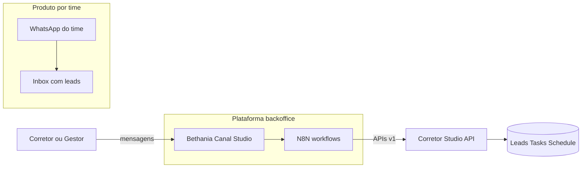
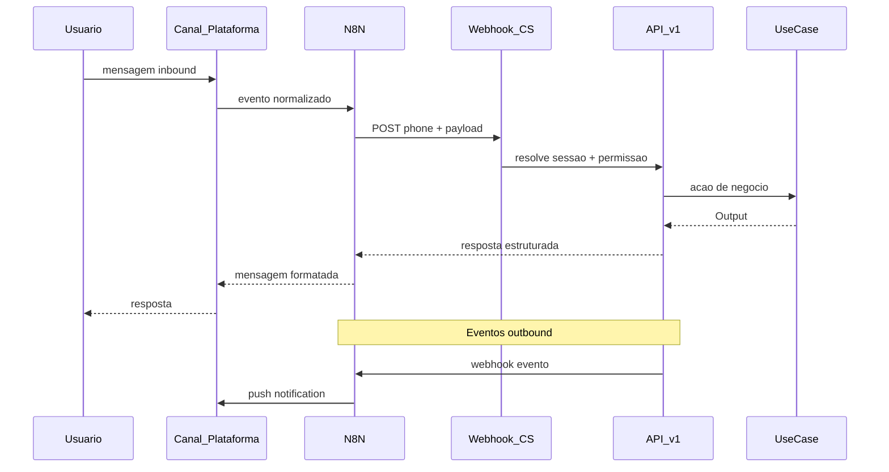
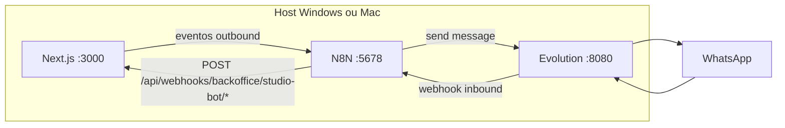
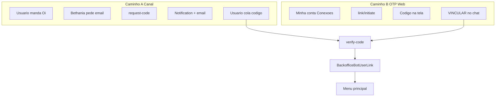
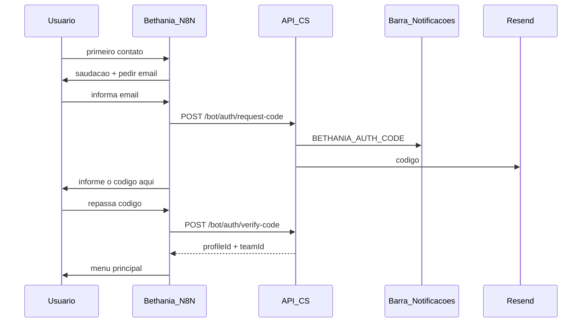
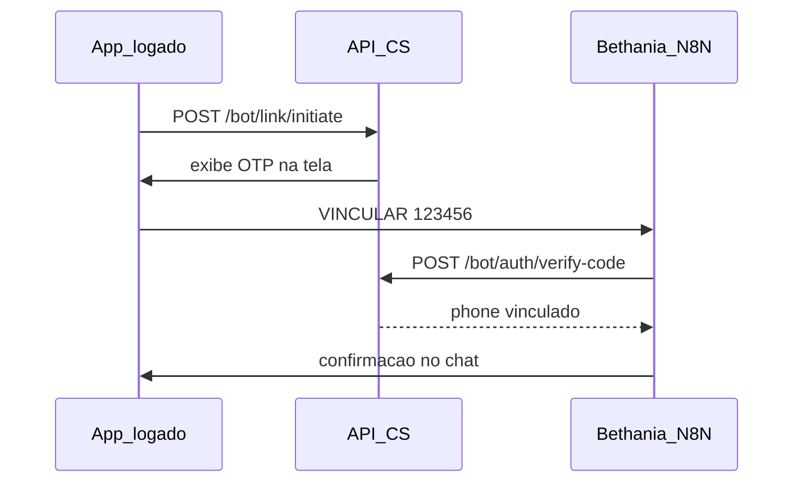
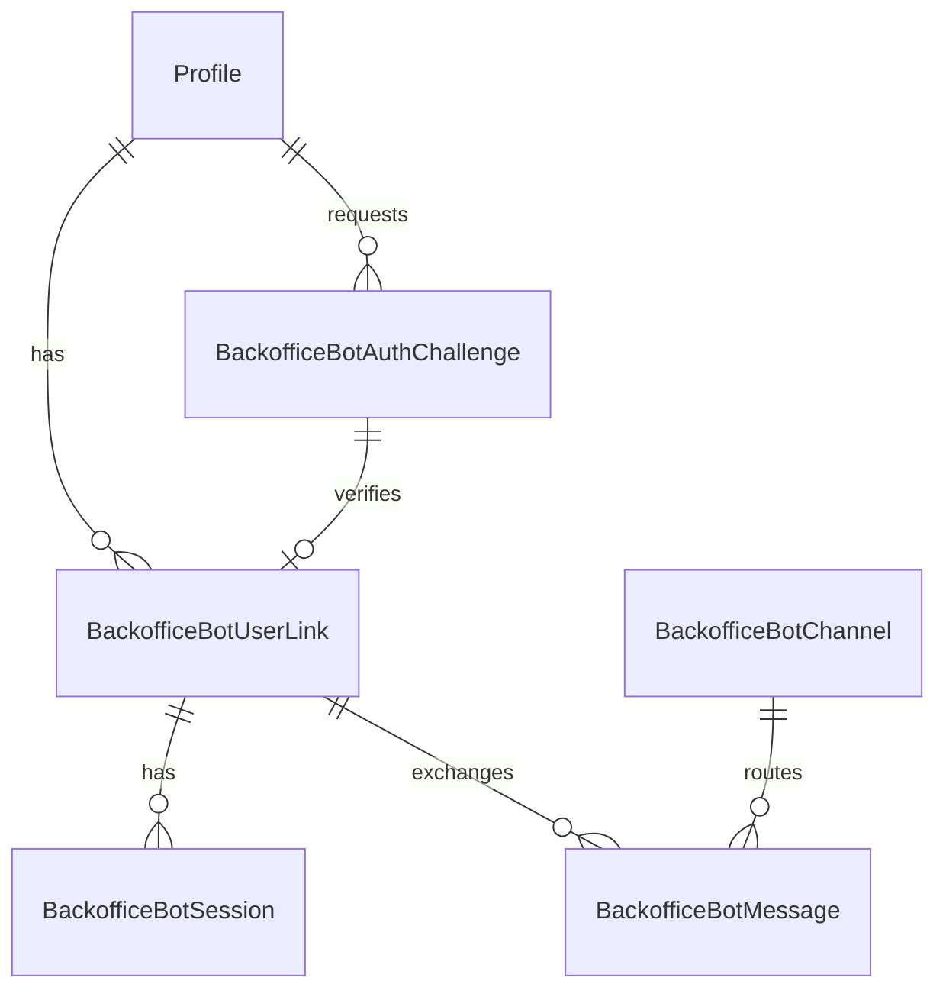
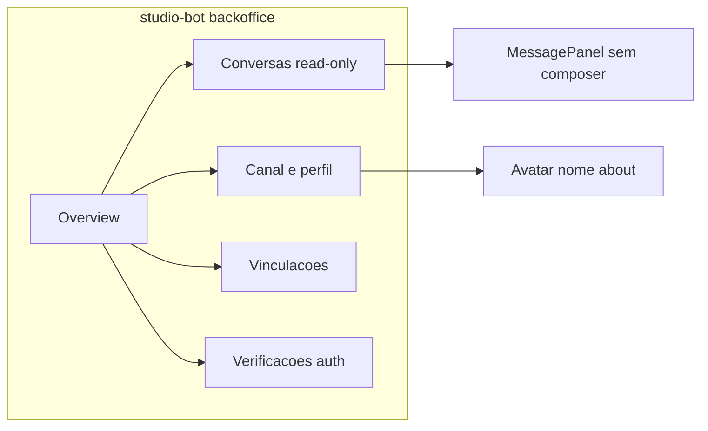
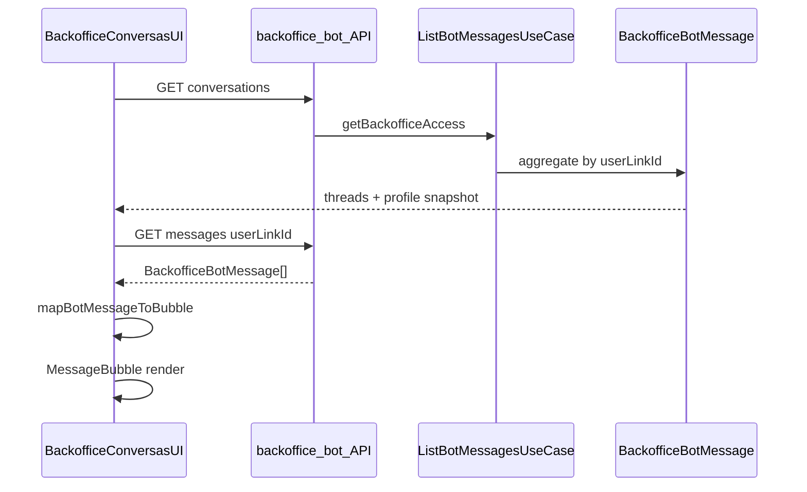

# Spec: Bethânia — Bot N8N do Corretor Studio

Introduz a **Bethânia**, assistente conversacional do Corretor Studio orquestrada por **N8N** (sem LLM em v1), para notificações bidirecionais com usuários do produto (MASTER, MANAGER, OPERATOR): consulta de leads, upload de documentos, agendamento de reuniões e criação de tarefas — com autenticação híbrida e canal gerenciado exclusivamente pelo backoffice interno.

## Background

### Problema

Corretores e gestores operam em mobilidade e precisam consultar leads, registrar ações e receber alertas sem abrir o CRM completo. Hoje o produto oferece notificações in-app, e-mail, web push e WhatsApp **por time** para conversar com **leads** — mas não há canal dedicado para o **usuário do produto** interagir com o Corretor Studio de forma conversacional e acionável.

### Estado atual relevante

| Área | Referência no código |
|------|----------------------|
| Leads, tarefas, agenda | `app/api/v1/leads/`, `app/api/v1/tasks/`, `app/api/v1/leads/[id]/schedule/` |
| Notificações in-app | `Notification`, `NotificationService`, `app/api/v1/notifications/` |
| Permissões por time | `app/api/v1/utils/teamAccess.ts` — `hasLeadAccess`, `hasLeadActivityAccess` |
| Feature slugs | `lib/features/feature-slugs.ts`, `FeatureAccessService` |
| WhatsApp de leads (por time) | `TeamWhatsAppConfig`, `WhatsAppConversation`, `app/[supabaseId]/whatsapp/` |
| Inbox WhatsApp produto (componentes reutilizáveis) | `WhatsAppInboxContainer`, `ConversationList`, `ConversationItem`, `MessagePanel`, `MessageBubble`, `formatWhatsAppMessageText` em `app/[supabaseId]/whatsapp/features/` |
| WhatsApp provisionado (backoffice) | `app/backoffice/(app)/whatsapp/`, `BackofficeWhatsAppInstanceUseCase` |
| Minha conta / Conexões | `app/[supabaseId]/account/page.tsx` — aba `connections` (Google Calendar) |
| Webhook de leads externos | `app/api/webhooks/studio/[teamId]/[token]/` (n8n já citado na UI de integrações) |
| E-mail transacional | Resend |
| Dev local Evolution (Docker) | `docker-compose.evolution.yml`, `.env.evolution.example`, scripts `evo:*`, `scripts/dev-local.ts` (`--skip-evo`) |
| Dev local N8N (Docker) | **A implementar** — espelhar padrão Evolution: `docker-compose.n8n.yml`, `.env.n8n.example`, scripts `n8n:*`, `dev-local.ts` (`--skip-n8n`) |

### Lacunas

- Sem modelo de sessão bot nem vínculo phone → `Profile`.
- Sem fluxo de verificação via barra de notificações + e-mail.
- Sem webhooks outbound do domínio para N8N.
- Sem API enxuta de contexto de lead para orquestração externa.
- `WhatsAppConversation` é domínio de **leads**, não de usuários do produto.

### Gatilho

Necessidade de um bot de plataforma (**Bethânia**) para conversas usuário ↔ Corretor Studio, com automação N8N (v1 sem LLM), controle de permissões por papel e gestão centralizada no backoffice.

### Separação crítica do WhatsApp existente



**Não reutilizar** `WhatsAppConversation` para sessões da Bethânia — misturaria domínios, permissões e billing.

## Goals

### Primários (must-have)

1. **Bethânia** como assistente menu-driven (comandos + botões WhatsApp) entre usuário **verificado** e Corretor Studio.
2. **Autenticação híbrida** com log unificado em `BackofficeBotAuthChallenge`:
   - **Caminho A (canal):** e-mail no chat → código na barra de notificações + e-mail → validação no chat.
   - **Caminho B (OTP web):** Minha conta → Conexões → Vincular Bethânia → `VINCULAR {código}` no chat.
3. Consulta de leads no escopo do usuário (MASTER / MANAGER / OPERATOR).
4. Ações no lead: nota, anexo, agendar/remarcar/cancelar reunião, criar tarefa.
5. Notificações push acionáveis via N8N (reunião, tarefa, lead atribuído).
6. Gestão do canal no backoffice: status, logs, vinculações, auditoria de auth.
7. Auditoria em `LeadActivity` com origem `studio_bot` / identidade Bethânia.

### Secundários

8. Preferências de notificação da Bethânia por usuário.
9. Deep links do chat para telas do CRM web.
10. Digest matinal opt-in para MANAGER+ (`RESUMO`).

## Non-Goals

- LLM / NLU / interpretação de texto livre em v1.
- Bethânia respondendo **clientes finais** (leads) — permanece no módulo WhatsApp por time.
- Transferência de lead, edição cadastral ampla, chat entre usuários.
- UI de **gestão** do bot no produto — apenas backoffice interno; touchpoints de produto limitados a Conexões + notificações.
- **Envio manual de mensagens** pelo backoffice em v1 — inbox backoffice é read-only; outbound automatizado via N8N.
- OTP gerado manualmente no backoffice.
- Multi-canal além do primário em v1 (arquitetura extensível; implementar um canal).
- Alterar copy ou fluxo da landing page.

## Design

### Technical Approach

Seguir arquitetura canônica (`agents.md`):

```text
Webhook / Route -> UseCase -> [Service] -> Repository -> Prisma
```

**Componentes:**

| Componente | Responsabilidade |
|------------|------------------|
| **Canal plataforma** | Número único gerido no backoffice (WhatsApp Business via Evolution, alinhado ao stack) |
| **N8N** | State machine, menus, retries, rate limit, templates HSM |
| **Webhook inbound** | `app/api/webhooks/backoffice/studio-bot/` — HMAC, idempotency |
| **Bot API (produto)** | `app/api/v1/bot/*` — auth, contexto, ações (phone link) |
| **Bot API (backoffice)** | `app/api/v1/backoffice/bot/*` — canal, auditoria, admin |
| **BotPolicyService** | Espelha `getTeamAccess` + `hasLeadAccess` / `hasLeadActivityAccess` |
| **Event dispatcher** | `BackofficeBotEventOutbox` → webhooks N8N |
| **Backoffice UI** | `app/backoffice/(app)/studio-bot/` |



Toda mutação revalida permissões no backend — **nunca confiar só no N8N**.

### Desenvolvimento local — N8N (Docker)

Espelha o padrão já estabelecido pela **Evolution API** no repositório (`docker-compose.evolution.yml`, `evo:*`, `scripts/dev-local.ts`). O N8N roda em stack Docker **isolada** do Supabase (55322) e do Postgres da Evolution.

#### Topologia local



- Comunicação entre containers e o host via `host.docker.internal` (mesmo padrão de `EVO_WEBHOOK_PUBLIC_URL`).
- Em dev local, a Bethânia usa a **Evolution existente** com instância dedicada `bethania` — separada das instâncias WhatsApp de leads por time.

#### Arquivos propostos (Fase 1)

| Arquivo | Propósito |
|---------|-----------|
| `docker-compose.n8n.yml` | Serviço `n8n` + `n8n-postgres` dedicado |
| `.env.n8n.example` | Credenciais, `N8N_ENCRYPTION_KEY`, timezone, URLs de webhook |
| `.env.n8n` | Gitignored; bootstrap de `.env.n8n.example` no primeiro `bun dev` |

Referência de implementação Evolution: [`docker-compose.evolution.yml`](../docker-compose.evolution.yml), [`.env.evolution.example`](../.env.evolution.example).

#### Especificação do Compose

| Item | Valor |
|------|-------|
| Imagem | `docker.io/n8nio/n8n:latest` (fixar tag em produção) |
| Porta host | `127.0.0.1:5678:5678` |
| Volume | `n8n_data` — workflows e credenciais |
| Postgres | `n8n-postgres` — `postgres:15-alpine`, credenciais fixas `n8n` / `n8n` (sem colidir com Supabase ou Evolution) |
| `extra_hosts` | `host.docker.internal:host-gateway` |
| Healthcheck | `GET http://127.0.0.1:5678/healthz` |
| Rede | `n8n-net` (bridge isolada) |

Exemplo esquemático do serviço `n8n` (documentação — implementar em Fase 1):

```yaml
services:
  n8n:
    image: docker.io/n8nio/n8n:latest
    container_name: n8n
    restart: unless-stopped
    depends_on:
      n8n-postgres:
        condition: service_healthy
    ports:
      - "127.0.0.1:5678:5678"
    volumes:
      - n8n_data:/home/node/.n8n
    networks:
      - n8n-net
    env_file:
      - .env.n8n
    extra_hosts:
      - "host.docker.internal:host-gateway"
    healthcheck:
      test: ["CMD-SHELL", "wget -q --spider http://127.0.0.1:5678/healthz || exit 1"]
      interval: 5s
      timeout: 5s
      retries: 12
      start_period: 30s
```

#### Scripts Bun (espelhar `evo:*`)

```json
"n8n:up": "docker compose -f docker-compose.n8n.yml --env-file .env.n8n up -d",
"n8n:down": "docker compose -f docker-compose.n8n.yml --env-file .env.n8n down",
"n8n:reset": "docker compose -f docker-compose.n8n.yml --env-file .env.n8n down -v && docker compose -f docker-compose.n8n.yml --env-file .env.n8n up -d",
"n8n:logs": "docker compose -f docker-compose.n8n.yml --env-file .env.n8n logs -f n8n"
```

#### Integração `bun run dev`

Espelhar [`scripts/dev-local.ts`](../scripts/dev-local.ts):

| Comportamento | Detalhe |
|---------------|---------|
| Auto-start | Se N8N não responde em `:5678`, executa `bun run n8n:up` e aguarda healthcheck |
| Bootstrap | `bootstrapN8nEnv()` — copia `.env.n8n.example` → `.env.n8n` se ausente |
| Flag | `--skip-n8n` — não sobe nem valida N8N (como `--skip-evo`) |
| Overrides | `getLocalN8nOverrides()` injeta `N8N_BASE_URL` e secrets no processo Next.js |
| Ordem preflight | Supabase → Evolution → **N8N** → Next.js |

#### Variáveis de ambiente (N8N + Bethânia)

| Variável | Dev local | Produção |
|----------|-----------|----------|
| `N8N_BASE_URL` | `http://127.0.0.1:5678` | URL do serviço N8N |
| `N8N_WEBHOOK_BASE_URL` | `http://host.docker.internal:5678` | URL que Evolution e outros containers usam para chamar N8N |
| `BACKOFFICE_N8N_OUTBOUND_URL` | `http://127.0.0.1:5678/webhook/bethania-outbound` | Webhook CS → N8N (eventos outbound) |
| `BACKOFFICE_STUDIO_BOT_WEBHOOK_SECRET` | chave local compartilhada (HMAC) | Secret produção |
| `N8N_BETHANIA_INBOUND_PATH` | `/webhook/bethania-inbound` | Path do workflow inbound |
| `EVO_BETHANIA_INSTANCE` | `bethania` | Nome da instância Evolution da Bethânia |
| `BACKOFFICE_BETHANIA_WHATSAPP_NUMBER` | número de teste | Número oficial |

`bun run dev` lê secrets de `.env.n8n` quando `N8N_BASE_URL` aponta para localhost — mesmo padrão de `EVO_API_KEY` ← `AUTHENTICATION_API_KEY` em `.env.evolution`.

Documentar também em `.env.example` (Fase 1), na mesma seção das vars Evolution.

#### Primeiro uso (checklist dev)

1. Docker Desktop em execução.
2. `cp .env.n8n.example .env.n8n` (ou deixar o `bun dev` criar automaticamente).
3. `bun run dev` — sobe Supabase + Evolution + N8N.
4. UI N8N: `http://127.0.0.1:5678` — criar usuário admin no primeiro acesso.
5. Importar workflows base (Fase 2) a partir de `n8n/workflows/`.
6. Na Evolution: instância `bethania` com webhook apontando para `{N8N_WEBHOOK_BASE_URL}{N8N_BETHANIA_INBOUND_PATH}`.
7. No backoffice (quando UI existir): `BackofficeBotChannel.n8nInboundUrl` e secrets alinhados.

Comandos úteis isolados:

```bash
bun run n8n:up      # sobe stack
bun run n8n:logs    # acompanha logs
bun run n8n:down    # para stack
bun run n8n:reset   # recria volumes (postgres desatualizado)
bun run dev -- --skip-n8n   # dev sem Bethânia/N8N
```

#### Troubleshooting

| Sintoma | Ação |
|---------|------|
| N8N não sobe | `bun run n8n:logs` |
| Container Postgres em crash-loop | `bun run n8n:reset` e reiniciar `bun dev` |
| Webhook N8N não alcança o app | Conferir `host.docker.internal:3000` e firewall |
| Evolution não alcança N8N | Conferir `N8N_WEBHOOK_BASE_URL` em `.env.n8n` |
| Dev sem Bethânia | `bun run dev -- --skip-n8n` |

### Autenticação híbrida

Ambos os caminhos convergem em `BackofficeBotAuthChallenge` + `POST /api/v1/bot/auth/verify-code`. Campo `source`: `channel_email` | `web_otp`.



#### Caminho A — Fluxo no canal



**Quando usar:** usuário descobre a Bethânia pelo WhatsApp; abre o app só para ler o código na barra de notificações.

**Copy de saudação:**

> Olá! Eu sou a **Bethânia**, assistente do Corretor Studio. Antes de continuarmos, preciso confirmar sua identidade. Qual é o e-mail que você usa para acessar a plataforma?

#### Caminho B — OTP web



**Passos:**

1. Usuário logado em **Minha conta → Conexões** (`/{supabaseId}/account`, tab `connections`).
2. Card **Vincular Bethânia** (padrão visual Google Calendar em `account/page.tsx`).
3. `POST /api/v1/bot/link/initiate` — headers `x-supabase-user-id` + `x-team-id`; `profileId` da sessão; código 6 dígitos TTL 10 min; `source: web_otp`.
4. UI exibe: *Envie `VINCULAR 123456` para a Bethânia* + deep link WhatsApp.
5. Usuário envia `VINCULAR 123456` ou `123456` no chat.
6. `verify-code` associa phone ao profile.

**Copy orientação (chat):**

> Para vincular seu número, acesse **Minha conta → Conexões → Vincular Bethânia** e envie: `VINCULAR` + código de 6 dígitos.

#### Regras compartilhadas

1. Phone sem vínculo → N8N chama `GET /api/v1/bot/auth/status`.
2. Mensagem com `VINCULAR {code}` ou 6 dígitos → tentar verify (caminho B).
3. Caso contrário → caminho A (saudação + e-mail).
4. Sessão N8N: `profileId`, `teamId`, `flowStack`, `currentLeadId` (TTL 30 min).
5. Vínculo revogado → reautenticação por qualquer caminho.
6. Máx. 5 tentativas de verify por challenge; máx. 3 gerações de código por profile/hora.

### Data Model

Isolamento backoffice conforme `agents.md` — tabelas prefixadas `Backoffice*`.



#### `BackofficeBotChannel`

| Campo | Tipo | Descrição |
|-------|------|-----------|
| `id` | UUID | PK |
| `displayName` | Text | Nome exibido no WhatsApp (default `Bethânia`) |
| `avatarUrl` | Text? | URL pública da foto de perfil (storage) |
| `avatarStoragePath` | Text? | Path no bucket para upload/replace |
| `aboutText` | Text? | Status/about WhatsApp (máx. 139 caracteres) |
| `phoneNumber` | Text? | E.164 — read-only no backoffice após connect |
| `lastProfileSyncAt` | Timestamptz? | Última sync de perfil com Evolution / Cloud API |
| `channelType` | enum | `whatsapp` (v1) |
| `status` | enum | `pending`, `connected`, `disconnected`, `error` |
| `providerConfig` | Json | Credenciais Evolution / Cloud API |
| `webhookSecret` | Text | HMAC inbound |
| `n8nInboundUrl` | Text? | URL workflow N8N |
| `n8nOutboundSecret` | Text | HMAC outbound |
| `isActive` | Boolean | |
| `createdAt` / `updatedAt` | Timestamptz | |

**Gestão de identidade (backoffice):** `PATCH` salva no DB e dispara sync para o provedor (Evolution `updateProfile` ou equivalente Cloud API). Falha de sync → toast + badge "Perfil pendente sync" na UI.

#### `BackofficeBotAuthChallenge`

Auditoria unificada de verificação.

| Campo | Tipo | Descrição |
|-------|------|-----------|
| `id` | UUID | PK |
| `source` | enum | `channel_email`, `web_otp` |
| `normalizedPhone` | Text? | E.164; preenchido no verify (B) ou no request (A) |
| `emailRequested` | Text? | Caminho A |
| `profileId` | UUID? | Pré-preenchido em `web_otp`; resolvido por e-mail em `channel_email` |
| `codeHash` | Text | bcrypt/argon2 — nunca plain-text |
| `status` | enum | `pending`, `verified`, `expired`, `failed` |
| `attemptCount` | Int | Default 0 |
| `expiresAt` | Timestamptz | TTL 10 min |
| `verifiedAt` | Timestamptz? | |
| `ipMetadata` | Json? | Auditoria opcional |
| `createdAt` / `updatedAt` | Timestamptz | |

Índices: `(normalizedPhone, status)`, `(profileId, createdAt DESC)`.

#### `BackofficeBotUserLink`

| Campo | Tipo | Descrição |
|-------|------|-----------|
| `id` | UUID | PK |
| `profileId` | UUID | FK → Profile |
| `normalizedPhone` | Text | E.164, unique ativo |
| `linkedAt` | Timestamptz | |
| `linkedBy` | enum | `channel_email`, `web_otp` |
| `authChallengeId` | UUID | FK → challenge |
| `isActive` | Boolean | |
| `lastInteractionAt` | Timestamptz? | |
| `revokedAt` | Timestamptz? | |

Unique: `@@unique([normalizedPhone])` onde `isActive = true` (partial index).

#### `BackofficeBotSession`

| Campo | Tipo | Descrição |
|-------|------|-----------|
| `id` | UUID | PK |
| `userLinkId` | UUID | FK |
| `teamId` | UUID | Time ativo na sessão |
| `currentLeadId` | UUID? | Contexto pegajoso |
| `flowId` | Text? | Ex.: `lead-context`, `meeting-reschedule` |
| `flowStep` | Text? | |
| `flowStack` | Json | Pilha de menus |
| `expiresAt` | Timestamptz | TTL 30 min |

#### `BackofficeBotMessage`

| Campo | Tipo | Descrição |
|-------|------|-----------|
| `id` | UUID | PK |
| `userLinkId` | UUID? | Null durante auth |
| `direction` | enum | `inbound`, `outbound` |
| `channelMessageId` | Text? | Idempotency |
| `flowId` | Text? | |
| `errorCode` | Text? | |
| `payload` | Json | Conteúdo normalizado (ver schema abaixo) |
| `createdAt` | Timestamptz | |

**Schema `payload` normalizado** (obrigatório no webhook inbound para reuso de bolhas WhatsApp):

```typescript
{
  messageType: "text" | "image" | "document" | "audio" | "video" | "sticker" | "location";
  contentText?: string | null;
  mediaUrl?: string | null;
  caption?: string | null;
  mediaFileName?: string | null;
  linkPreview?: { title?: string; description?: string; imageUrl?: string; url?: string } | null;
  pushName?: string | null; // nome WhatsApp do remetente inbound
}
```

Mapeamento para renderização no backoffice (adaptador `mapBotMessageToBubble`):

| Campo payload | Campo bolha (`MessagingMessage`) |
|---------------|----------------------------------|
| `messageType` | `messageType` |
| `contentText` | `contentText` |
| `mediaUrl` / `caption` | idem |
| `direction` outbound | `senderDisplayName` = `BackofficeBotChannel.displayName` |
| `direction` inbound | `senderDisplayName` = `Profile.fullName` ou `pushName` |

#### `BackofficeBotNotificationPreference`

| Campo | Tipo | Descrição |
|-------|------|-----------|
| `id` | UUID | PK |
| `profileId` | UUID | FK |
| `type` | Text | Ex.: `meeting_reminder_30m` |
| `enabled` | Boolean | |
| `quietHours` | Json? | v1.1 |

Unique: `@@unique([profileId, type])`.

#### `BackofficeBotEventOutbox`

| Campo | Tipo | Descrição |
|-------|------|-----------|
| `id` | UUID | PK |
| `eventType` | Text | Ex.: `meeting.reminder_30m` |
| `profileId` | UUID | Destinatário |
| `payload` | Json | `leadCode`, `deepLink`, `actionButtons` |
| `status` | enum | `pending`, `sent`, `failed` |
| `idempotencyKey` | Text | Unique |
| `createdAt` / `sentAt` | Timestamptz | |

#### Alterações em modelos existentes

**`NotificationType`** — adicionar:

```prisma
BETHANIA_AUTH_CODE
```

Copy na notificação (código só no corpo renderizado, não em `metadata`):

- **Canal:** "Seu código de verificação da Bethânia: **{code}**. Válido por 10 minutos. Informe na conversa com a Bethânia."
- **Web:** "Seu código: **{code}**. Envie `VINCULAR {code}` para a Bethânia no WhatsApp."

`metadata: { challengeId, source, expiresAt }`.

**`ActivityType`** — adicionar `studio_bot` (migration futura) ou usar `note` com `payload.source = "bethania"` até migration.

**`LeadActivity.payload` (ações via bot):**

```typescript
{
  source: "bethania";
  botName: "Bethânia";
  action: string;
  flowId: string;
  messageId?: string;
}
```

#### Migration strategy

1. `bun run db:migrate:new studio-bot-foundation` — tabelas `BackofficeBot*` (SQL idempotente).
2. `bun run db:migrate:new studio-bot-notification-type` — enum `BETHANIA_AUTH_CODE`.
3. `bun run db:migrate:new seed-studio-bot-feature` — feature slug `studio-bot` em `backoffice_features` + seed `prisma/seed-backoffice-products.ts`.
4. `bun run db:migrate:new studio-bot-activity-type` — `ActivityType.studio_bot` (quando implementar fase 3).
5. `bun run db:migrate:new studio-bot-channel-profile` — campos `avatarUrl`, `avatarStoragePath`, `aboutText`, `phoneNumber`, `lastProfileSyncAt` em `BackofficeBotChannel`.

### API

#### Webhooks (N8N → CS)

| Método | Path | Auth | Propósito |
|--------|------|------|-----------|
| POST | `/api/webhooks/backoffice/studio-bot/inbound` | HMAC `x-studio-bot-signature` | Mensagem recebida |
| POST | `/api/webhooks/backoffice/studio-bot/action` | HMAC | Executar ação resolvida pelo N8N |

Header idempotency: `x-idempotency-key`.

#### Autenticação híbrida

| Método | Path | Auth | Body | Response |
|--------|------|------|------|----------|
| POST | `/api/v1/bot/auth/request-code` | N8N HMAC | `{ email, normalizedPhone }` | `{ challengeId, expiresAt }` |
| POST | `/api/v1/bot/link/initiate` | Supabase session | — | `{ challengeId, code, expiresAt }` |
| POST | `/api/v1/bot/auth/verify-code` | N8N HMAC | `{ normalizedPhone, code }` | `{ profileId, teamId, userLinkId }` |
| GET | `/api/v1/bot/auth/status` | N8N HMAC | `?phone=` | `{ linked, profileId?, pendingChallenge? }` |
| GET | `/api/v1/bot/link/status` | Supabase session | — | `{ linked, normalizedPhone?, linkedAt? }` |
| DELETE | `/api/v1/bot/link` | Supabase session | — | revoga vínculo |

**Anti-enumeration (caminho A):** resposta genérica se e-mail não existir; não criar Notification.

#### Sessão e ações (phone link ativo)

| Método | Path | Propósito |
|--------|------|-----------|
| GET | `/api/v1/bot/context` | Menu filtrado por papel + sessão |
| POST | `/api/v1/bot/actions/{action}` | Facade: `list_leads`, `lead_detail`, `add_note`, etc. |
| GET/PUT | `/api/v1/bot/notification-preferences` | Preferências push Bethânia |

`POST /api/v1/bot/actions/{action}` delega para APIs existentes:

| action | API existente |
|--------|---------------|
| `list_leads` | `GET /api/v1/leads` |
| `lead_detail` | `GET /api/v1/leads/{id}/details` |
| `agenda_today` | `GET /api/v1/dashboard/schedules` |
| `list_tasks` | `GET /api/v1/tasks` |
| `add_note` | `POST /api/v1/leads/{id}/activities` (`type: note`) |
| `upload_attachment` | `POST /api/v1/leads/{id}/attachments` |
| `schedule_meeting` | `POST/PUT /api/v1/leads/{id}/schedule` |
| `cancel_meeting` | `POST /api/v1/leads/{id}/schedule/cancel` |
| `create_task` | `POST /api/v1/leads/{id}/activities` (`type: task`) |

Headers internos (service-to-service): `x-bot-user-link-id`, `x-supabase-user-id`, `x-team-id`.

#### Backoffice

| Método | Path | Propósito |
|--------|------|-----------|
| GET/POST/PATCH | `/api/v1/backoffice/bot/channel` | Config canal Bethânia |
| PATCH | `/api/v1/backoffice/bot/channel/profile` | `displayName`, `aboutText` |
| POST | `/api/v1/backoffice/bot/channel/avatar` | Multipart upload → storage → `avatarUrl` + sync provider |
| POST | `/api/v1/backoffice/bot/channel/reconnect` | QR / reconnect (padrão backoffice WhatsApp) |
| POST | `/api/v1/backoffice/bot/channel/sync-profile` | Reenviar perfil ao provedor |
| GET | `/api/v1/backoffice/bot/conversations` | Threads agregadas por `userLinkId` + resumo `Profile` |
| GET | `/api/v1/backoffice/bot/conversations/{userLinkId}/messages` | Mensagens paginadas (`?before=`, cursor) |
| GET | `/api/v1/backoffice/bot/user-links` | Vinculações |
| GET | `/api/v1/backoffice/bot/auth-challenges` | Auditoria auth |
| GET | `/api/v1/backoffice/bot/messages` | Log mensagens (flat, auditoria) |
| POST | `/api/v1/backoffice/bot/test-ping` | Health check N8N |
| DELETE | `/api/v1/backoffice/bot/user-links/{id}` | Revogar vínculo |

Query params em `conversations`: `search` (nome/e-mail/phone), `dateFrom`, `dateTo`, `page`, `pageSize`.

Resposta de mensagens inclui `flowId` e `errorCode` em metadados para auditoria (badge opcional na bolha).

Auth: `getBackofficeAccess()`.

#### Eventos outbound (CS → N8N)

| eventType | Audiência | Ações sugeridas |
|-----------|-----------|-----------------|
| `meeting.reminder_30m` | assignedTo + closerId | Ver lead, Confirmar, Remarcar |
| `meeting.reminder_5m` | assignedTo + closerId | Abrir link, Confirmar |
| `task.due_today` | assignee | Ver tarefa, Concluir, Adiar |
| `task.overdue` | assignee + manager | Ver tarefa |
| `lead.assigned` | new assignee | Ver lead, Menu |
| `lead.status_changed` | assignedTo | Ver lead (batch 15 min) |
| `daily.digest` | MANAGER+ opt-in | Itens numerados |

Payload padrão:

```typescript
{
  eventType: string;
  profileId: string;
  normalizedPhone: string;
  leadId?: string;
  leadCode?: string;
  leadName?: string;
  message: string;
  actionButtons: Array<{ id: string; label: string; payload: object }>;
  deepLink: string;
}
```

**Env vars (app):**

| Variável | Uso |
|----------|-----|
| `BACKOFFICE_STUDIO_BOT_WEBHOOK_SECRET` | HMAC webhooks N8N ↔ CS |
| `BACKOFFICE_N8N_OUTBOUND_URL` | CS → N8N (eventos outbound) |
| `BACKOFFICE_BETHANIA_WHATSAPP_NUMBER` | Número canal Bethânia |
| `N8N_BASE_URL` | App → N8N (dev: `http://127.0.0.1:5678`) |
| `N8N_WEBHOOK_BASE_URL` | Containers → N8N (dev: `http://host.docker.internal:5678`) |
| `N8N_BETHANIA_INBOUND_PATH` | Path workflow inbound (default `/webhook/bethania-inbound`) |
| `EVO_BETHANIA_INSTANCE` | Instância Evolution dedicada (default `bethania`) |

Ver seção [Desenvolvimento local — N8N (Docker)](#desenvolvimento-local--n8n-docker) e `.env.n8n.example` (Fase 1).

### UI/UX

#### Paradigma conversacional

- **State-machine menu-driven** — sem LLM.
- Comandos globais: `MENU`, `AJUDA`, `CANCELAR`, `VOLTAR`, `TIME`, `RESUMO`, `SILENCIAR`.
- Input: botões WhatsApp (máx. 3), listas (máx. 10), resposta numérica, texto estruturado, upload mídia.
- Sessão TTL 30 min; contexto pegajoso de `leadId` após push.
- Máx. 4 toques até confirmação em fluxos de escrita.

#### Menu principal (usuário verificado)

```
Olá, {firstName}! Time: {teamName}
O que deseja fazer?

1 — Meus leads
2 — Agenda de hoje
3 — Minhas tarefas
4 — Buscar lead (MANAGER+)
5 — Resumo do time (MANAGER+)
```

#### Contexto de lead

```
Lead {leadCode} — {leadName}
Status: {statusLabel}
Próxima reunião: {meetingOrDash}

1 — Ver detalhes
2 — Adicionar nota
3 — Reunião
4 — Nova tarefa
5 — Enviar documento
6 — Voltar
```

#### Jornadas principais

| ID | Jornada | Ator |
|----|---------|------|
| J1-A | Canal → e-mail → código → validação | Qualquer |
| J1-B | Conexões → OTP → VINCULAR → validação | Logado |
| J2 | Push acionável → subfluxo sem redigitar lead | OPERATOR+ |
| J3 | Consultar lead (lista / busca / código) | Escopo por papel |
| J4 | Upload documento ao lead | hasLeadActivityAccess |
| J5 | Agendar / remarcar / cancelar reunião | Escopo schedule |
| J6 | Criar tarefa com confirmação | Escopo lead |
| J7 | Digest matinal `RESUMO` | MANAGER+ |

#### Matriz de permissões

Espelha `teamAccess.ts`. Bot pré-filtra menus; backend **sempre** revalida.

| Ação | MASTER | MANAGER | OPERATOR |
|------|--------|---------|----------|
| `view_lead_list` | Todos da conta | Time; todos se `canViewAllTeams` | Atribuídos ou SDR com `hasLeadAccess` |
| `view_lead_detail` | Idem | Idem | Idem; campos sensíveis redacted v1.1 |
| `add_note` | Sim | Sim | `hasLeadActivityAccess` |
| `upload_attachment` | Sim | Sim | `hasLeadActivityAccess` + lead acessível |
| `schedule_meeting` | Sim | Sim | `assignedTo` ou `closerId` self |
| `cancel_meeting` | Idem schedule | Idem | Idem |
| `create_task` | Qualquer lead; atribuir a qualquer | Leads do escopo; atribuir ao time | Lead acessível; **só a si** em v1 |
| `view_team_digest` | Sim | Sim | Não |
| `transfer_lead` | Sim | `canTransferAccountLeads` | Não — só web |

**Negação padronizada:**

> Você não tem permissão para esta ação no lead {leadCode}.

#### Touchpoints produto

| Superfície | Conteúdo |
|------------|----------|
| **Minha conta → Conexões** | Card `BethaniaConnectionCard.tsx` — status, gerar OTP, deep link, revogar |
| **Barra de notificações** | `BETHANIA_AUTH_CODE` com destaque |
| **LeadActivity** | Badge "via Bethânia" |
| **Deep links** | `/{supabaseId}/crm/leads/{leadId}`, `?tab=tasks` |

#### Touchpoints backoffice

Rota base: `app/backoffice/(app)/studio-bot/` — ver seção [Backoffice — Manutenção da Bethânia](#backoffice--manutenção-da-bethânia).

| Tela | Conteúdo resumido |
|------|-------------------|
| Overview | Status canal, contadores, test ping N8N |
| Conversas | Inbox read-only — mensagens trocadas por vínculo |
| Canal e perfil | Conexão, avatar, nome, about da Bethânia |
| Vinculações | Lista + revogar |
| Verificações | `BackofficeBotAuthChallenge` read-only |

Design: superfície backoffice, Poppins, tokens semânticos, shadcn (`corretor-studio-design`).

#### Notificações push vs pull

| Tipo | Canal | Prioridade |
|------|-------|------------|
| Reunião 30 min | Push | Alta |
| Reunião 5 min | Push | Crítica |
| Tarefa hoje | Push | Média |
| Tarefa atrasada | Push | Alta |
| Lead atribuído | Push | Média |
| Status alterado | Push agrupado 15 min | Baixa |
| Digest diário | Pull opt-in 08:00 | Média |

Rate limit: 12 push/hora/usuário; overflow → digest único.

#### Copy pt-BR

- Frases curtas; uma ideia por mensagem.
- Lead sempre com `#L-0042`.
- Datas: `Ter, 01/07 às 14:30` (fuso do `Profile.timezone`).
- Tom profissional, "você", sem culpar o usuário em erros.
- Emojis funcionais com moderação: ⏰ 📎 ✅ ⚠️ (máx. 1 por mensagem).

#### Recuperação de erros

| Código | Mensagem usuário | Recuperação |
|--------|------------------|-------------|
| `AUTH_NOT_LINKED` | Número não vinculado | Orientar J1-A ou J1-B |
| `AUTH_EXPIRED_OTP` | Código expirado | Gerar novo |
| `LEAD_NOT_FOUND` | Lead não encontrado | Buscar de novo / Menu |
| `PERMISSION_DENIED` | Sem permissão | Voltar |
| `API_TIMEOUT` | Instabilidade momentânea | Tentar novamente / Menu |
| `UPLOAD_TOO_LARGE` | Máx. 16 MB | Reenviar comprimido |
| `INVALID_DATE` | Use DD/MM/AAAA HH:MM | Lista de slots |
| `MEETING_CONFLICT` | Horário indisponível | Slots alternativos |
| `SESSION_EXPIRED` | Sessão expirou | Menu (preserva leadId <2h) |
| `OUTSIDE_WHATSAPP_WINDOW` | Aguarde próxima mensagem | Template HSM |
| `PHONE_ALREADY_LINKED` | Número em outra conta | Revogar em Conexões |

Toda tela de erro inclui `MENU` ou `CANCELAR`. Após 3 falhas `API_TIMEOUT` → link web escape hatch.

## Backoffice — Manutenção da Bethânia

Módulo interno para operação do canal da Bethânia: visualizar conversas e mensagens trocadas, gerenciar identidade do bot (avatar, nome exibido, about) e auditar vinculações — **sem** expor gestão no produto.

### Escopo e princípios

- **Somente backoffice** — autorização via `getBackofficeAccess()`; produto não gerencia o bot.
- **Isolamento de módulo** (`agents.md`): rotas `app/api/v1/backoffice/bot/*`, services `app/api/services/backofficeBot/`, use cases `app/api/useCases/backofficeBot/`.
- **Inbox read-only em v1** — operador visualiza mensagens; envio manual fica fora de escopo (N8N é autor de outbound automatizado).
- **Reuso visual, não acoplamento de domínio** — backoffice **não** importa `WhatsAppInboxContext` nem use cases de leads; usa adaptadores DTO → tipos de bolha.

### Arquitetura de UI

```text
app/backoffice/(app)/studio-bot/
  page.tsx                    # Overview: status canal + atalhos
  conversas/
    page.tsx                  # Inbox read-only
    loading.tsx
  canal/
    page.tsx                  # Perfil + conexão + N8N health
    loading.tsx
  vinculacoes/page.tsx
  verificacoes/page.tsx
  features/
    context/                  # BackofficeStudioBot*Types, Hook, Context
    services/                 # IBackofficeStudioBotService + impl
    container/                # Containers por tela
    components/               # Wrappers backoffice-only
    utils/
      mapBotMessageToBubble.ts
      mapUserLinkToConversation.ts
```

Nav: item **Bethânia** em `app/backoffice/components/BackofficeSidebar.tsx` → `/backoffice/studio-bot`.

Padrão operacional de referência: `app/backoffice/(app)/whatsapp/` (tabela + sheet + badges).

### Telas e comportamento



| Tela | Conteúdo | Padrão visual |
|------|----------|---------------|
| **Overview** | Card status canal (espelhar `ConnectionCard` simplificado em `app/[supabaseId]/whatsapp/configuracoes/`), contadores (vínculos ativos, msgs 24h), botão test ping N8N | Cards + badges backoffice |
| **Conversas** | Inbox master-detail: thread = `BackofficeBotUserLink` + `Profile` (nome, avatar do corretor) | Layout `WhatsAppInboxContainer` |
| **Canal e perfil** | Status Evolution, reconnect, identidade Bethânia (upload avatar, `displayName`, `aboutText`), URLs N8N | Form/sheet estilo `BackofficeWhatsAppInstanceSheet` |
| **Vinculações** | Tabela paginada + revogar | Padrão `BackofficeWhatsAppInstancesTable` |
| **Verificações** | Tabela read-only `BackofficeBotAuthChallenge` com filtro por `source` | Tabela backoffice padrão |

**Thread de conversa:** agregar `BackofficeBotMessage` por `userLinkId`; preview = última mensagem; avatar/nome do **usuário vinculado** vêm de `Profile` (`profileIconUrl`, `fullName`); bolhas outbound da Bethânia usam avatar/nome do **canal** (`BackofficeBotChannel`).

**Perfil do corretor:** exibido somente leitura na thread — edição permanece em Minha conta do produto.

### Reuso de componentes WhatsApp do produto

| Componente produto | Uso na Bethânia (backoffice) |
|--------------------|------------------------------|
| `WhatsAppInboxContainer` | Layout master-detail (lista + painel) |
| `ConversationList` | Lista de threads |
| `ConversationItem` | Item com avatar, preview, horário |
| `MessagePanel` | Cabeçalho + scroll (**sem** `MessageComposer` em v1) |
| `MessageBubble` | Bolhas inbound/outbound |
| `MessageBubbleSkeleton` / `InboxSkeleton` | Estados de loading |
| `formatWhatsAppMessageText` | Formatação de texto |

| Componente backoffice WhatsApp | Uso na Bethânia |
|-------------------------------|-----------------|
| `BackofficeWhatsAppInstanceStatusBadge` | Modelo para `BackofficeBotChannelStatusBadge` |
| `BackofficeWhatsAppInstanceSheet` | Modelo para sheet de canal/perfil |
| `BackofficeWhatsAppInstancesTable` | Modelo para tabela de vinculações |

#### Estratégia de implementação

**A. Extração recomendada** — mover componentes presentacionais sem `useWhatsAppInboxContext` para `components/messaging/`:

- `MessagingConversationList`, `MessagingConversationItem`, `MessagingMessageBubble`, skeletons
- Props tipadas (`MessagingConversation`, `MessagingMessage`) — superset mínimo de `WhatsAppInboxTypes.ts`

Produto e backoffice importam da pasta compartilhada; inbox do produto mantém context próprio.

**B. Adaptadores backoffice (obrigatório)** — em `features/utils/`:

```typescript
mapUserLinkToConversation(link, profile, lastMessage) → MessagingConversation
mapBotMessageToBubble(msg: BackofficeBotMessage, channel, profile?) → MessagingMessage
```

**Componentes backoffice-only:**

- `BackofficeBotChannelStatusBadge`
- `BackofficeBotProfileForm` — upload avatar + nome + about
- Containers com `BackofficeStudioBotContext` (sem `TeamContext`)

### Fluxo de dados (inbox)



## Edge Cases & Error Handling

- E-mail não cadastrado (A) → resposta genérica; sem Notification.
- OTP web expirado → botão "Gerar novo código" invalida challenge anterior.
- Phone vinculado a outro profile → `PHONE_ALREADY_LINKED`.
- Código incorreto → `attemptCount++`; 5 falhas → `failed`.
- Dois challenges pendentes → invalidar o mais antigo ao gerar novo.
- Usuário em múltiplos times → comando `TIME`.
- Upload fora de tipos permitidos (PDF, JPG, PNG).
- Conta inativa / assinatura expirada → bloquear ações; MASTER vê link billing.
- Retry N8N com mesma `idempotency-key` → resposta cached, sem duplicata.
- Fora janela 24h WhatsApp → template HSM pré-aprovado.

## Security & Privacy

- HMAC-SHA256 em webhooks N8N ↔ CS.
- Código armazenado como hash; plain-text só em Notification + e-mail + tela OTP.
- Rate limits: 3 gerações/hora/profile; 5 verify/challenge; 12 push/hora.
- Anti-enumeration de e-mail no caminho A.
- PII mínima no WhatsApp; detalhes longos via deep link web.
- Log de `PERMISSION_DENIED` para auditoria.
- Tabelas `Backoffice*` sem RLS produto — acesso via `getBackofficeAccess()`.
- Revogação de vínculo exige sessão Supabase do próprio profile.

## Testing Strategy

### Unit

- `BotPolicyService` — matriz MASTER / MANAGER / OPERATOR.
- Normalização phone E.164 e parsing `VINCULAR {code}`.
- Expiração e invalidação de challenges.

### Integration

- Caminho A: `request-code` → Notification + e-mail → `verify-code`.
- Caminho B: `link/initiate` (session) → `verify-code` (N8N).
- HMAC rejeição e idempotency.
- Cada `bot/actions/{action}` → API existente com Output.

### E2E N8N

- `bethania-verification-channel`
- `bethania-verification-web`
- `lead-context`, `meeting-reschedule`, `task-create`
- Push acionável com contexto pegajoso

### Manual

- Matriz de negação por role.
- Revogação e re-vinculação.
- Janela 24h / HSM.

## Success Criteria

- **Caminho A:** código em notificações + e-mail em ≤30s após e-mail válido.
- **Caminho B:** OTP na web em ≤2s; vínculo após `VINCULAR` no chat.
- Verificação completa em ≤5 interações.
- Lead atribuído consultável em ≤3 interações pós-auth.
- Push reunião 30 min com botão "Remarcar" funcional.
- Upload PDF → `LeadAttachment` + activity auditável.
- OPERATOR sem permissão → mensagem padronizada, nunca 500.
- Backoffice: últimas 100 mensagens por thread + status canal visíveis.
- Backoffice: identidade Bethânia editável (avatar, `displayName`, `aboutText`) com sync ao provedor.
- Zero chamadas LLM; 100% fluxos determinísticos N8N.

## Implementation Phases

### Fase 0 — Fundação documental

- [x] `specs/studio-bot-n8n.md`
- [x] Diagramas mermaid
- [x] Cópia Obsidian em `docs/obsidian/`
- [ ] Feature slug `studio-bot` — migration + seed (fase 1)

### Fase 1 — Infraestrutura e autenticação híbrida (backend)

- [ ] `docker-compose.n8n.yml` + `.env.n8n.example`
- [ ] Scripts `n8n:up`, `n8n:down`, `n8n:reset`, `n8n:logs`
- [ ] Integração `scripts/dev-local.ts` (`--skip-n8n`, bootstrap, overrides)
- [ ] Documentar vars N8N/Bethânia em `.env.example`
- [ ] Migration `BackofficeBot*` + `BackofficeBotAuthChallenge` com `source`
- [ ] Enum `NotificationType.BETHANIA_AUTH_CODE` + template e-mail Resend
- [ ] `POST /api/v1/bot/auth/request-code`
- [ ] `POST /api/v1/bot/link/initiate` + `GET /api/v1/bot/link/status` + `DELETE /api/v1/bot/link`
- [ ] `POST /api/v1/bot/auth/verify-code` + `GET /api/v1/bot/auth/status`
- [ ] Webhook inbound + HMAC + idempotency
- [ ] `BotPolicyService`
- [ ] Postman + `lib/env/validation.ts`

### Fase 2 — N8N core flows (read)

- [ ] Pasta `n8n/workflows/` com exports JSON versionados
- [ ] `n8n/README.md` — import de workflows + URLs de webhook
- [ ] Workflow roteador auth (`VINCULAR` vs primeiro contato)
- [ ] Workflow verificação caminho A
- [ ] Workflow verificação caminho B
- [ ] UI: `BethaniaConnectionCard` em Minha conta → Conexões
- [ ] Workflow menu principal
- [ ] Workflows listar/buscar leads, agenda, tarefas
- [ ] `GET /api/v1/bot/context`

### Fase 3 — N8N mutation flows (write)

- [ ] Nota em lead
- [ ] Upload anexo (mídia → storage → API)
- [ ] Agendar / remarcar / cancelar reunião
- [ ] Criar tarefa com confirmação
- [ ] `ActivityType.studio_bot` + payload Bethânia

### Fase 4 — Notificações outbound

- [ ] `BackofficeBotEventOutbox` + dispatcher
- [ ] Hooks em schedule, task, assignment
- [ ] Workflows N8N push com botões
- [ ] Preferências de notificação (API + UI)

### Fase 5 — Backoffice admin UI

- [ ] Nav item Bethânia em `BackofficeSidebar` + scaffold `app/backoffice/(app)/studio-bot/` (overview, conversas, canal, vinculacoes, verificacoes)
- [ ] Extrair ou referenciar componentes em `components/messaging/` (ConversationList, MessageBubble, skeletons)
- [ ] Inbox read-only com adaptadores `mapBotMessageToBubble` / `mapUserLinkToConversation`
- [ ] Form perfil Bethânia (`BackofficeBotProfileForm`: avatar, `displayName`, `aboutText`) + sync provider
- [ ] APIs `conversations`, `conversations/{userLinkId}/messages`, `channel/profile`, `channel/avatar`, `channel/reconnect`, `channel/sync-profile`
- [ ] Migration campos perfil em `BackofficeBotChannel` (`studio-bot-channel-profile`)
- [ ] Status canal + reconnect + test ping N8N
- [ ] Vinculações + revogar; log verificações auth
- [ ] Postman backoffice bot endpoints

### Fase 6 — Hardening

- [ ] Rate limits + digest overflow
- [ ] Templates HSM (janela 24h)
- [ ] Observabilidade (`flowId`, `step`, `errorCode`)
- [ ] `governance:check` + testes integração

## Open Questions

- [ ] Caminho do vault Obsidian pessoal para sync além de `docs/obsidian/` no repo
- [x] Provedor exato do canal em **produção**: Evolution API em v1 (alinhado ao stack); WhatsApp Cloud API como v1.1
- [x] Hosting N8N em **dev local** — Docker Compose dedicado (`docker-compose.n8n.yml`), scripts `n8n:*`, auto-start em `bun run dev` (resolvido na SPEC)
- [ ] Hosting N8N em **produção**: self-hosted vs cloud e URL base
- [ ] Templates HSM pré-aprovados na v1
- [ ] OPERATOR atribuir tarefa a colega em v1? (recomendação: não — só a si)
- [x] Feature slug `studio-bot`: incluso no plano base; acesso backoffice MASTER-only para gestão do canal
- [ ] Número WhatsApp da Bethânia em produção: dedicado vs infraestrutura Evolution compartilhada (dev local: instância Evolution `bethania` na stack existente)
- [x] Extrair `components/messaging/` na mesma PR da UI backoffice ou PR prévia de refactor? — **PR prévia** (refactor presentacional antes da Fase 5 UI)
- [x] Bucket/storage para avatar da Bethânia: bucket dedicado `backoffice-bot` (isolamento backoffice; env `SUPABASE_BACKOFFICE_BOT_BUCKET`)

## Decisions Log

> **Q:** Qual o nome do bot?
> **A:** **Bethânia** — identidade fixa em copy, backoffice e auditoria.

> **Q:** Como o usuário se autentica?
> **A:** Híbrido v1: (A) canal — e-mail → código em notificações + e-mail → validação no chat; (B) OTP web — Minha conta → Conexões → Vincular Bethânia → `VINCULAR {código}` no chat. Mesma `BackofficeBotAuthChallenge` e mesmo `verify-code`.

> **Q:** Onde fica o OTP web?
> **A:** **Minha conta → Conexões** (`/{supabaseId}/account`, aba `connections`), card ao lado de Google Calendar.

> **Q:** OTP web substitui o fluxo do canal?
> **A:** Não — coexistem. Canal para mobile-first; web OTP para quem já está no app/desktop.

> **Q:** Bethânia usa o WhatsApp de leads do time?
> **A:** Não — canal de plataforma separado, gerido no backoffice. WhatsApp por time permanece para leads.

> **Q:** LLM em v1?
> **A:** Não — apenas automação N8N com menus e comandos fixos.

> **Q:** Como rodar N8N em desenvolvimento local?
> **A:** Docker Compose dedicado (`docker-compose.n8n.yml`), `.env.n8n.example`, scripts `n8n:*`, auto-start em `bun run dev` com `--skip-n8n`, espelhando o padrão Evolution. Topologia: WhatsApp → Evolution → N8N → Lead Flow API.

> **Q:** O backoffice pode enviar mensagens manualmente em v1?
> **A:** Não — inbox backoffice é **read-only**. Reuso visual dos componentes WhatsApp via adaptadores DTO; sem importar `WhatsAppInboxContext` nem use cases de leads.

> **Q:** Quem edita avatar e nome exibidos na conversa?
> **A:** Identidade **editável** é da Bethânia (`BackofficeBotChannel`: avatar, `displayName`, `aboutText`). Perfil do corretor (`Profile`) é **somente leitura** na thread — edição em Minha conta do produto.
