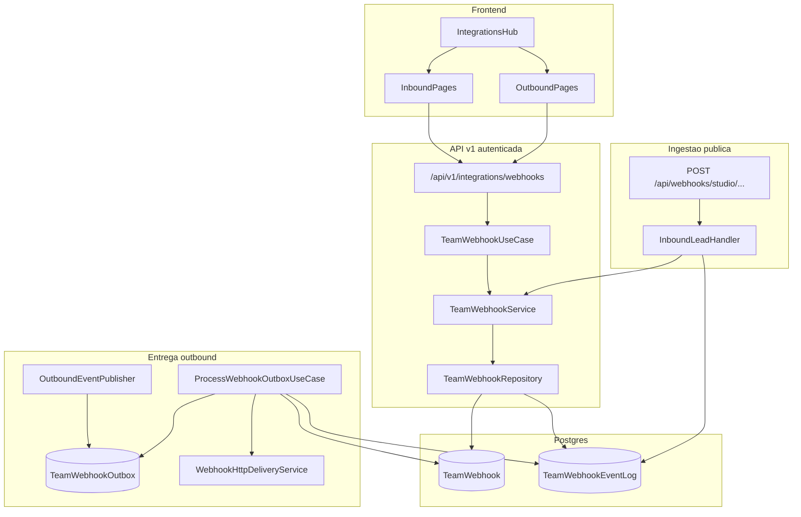
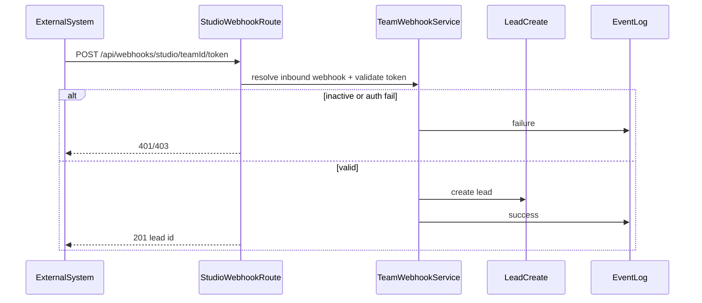
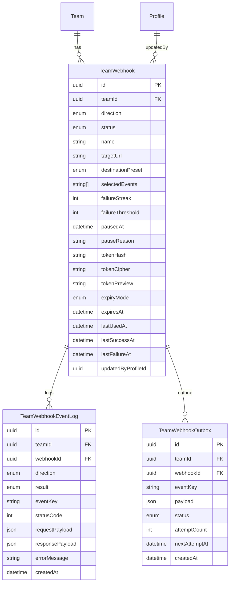

# Spec: Webhooks Entrada / Saída — Design

**Status:** draft for implementation  
**Depends on:** [requirements.md](./requirements.md)

## Overview

Unificar webhooks do produto em um modelo `TeamWebhook` com direção `inbound` | `outbound`, status explícito, logs paginados e dispatcher assíncrono para saída. Migrar o Studio Webhook atual para inbound sem quebrar a URL pública.

Arquitetura canônica:

```text
Route → UseCase → Service → Repository → Prisma
```

Outbound:

```text
Domain UseCase → OutboundEventPublisher → Outbox → Cron/Worker → HttpDelivery → Log + AutoPause
```

## Architecture



### Sequence — Outbound delivery

```mermaid
sequenceDiagram
  participant Domain as CRM_UseCase
  participant Pub as OutboundEventPublisher
  participant Box as TeamWebhookOutbox
  participant Cron as ProcessOutboxCron
  participant Del as HttpDelivery
  participant Ext as ExternalURL
  participant Log as EventLog
  participant Cfg as TeamWebhook

  Domain->>Pub: publish(teamId, eventKey, payload)
  Pub->>Cfg: find active outbound matching event
  loop each matching webhook
    Pub->>Box: insert pending row
  end
  Note over Domain: retorna sem esperar HTTP externo

  Cron->>Box: claim due pending rows
  Cron->>Del: POST targetUrl
  Del->>Ext: HTTPS request
  Ext-->>Del: status / error
  Del-->>Cron: result
  Cron->>Log: persist attempt
  alt success
    Cron->>Cfg: failureStreak = 0
    Cron->>Box: mark delivered
  else failure
    Cron->>Cfg: failureStreak++
    alt streak >= threshold
      Cron->>Cfg: status = paused
      Cron->>Cron: notify manager
    end
    Cron->>Box: mark failed or retry with backoff
  end
```

### Sequence — Inbound lead



## Data Model



### Enums (Prisma)

```prisma
enum TeamWebhookDirection {
  inbound
  outbound
  @@map("team_webhook_direction")
}

enum TeamWebhookStatus {
  active
  paused
  disabled
  @@map("team_webhook_status")
}

enum TeamWebhookDestinationPreset {
  generic
  slack
  teams
  zapier
  @@map("team_webhook_destination_preset")
}

enum TeamWebhookEventKey {
  lead_created
  lead_status_changed
  lead_assigned
  appointment_created
  appointment_reminder
  activity_created
  @@map("team_webhook_event_key")
}

enum TeamWebhookLogResult {
  success
  failure
  rejected
  @@map("team_webhook_log_result")
}

enum TeamWebhookOutboxStatus {
  pending
  processing
  delivered
  failed
  cancelled
  @@map("team_webhook_outbox_status")
}
```

Reutilizar `StudioWebhookTokenExpiryMode` (`hours_24` | `months_6` | `indeterminate`) nos campos de token inbound, ou renomear para `TeamWebhookTokenExpiryMode` na migração (preferência: rename + map legado).

### Model `TeamWebhook`

| Campo | Tipo | Notas |
|-------|------|-------|
| `id` | UUID PK | |
| `teamId` | UUID FK → Team | Cascade |
| `direction` | `TeamWebhookDirection` | inbound \| outbound |
| `status` | `TeamWebhookStatus` | default `active` |
| `name` | text | label amigável |
| `targetUrl` | text? | obrigatório se outbound |
| `destinationPreset` | enum? | default `generic` (outbound) |
| `selectedEvents` | `TeamWebhookEventKey[]` | outbound; Postgres array/enum[] |
| `failureStreak` | int | default 0 |
| `failureThreshold` | int | default 10 |
| `pausedAt` | timestamptz? | |
| `pauseReason` | text? | `auto_failure` \| `manual` |
| `tokenHash` / `tokenCipher` / `tokenPreview` | text? | inbound |
| `expiryMode` / `expiresAt` | | inbound |
| `lastUsedAt` / `lastSuccessAt` / `lastFailureAt` | timestamptz? | |
| `updatedByProfileId` | UUID | |
| `createdAt` / `updatedAt` | | |

Índices sugeridos:

- `@@index([teamId, direction, status])`
- `@@index([teamId, direction, createdAt(sort: Desc)])`
- Outbound lookup: partial index mental — query `status=active AND direction=outbound AND event = ANY(selectedEvents)`

### Model `TeamWebhookEventLog`

Substitui o uso de `TeamStudioWebhookRequestLog` para novos eventos. Campos alinhados a REQ-MGT-03. Índice `(webhookId, createdAt DESC)` e `(teamId, createdAt DESC)`.

Retenção sugerida: 90 dias (job de purge em cron separado — task opcional v1.1 se não couber).

### Model `TeamWebhookOutbox`

Garante entrega assíncrona e retries curtos antes do pause:

- Tentativas com backoff (espelhar espírito de `lib/studio-bot/outbox-retry.ts`): 1m, 5m, 15m… até esgotar retries **ou** atingir `failureThreshold` no webhook.
- Cada tentativa falha incrementa `failureStreak` do webhook.
- Sucesso → `delivered` + streak 0.
- Se webhook virar `paused`/`disabled` → outbox pendente desse webhook → `cancelled`.

### Migração do legado

1. Criar tabelas novas via `bun run db:migrate:from-prisma` / SQL gerado.
2. Data migration (`db:migrate:new migrate-studio-webhook-to-team-webhook`):
   - Para cada `TeamStudioWebhookConfig`, inserir `TeamWebhook` inbound `active` (ou `disabled` se expirado).
   - Copiar logs recentes de `TeamStudioWebhookRequestLog` → `TeamWebhookEventLog` (melhor esforço).
3. Ingestão `/api/webhooks/studio/...` passa a resolver via `TeamWebhook` inbound; fallback temporário à tabela antiga só se necessário durante rollout (preferência: cutover único).
4. Deprecar UI antiga `StudioWebhookIntegration` card monolítico em favor das novas rotas; manter APIs antigas como proxy/thin wrappers por 1 release se houver clientes internos.

## API Design

### Autenticadas (manager + feature `integration`)

Base: `/api/v1/integrations/webhooks`

| Method | Path | Descrição |
|--------|------|-----------|
| `GET` | `/` | Lista; query `direction=inbound\|outbound`, `status?`, paginação |
| `POST` | `/` | Cria (body discrimina direction) |
| `GET` | `/{id}` | Detalhe |
| `PATCH` | `/{id}` | Atualiza config / eventos / URL / nome |
| `POST` | `/{id}/status` | `{ status: active\|disabled }` ou `{ action: reactivate }` |
| `GET` | `/{id}/logs` | Logs paginados; `result?`, `cursor/page` |
| `POST` | `/{id}/test` | Só outbound — envia payload de teste |
| `DELETE` | `/{id}` | Soft: `disabled` + opcional hard delete depois |

Compat (legado, thin):

| Method | Path | Comportamento |
|--------|------|---------------|
| `GET/PUT` | `/api/v1/integrations/studio-webhook` | Proxy para inbound default do time |
| `GET` | `/api/v1/integrations/studio-webhook/logs` | Proxy logs do inbound default |

### Pública (ingestão)

| Method | Path | Descrição |
|--------|------|-----------|
| `POST` | `/api/webhooks/studio/{teamId}/{token}` | Inbound lead (compat) |
| `POST` | `/api/webhooks/studio/{teamId}` | Modo sem token (se configurado) |

### Cron

| Method | Path | Auth |
|--------|------|------|
| `POST` | `/api/v1/integrations/webhooks/cron/process-outbox` | `Authorization: Bearer CRON_SECRET` |

Atualizar Postman: `postman/Lead-Flow-API-Collection.json` + Environment.

## TypeScript Interfaces (contratos)

```typescript
type TeamWebhookDirection = "inbound" | "outbound";
type TeamWebhookStatus = "active" | "paused" | "disabled";
type TeamWebhookDestinationPreset = "generic" | "slack" | "teams" | "zapier";

type TeamWebhookEventKey =
  | "lead_created"
  | "lead_status_changed"
  | "lead_assigned"
  | "appointment_created"
  | "appointment_reminder"
  | "activity_created";

interface TeamWebhookSummary {
  id: string;
  direction: TeamWebhookDirection;
  status: TeamWebhookStatus;
  name: string;
  destinationPreset: TeamWebhookDestinationPreset | null;
  selectedEvents: TeamWebhookEventKey[];
  failureStreak: number;
  failureThreshold: number;
  lastUsedAt: string | null;
  lastSuccessAt: string | null;
  lastFailureAt: string | null;
  pausedAt: string | null;
  pauseReason: string | null;
  tokenPreview: string | null;
  expiresAt: string | null;
  createdAt: string;
  updatedAt: string;
}

interface CreateInboundWebhookInput {
  direction: "inbound";
  name: string;
  tokenMode: "manual" | "auto" | "none";
  token?: string;
  expiryMode: "hours_24" | "months_6" | "indeterminate";
}

interface CreateOutboundWebhookInput {
  direction: "outbound";
  name: string;
  targetUrl: string;
  destinationPreset: TeamWebhookDestinationPreset;
  selectedEvents: TeamWebhookEventKey[]; // min 1
  failureThreshold?: number; // default 10
}

interface OutboundDomainEvent {
  teamId: string;
  eventKey: TeamWebhookEventKey;
  occurredAt: string; // ISO
  leadId?: string;
  payload: Record<string, unknown>;
}

interface IOutboundEventPublisher {
  publish(event: OutboundDomainEvent): Promise<void>;
}

interface IWebhookHttpDeliveryService {
  deliver(args: {
    targetUrl: string;
    preset: TeamWebhookDestinationPreset;
    body: unknown;
    timeoutMs: number;
  }): Promise<{ ok: boolean; statusCode: number | null; responseBody: unknown; errorMessage: string | null }>;
}

interface ITeamWebhookRepository {
  listWithCtx(ctx: TeamContext, filter: { direction: TeamWebhookDirection; status?: TeamWebhookStatus; page: number; pageSize: number }): Promise<{ items: TeamWebhookSummary[]; total: number }>;
  findByIdWithCtx(ctx: TeamContext, id: string): Promise<TeamWebhookSummary | null>;
  createWithCtx(ctx: TeamContext, data: CreateInboundWebhookInput | CreateOutboundWebhookInput): Promise<TeamWebhookSummary>;
  updateWithCtx(ctx: TeamContext, id: string, data: Partial<...>): Promise<TeamWebhookSummary>;
  setStatusWithCtx(ctx: TeamContext, id: string, status: TeamWebhookStatus, pauseReason?: string | null): Promise<TeamWebhookSummary>;
  findActiveOutboundForEvent(teamId: string, eventKey: TeamWebhookEventKey): Promise<Array<{ id: string; targetUrl: string; destinationPreset: TeamWebhookDestinationPreset }>>;
  // + logs / outbox claim helpers
}
```

Todas as use cases novas **MUST** retornar `Output` (`lib/output/index.ts`).  
Rotas usam `getTeamAccess()` uma vez e propagam `TeamContext` (`*WithCtx`).

## Camadas / pastas

```text
app/api/v1/integrations/webhooks/
  route.ts
  [id]/route.ts
  [id]/status/route.ts
  [id]/logs/route.ts
  [id]/test/route.ts
  cron/process-outbox/route.ts

app/api/useCases/integrations/webhooks/
  TeamWebhookUseCase.ts
  ProcessWebhookOutboxUseCase.ts
  ITeamWebhookUseCase.ts

app/api/services/teamWebhook/
  TeamWebhookService.ts
  OutboundEventPublisher.ts
  WebhookHttpDeliveryService.ts
  webhookPayloadPresets.ts
  I*.ts

app/api/infra/data/repositories/teamWebhook/
  TeamWebhookRepository.ts
  TeamWebhookEventLogRepository.ts
  TeamWebhookOutboxRepository.ts

app/[supabaseId]/integrations/
  page.tsx                          # hub atualizado
  webhooks/inbound/page.tsx
  webhooks/inbound/new/page.tsx
  webhooks/inbound/[id]/page.tsx
  webhooks/outbound/page.tsx
  webhooks/outbound/new/page.tsx
  webhooks/outbound/[id]/page.tsx
  features/...                      # feature architecture por página ou shared webhooks feature
```

Frontend: page-local `features/{context,services,container}` por área ou feature compartilhada `integrations/webhooks/features` — preferir **feature compartilhada** sob `integrations/features/webhooks/` para evitar duplicação Entrada/Saída, com containers específicos.

## Domain event hooks

Publicar via `OutboundEventPublisher` nos mesmos pontos (ou imediatamente após) em que `teamAutomationDispatcherService` já é chamado:

| Event key | Onde encaixar |
|-----------|----------------|
| `lead_created` | `LeadUseCase` (criação) |
| `lead_status_changed` | `LeadUseCase` (transição de status) |
| `lead_assigned` | fluxo de atribuição de operador |
| `appointment_created` | `LeadScheduleService` / criação de meeting |
| `appointment_reminder` | job/cron que dispara `MEETING_REMINDER` |
| `activity_created` | criação de `LeadActivity` (filtrar tipos ruído se necessário) |

Publisher é fire-and-forget seguro: erros de enqueue → `console.error`, não falham a operação do CRM.

## Payload envelope

### Genérico / Zapier / n8n

```json
{
  "id": "evt_...",
  "type": "lead_status_changed",
  "created_at": "2026-07-27T15:00:00.000Z",
  "team_id": "uuid",
  "data": {
    "lead": { "id": "...", "name": "...", "status": "...", "email": "...", "phone": "..." },
    "previous_status": "...",
    "actor_profile_id": "..."
  }
}
```

### Preset Slack

Wrap em `{ "text": "..." }` ou Block Kit mínimo documentado na UI (texto legível + link opcional para o lead no app).

### Preset Teams

Payload MessageCard / Adaptive Card simples documentado no formulário (Incoming Webhook URL do Teams).

A UI dos presets **não** muda o transporte — só ajuda o usuário e seleciona o wrapper em `webhookPayloadPresets.ts`.

## Auto-pause & notificação

1. Após cada falha de delivery: `failureStreak += 1`, `lastFailureAt = now`.
2. Se `failureStreak >= failureThreshold`: `status = paused`, `pauseReason = auto_failure`, `pausedAt = now`.
3. Notificar manager: novo `NotificationType.WEBHOOK_AUTO_PAUSED` (migration enum) **ou** reutilizar tipo genérico com metadata `{ webhookId, name }` se governança preferir evitar enum — **preferência: enum dedicado**.
4. Outbox rows pending do webhook → `cancelled`.
5. Reativar: `POST .../status` `{ action: "reactivate" }` → `active`, streak 0, `pauseReason null`.

## Segurança

- Tokens inbound: hash + cipher + preview (`lib/webhooks/studioWebhookSecurity.ts` → generalizar para `lib/webhooks/teamWebhookSecurity.ts`).
- `targetUrl`: HTTPS only em produção; blocklist de IPs privados (SSRF) no delivery service.
- Timeout: 10s; sem seguir redirects para hosts bloqueados.
- Logs: redact token paths e Authorization headers.
- Auth gestão: `getTeamAccess()` + role manager + `hasAccess(FEATURE_SLUGS.CONFIGURATION)`.

### RLS (Postgres)

Migration manual: `bun run db:migrate:new team-webhooks-rls` → `supabase/migrations/*_team-webhooks-rls.sql`.

Acesso da API continua via Prisma `service_role` (bypassa RLS). Policies protegem PostgREST / client JWT, espelhando o Studio Webhook legado (manager-only).

| Tabela | SELECT (authenticated) | INSERT/UPDATE/DELETE (authenticated) |
|--------|------------------------|------------------------------------|
| `corretor_studio_team_webhooks` | manager do `teamId` | manager do `teamId` |
| `corretor_studio_team_webhook_event_logs` | manager do `teamId` | nenhuma (writes só service_role) |
| `corretor_studio_team_webhook_outbox` | nenhuma | nenhuma (fila interna; deny-all JWT) |

Predicate:

```sql
EXISTS (
  SELECT 1
  FROM public.corretor_studio_team_members tm
  JOIN public.corretor_studio_profiles p ON p.id = tm."profileId"
  WHERE tm."teamId" = <table>."teamId"
    AND tm.role = 'manager'
    AND (p."supabaseId" = auth.uid() OR p.id = auth.uid())
)
```

Grants: `REVOKE ALL ... FROM anon` nas 3 tabelas; authenticated com DML em `team_webhooks` e SELECT em `event_logs`; outbox sem GRANT authenticated; `service_role` com ALL.

## Frontend UX rules

- Seguir `DESIGN.md` + skill `corretor-studio-design` antes de JSX novo.
- shadcn: `Badge` status, `Tabs` config/logs, `FieldGroup`/`Field` forms, `Skeleton` loading, `sonner` toasts, `AlertDialog` para desativar.
- Badges:
  - active → default/success semantic
  - paused → warning
  - disabled → secondary
- Direction badges: “Entrada” / “Saída”.
- Validação submit lock (REQ action button).
- Copy pt-BR com acentuação (`lint:pt-br`).

## Observability

- `console.info` fluxo: enqueue, deliver, pause.
- `console.error` falhas de delivery/cron.
- Prefixo estável: `[TeamWebhookOutbox][POST]`, `[StudioWebhookInbound][POST]`.

## Testing strategy

- Unit: payload presets, auto-pause threshold, SSRF URL guard, token security.
- Unit: OutboundEventPublisher filtra por `selectedEvents` + status.
- Integration-ish: ProcessWebhookOutboxUseCase claim → deliver → log → pause.
- Frontend: não obrigatório E2E na v1; smoke manual checklist em `tasks.md`.

## Non-goals (reforço design)

- Não unificar Meta/Asaas/WhatsApp neste modelo.
- Não implementar OAuth Slack/Teams.
- Não colocar Prisma direto em routes v1 novas.

## Migration checklist (implementação)

1. Prisma schema + `bun run db:migrate:from-prisma -- team-webhooks`
2. Manual data migrate Studio → TeamWebhook
3. Enum `NotificationType.WEBHOOK_AUTO_PAUSED` via migration
4. Repos + services + use cases + routes
5. Cron outbox + vercel.json cron entry se aplicável
6. Frontend pages + hub
7. Deprecate card monolítico
8. Postman + docs `docs/WEBHOOK_SETUP.md` update
9. Validação: typecheck, lint, governance, lint:pt-br, design:check
