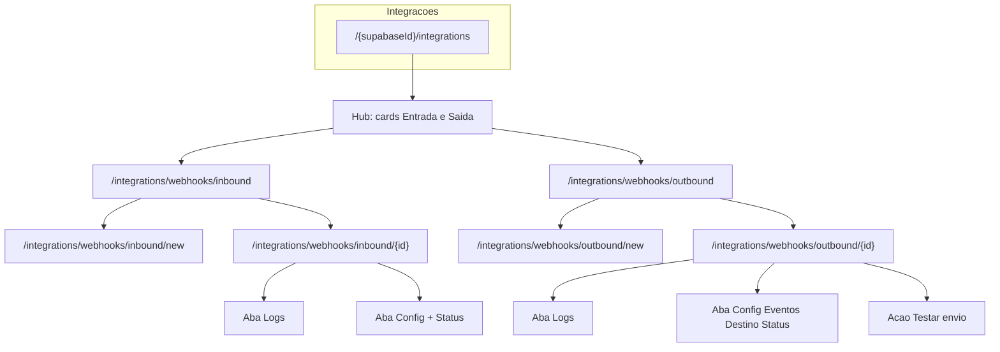

# Spec: Webhooks Entrada / Saída — Requirements

**Status:** approved (v1 decisions locked)  
**Feature area:** Integrações (produto CRM)  
**Related plan:** SPEC Webhooks Inbound Outbound

## Background

### Problema

Hoje o Corretor Studio oferece apenas um **Webhook de entrada** (Studio Webhook / “Webhook Genérico de Leads”): sistemas externos enviam POST e o CRM cria um lead. Não há:

- Webhooks de **saída** (CRM → Slack, Teams, Zapier, n8n, URL genérica)
- Segregação clara de tipos na UX e no backend
- Status explícito ativo / pausado / desativado
- Logs paginados de todos os eventos
- Auto-pause quando o destino externo falha repetidamente
- Páginas dedicadas de criação e gerenciamento

### Estado atual relevante

| Área | Referência |
|------|------------|
| UI Integrações | `app/[supabaseId]/integrations/` — `StudioWebhookIntegration.tsx` |
| API gestão | `GET/PUT /api/v1/integrations/studio-webhook`, `GET .../logs` |
| Ingestão | `POST /api/webhooks/studio/{teamId}/[token]` |
| Schema | `TeamStudioWebhookConfig`, `TeamStudioWebhookRequestLog` (retenção ~15) |
| Segurança token | `lib/webhooks/studioWebhookSecurity.ts` |
| Feature | `FEATURE_SLUGS.CONFIGURATION` (`integration`) |
| Padrão de eventos internos | `TeamAutomationDispatcherService` + `TeamAutomationTriggerType` |
| Notificações | `NotificationService` / `NotificationType` |
| Outbox/retry referência | `lib/studio-bot/outbox-retry.ts` (Bethânia) |

### Gatilho

Evolução do módulo de Integrações Webhooks: inbound existente + outbound opt-out com gestão, logs e resiliência.

## Goals

### Primários (must-have)

1. Segregar **Webhook de entrada** e **Webhook de saída** no backend e no frontend (rotas, modelos, badges, formulários).
2. Hub em `/{supabaseId}/integrations` com cards distintos para Entrada e Saída.
3. CRUD completo: listagem, criação, detalhe/edição, ativar/desativar, status visível.
4. Status: `active` | `paused` | `disabled`.
5. Logs de **todos** os eventos (sucesso e falha), inbound e outbound, com paginação.
6. Outbound: HTTP POST JSON para URL configurável + presets de UI (Slack, Teams, Zapier/n8n) sem OAuth.
7. Eventos outbound selecionáveis (multi-select obrigatório ≥1) no catálogo v1 completo.
8. Auto-pause após N falhas consecutivas de envio (default **10**); notificar manager; reativação manual.
9. Migrar Studio Webhook atual para o modelo unificado de Entrada sem quebrar URL pública de ingestão.

### Secundários (mesma v1 se couber sem inflar escopo)

10. Ação “Testar envio” no detalhe do webhook de saída.
11. Métricas resumidas no detalhe (últimas 24h: sucesso / falha / taxa).
12. Notificação in-app quando webhook for pausado automaticamente.

## Non-Goals (v1)

- OAuth nativo Slack / Microsoft Teams
- Mapper visual de payload (drag-and-drop de campos)
- Webhooks no módulo `app/backoffice/**`
- Substituir Meta Lead Ads, Asaas, WhatsApp Evolution ou Resend por este módulo
- Retry infinito sem pause
- Transformação arbitraria de schema por webhook além dos presets de envelope (Slack/Teams)
- Múltiplos endpoints de ingestão com contratos distintos além do payload de lead atual

## Decisões travadas

| Decisão | Valor |
|---------|--------|
| Destinos outbound | **B** — URL genérica + presets de UI (Slack Incoming Webhook, Teams, Zapier/n8n) |
| Eventos outbound | Catálogo completo; **multi-select** na config de cada webhook |
| Terminologia UX | “Webhook de entrada” / “Webhook de saída” |
| Limiar auto-pause | 10 falhas consecutivas (configurável por webhook, default 10) |
| Feature slug | Reutilizar `integration` / `FEATURE_SLUGS.CONFIGURATION` |
| Escopo | Produto CRM apenas |

## Terminologia

| Termo | Significado |
|-------|-------------|
| Webhook de entrada (Inbound) | Sistema externo → Corretor Studio (cria lead) |
| Webhook de saída (Outbound) | Corretor Studio → ferramenta externa |
| Ativo (`active`) | Aceita/envia eventos normalmente |
| Pausado (`paused`) | Suspenso automaticamente por falhas (ou pause manual); não processa até reativar |
| Desativado (`disabled`) | Desligado pelo usuário; não processa |

## User Stories

1. Como **manager**, quero ver no hub de Integrações dois caminhos claros (Entrada e Saída) para não confundir direção do fluxo.
2. Como **manager**, quero criar um webhook de entrada, copiar a URL/token e receber leads de qualquer ferramenta que faça POST.
3. Como **manager**, quero criar um webhook de saída apontando para Slack/Teams/Zapier/URL genérica e escolher quais eventos do CRM disparam o envio.
4. Como **manager**, quero ver o status atual (ativo/pausado/desativado) na listagem e no detalhe.
5. Como **manager**, quero consultar o histórico de eventos com sucesso e falha, com paginação.
6. Como **sistema**, quero pausar automaticamente um webhook de saída após muitas falhas consecutivas e notificar o manager.
7. Como **manager**, quero reativar um webhook pausado depois de corrigir a URL/destino.
8. Como **manager**, quero testar um envio outbound sem esperar um evento real do CRM.
9. Como **operador/time legado**, quero que a URL antiga `/api/webhooks/studio/{teamId}/{token}` continue funcionando após a migração.

## Estrutura de páginas (contrato UX)

### Wireframe lógico por página

| Rota | Conteúdo principal |
|------|-------------------|
| `/{supabaseId}/integrations` | Cards: Lead Form (existente), Webhooks de entrada, Webhooks de saída |
| `.../webhooks/inbound` | Tabela: nome, status badge, lastUsedAt, ações |
| `.../webhooks/inbound/new` | Form: nome, modo token, expiração, criar |
| `.../webhooks/inbound/{id}` | Tabs Config / Logs; URL+token; toggle status |
| `.../webhooks/outbound` | Tabela: nome, preset, status, eventos (resumo), failureStreak |
| `.../webhooks/outbound/new` | Form: nome, preset, URL, multi-select eventos, limiar pause |
| `.../webhooks/outbound/{id}` | Tabs Config / Logs; testar envio; reativar se paused |

## Catálogo de eventos outbound (v1)

| Event key | Label UI | Gatilho de domínio |
|-----------|----------|--------------------|
| `lead_created` | Lead criado | Criação de lead |
| `lead_status_changed` | Status do lead alterado | Mudança de `LeadStatus` |
| `lead_assigned` | Lead atribuído | Atribuição a operador/membro |
| `appointment_created` | Agendamento criado | Criação de schedule/meeting |
| `appointment_reminder` | Lembrete de agendamento | Job/cron de lembrete (`MEETING_REMINDER` / equivalente) |
| `activity_created` | Atividade/nota criada | Nova `LeadActivity` relevante |

Regra: na criação/edição do outbound, o manager **deve selecionar ao menos um** evento. Um webhook só dispara para os eventos marcados.

## Requirements (EARS)

### REQ-INB — Entrada

**REQ-INB-01**  
WHEN um cliente externo envia `POST` válido no endpoint de ingestão do time  
GIVEN o webhook de entrada correspondente está `active` e o token/expiração são válidos  
THEN o sistema SHALL criar o lead no CRM no status `new_opportunity`  
AND SHALL registrar o evento no log com resultado de sucesso.

**REQ-INB-02**  
WHERE o webhook de entrada está `disabled` ou `paused`  
WHEN uma requisição chega no endpoint  
THEN o sistema SHALL rejeitar com HTTP adequado (ex.: 403)  
AND SHALL registrar a tentativa no log.

**REQ-INB-03**  
WHEN o token é inválido, ausente (quando exigido) ou expirado  
THEN o sistema SHALL responder 401  
AND SHALL registrar a falha no log (sem criar lead).

**REQ-INB-04**  
WHEN o payload falha validação (Zod) ou contém padrão suspeito de SQL injection  
THEN o sistema SHALL responder 400  
AND SHALL registrar a falha no log.

**REQ-INB-05**  
WHEN a migração do Studio Webhook legado for aplicada  
THEN a URL pública `POST /api/webhooks/studio/{teamId}/{token?}` SHALL permanecer compatível  
AND a configuração legado SHALL ser representada como webhook(s) de entrada no novo modelo.

**REQ-INB-06**  
WHILE o manager gerencia webhooks de entrada  
THE SYSTEM SHALL permitir criar mais de um webhook de entrada por time (v1: pelo menos um; modelo deve permitir N)  
AND SHALL exibir status, URL e logs no detalhe.

### REQ-OUT — Saída

**REQ-OUT-01**  
WHEN um evento do catálogo ocorre no CRM  
GIVEN existe webhook de saída `active` no time com aquele evento selecionado  
THEN o sistema SHALL enfileirar um envio HTTP POST JSON para a `targetUrl`  
AND SHALL NÃO bloquear a request HTTP do domínio CRM aguardando a resposta do destino.

**REQ-OUT-02**  
WHEN o destino responde 2xx  
THEN o sistema SHALL registrar log de sucesso  
AND SHALL zerar `failureStreak`.

**REQ-OUT-03**  
WHEN o destino responde erro de rede, timeout ou status não-2xx  
THEN o sistema SHALL registrar log de falha  
AND SHALL incrementar `failureStreak`.

**REQ-OUT-04**  
WHILE `failureStreak >= failureThreshold` (default 10)  
THE SYSTEM SHALL alterar o status do webhook para `paused`  
AND SHALL notificar o manager do time  
AND SHALL parar novos envios desse webhook até reativação manual.

**REQ-OUT-05**  
WHEN o manager seleciona preset Slack, Teams ou Zapier/n8n na criação/edição  
THEN a UI SHALL orientar como obter a URL e o formato esperado do payload  
AND o transporte SHALL permanecer HTTP POST genérico (sem OAuth).

**REQ-OUT-06**  
WHEN o manager cria/edita um webhook de saída  
THEN o sistema SHALL exigir `targetUrl` HTTPS válida  
AND SHALL exigir seleção de ≥1 evento do catálogo.

**REQ-OUT-07**  
WHEN o manager aciona “Testar envio”  
GIVEN o webhook não está `disabled`  
THEN o sistema SHALL enviar um payload de teste identificado  
AND SHALL registrar o resultado no log.

**REQ-OUT-08**  
WHEN o manager reativa um webhook `paused`  
THEN o sistema SHALL definir status `active`  
AND SHALL zerar `failureStreak`  
AND SHALL permitir novos envios.

### REQ-MGT — Gestão, logs e UX

**REQ-MGT-01**  
WHERE o usuário acessa a área de webhooks  
THE SYSTEM SHALL separar visualmente Entrada e Saída (listas, rotas, badges, formulários distintos).

**REQ-MGT-02**  
WHEN o manager abre listagem ou detalhe  
THEN o sistema SHALL exibir o status atual com badge (`active` / `paused` / `disabled`).

**REQ-MGT-03**  
WHEN ocorre qualquer tentativa inbound ou outbound  
THEN o sistema SHALL persistir log com timestamp, direção, resultado, status HTTP (quando houver), payload sanitizado e mensagem de erro (se houver).

**REQ-MGT-04**  
WHEN o manager consulta logs  
THEN o sistema SHALL paginar resultados (não limitar a 15 fixos no modelo unificado)  
AND SHALL permitir filtrar por resultado (sucesso/falha) quando aplicável.

**REQ-MGT-05**  
WHERE o perfil não é manager (ou sem acesso à feature `integration`)  
THE SYSTEM SHALL negar gestão de webhooks.

**REQ-MGT-06**  
WHEN o manager desativa (`disabled`) um webhook  
THEN o sistema SHALL interromper processamento imediatamente  
AND SHALL manter histórico de logs.

### REQ-SEC — Segurança

**REQ-SEC-01**  
THE SYSTEM SHALL armazenar tokens de entrada com hash; cipher/preview apenas conforme padrão atual de `studioWebhookSecurity`.

**REQ-SEC-02**  
THE SYSTEM SHALL sanitizar tokens e segredos em logs e endpoints exibidos na UI.

**REQ-SEC-03**  
THE SYSTEM SHALL exigir HTTPS para `targetUrl` outbound (exceto ambiente local de desenvolvimento, se explicitamente permitido).

**REQ-SEC-04**  
THE SYSTEM SHALL aplicar timeout curto no HTTP outbound (ex.: 10s) e não seguir redirects perigosos além do necessário.

## Acceptance Criteria

- [ ] Hub de Integrações mostra cards distintos de Entrada e Saída.
- [ ] Fluxo completo CRUD inbound com status e logs paginados.
- [ ] Fluxo completo CRUD outbound com multi-select de eventos e presets.
- [ ] Evento CRM dispara apenas webhooks ativos com aquele evento selecionado.
- [ ] 10 falhas consecutivas → status `paused` + notificação ao manager.
- [ ] Reativação manual zera streak e retoma envios.
- [ ] URL legado `/api/webhooks/studio/...` continua criando leads.
- [ ] Segregação clara na UI (copy, badges, rotas).
- [ ] `bun run typecheck`, `lint`, `governance:check`, `lint:pt-br` e `design:check` (UI) passam na implementação.

## Open questions (não bloqueantes para design)

1. Limite máximo de webhooks outbound por time (sugestão: 20).
2. Retenção de logs em dias (sugestão: 90 dias + job de purge).
3. Envelope exato Slack vs Teams no preset (documentar em `design.md`).

## References

- Plano: SPEC Webhooks Inbound Outbound
- Código legado: `app/api/webhooks/studio/`, `StudioWebhookIntegration*`
- Automations (padrão de trigger): `app/api/services/teamAutomation/TeamAutomationDispatcherService.ts`
